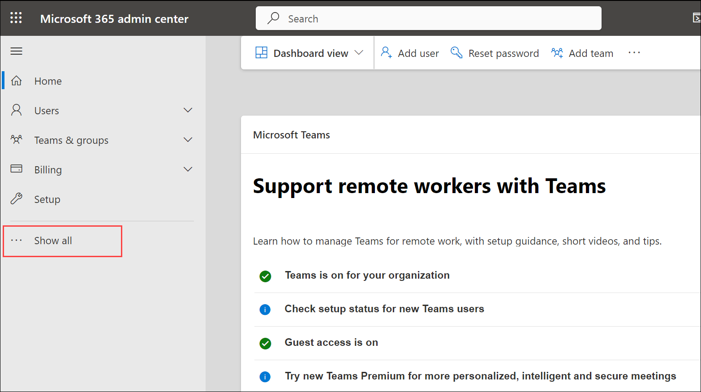
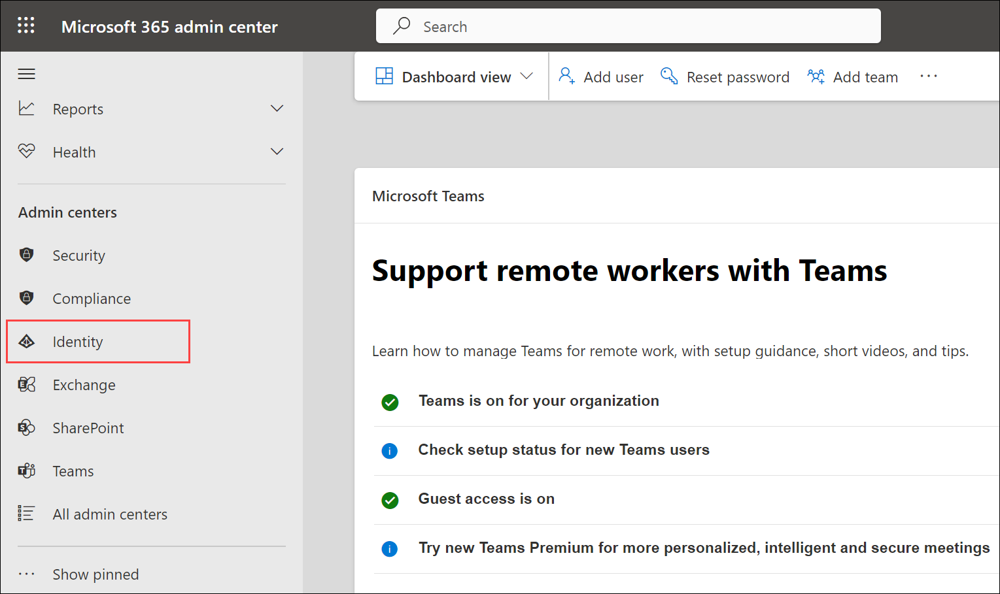
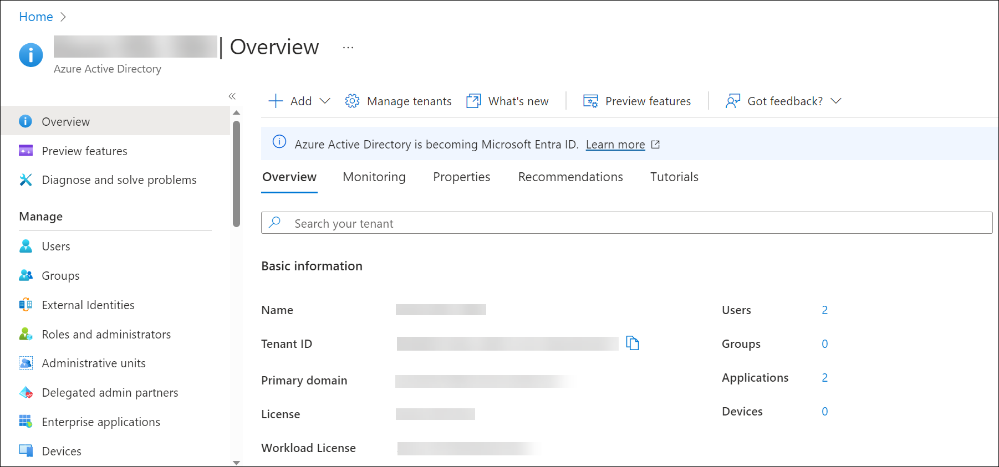
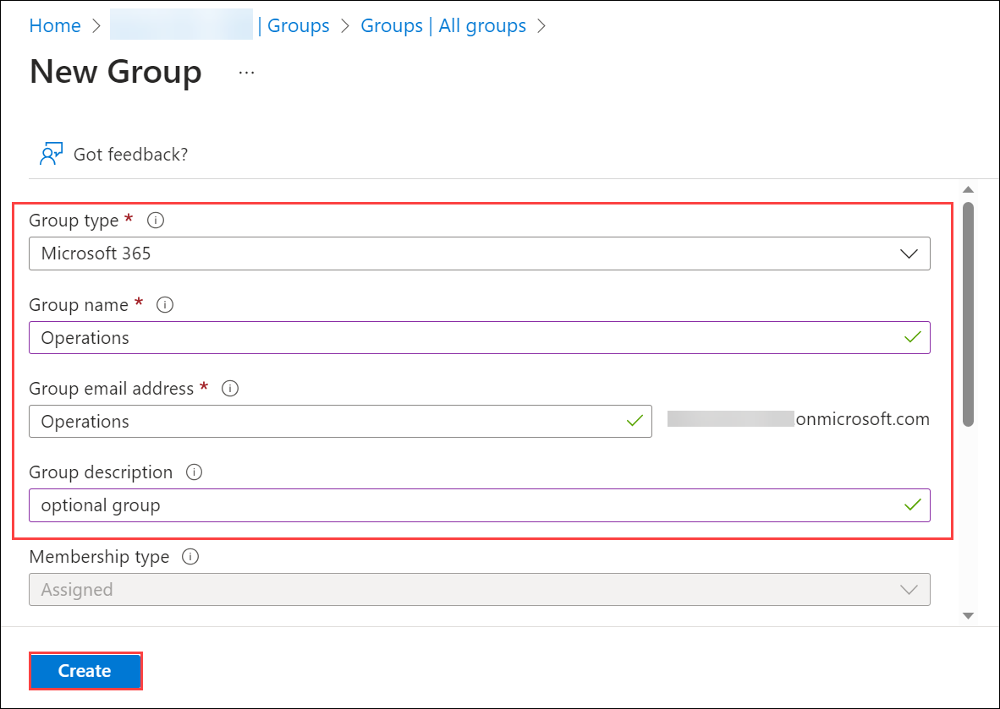
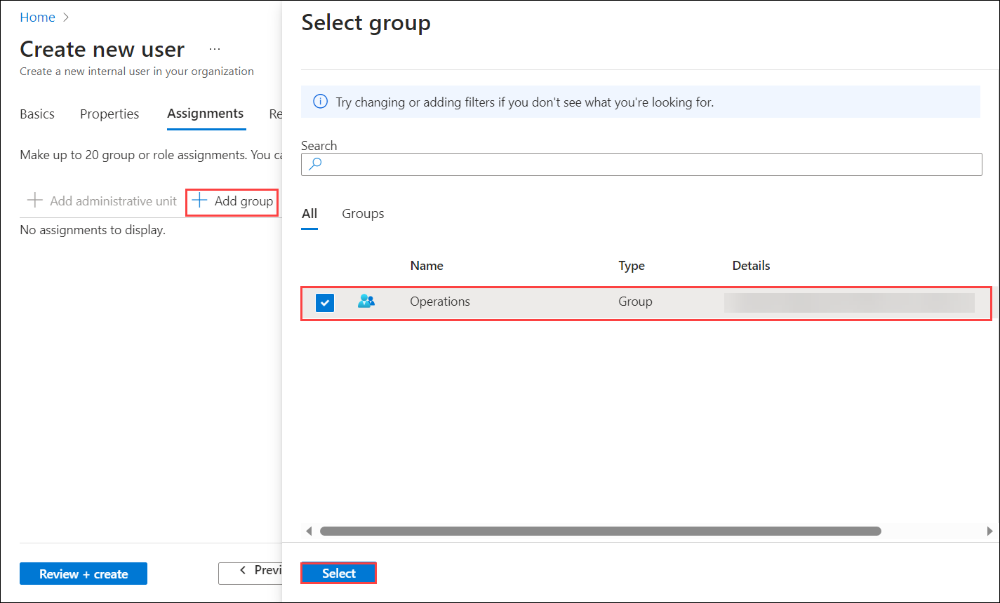
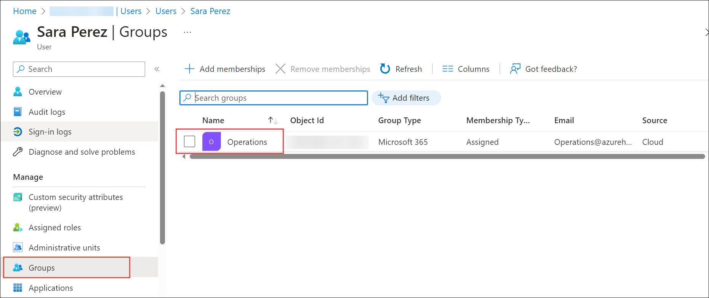
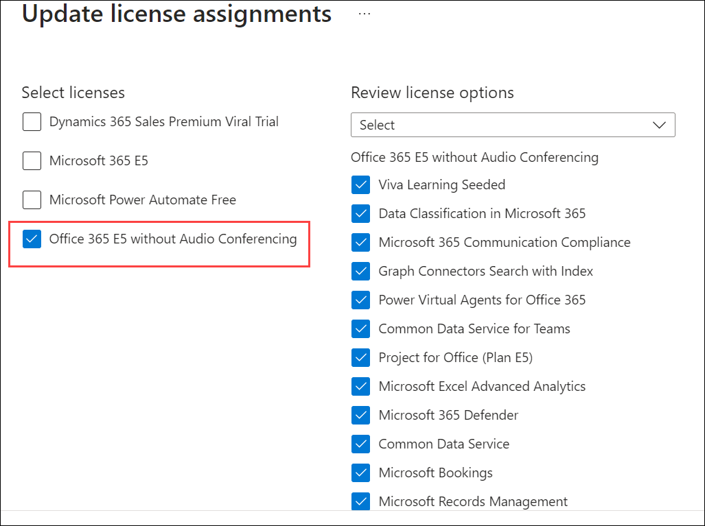
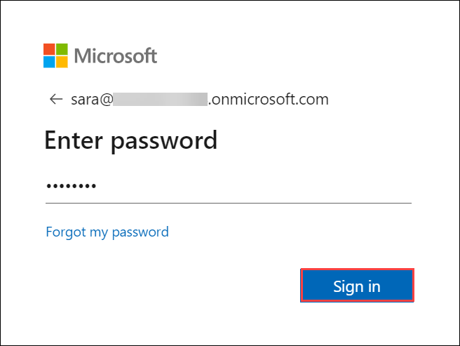
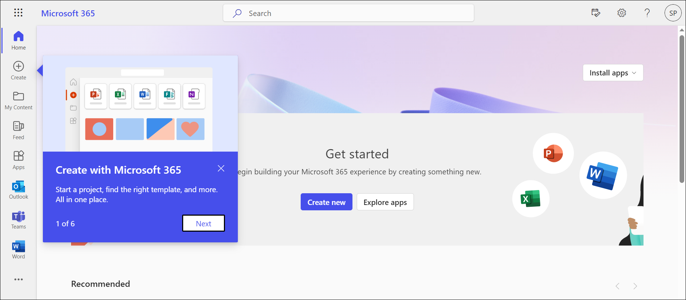

# Lab-01: Explore Azure Active Directory

## Lab scenario

In this lab, you'll access Azure Active Directory. Additionally, you'll create a user and configure the different settings, including adding licenses.

## Objectives

In this lab, you will complete the following tasks:

+ Task 1: Accessing Azure AD through the Microsoft 365 Admin portal and through the Azure portal
+ Task 2: Creating a basic group
+ Task 3: Create a new user in the Azure Active Directory and explore some of the services
+ Task 4: Sign in to the user first time

## Estimated timing: 10-15 minutes

## Architecture diagram

## Task 1: Accessing Azure AD through the Microsoft 365 Admin portal and through the Azure portal

As a subscriber to Microsoft 365 you are already using Azure AD.  In this task, you will walk through accessing Azure AD through the Microsoft 365 Admin portal and through the Azure portal.

1. Open another tab in Microsoft Edge, in the address bar enter **[admin.microsoft.com](https://admin.microsoft.com/)** to access the Microsoft 365 admin center.

1. Sign in with the following credentials.
    
    1. In the Sign in window enter following email  then select **Next**.

       * Email : **<inject key="AzureAdUserEmail"></inject>**
     
    1. Enter the admin following password and select **Sign in**.

       * Password : **<inject key="AzureAdUserPassword"></inject>** 
          

1. From the left navigation pane of the Microsoft 365 admin center, select **Show all**.

   

1. Under Admin centers, select **Identity** (you may need to scroll down).  

   

1. A new browser page opens to the My Dashboard page of the Azure Active Directory admin center. From the dashboard’s main windows, you will see several tiles, including the Organization’ Identity tile ( the tenant and the Azure AD edition), a tile for users and groups, and more.

1. From the left navigation pane, under favorites select **Identity**.  In the main window, you will see another navigation panel that lists all the services that are available in Azure AD. To the right, you will see information about the tenant and links to identity types you can create and featured services.  

   
 
1. Now open a new browser window and in the address bar, enter **portal.azure.com**.  Since you are already signed in as <inject key="Username" enableCopy="false" /> and you originally used those same credentials to redeem your Azure pass, you should be logged in as the admin when you access the Azure portal.  You can verify this by checking the email on the top-right corner of the page and hovering your mouse over the user icon.

   

1. The Azure portal’s landing page shows Azure services, including Virtual Machine, storage accounts, databases, and much more.

   

1. Select More Services, then select Azure Active Directory. If you don't immediately see it, you can enter Azure Active Directory on the blue search bar and select Azure Active Directory from result list.

1. You are now seeing the Azure Active Directory for your Microsoft 365 tenant. Whichever approach you use to access Azure Active Directory services (the Microsoft 365 admin portal or the Azure portal) you end up in the same place – the Azure Active Directory where you can administer all the Azure AD services.

   
   
1. Keep this browser page open for the next task.

## Task 2: Creating a basic group

1. On the Active Directory page, from left navigation pane select **Groups** under the **Manage** section and then select **New group**.

1. Populate the **New Group** fields as follows and Select **Create**

    1. Group type: **Microsoft 365**.

    2. Group name: **Operations**.

    3. Group email address: **Leave Default**.

    4. Group description: **Add an optional description to your group**.

    
   
    > **Congratulations** on completing the task! Now, it's time to validate it. Here are the steps:
    > - Click Lab Validation tab located at the upper right corner of the lab guide section and navigate to the Lab Validation tab.
    > - Hit the Validate button for the corresponding task.
    > - If you receive a success message, you can proceed to the next task. If not, carefully read the error message and retry the step, following the instructions in the lab guide.
    > - If you need any assistance, please contact us at labs-support@spektrasystems.com. We are available 24/7 to help you out.

## Task 3: Create a new user in the Azure Active Directory and explore some of the services

In this task, you’ll learn how to create a new user in the Azure Active Directory and explore some of the services that can be managed at the user level.

1. In Azure Active Directory Overview page, from the left navigation select **Users** under the **Manage** section.

1. Notice that your tenant is already configured with users. Select **+ New user** at the top of the page and select **create new user** from the drop down.

    
   
1. Populate the **Identity** fields as follows and select **Next: Properties >**.

    1. User principal name: **sara**

    1. Display Name : **Sara Perez**

    1. Uncheck **Auto generate password**

    1. Initial password: **Naja8996** When Sara signs in for the first time, she will be prompted to change her password.

      .png)

1. On the **Properties** tab under settings specify the following and select **Next: Assignments >**

   1. Usage location: **United States** (select the drop-down then scroll down to find this option).  Configuring usage location is required for assigning licenses.

     .png)
   
1. In the **Assignments** tab :

    1. Click **Add Group**,this displays the available groups.  Notice the list of available groups.

    2. Select **Operations**, you may need to scroll down, then press **Select**. Notice how the text next to groups has been updated to reflect 1 group selected.  

      

1. Next to Roles, select **Add Roles**. The list of Directory roles appears.  Scroll down to view the various built-in roles, to view the various roles, but don’t change the user role.  Close out of this window by selecting the **X** on the top right-hand corner of the page.

      

1. From the bottom of the page, select the **Review + create** button.

1. Navigate back to **Azure active dircotry** user blade and verify the user appears on the user list (names are listed in alphabetical order).Kindly refresh the screen if the newly created user is not visible.

1. From the user list select the user you just created, **Sara Perez**, the profile page opens.

      

1. The left navigation panel shows the various options that can be configured for the user.  Select **Groups**.  Here you can see additional information about the group.  Verify the Operations group is listed (it may take several minutes for the group assignment to show up).  

    
    
1. From the left navigation panel select **Licenses**.  Notice that there are no license assignments found for this user.  

1. To add a license select **+ Assignments** from the top of the main window.

     

1. Under Select licenses, select **Office 365 E5 without Audio Conferencing** then select the **Save** button on the bottom of the screen. A notification on the top right corner of the screen should show that license assignments succeeded.

    
    
1. Select the **X** on the top right of the screen to close the License assignments window.

1. Select the **Refresh icon** at the top of the page to confirm the license assignments.

1. Return to the Azure Active Directory Overview page

1. You have successfully created and configured a user in Azure Active Directory.

1. Copy the email id of the  recently created user to use the email id to sign in for the next task (sara@azureholxxxx.onmicrosoft.com)

1. Sign out from all the browser tabs by clicking on the user icon next to the email address on the top right corner of the screen. Then the close all the browser windows.

    > **Congratulations** on completing the task! Now, it's time to validate it. Here are the steps:
    > - Click Lab Validation tab located at the upper right corner of the lab guide section and navigate to the Lab Validation tab.
    > - Hit the Validate button for the corresponding task.
    > - If you receive a success message, you can proceed to the next task. If not, carefully read the error message and retry the step, following the instructions in the lab guide.
    > - If you need any assistance, please contact us at labs-support@spektrasystems.com. We are available 24/7 to help you out.

## Task 4: Sign in to the user first time

In this task, you will sign in as Sara Perez, for the first time.

1. Open Microsoft Edge.

1. In the address bar enter **login.microsoft.com**.

1. Sign in as **sara@azureholxxxx.onmicrosoft.com**.

   

1. Enter the temporary password **Naja8996**.

    

1. You are now prompted to Update your password. In the Current password field, enter **Naja8996**.

1. In the New password field enter, **SC900-Lab**.  In the Confirm your password field enter SC900-Lab, then select Sign in.  Note: As a best practice, a more secure password should be used. This password is chosen, for expediency and only for the purpose of this lab.

     

1. You should now be successfully signed in to Microsoft 365.

     

1. **Sign out** from all the browser tabs by clicking on the user icon next to the email address on the top right corner of the screen. Then the close all the browser windows.

### Review
In this lab, you have completed:
- Accessing Azure AD through the Microsoft 365 Admin portal and through the Azure portal
- Creating a basic group
- Create a new user in the Azure Active Directory and explore some of the services
- Sign in to the user first time

## You have successfully completed the lab

