# Lab-02: Explore Azure AD Authentication with a self-service password reset

## Lab scenario

In this lab, you, as an admin, will walk through the process of enabling self-service password reset. With SSPR enabled, you will then assume the role of a user and go through the process of registering for SSPR and also resetting your password.  Lastly, you as the admin will be able to view audit logs and usage data & insights for SSPR.

## Objectives

In this lab, you will complete the following tasks:

+ Task 1: Creating a basic group
+ Task 2: Configure Password reset for users
+ Task 3: Registration process for a self-service password reset
+ Task 4: Process of resetting your password
+ Task 5: View the Audit logs and the Usage & insights data associated with password reset.

## Estimated timing: 15-20 minutes

## Architecture diagram

## Task 1:  Creating a basic group

In this task, you, as the admin, will add user, Adele Vance, into the SSPRSecurityUsers group.  Also, you will be resetting the user’s password so that you can do the first-time login, as the user, and register for SSPR.

1. In the Azure portal, in the **Search resources, services, and docs (G+/)** text box at the top of the Azure portal page,  type **Microsoft Entra ID** and press the **Enter** key.

   

1. On the **Microsoft Entra ID** page, from the left navigation menu, select **Groups(2)** under **Manage(1)**.

   
   
1. From the **Groups** page select **New group**.

   
   
1. Populate the **New Group** fields as follows and Select **Create(4)**

    1. Group type: **Security(1)**.

    2. Group name: **SSPRSecurityGroupUsers(2)**.

    3. Group description: **Add an optional description to your group(3)**.
       
    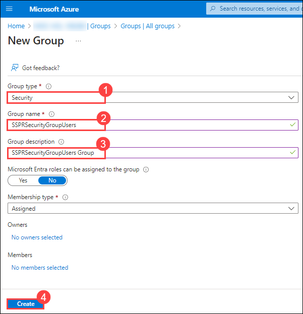

1. Navigate back to the **Microsoft Entra ID** home page, from the left navigation menu, select **Password reset** under **Manage**.

   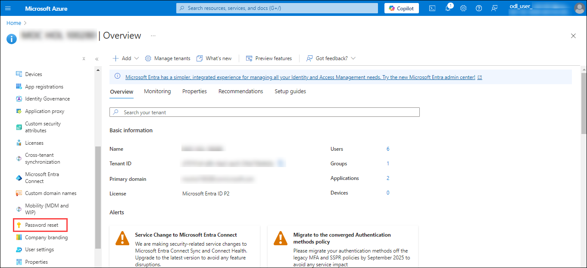

1. On the **Password reset | Properties** page, under **Self service password reset enabled**, choose **Selected (1)** option and then select your Microsoft Entra ID group,by clicking on the **No group selected**.

   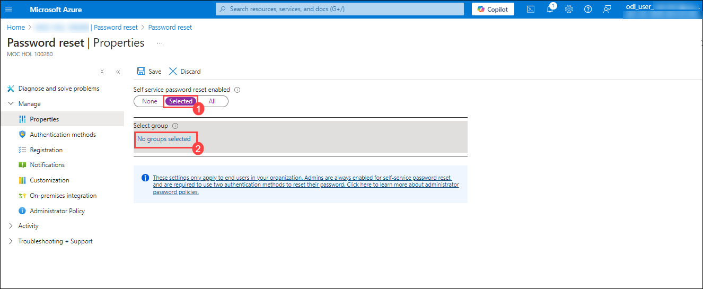
   
1. Select **SSPRSecurityGroupUsers (1)** group, after that choose **Select (2)**.

   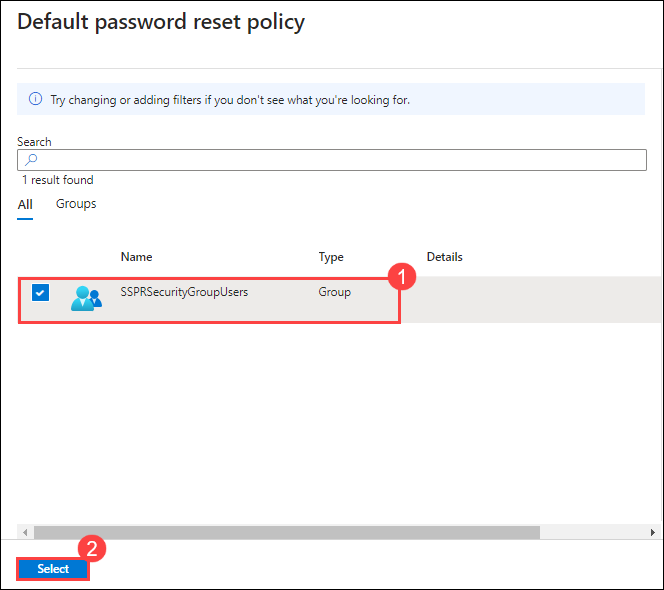

1. Once you Microsoft Entra ID group is selected, make sure that it appears under **Select group(1)** and then click on **Save(1)**.

   

1. Close the Properties window of Password reset by selecting the X at the top right corner of the page.
   
1. In Microsoft Entra ID Overview page, click on the **Groups** blade under the manage section.

   
  
1. In the Search groups field, select **SSPRSecurityGroupUsers**.  It will take you to the configuration option for this group.

   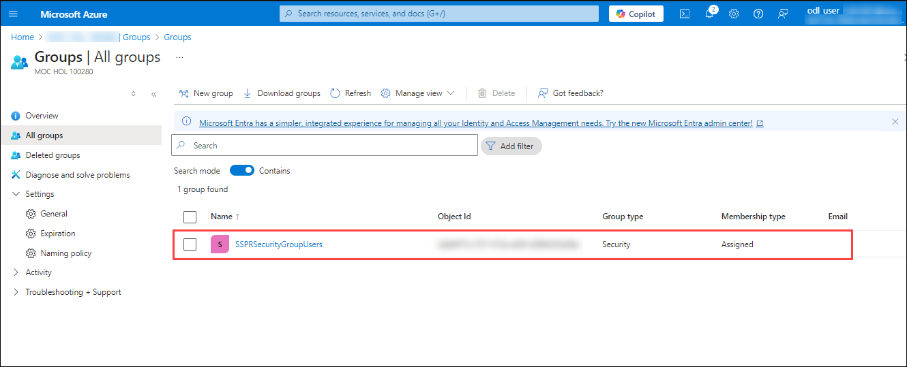
 
1. From the left navigation pane, select **Members** under **Manage**.

   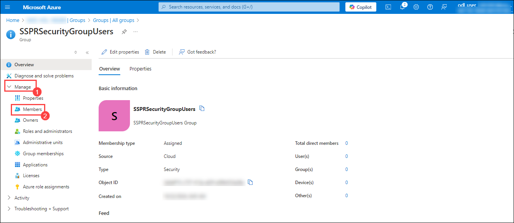

1. From the top of the page, select **+ Add members**.

   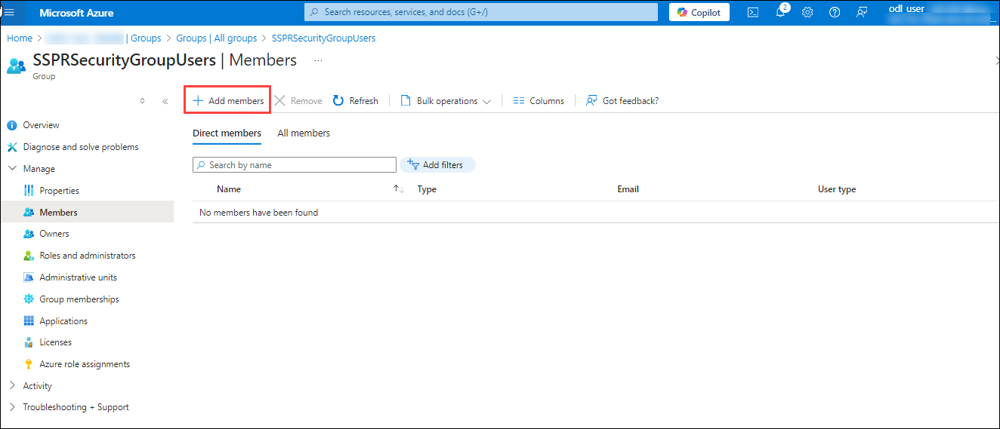 

1. In the Search box, enter **Adele (1)**.  Once the user, **Adele Vance (2)**, appears below the search box, select it then press **Select (3)** from the bottom of the page.

   
   
1. Close out of the SSPRSecurityUsers window, selecting the **X** on the top right corner of the screen,

1. Return to the **Microsoft Entra ID** page.

1. From the left navigation panel select **Users(2)** under **Manage(1)**.

   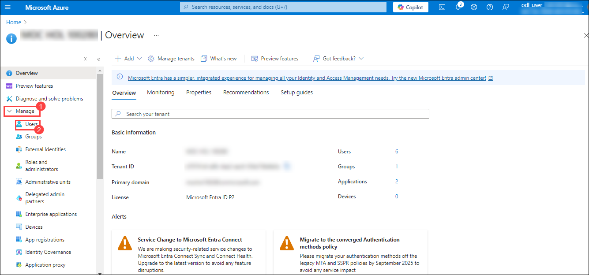
   
1. Select **Adele Vance** from the list of users.

   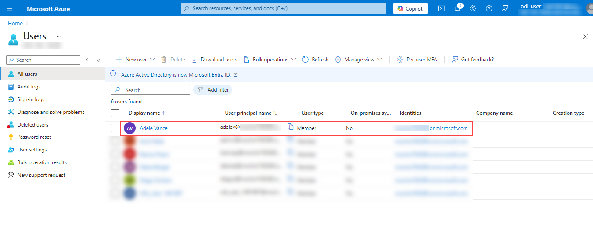

1. Select **Reset password(1)** from the top of the page. Since you have not previously signed in as Adele Vance, you will need to reset the password

1. When the Reset password window opens, select **Reset Password(2)**.  

   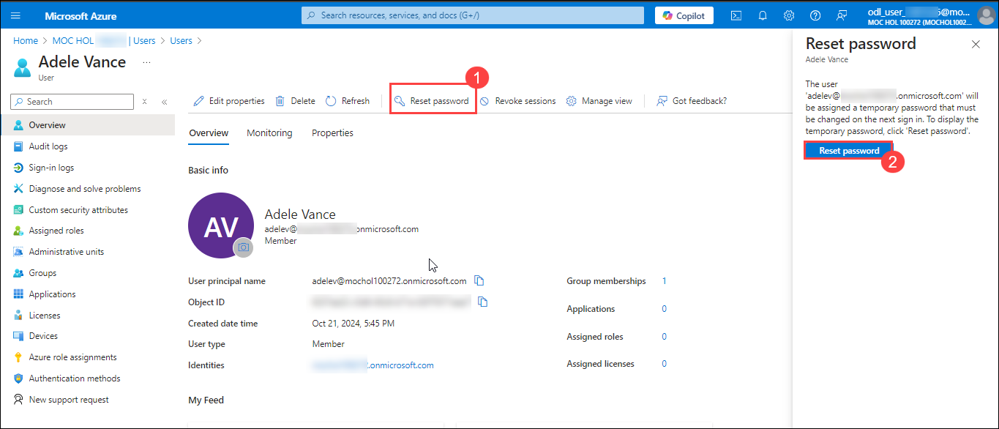

   >**IMPORTANT**: Make a note of the new password, as you will need it in a subsequent task, to be able to sign in as the user.

   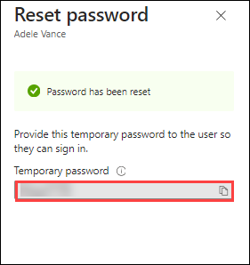
   
1. Close the password reset window by selecting the **X** at the top right corner of the page.

1. Close the Adele Vance window by selecting the **X** at the top right corner of the page.

1. Close the Users window by selecting the **X** at the top right corner of the page.

1. Keep the **Microsoft Entra ID** Overview window open as you will use it in the subsequent task.

## Task 2: Configure Password reset for users

In this task, you, as the admin, will learn how to configure Password reset for users, including the configuration of the types of authentication methods to use.

1. Go to the **Microsoft Entra ID** home page.

1. From the left navigation pane, select **Password reset**.  

1. The properties for self-service password reset are displayed.  Ensure that **Self-service reset** is **selected** for the group which is listed, the **SSPRSecurityUsers**.  Put your cursor over the information icon next to where it says "select group" and note what it says, "Defines the group of users who are allowed to reset their own passwords." You must include users in the group, you can’t individually select users.  Also, if you change the group, then the group you select replaces the group currently listed.  As such, it is recommended that you simply add users to the SSPR group.  Lastly, note the blue information box, "These settings only apply to end users in your organization. Admins are always enabled for self-service password reset and are required to use two authentication methods to reset their password."

1. From the left navigation panel of Password reset, select **Authentication Methods**.

1. In the Number of methods required to reset, select **1**. Note the information box on the screen.

1. Notice the different methods available to users.  **Email** and **Mobile phone** should already be checked; if not, select them and click save.

   .png)

1. From the left navigation panel of Password reset, select **Registration**.  

1. Ensure the setting to Require users to register when signing in is set to **Yes**.  Leave the Number of days before users are asked to re-confirm their authentication information, to the default of 180 and click save if any changes have been made.  Take note of the information box on the page.

1. From the left navigation panel of Password reset, select **Notifications**.  

1. Ensure the setting to Notify users on password resets is set to **Yes**.  Leave the setting for Notify all admins when other admins reset their password to **No**.

1. Note how the Password reset navigation pane also includes options to view audit logs and Usage & insights.

     .png)

1. **Sign out** from all the browser tabs by clicking on the user icon next to the email address on the top right corner of the screen. Then the close all the browser windows.

## Task 3: Registration process for a self-service password reset

>**Important:** Before proceeding with this task, in your Mobile phone, download the **Microsoft Authenticator App**.

In this task, you, as user Adele Vance, will go through the registration process for a self-service password reset.  This task requires that you have access to a mobile device where you can receive text messages.
 
1. Open Microsoft Edge.

1. Go to [login.microsoftonline.com](https://www.office.com) portal.

1. Sign in as Adele Vance,
    1. In the Sign in window enter **Adelev@azureholxxxx.onmicrosoft.com** (where xxxxxx can be found in the **Environment** Tab in the Lab Guide section) then select **Next**.
    2. Enter the password you noted in the earlier task. Select **Sign in**.
    3. When prompted to stay signed- in, select **Yes**.

1. Since this is your first sign-in as Adele Vance, you will be prompted to reset your password.  Enter your old password.  For your new password enter **SC900-Lab**. Enter **SC900-Lab** in the confirm password field.  Select **Sign in**.  

   >**Note:** we are using this password only for the convenience of the lab. As a best practice, you would typically enter a more secure password.

1. A pop-up displays indicating that **Action Required**. his is because as a member of the SSPRSecurityUsers group, the configuration requires its members to register when they sign in. Select the **Next** button. Then When prompted to stay signed- in, select **Yes**.

    >**Note**:  An alternative to having users do the registration, themselves, is for admins to directly configure the authentication methods when they add a user. This requires admins to know and set the ​phone numbers and email addresses that users use to perform a self-service password reset, and reset a user’s password.

   .png)

   .png)

   .png)

1. In the Keep your account secure window, you have the option to select the method to use for MFA. Microsoft Authenticator is one option. Select **I want to set up a different authenticator app (1)**. On the **Authenticator app**, select **Next (2)**.

   

1. On the **Set up your account** page opens, select **Next**.

1. **Scan the QR code** through your phone. On the phone, inside the **Authenticator app** select **Work or school account**, and scan the QR code. Select **Next** on the **Keep your account secure** page. Enter the code, which is shown on the Authenticator app.

1. Now, Enter the phone number where you can receive a text code and select the **Next** button. A new window opens indicating a code was just sent to the phone you entered.  Enter the code you are received and select **Next**. A window opens indicating **Verification complete. Your phone has been registered.** Select **Next**. Select **Done**, on the **Success!** page.

   .png)

1. You can now complete your sign-in. You should be on the Office 365 landing page. If you see that your sign-in time has expired, just reenter the password, SC900-Lab.

1. Sign out of the Office 365 page and close your browser window.
  
    > **Congratulations** on completing the task! Now, it's time to validate it. Here are the steps:
    > - Hit the Validate button for the corresponding task. If you receive a success message, you can proceed to the next task. Alternatively, you can navigate to the Lab Validation Page, from the upper right corner in the lab guide section.
    > - If not, carefully read the error message and retry the step, following the instructions in the lab guide. 
    > - If you need any assistance, please contact us at labs-support@spektrasystems.com. We are available 24/7 to help you out.
 
    <validation step="40262c29-497d-4b45-a9cb-48830f9bb272" />

## Task 4 (Optional): Process of resetting your password

In this task, you, as user Adele Vance, will go through the process of resetting your password.

1. Open Microsoft Edge.

1. Go to [login.microsoft.com](https://login.microsoft.com) portal.

1. Sign in as Adele Vance, by entering your email **Adele@azureholxxxx.onmicrosoft.com** (user email id of Adel Vance)and select the **Next** button. You may, instead, see a Pick an account window open, if so, select the account for Adele Vance.

1. From the Enter password window, select **Forgot my password**. 

1. The Get back into your account window opens. Verify that the email for Adele Vance, Adele@azureholxxxx.onmicrosoft.com, is shown in the email or username box.  If not, enter it. In the empty box, enter the characters displayed in the image or the words from the audio. Once you have entered them, select **Next**.

   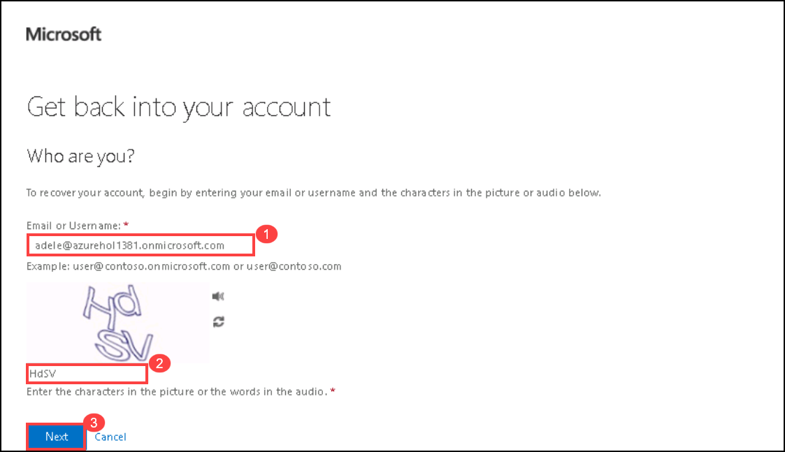

1. The screen shows Get back into your account and shows Verification step 1 > choose a new password. Leave the default setting **Text my mobile phone**.  You are prompted to enter your mobile phone number.  Once you have entered it, select the **Text button**.
   .png)

1. Enter the verification code then press **Next**.

1. In the next screen you are prompted to enter the new password and confirm the new password.  Enter those now and select the **Finish** button.

1. You will see a message on the screen that your password has been reset.  Select **click here** to sign in with your new password.

1. From the Pick an account information box, select **Adele@azureholxxxx.onmicrosoft.com**, enter your new password, then select the **Sign in** button.  If you are prompted to Stay signed in. select **No**.

1. You should now be on the Office 365 Page.

1. Sign out by selecting the user icon next to the email address on the top right corner of the screen and selecting **Sign out**. Then the close all the browser windows

## Task 5 (Optional):  View the Audit logs and the Usage & insights data associated with password reset

In this task, you, as the administrator, will briefly view the Audit logs and the Usage & insights data associated with password reset.

1. Open Microsoft Edge.

1. In the address bar enter and sign in to the Azure portal at https://portal.azure.com with the Azure credentials.

     * Email/Username: <inject key="AzureAdUserEmail"></inject>

1. Now enter the following password and click on **Sign in**.
  
     * Password: <inject key="AzureAdUserPassword"></inject>
  
     * When prompted to stay signed- in, select **Yes**.

1. Select **Azure Active Directory**.  

1. From the left navigation pane, select **Password reset**.

1. From the left navigation pane, select **Audit logs**.  Notice the information available and the available filters.  Also, note that you can download logs.  

1. Select **Download**.  Note that you can format the download as CSV or JSON.  Close the window by selecting the **X** on the top right corner of the screen.

   -01.png)

1. From the left navigation pane, select **Usage & insights**.

1. Notice the information available that pertains to Registration.  Note that it may take time to refresh this data, even after you do a refresh, so it may not yet reflect the registration or usage data from the previous task.

1. From the top of the page select **Usage** to view the number of Self-service password resets and account unlocks by the method.  Note that it may take time to refresh this data, even after you do a refresh, so it may not yet reflect the usage data from the previous task.

1. Close the open browser tabs.

### Review
In this lab, you, as an admin, went through the process of enabling a self-service password reset. With SSPR enabled, you will then assumed the role of a user to go through the process of registering for SSPR and also resetting your password.  Lastly, you as the admin, learn where to access audit logs and usage & insights data for SSPR.

## You have successfully completed the lab
