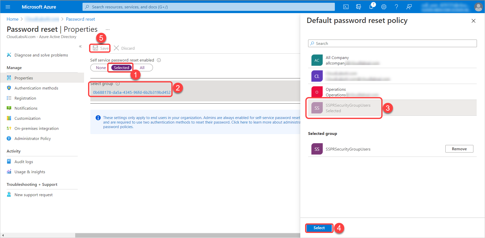
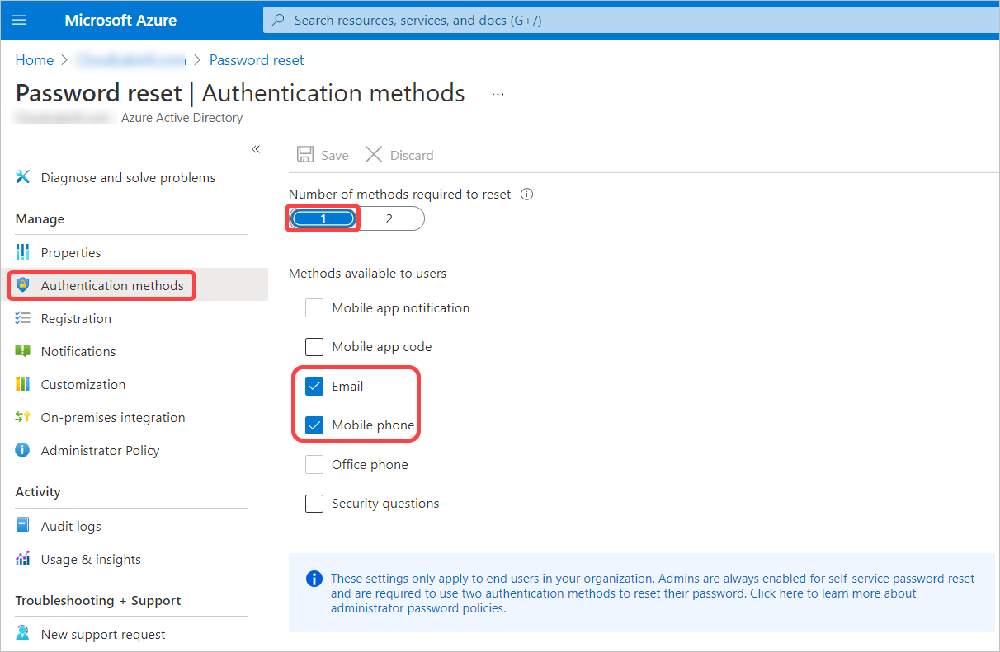
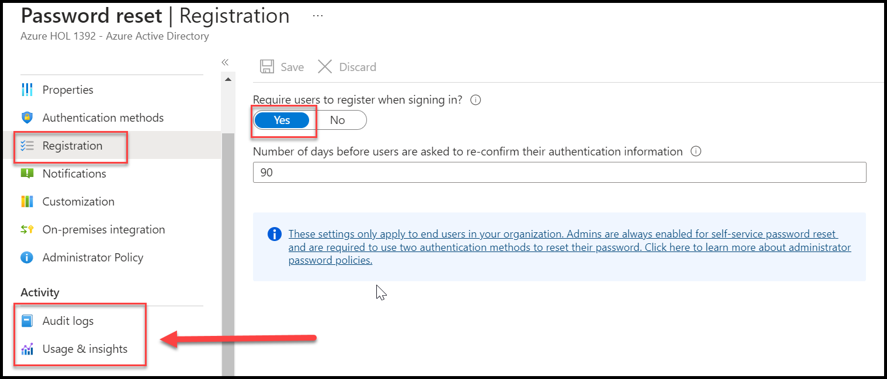
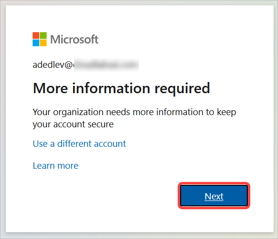
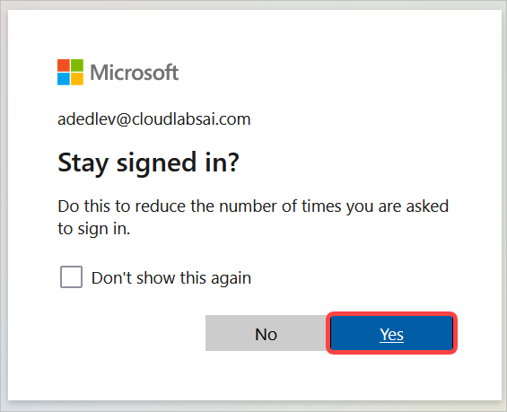
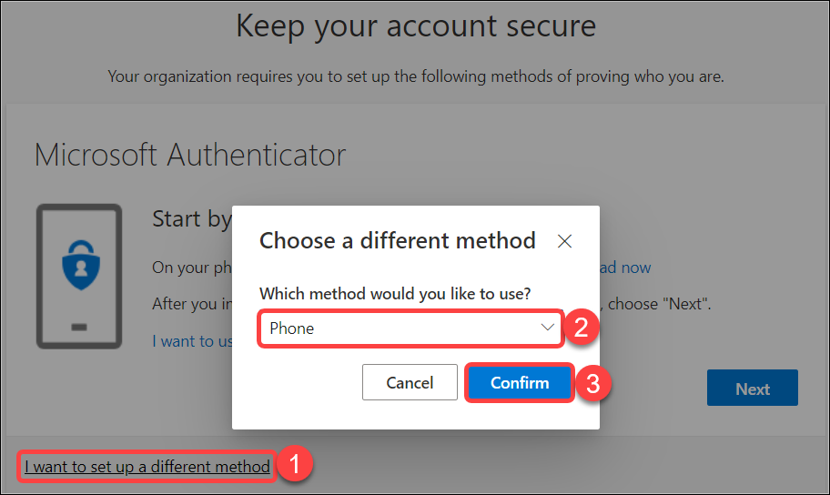
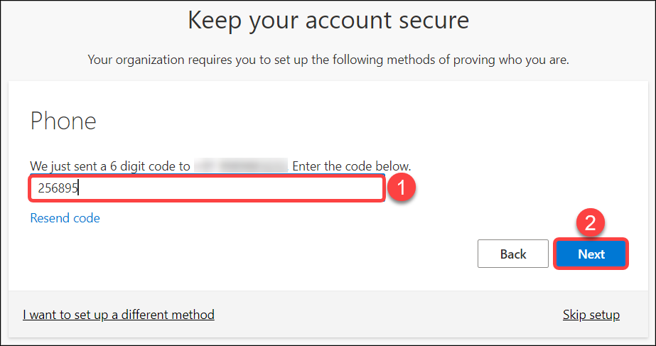
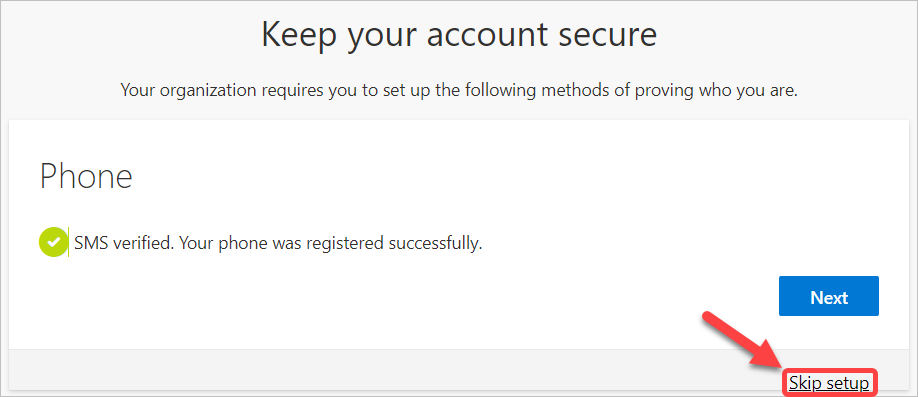
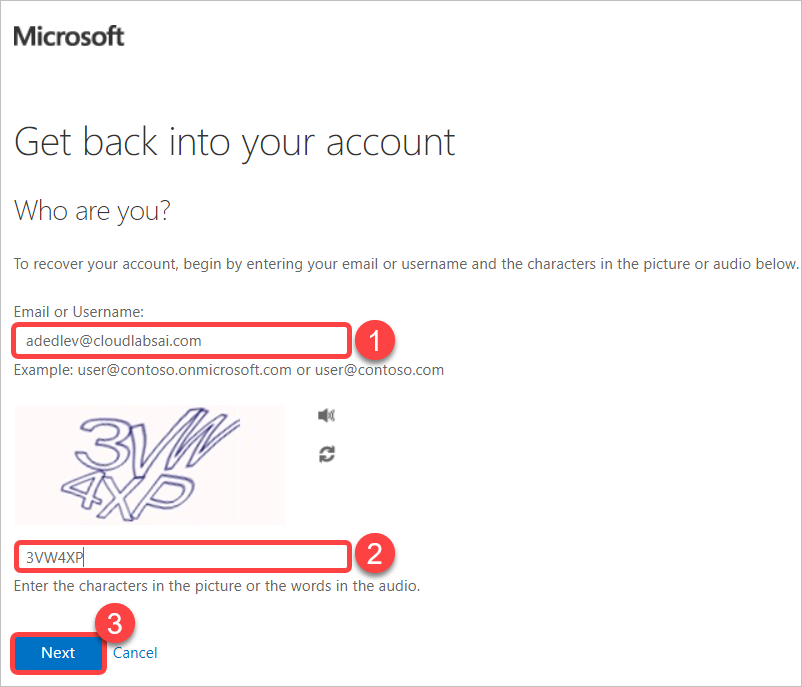
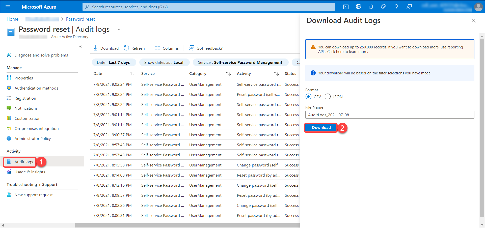

# Lab: Explore Azure AD Authentication with a self-service password reset

## Lab scenario

In this lab, you, as an admin, will walk through the process of enabling self-service password reset. With SSPR enabled, you will then assume the role of a user and go through the process of registering for SSPR and also resetting your password.  Lastly, you as the admin will be able to view audit logs and usage data & insights for SSPR.

**Estimated Time**: 15-20 minutes

#### Task 1:  In this task, you, as the admin, will add an existing user, Adele Vance, into the SSPRSecurityUsers group.  Also, you will also need to do a reset the user’s password so that you can do the first-time login, as the user, and register for SSPR.

1. Open Microsoft Edge.

2. In the address bar enter **portal.azure.com** and sign in with the credentials provided in the **Environment Details** Tab.
    1. In the Sign in window enter **odl_user_xxxxx@xxxxx.onmicrosoft.com** (username which you will find in the Environment Details tab) then select **Next**.
    1. Enter the admin password which should be provided by your lab hosting provider. Select **Sign in**.
    1. When prompted to stay signed- in, select **Yes**.

3. Select **Azure Active Directory**.  

4. From the left navigation panel, select **Groups**.

#### Task 2: Creating a basic group

1. On the Active Directory page, select Groups and then select New group.

   

1. Populate the **New Group** fields as follows and Select **Create**

    1. Group type: **Security**.

    2. Group name: **SSPRSecurityGroupUsers**.

    4. Group description: **Add an optional description to your group**.

1. On the **Azure Active Directory** home page, select **Password reset**.

1. From the Properties page, under the option Self-service password reset enabled, Choose **Selected**, then under **Select group** option, click on **No groups selected**.

1. Browse for and select your Azure AD group, SSPRSecurityGroupUsers, after that choose Select, then select save.

   

5. Now go to the **Groups**. In the Search groups field, enter **SSPR**, then from the search results select **SSPRSecurityGroupUsers**.  It will take you to the configuration option for this group.

6. From the left navigation pane, select **Members**.

7. From the top of the page, select **+ Add members**.  

8. In the Search box, enter **Adele**.  Once the user, **Adele Vance**, appears below the search box, select it then press **Select** from the bottom of the page.

   
   
9. Close out of the SSPRSecurityUsers window, selecting the **X** on the top right corner of the screen,

   

10. Return to the **Azure Active Directory** page.

11. From the left navigation panel select **Users**.

12. Select **Adele Vance** from the list of users.

13. Select **Reset password** from the top of the page. Since you have not previously signed in as Adele Vance, you will need to reset the password

14. When the password reset window opens, select **Reset Password**.  IMPORTANT, make a note of the new password, as you will need it in a subsequent task, to be able to sign in as the user.

15. Close the password reset window by selecting the **X** at the top right corner of the page.

   

16. Close the Adele Vance window by selecting the **X** at the top right corner of the page.

17. Close the Users window by selecting the **X** at the top right corner of the page.

18. Keep the AAD Overview window open as you will use it in the subsequent task.

#### Task 2: In this task, you, as the admin, will learn how to configure Password reset for users, including the configuration of the types of authentication methods to use.

1. Go to the Azure Active Directory home page

2. From the left navigation pane, select **Password reset**.  

3. The properties for self-service password reset are displayed.  Ensure that **Self-service reset** is **selected** for the group which is listed, the **SSPRSecurityUsers**.  Put your cursor over the information icon next to where it says "select group" and note what it says, "Defines the group of users who are allowed to reset their own passwords." You must include users in the group, you can’t individually select users.  Also, if you change the group, then the group you select replaces the group currently listed.  As such, it is recommended that you simply add users to the SSPR group.  Lastly, note the blue information box, "These settings only apply to end users in your organization. Admins are always enabled for self-service password reset and are required to use two authentication methods to reset their password."

5. From the left navigation panel of Password reset, select **Authentication Methods**.

6. In the Number of methods required to rest, select **1**. Note the information box on the screen.

7. Notice the different methods available to users.  **Email** and **Mobile phone** should already be checked; if not, select them and click save.

   

8. From the left navigation panel of Password reset, select **Registration**.  

9. Ensure the setting to Require users to register when signing in is set to **Yes**.  Leave the Number of days before users are asked to re-confirm their authentication information, to the default of 90 and click save if any changes have been made.  Take note of the information box on the page.

10. From the left navigation panel of Password reset, select **Notifications**.  

11. Ensure the setting to Notify users on password resets is set to **Yes**.  Leave the setting for Notify all admins when other admins reset their password to **No**.

12. Note how the Password reset navigation pane also includes options to view audit logs and Usage & insights.

   

13. **Sign out** from all the browser tabs by clicking on the user icon next to the email address on the top right corner of the screen. Then the close all the browser windows.

#### Task 3:  In this task, you, as user Adele Vance, will go through the registration process for a self-service password reset.  This task requires that you have access to a mobile device where you can receive text messages or a personal email account that you can access.
 
1. Open Microsoft Edge.

2. In the address bar enter **login.microsoftonline.com**.

3. Sign in as Adele Vance,
    1. In the Sign in window enter **adedlev@azureholLxxxxx.onmicrosoft.com**  then select **Next**.
    1. Enter the password you noted in the earlier task. Select **Sign in**.
    1. When prompted to stay signed- in, select **Yes**

4. Since this is your first sign-in as Adele Vance, you will be prompted to reset your password.  Enter your old password.  For your new password enter **SC900-Lab**. Enter **SC900-Lab** in the confirm password field.  Select **Sign in**.  Note: we are using this password only for the convenience of the lab. As a best practice, you would typically enter a more secure password.

5. A pop-up displays indicating that **Help us protect your account**. Click on **Skip for now (14 days until this is required)** and then you will get another pop-up saying **More information is required**.  This is because as a member of the SSPRSecurityUsers group, the configuration requires its members to register when they sign in.  Select the **Next** button. Again you will get a pop-up display indicating that **Help us protect your account**. Click on **Skip for now (14 days until this is required)**. Then When prompted to stay signed- in, select **Yes**

    >Note:  An alternative to having users do the registration, themselves, is for admins to directly configure the authentication methods when they add a user. This requires admins to know and set the ​phone numbers and email addresses that users use to perform a self-service password reset, and reset a user’s password.

   

   

   

6. In the Keep your account secure window, you have the option to select the method to use for MFA.  Microsoft Authenticator is one option. For expediency in this lab exercise, you will choose a different method.  Select **I want to set up a different method**.  From the Chose a different method pop-up window, select the **drop-down arrow** and select **Phone** then select **Confirm**.

   

7. The **Keep your account secure** page opens.  The window that appears is for the Phone authentication method, if you don’t have a mobile device with you that is capable of receiving text messages, skip to the next step.  You are prompted to enter a phone number. Ensure the option **Text me a code** is enabled.   Enter the phone number where you can receive a text code and select the **Next** button. A new window opens indicating a code was just sent to the phone you entered.  Enter the code you are received and select **Next**. A window opens indicating Success and showing your Default sign-in method.  Select **Done**. 

   

   

   

8. Skip this step if you were able to configure SSPR with your mobile phone number.  Alternatively, you can set up a different method as shown on the bottom left of the window.  If you choose to set up a different method, select **I want to set up a different method**, a pop-up window shows up, asking Which method would you like to use?  From the drop-down, select your preferred method, **Email**, then select the **Confirm** button.  Enter the email you would like to use then select **Next**.  A new window opens indicating a code was just sent to the email you entered.  Access the email you entered to obtain the code.  Enter the code you are received and select **Next**. A window opens indicating Success and showing your Default sign-in method.  Select **Done**.

>Note: if it's ask you to choose between **Email** and **Authenticator app**, select **Authenticator App** and proceed with the further steps.

9. You can now complete your sign-in. You should be on the Office 365 landing page. If you see that your sign-in time has expired, just reenter the password, SC900-Lab.

10. Sign out of the Office 365 page and close your browser window.

#### Task 4 (Optional): In this task, you, as user Adele Vance, will go through the process of resetting your password.

1. Open Microsoft Edge.

2. In the address bar enter login.microsoftonline.com.

3. Sign in as Adele Vance, by entering your email **AdeleV@WWLxxxxx.onmicrosoft.com** (user email id of Adel Vance)and select the **Next** button. You may, instead, see a Pick an account window open, if so, select the account for Adele Vance.

4. From the Enter password window, select **Forgot my password**. 

5. The Get back into your account window opens. Verify that the email for Adele Vance, AdeleV@WWLxZZZZ.onmicrosoft.com, is shown in the email or username box.  If not, enter it. In the empty box, enter the characters displayed in the image or the words from the audio. Once you have entered them, select **Next**.

   

6. The screen shows Get back into your account and shows Verification step 1 > choose a new password. Leave the default setting **Text my mobile phone**.  You are prompted to enter your mobile phone number.  Once you have entered it, select the **Text button**.  If during the registration you selected email, the Get back into your account window will indicate You will receive an email containing a verification code at your alternate email address.  Select **Email**. 

   

7. Enter the verification code then press **Next**.

8. In the next screen you are prompted to enter the new password and confirm the new password.  Enter those now and select the **Finish** button.

9. You will see a message on the screen that your password has been reset.  Select **click here** to sign in with your new password.

10. From the Pick an account information box, select **AdeleV@WWLxZZZZZZ.onmicrosoft.com**, enter your new password, then select the **Sign in** button.  If you are prompted to Stay signed in. select **No**.

11. You should now be on the Office 365 Page.

12. Sign out by selecting the user icon next to the email address on the top right corner of the screen and selecting **Sign out**. Then the close all the browser windows

#### Task 5 (Optional):  In this task, you, as the administrator, will briefly view the Audit logs and the Usage & insights data associated with password reset.

1. Open Microsoft Edge.

2. In the address bar enter **portal.azure.com** 

3. Sign in with the credentials provided in the **Environment Details** Tab. 
    1. In the Sign in window enter **odl_user_xxxxx@WWLxxxxx.onmicrosoft.com** (you will find the odl user email in the Environment Details tab) then select **Next**.
    1. Enter the admin password which should be provided by your lab hosting provider. Select **Sign in**.
    1. When prompted to stay signed- in, select **Yes**.

4. Select **Azure Active Directory**.  

5. From the left navigation pane, select **Password reset**.

6. From the left navigation pane, select **Audit logs**.  Notice the information available and the available filters.  Also, note that you can download logs.  

7. Select **Download**.  Note that you can format the download as CSV or JSON.  Close the window by selecting the **X** on the top right corner of the screen.

   

8. From the left navigation pane, select **Usage & insights**.

9. Notice the information available that pertains to Registration.  Note that it may take time to refresh this data, even after you do a refresh, so it may not yet reflect the registration or usage data from the previous task.

10. From the top of the page select **Usage** to view the number of Self-service password resets and account unlocks by the method.  Note that it may take time to refresh this data, even after you do a refresh, so it may not yet reflect the usage data from the previous task.

11. Close the open browser tabs.

#### Review
In this lab, you, as an admin, went through the process of enabling a self-service password reset. With SSPR enabled, you will then assumed the role of a user to go through the process of registering for SSPR and also resetting your password.  Lastly, you as the admin, learn where to access audit logs and usage & insights data for SSPR.
