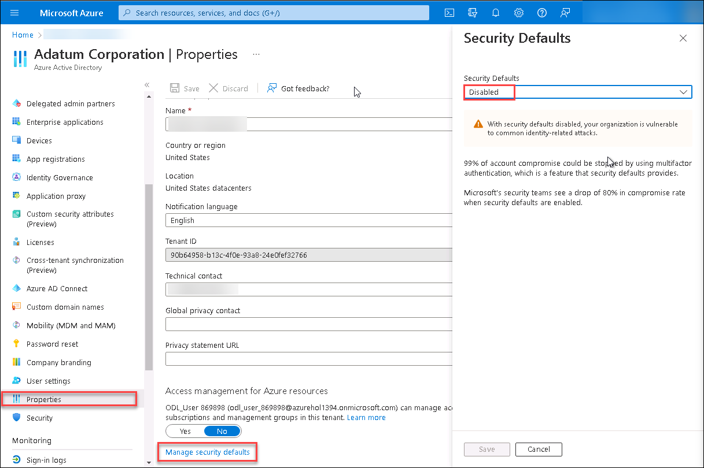
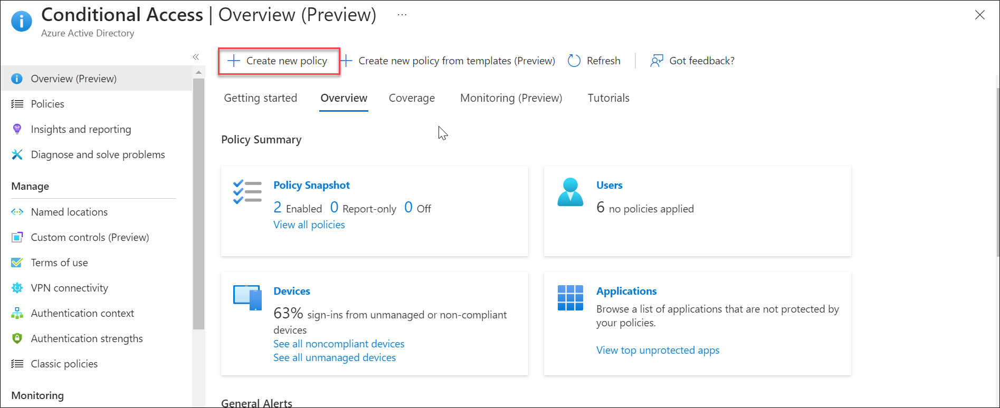
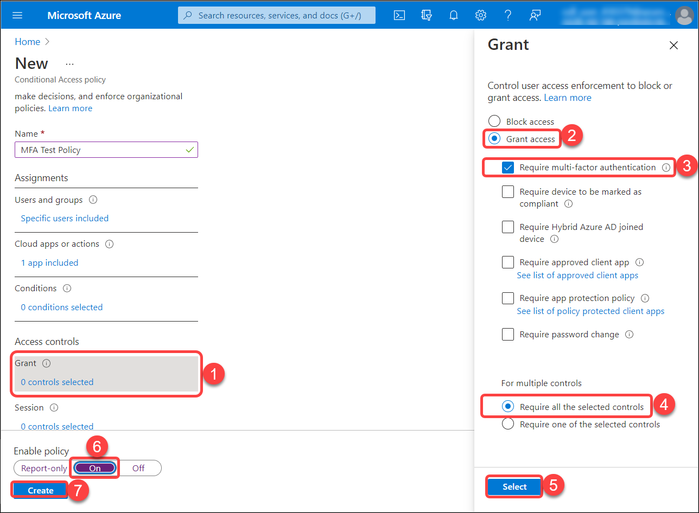
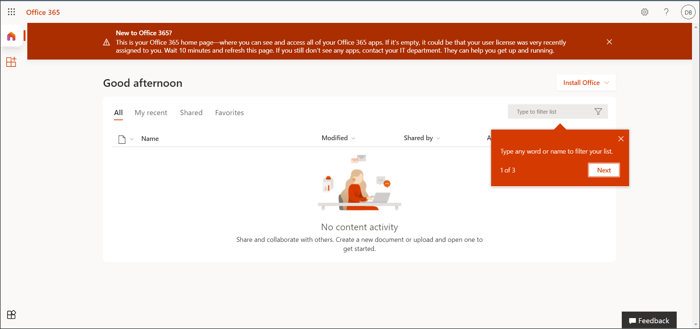
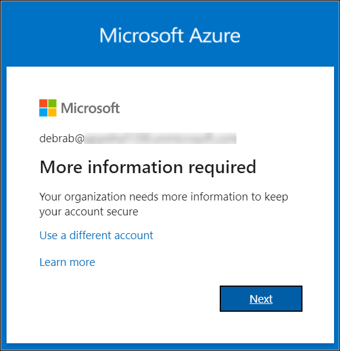
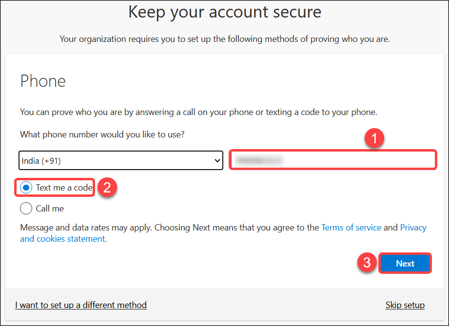

# Lab: Explore access management in Azure AD with Conditional

## Lab scenario
In this lab, you will explore conditional access MFA, from the perspective of an admin and a user.  As the admin will create a policy that will require a user to go through multi-factor authentication when accessing a cloud-based Microsoft Azure Management application.  From a user perspective, you will see the impact of the conditional access policy, including the process to register for MFA.

**Estimated Time**: 10-15 minutes

#### Task 1: In this task, you, as the admin, will reset the password for the user Debra Berger.  This step is needed so you can initially sign in as the user in subsequent tasks.

1. Open Microsoft Edge.  In the address bar enter **portal.azure.com**.

2. if not sign in, sign in with the credentials provided in the **Environment Details** Tab. 
    1. In the Sign in window enter **<inject key="AzureAdUserEmail"></inject>** (username that you will find in the Environment Details tab) then select **Next**.
    1. Enter the admin password which should be provided by your lab hosting provider. Select **Sign in**.
    1. When prompted to stay signed- in, select **Yes**.

3. Select **Azure Active Directory**.  

4. From the left navigation panel select **Users**.

5. Click on **+ New User > Create new user**. **Debra Berger** from the list of users.

    

1. Then in **Create new user** page, on basics tab provide the following credentials, then click on **Review + Create** and **Create**:-

    | Setting| Value|
    |----|----|
    | User principal name | **Debraberger**|
    | Display name | **Debra Berger** |
    | Auto generated password | **unchecked** |
    | Password | **Give unique password** |

    > **Note**: Copy and paste your password for further use.

1. Now you are able to see the new user on the user's page.

   > **Note**: make a note of the new password, as you will need it in a subsequent task, to be able to sign in as the user.

1. Select **Debra Berger** from the list of users.

9. Close the Users window by selecting the **X** at the top right corner of the page.

10. Keep this window open.

#### Task 2:  In this task, you will go through the process of creating a conditional access policy in Azure AD.  

2. Under Manage, select **Properties**, Click on **Manage Security defaults** Set the Security defaults to disabled and click on save.
 
   

2. Go back to the Azure Active Directory Home page. From the left navigation panel, select **Security**.

   

3. From the left navigation panel, select **Conditional Access**.

   

4. The Conditional Access Policies screen is displayed. Any existing Conditional Access Policies are listed here. Select **+ Create new policy**.

   

5. In the Name field, enter **MFA Test Policy**.

6. Under Users and groups, select **0 users and groups selected**.

7. You will now see the option to Include or Exclude users or groups.  Make sure **Include** is selected (underlined).

8. Select the option for **Select users and groups** and select **Users and groups**.  The window to select users and groups opens.  

9. In the Search bar, enter **Debra**.  Select **Debra Berger** from beneath the search bar, then press the **Select** button on the bottom of the page.  Note, a common practice is to assign the policy to users in a group.  For the purpose of expediency with this lab, we will assign the policy to a specific user. 

   

10. Under Cloud apps or actions, select **No cloud apps, actions, or authentication selected**.

11. You will now see the option to Include or Exclude cloud apps or user actions.  Make sure **Cloud apps** is highlighted and **Include** is selected (underlined), then select **Select apps**.  under **Select** click on **None**, then the window to Select Cloud apps opens.

12. In the search bar, Type/Search and select **Microsoft Azure Management**, then press **Select** at the bottom of the page.  Notice the warning.  

   

13. Under Conditions, select **0 conditions selected**.  Notice the different options you can configure.  Through the policy, you can control user access based on signals from conditions like risk, device platform, location, client apps, or device state.  For example, you could include a condition for the policy to apply for any location except selected or trusted locations such as your headquarters’ network.  For this policy, do not set any conditions.

14. Now you will set the access controls.  Under Grant, select **0 controls selected**.

15. The Grant window opens.  Ensure **Grant access** is selected and then select **Require multi-factor authentication**.  Under the section For multiple controls, leave the default **Require all the selected controls**.  Press **Select** at the bottom of the page.

16. AT the bottom of the page, Under Enable policy, select **On**, then press the **Create button**.

   

17. After a few seconds, the MFA Test policy should appear in the list of conditional access policies (if needed, select **Refresh** at the top of the page).

18. Sign out of Azure and close your browser windows.

#### Task 3: In this task, you will see the impact of the conditional access policy, from the perspective of the user, Debra Berger. You will start first by signing in to an application that is not included in the conditional access policy.  Then you will repeat the process for an application that is included in the conditional access policy.  Recall that the policy requires the user to go through MFA when accessing a Microsoft Azure Management application.  To use MFA, the user must first register the authentication method that will be used for MFA, for example, a code sent to a mobile device or an authenticator application.

1. Open Microsoft Edge.  In the address bar of the browser, enter **https://login.microsoftonline.com/**.

1. Sign in as Debra Burger,
    1. In the Sign in window enter **DebraB@WWLxxxxx.onmicrosoft.com** (where xxxxxx is your unique tenant ID provided by your lab hosting provider) then select **Next**.
    1. Enter the password you noted in the earlier task. Select **Sign in**.
    1. Since the password provided when you, as the admin, reset the password is temporary you need to update your password (this is not part of MFA).  Enter the current password, then for the new password and confirm password fields enter **SC900-Lab**.
    1. When prompted to stay signed- in, select **Yes**

1. You should be successfully logged in to your Microsoft 365 account.  MFA was not required for this application as it is not part of the policy.

   

1. Now you will attempt to sign in to an application that meets the criteria for MFA.  Open Microsoft Edge and in the address bar, enter https://portal.azure.com.

1. You will see a window indicating, More information required.  Select **Next**.  Note, this will initiate the MFA registration process, as this is the first time you are accessing the cloud app that was identified in the conditional access policy.  This registration process is required only once.   An alternative to having the user go through the registration process is to have the admin configure the authentication method to use.

   

1. In the Keep your account secure window, you have the option to select the method to use for MFA.  Microsoft Authenticator is one option. For expediency in this lab exercise, you will choose a different method.  Select **I want to set up a different method**.  From the Chose a different method pop-up window, select the **drop-down arrow** and select **Phone** then select **Confirm**.

   

1. In the window that opens, ensure your country is selected then enter the mobile phone number you wish to use and select, ensure that **Text me a code** is selected, then press **Next**.  The screen will display, "SMS verified. Your phone was registered successfully".  Select **Next**. then select **Done**.  this completes the one-time registration process.

   

   

   

   

1. You will likely get a message indicating that your sign-in timed out.  Just enter the password **SC900-Lab** and select **Sign in**.

1. You will see a window prompting you to enter the code that was sent to your phone.  Enter the code and select **Next**.  This is the experience that you will experience anytime you access a Microsoft Azure Management cloud application, such as the Azure Portal, per the MFA policy.

1. You will see a window prompting you to enter the code that was sent to your phone.  Enter the code and select the **Verify** button.  When prompted to stay signed in, select **No**.

1. You should now be able to access the Azure portal.  The Azure portal is a Microsoft Azure Management application and therefore requires multi-factor authentication, per the conditional access policy that was created.  

1. Sign out by selecting the user icon next to the email address on the top right corner of the screen and selecting Sign out. Then the close all the browser windows.

#### Review
In this lab, you went through the process of setting up a conditional access policy that requires users to go through MFA when they access the Microsoft Azure Management cloud application.  Then, as a user, you went through the registration process for MFA and saw the impact of the conditional access policy that required you to use MFA when accessing the Azure portal.
