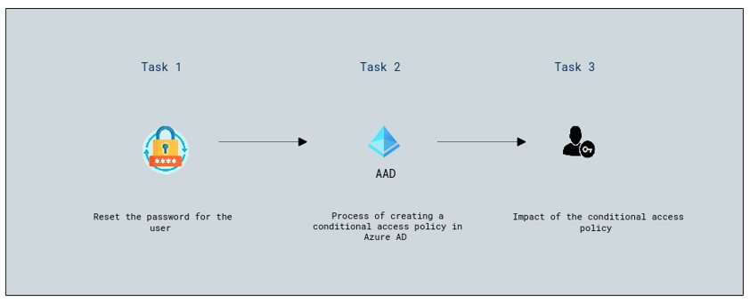
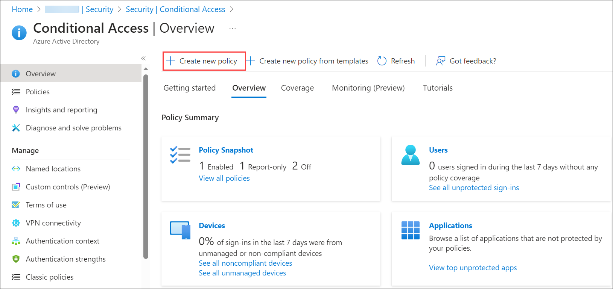
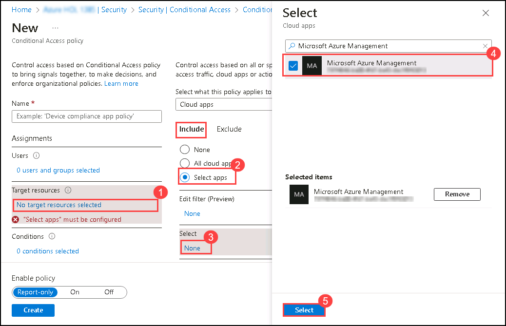
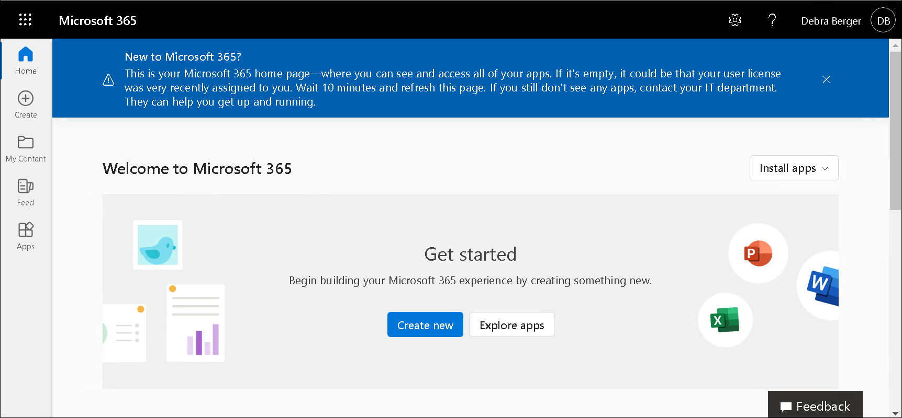
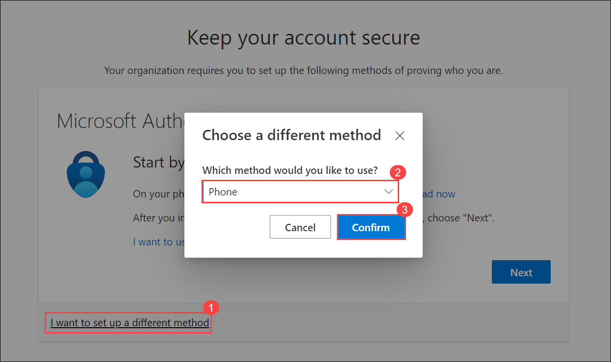
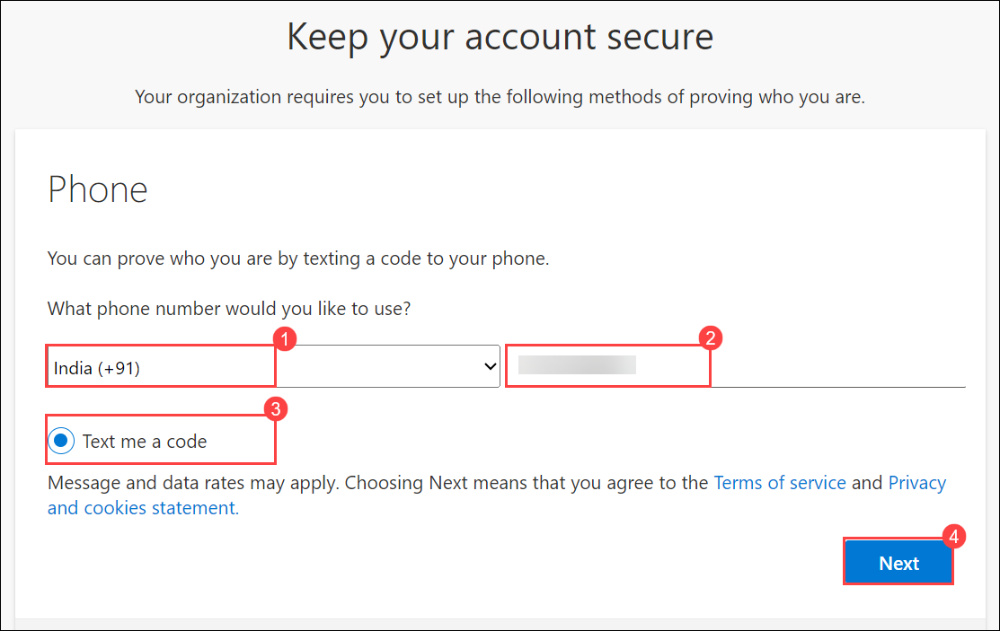
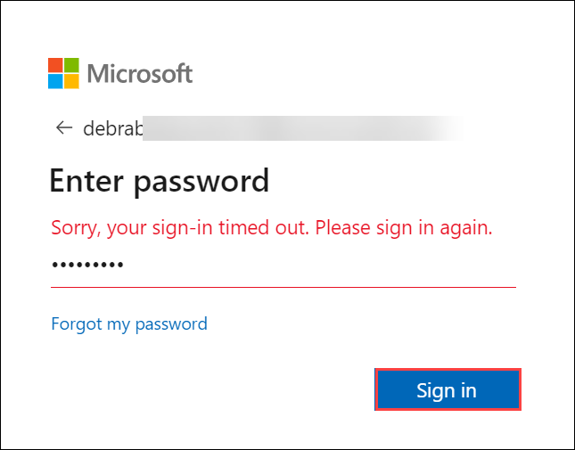
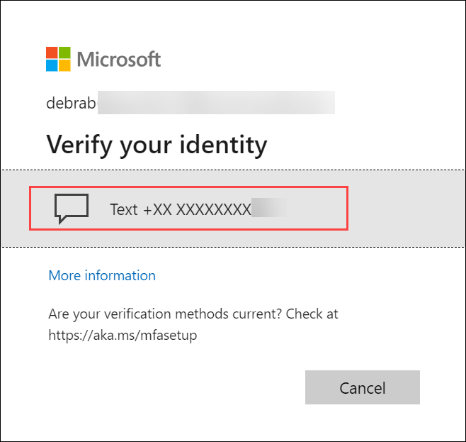

# Lab-03 : Explore access management in Azure AD with Conditional

## Lab scenario
In this lab, you will explore conditional access MFA, from the perspective of an admin and a user.  As the admin will create a policy that will require a user to go through multi-factor authentication when accessing a cloud-based Microsoft Azure Management application.  From a user perspective, you will see the impact of the conditional access policy, including the process to register for MFA.

## Lab objectives

In this lab, you will complete the following tasks:

+ Task 1: Reset the password for the user
+ Task 2: Process of creating a conditional access policy in Azure AD
+ Task 3: Impact of the conditional access policy

## Estimated timing: 30 minutes

## Architecture diagram

## Task 1:  Reset the password for the user

In this task, you, as the admin, will reset the password for the user Debra Berger.  This step is needed so you can initially sign in as the user in subsequent tasks.

1. If you are not already signed into the Azure portal, sign in to the Azure portal at https://portal.azure.com with the Azure credentials.

1. On **Sign in to Microsoft Azure** blade, you will see a login screen, in that enter the following email/username and then click on **Next**.
   
   * Email/Username: <inject key="AzureAdUserEmail"></inject>

1. Now enter the following password and click on **Sign in**.
   
   * Password: <inject key="AzureAdUserPassword"></inject>
   
1. On the Azure portal locate the search bar at the top of the page. Select the search result for **Azure Active Directory**.

1. From the left navigation panel select **Users**.

1. Select Debra Berger from the list of users.

1. Select **Reset password** from the top of the page. Since you have not previously signed in as Debra Berger you don’t know her password and will need to reset the password.

1. When the password reset window opens, select **Reset Password** and copy the password.

   >**IMPORTANT**: Kindly make a note of the new password, as you will need it in a subsequent task, to be able to sign in as the user.

1. Close the password reset window by selecting the **X** at the top right corner of the page.

1. Close users window by selecting the **X** at the top right corner of the page.

1. Close the All users window by selecting the **X** at the top right corner of the page. You should now be on the Azure Active Directory page.

1. Keep the browser page open, as you will in the subsequent tasks.

## Task 2: Process of creating a conditional access policy in Azure AD

 In this task, you will go through the process of creating a conditional access policy in Azure AD. 

1. On the **Azure Active Directory** page, under **Manage** section, select **Properties**, click on **Manage Security defaults** link, ensure that Security defaults is set to **Disabled**.

   
   
   >**Note**: if Security defaults is not set to **Disabled** kindly select **Disabled** from dropdown and click on **Save**.
 
1. Go back to the Azure Active Directory Home page. From the left navigation panel, under **Manage** section, select **Security**.

1. On **Security** page, from the left navigation panel, under **Protect** section, select **Conditional Access**.

1. The Conditional Access Policies screen is displayed. Any existing Conditional Access Policies are listed here. Select **+ Create new policy**.

    

    - In the Name field, enter **MFA Test Policy**.

    - Under Users and groups, select **0 users and groups selected**.

    - You will now see the option to Include or Exclude users or groups.  Make sure **Include** is selected (underlined).

    - Select the option for **Select users and groups** and select **Users and groups**.  The window to select users and groups opens.

      .png)
   
1. In the Search bar, enter **Debra**.  Select **Debra Berger** from beneath the search bar, then press the **Select** button on the bottom of the page.  Note, a common practice is to assign the policy to users in a group.  For the purpose of expediency with this lab, we will assign the policy to a specific user. 

    

1. Under **Target resources**, select **No target resources are selected**.

1. You will now see the option to Include or Exclude cloud apps or user actions.  Make sure **Cloud apps** is highlighted and **Include** is selected (underlined), then select **Select apps**.  under **Select** click on **None**, then the window to Select Cloud apps opens.

1. In the search bar, Type/Search and select **Microsoft Azure Management**, then press **Select** at the bottom of the page.  Notice the warning.  

    

1. Under Conditions, select **0 conditions selected**.  Notice the different options you can configure.  Through the policy, you can control user access based on signals from conditions like risk, device platform, location, client apps, or device state.  For example, you could include a condition for the policy to apply for any location except selected or trusted locations such as your headquarters’ network.  For this policy, do not set any conditions.

1. Now you will set the access controls.  Under Grant, select **0 controls selected**.

1. The Grant window opens.  Ensure **Grant access** is selected and then select **Require multi-factor authentication**.  Under the section For multiple controls, leave the default **Require all the selected controls**.  Press **Select** at the bottom of the page.

1. AT the bottom of the page, Under Enable policy, select **On**, then press the **Create button**.

    

1. After a few seconds, the MFA Test policy should appear in the list of conditional access policies (if needed, select **Refresh** at the top of the page).

    

1. Sign out of Azure and close your browser windows.

## Task 3: Impact of the conditional access policy

In this task, you will see the impact of the conditional access policy, from the perspective of the user, Debra Berger. You will start first by signing in to an application that is not included in the conditional access policy.  Then you will repeat the process for an application that is included in the conditional access policy.  Recall that the policy requires the user to go through MFA when accessing a Microsoft Azure Management application.  To use MFA, the user must first register the authentication method that will be used for MFA, for example, a code sent to a mobile device or an authenticator application.

1. Open Microsoft Edge.  In the address bar of the browser, enter **https://login.microsoftonline.com/**.

1. Sign in as Debra Burger,
    1. In the Sign in window enter **debrab@xxxxxx.onmicrosoft.com** (where xxxxxx can be found in the Environment Details Tabin the Lab Guide section) then select **Next**.
    1. Enter the password you noted in the earlier task. Select **Sign in**.
    1. Since the password provided when you, as the admin, reset the password is temporary you need to update your password (this is not part of MFA).  Enter the current password, then for the new password and confirm password fields enter **SC900-Lab**.
    1. When prompted to stay signed- in, select **Yes**

1. You should be successfully logged in to your Microsoft 365 account.  MFA was not required for this application as it is not part of the policy.

   

1. Now you will attempt to sign in to an application that meets the criteria for MFA.  Open Microsoft Edge and in the address bar, enter https://portal.azure.com.

1. You will see a window indicating, More information required.  Select **Next**.  Note, this will initiate the MFA registration process, as this is the first time you are accessing the cloud app that was identified in the conditional access policy.  This registration process is required only once.   An alternative to having the user go through the registration process is to have the admin configure the authentication method to use.

   .png)

1. In the Keep your account secure window, you have the option to select the method to use for MFA.  Microsoft Authenticator is one option. For expediency in this lab exercise, you will choose a different method.  Select **I want to set up a different method**.  From the Chose a different method pop-up window, select the **drop-down arrow** and select **Phone** then select **Confirm**.

    

1. In the window that opens, ensure your country is selected then enter the mobile phone number you wish to use and ensure that **Text me a code** is selected, then press **Next**.
    

1. Enter the code sent to mobile number and click **Next**, then the screen will display **SMS verified Your phone was registered successfully**, select **Next** then select **Done**, this completes the one-time registration process.

    

1. You will likely get a message indicating that your sign-in timed out.  Just enter the password **SC900-Lab** and select **Sign in**.

    

1. You will see a window prompting **Verify your identity**, select your phone number to receive the code.

    
   
1. You will see a window prompting you to enter the code that was sent to your phone.  Enter the code and select the **Verify** button.  When prompted to stay signed in, select **No**. This is the experience that you will experience anytime you access a Microsoft Azure Management cloud application, such as the Azure Portal, per the MFA policy.

1. You should now be able to access the Azure portal.  The Azure portal is a Microsoft Azure Management application and therefore requires multi-factor authentication, per the conditional access policy that was created.  

1. Sign out by selecting the user icon next to the email address on the top right corner of the screen and selecting Sign out. Then the close all the browser windows.
   
   > **Congratulations** on completing the task! Now, it's time to validate it. Here are the steps:
   - Click the Lab Validation tab located at the upper right corner of the lab guide section and navigate to the Lab Validation Page.
   - Hit the Validate button for the corresponding task. If you receive a success message, you can proceed to the next task. 
   - If not, carefully read the error message and retry the step, following the instructions in the lab guide.
   - If you need any assistance, please contact us at labs-support@spektrasystems.com. We are available 24/7 to help you out.

## Review
In this lab, you have completed:
- Reset the password for the user
- Process of creating a conditional access policy in Azure AD
- Impact of the conditional access policy
  
## You have successfully completed the lab
