# Lab 04: Explore Privileged Identity management

## Lab Overview

In this lab, you will explore some of the basic functionality of Privileged Identity Management (PIM). PIM does require a Microsoft Entra ID P2 license. In this lab, you, as the admin, will configure one of your users, Diego Siciliani, with Microsoft Entra user administrator role, through Privileged ID management (PIM). With user admin privileges, Diego will be able to create users and groups manage licenses and more. Both the admin and the user, Diego, must be configured for the Microsoft Entra ID P2 license.

## Lab Objectives

In this lab, you will complete the following tasks:

+ Task 1: Reset the password for the user

+ Task 2: Assign Microsoft Entra role in Privileged Identity Management

+ Task 3: Sign in to the Microsoft Entra Admin Center to access the Privileged Identity Management

## Estimated timing: 60 Minutes

## Architecture diagram

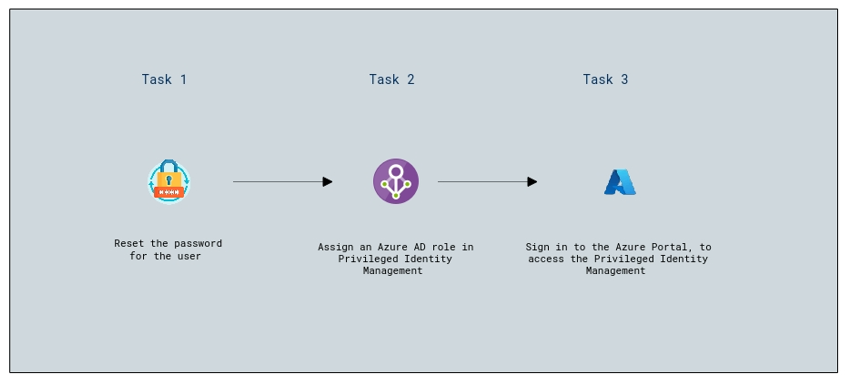

## Task 1: Reset the password for the user

In this task, you, as the admin, will reset the password for the user Diego Siciliani. This step is needed so you can initially sign in as the user in subsequent tasks.
 
1. Open **Microsoft Edge**, and in the address bar, enter **https://entra.microsoft.com**.
   
1. On **Sign in to Microsoft Azure** blade, you will see a login screen, in that enter the following email/username and then click on **Next**. 

   * Email/Username: <inject key="AzureAdUserEmail"></inject>
   
1. Now enter the following password and click on **Sign in**.

   * Password: <inject key="AzureAdUserPassword"></inject>
   
1. From the left navigation pane, expand **Entra ID (1)** and click on **Users (2)**, then select **All users**.

     
  
1. Select **Diego Siciliani** from the list of users.

    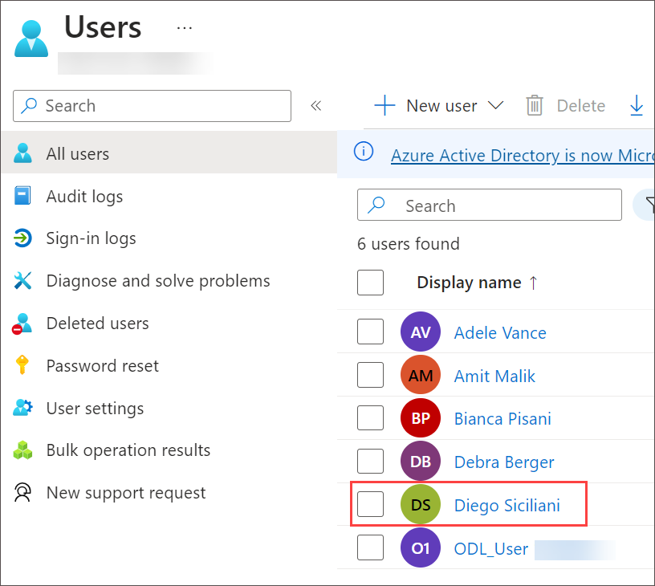
   
1. Select **Reset password** from the top of the page. Since you haven't previously signed in as Diego, you don’t know his password and will need to reset the password.

      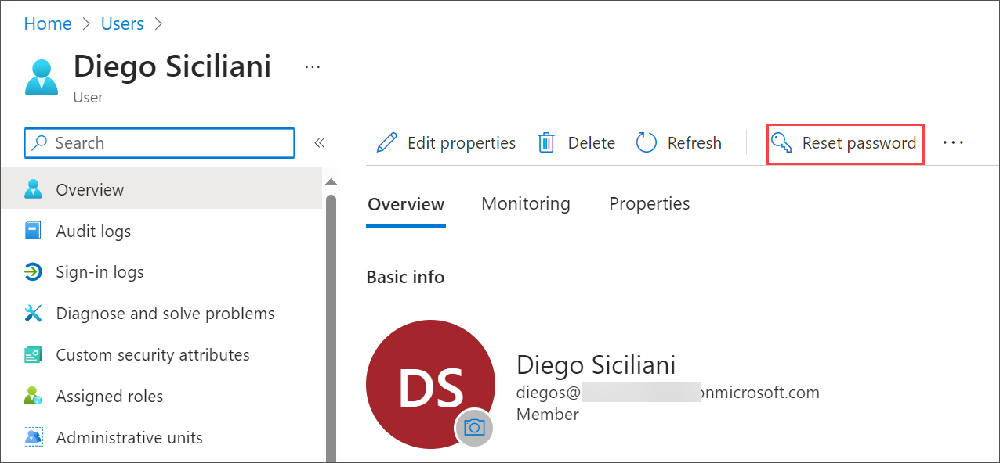
   
1. When the password reset window opens, select **Reset Password** and **Copy** the password.

     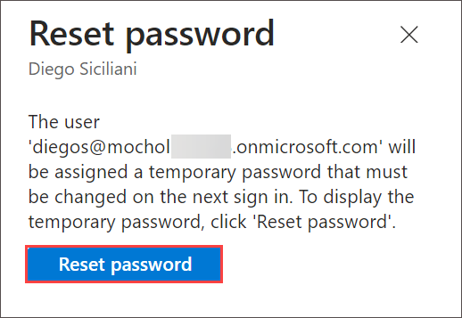

     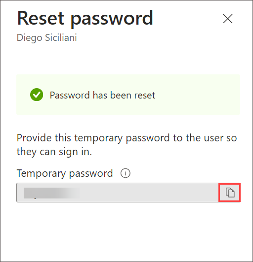
   
   >**Note**: Kindly make a note of the new password, as you will need it in a subsequent task, to be able to sign in as the user.
           
1. From the left navigation panel, select **Home** to return the home page for the Microsoft Entra admin center.

1. Keep the browser page open, as you will in the subsequent tasks.

## Task 2: Assign Microsoft Entra role in Privileged Identity Management

In this task, you, as the admin, will assign Diego Microsoft Entra role in Privileged Identity Management.

1. Open the browser tab for the home page of the Microsoft Entra admin center.  

1. From the left navigation panel, expand **ID Governance (1)**, then select **Privileged Identity Management (2)**, and in the Get started page, select **Manage (3)** under Manage access.

   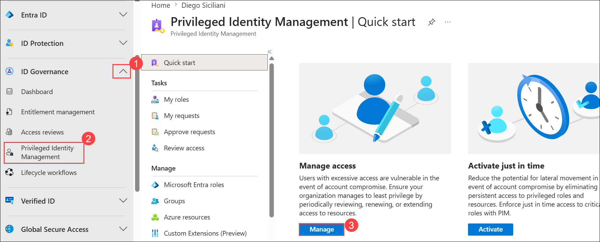

1. You're now in the **Roles** page.  In the search bar, on the top of the page, enter **user**.  From the search results, select **User Administrator**.

   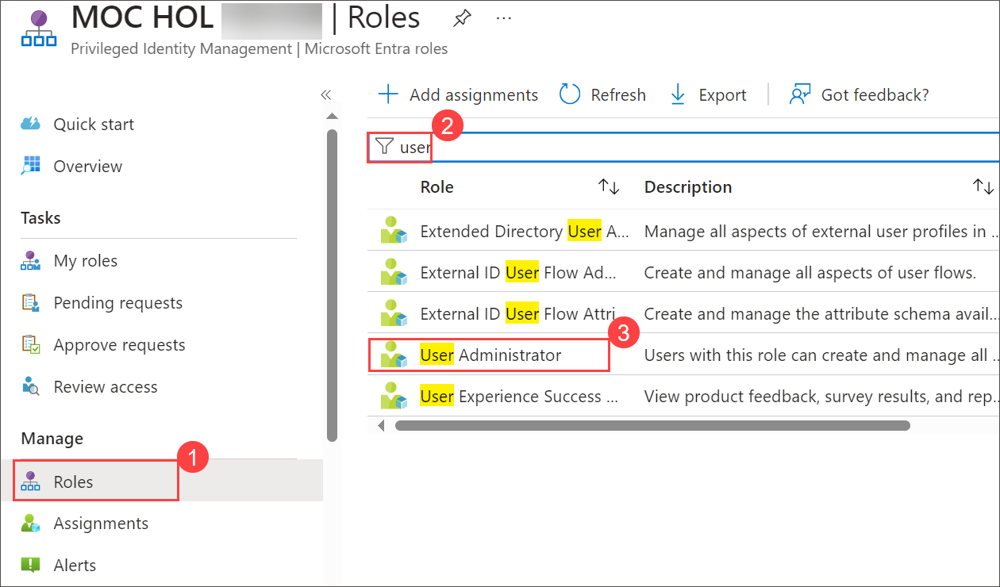

1. From the top of the page, select **+ Add Assignments**.

   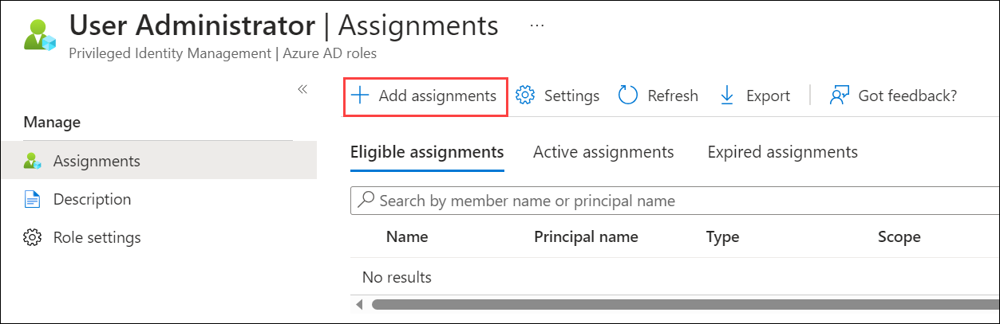

1. In the Add assignments page, ensure that **Membership** is underlined.  Here you will configure the membership settings for the user administrator role in PIM.

   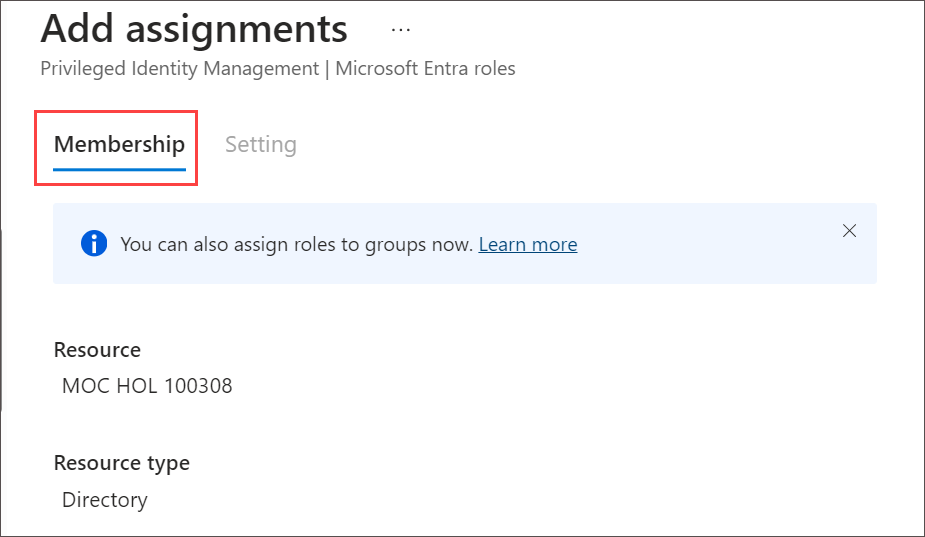

1. Leave the Scope type to its default value, Directory.  

1. Under Select members, select **No members selected (1)**. This opens the Select a member window. In the search bar, enter **Diego (2)**.  From the search results, select **Diego Siciliani (3)** then press **Select (4)** on the bottom of the page.  

   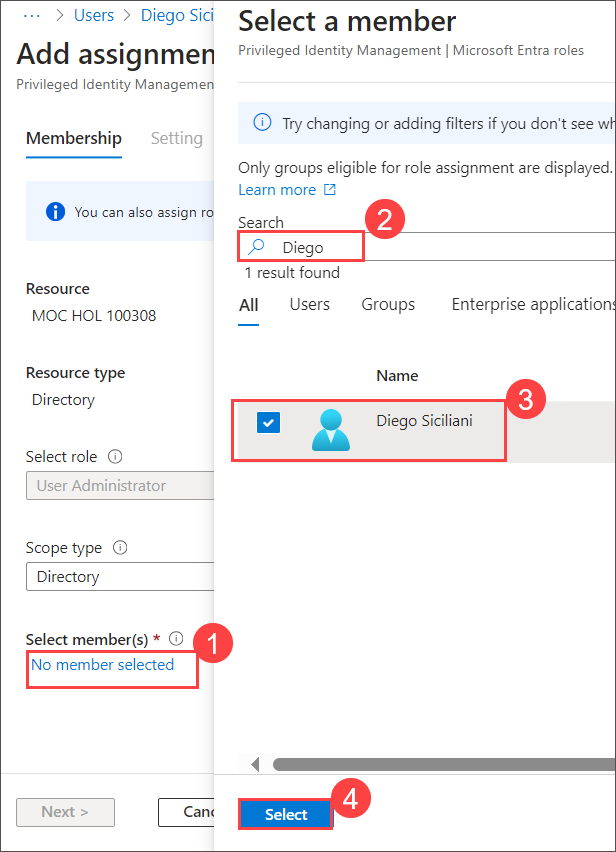

1. Under Select members you will see 1 Member(s) selected and the name and email of the selected member(s), Deigo Siciliani. From the bottom of the Add assignments page, select **Next**.

1. You are now on the **Setting** page.  Leave the Assignment type to the default setting, **Eligible (1)**.

1. If the Permanently eligible box is checked, select **Permanently eligible**, to remove the checkmark **(2)**.

1. In the Assignment start fields, keep the default date and time, which are today and the current time.

1. In the Assignment end fields, change the date to today’s date (note the default setting is one year from today, so you need to change the year). For the time, set the time to two hours from the current time.  After you have set the time field for the time when the Assignment ends, press the tab key on your keyboard and select **Assign (3)** at the bottom of the page.  

    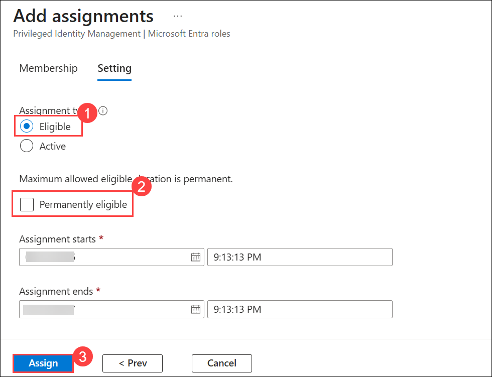

1. This takes you back to the Assignments window.  After a few seconds, you should see Diego Siciliani listed in the User Administrator table, along with the details of the assignment.  If after a few seconds you still don't see the update, select **Refresh** from the top of the page.

    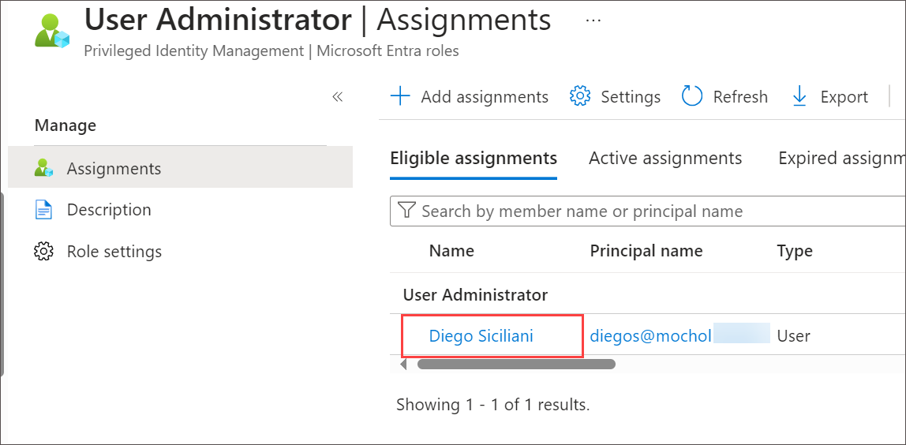

1. From the top of the page, select **Settings**.

1. In the Role setting details for the User Administrator, notice the different options. Note that the setting to “Require justification on activation” is set to yes, and “On activation, require Azure MFA” is also set. You will see both in the next task when Diego activates the role.  Also, note that “Require approval to activate” is set to No. Leave all the settings to their default values. Close the page by selecting the **X** on the top right corner of the screen.

   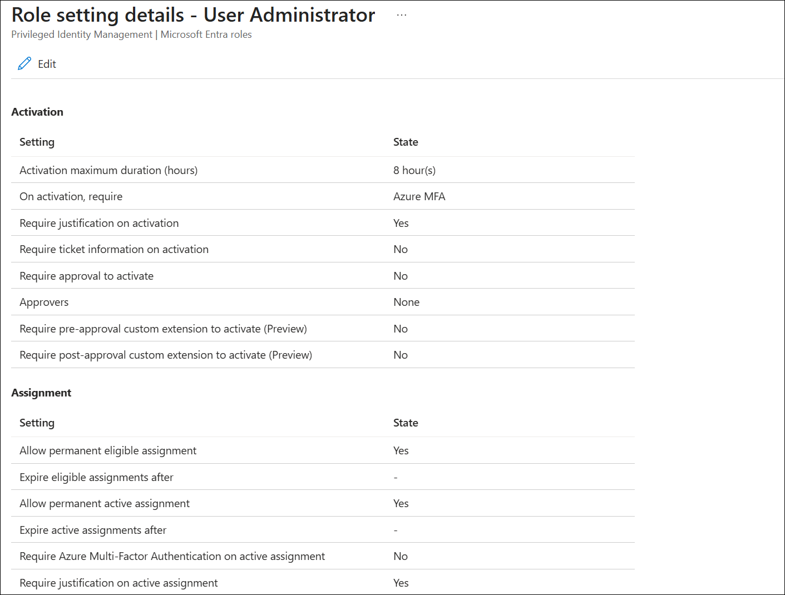

1. Sign out by selecting the user icon next to the email address on the top right corner of the screen and selecting **Sign out**. Then close all the browser windows.

 > **Congratulations** on completing the task! Now, it's time to validate it. Here are the steps:
 > - Hit the Validate button for the corresponding task. If you receive a success message, you can proceed to the next task. 
 > - If not, carefully read the error message and retry the step, following the instructions in the lab guide.
 > - If you need any assistance, please contact us at labs-support@spektrasystems.com. We are available 24/7 to help.

 <validation step="3bf29fd2-7b87-4aad-bd94-71ff0483cd5f" />  

## Task 3: Sign in to the Azure Portal, to access the Privileged Identity Management

In this task you, as Diego Siciliani, will sign in to Microsoft Entra admin center, to access the Privileged Identity Management capability of Microsoft Entra to activate your assignment as User administrator. Once activated you'll make some configuration changes to an existing user. 

> Note: For this task, you'll need access to a mobile device to use with the Microsoft Authenticator app.

1. Open Microsoft Edge. In the address bar of the browser, enter **[entra.microsoft.com](https://entra.microsoft.com/)**.

1. Sign in as Diego Siciliani.
    
    - In the Sign in window enter **<inject key="User 02 UPN"></inject>** (user email id of the Diego Siciliani) then select **Next**.
    
    - On the **Enter Temporary Access Pass** page, select **Use your password instead**, enter the temporary password provided in the previous task, and then select **Sign in**.
    
    - Since the password you entered was only a temporary password you need to update it now. Enter the current password. For the new password and confirm password fields enter **SC900-Lab** and select **Sign in**
    
    - If prompted, enter the provided Temporary Access Pass **<inject key="User 02 UPN"></inject>** and complete the sign-in process.

        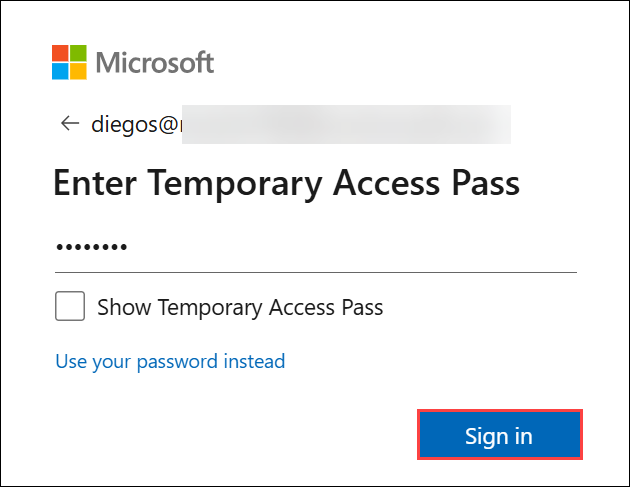
   
1. When prompted to stay signed- in, select **No**.

1. From the left navigation panel, expand **ID Governance (1)** then select **Privileged Identity Management (2)**.

     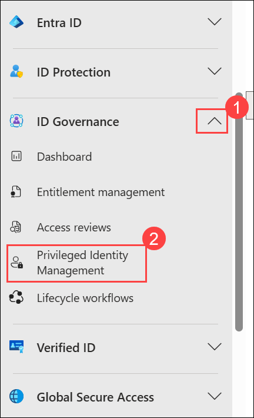

1. From the left navigation panel, select **My roles**. You're now seeing information for your eligible assignments. You'll see that you, Diego, are assigned the User administrator role.

1. In the last column of the table, labeled action, select **Activate**.

     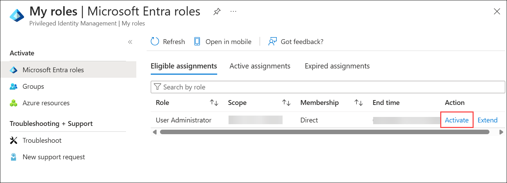

1. The Activate User Administrator window appears.  You are required to enter a reason for the activation.  In the box that appears, enter any reason you want (max of 500 characters) **Activating User Administrator Role for User Diego Siciliani (1)**, then select **Activate (2)**.

     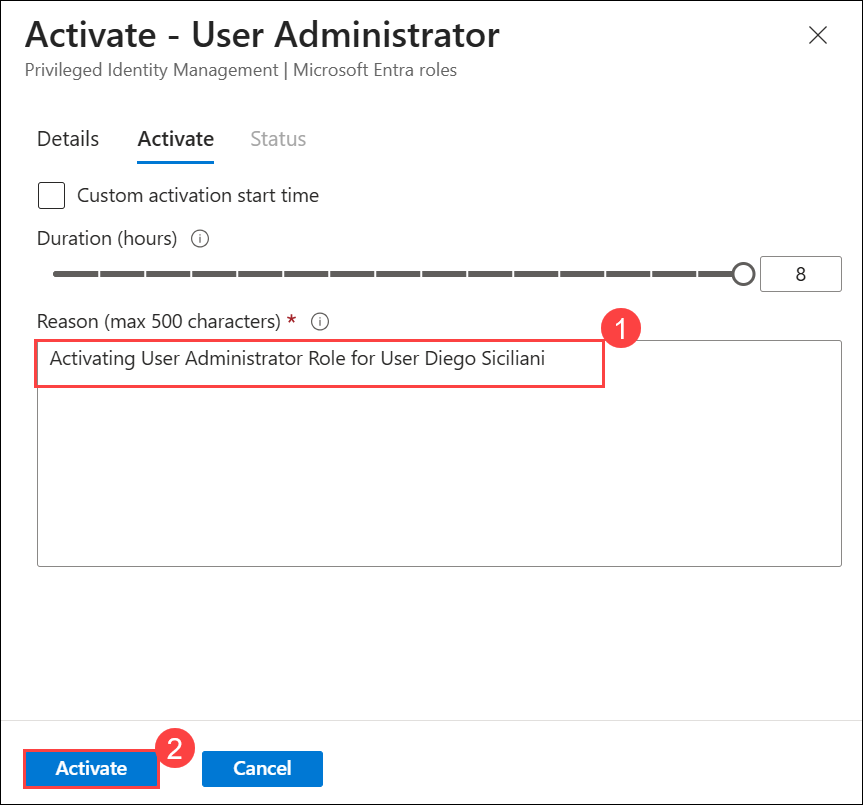

1. You will see the status (3 stages of progress), as the activation is processed.

     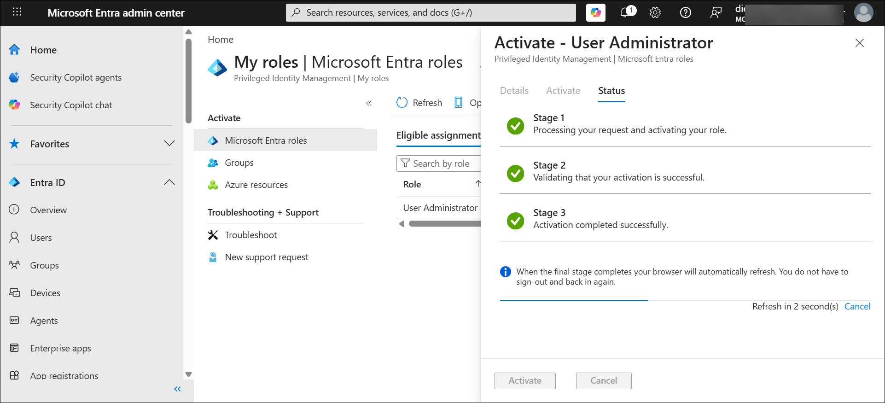

1. Once the activation is completed you are returned to the My roles | Microsoft Entra roles page, where you will see a notification stating you have just activated a role.  Select **Click here** to view your active roles.  If you notice the end time is different than what was originally configured, select the refresh key on the top of the page (it may take a few minutes to refresh).

1. Return to the home page of the Microsoft Entra admin center by selecting **Home** from the left navigation panel.

1. As a Microsoft Entra ID user administrator, you can create users and groups, manage licenses, and more. From the Microsoft Entra admin center page, search **Groups (1)** and select **Groups (2)**.

     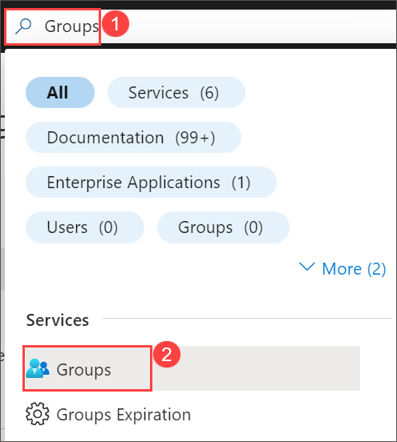

1. Select **All groups (1)** from the left pan and select **New Group (2)**.

     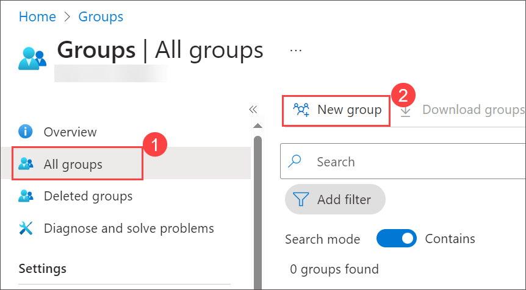

1. You will be navigated to New Group tab, provide the name of the group as **Mark 8 Project Team** and select **Create (5)** keeping rest of the settings as default.

    | Setting | Value |
    | --- | --- |
    | Group type | **Security (1)** |
    | Group name | **Mark 8 Project Team (2)** |
    | Group description | Provide group description as per your need |
    | Membership type | **Assigned (4)** |

     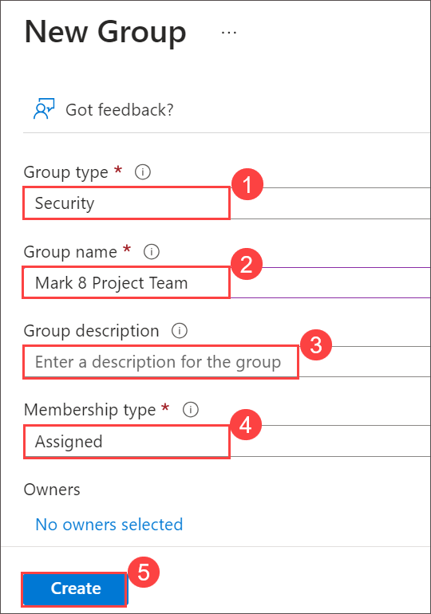

1. From the left navigation panel, expand **Entra ID**, then select **Users**, and go to **All users**.

1. From the users list, select **Bianca Pisani**.

     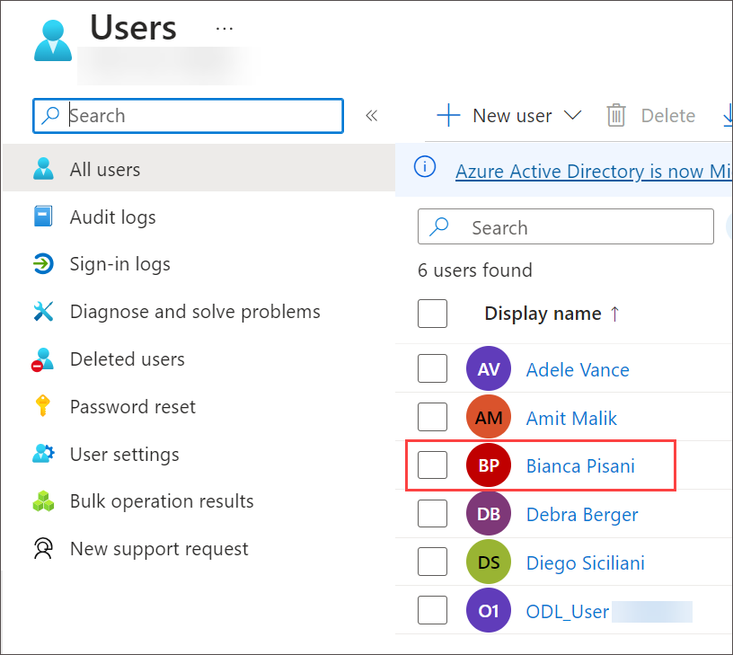

1. From the left navigation panel, select **Groups (1)**.

1. Notice the groups to which Bianca is already assigned. From the top of the page, select **+ Add Memberships (2)**. From the list of groups, select **Mark 8 Project Team (3)** and then **Select (4)** button.

     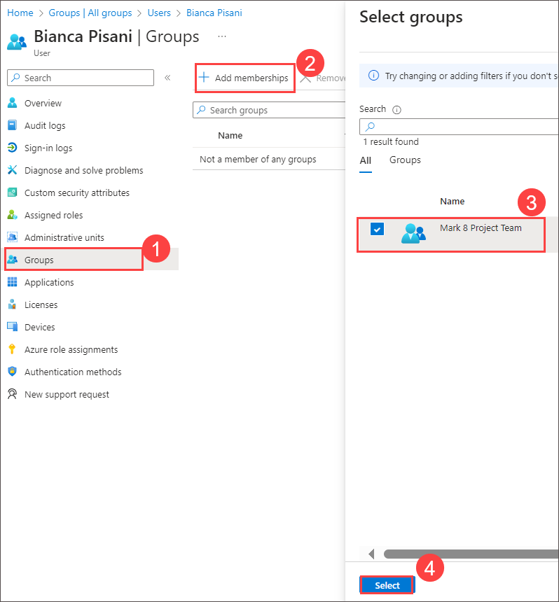

1. On the Groups page, notice that the **Mark 8 Project Team group** has been added to the list (if you don't immediately see it in list, select the **Refresh** button).

    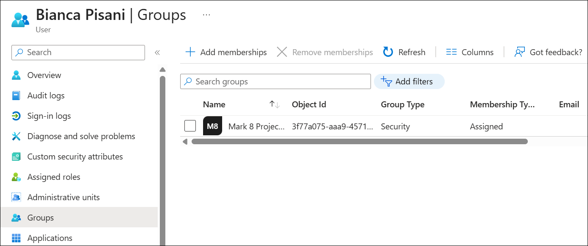

1. Sign out by selecting on the user icon next to the email address on the top right corner of the screen and selecting **Sign out**. Then close all the browser windows.

1. The duration of the user admin role is limited to the time that was configured.

 > **Congratulations** on completing the task! Now, it's time to validate it. Here are the steps:
 > - Hit the Validate button for the corresponding task. If you receive a success message, you have successfully completed the task. 
 > - If not, carefully read the error message and retry the step, following the instructions in the lab guide.
 > - If you need any assistance, please contact us at labs-support@spektrasystems.com. We are available 24/7 to help.

 <validation step="8e3654ca-357a-4da8-b947-b5b897cd526b" />

## Review

In this lab, you have completed:
- Reset the password for the user
- Assigned Microsoft Entra role in Privileged Identity Management
- Signed in to the Azure Portal, to access the Privileged Identity Management.
  
## You have successfully completed the lab
