# Lab-04: Explore identity governance in Azure AD with Privileged Identity management

## Lab scenario
In this lab, you will explore some of the basic functionality of Privileged Identity Management (PIM). PIM does require Azure AD Premium P2.  In this lab, you, as the admin, will configure one of your users, Diego Siciliani, with an Azure AD user administrator role, through Privileged ID management (PIM).   With user admin privileges, Diego will be able to create users and groups manage licenses and more. Both the admin and the user, Diego, must be configured for the Azure AD Premium P2 license.

## Task 1: Reset the password for the user

In this task, you, as the admin, will reset the password for the user Diego Siciliani. This step is needed so you can initially sign in as the user in subsequent tasks.
 
1. If you are not already signed into the Azure portal, sign in to the Azure portal at https://portal.azure.com, with the Azure credentials.
   
1. On **Sign in to Microsoft Azure** blade, you will see a login screen, in that enter the following email/username and then click on **Next**. 

   * Email/Username: <inject key="AzureAdUserEmail"></inject>
   
1. Now enter the following password and click on **Sign in**.

   * Password: <inject key="AzureAdUserPassword"></inject>
   
1. In the Azure portal, in the **Search resources, services, and docs** text box at the top of the Azure portal page, type **Azure Active Directory** and press the **Enter** key.  

1. From the left navigation panel under **Manage** section, select **Users**.

1. Select **Diego Siciliani** from the list of users.

1. Select **Reset password** from the top of the page. Since you have not previously signed in as Diego you don’t know his password and will need to reset the password.

1. When the password reset window opens, select **Reset Password** and copy the password.

  >**IMPORTANT**: Kindly make a note of the new password, as you will need it in a subsequent task, to be able to sign in as the user.
           
1. Close the password reset window by selecting the **X** at the top right corner of the page.

1. Close Diego’s profile window by selecting the **X** at the top right corner of the page.

1. Close the All users window by selecting the **X** at the top right corner of the page. You should now be on the Azure Active Directory page.

1. Keep the browser page open, as you will in the subsequent tasks.

## Task 2: Assign an Azure AD role in Privileged Identity Management

In this task, you, as the admin, will assign Diego an Azure AD role in Privileged Identity Management.

1. Go to the Azure Active Directory page.  

1. From the left navigation panel under **Manage** section, select **Identity Governance**.

1. From the main window, ensure **Getting started** is underlined then from the left navigation panel, under Privileged Identity Management, select **Azure AD roles**.

1. You are now in the Privileged Identity Management Quickstart window.  Select **Manage** under Manage Access.

   

1. You are now on the Roles page.  In the search bar, on the top of the page, enter **user**.  From the search results, select **User Administrator**.

   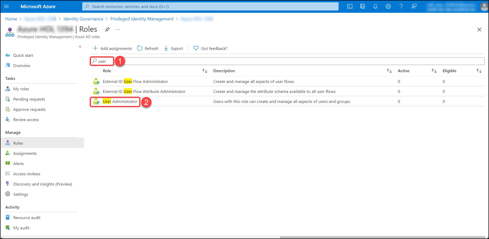

1. From the top of the page, select **+ Assignments**.

   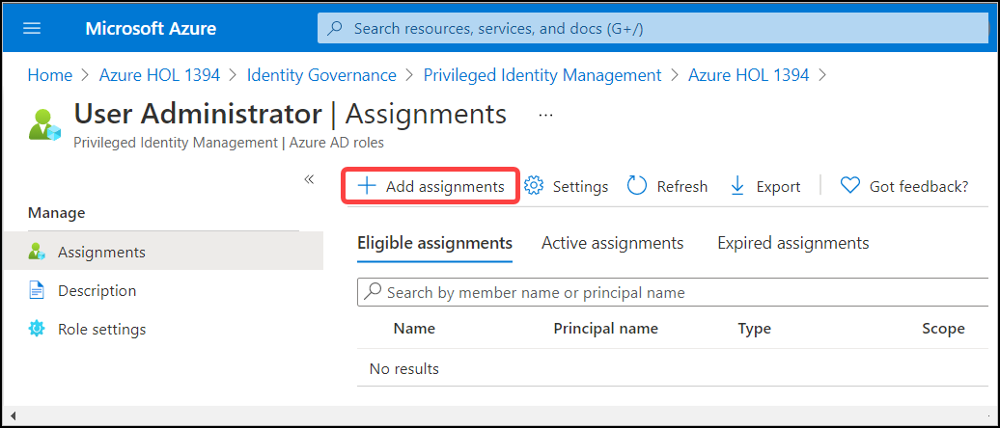

1. In the Add assignments page, ensure that **Membership** is underlined.  Here you will configure the membership settings for the user administrator role in PIM.

1. Leave the Scope type to its default value, Directory.  

1. Under Select members, select **No members selected**. This opens the Select a member window. 

1. In the search bar, enter **Diego**.  From the search results, select **Diego Siciliani** then press **Select** on the bottom of the page.  

1. Under Select members you will see 1 Member(s) selected and the name and email of the selected member(s), Deigo Siciliani. From the bottom of the Add assignments page, select **Next**.

1. You are now on the Setting page.  Leave the Assignment type to the default setting, **Eligible**.

1. If the Permanently eligible box is checked, select **Permanently eligible**, to remove the checkmark.

1. In the Assignment start fields, keep the default date and time, which are today and the current time.

1. In the Assignment end fields, change the date to today’s date (note the default setting is one year from today, so you need to change the year). For the time, set the time to two hours from the current time.  After you have set the time field for the time when the Assignment ends, press the tab key on your keyboard and select **Assign** at the bottom of the page.  

     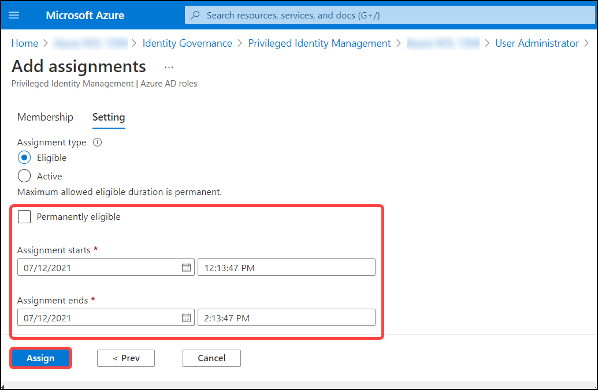

1. This takes you back to the Assignments window.  After a few seconds, you should see Diego Siciliani listed in the User Administrator table, along with the details of the assignment.  If after a few seconds you still don't see the update, select **Refresh** from the top of the page.

1. From the top of the page, select **Settings**.

1. In the Role setting details for the User Administrator, notice the different options.  Note that the setting to “Require justification on activation” is set to yes, and “On activation, require Azure MFA” is also set to yes.  You will see both of these in the next task when Diego activates the role.  Also, note that “Require approval to activate” is set to No.  Leave all the settings to their default values.  Close the page by selecting the **X** on the top right corner of the screen.

     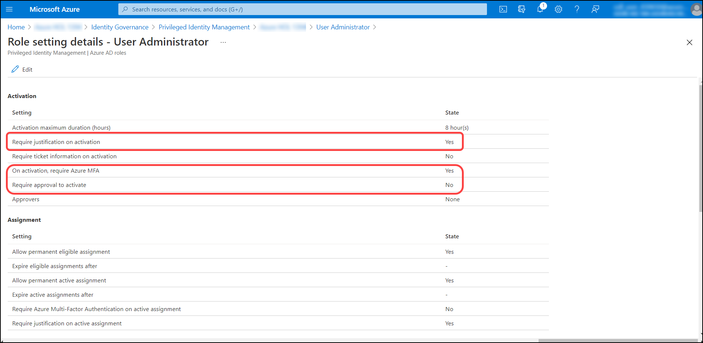

1. Sign out by selecting the user icon next to the email address on the top right corner of the screen and selecting **Sign out**. Then the close all the browser windows.

  > **Congratulations** on completing the task! Now, it's time to validate it ,Here are the steps:
  - Click the Lab Validation tab located at the upper right corner of the lab guide section and navigate to the Lab Validation Page.
  - Hit the Validate button for the corresponding task. If you receive a success message, you can proceed to the next task. 
  - If not, carefully read the error message and retry the step, following the instructions in the lab guide.
  - If you need any assistance, please contact us at labs-support@spektrasystems.com. We are available 24/7 to help you out.
 
## Task 3: Sign in to the Azure Portal, to access the Privileged Identity Management

In this task you, as Diego Siciliani, will sign in to the Azure Portal, to access the Privileged Identity Management capability of Azure Active Directory to activate your assignment as User administrator.  Once activated you will make some configuration changes to an existing user. Note: For this task, you will need access to a mobile device to which you have immediate access and can receive text messages.

1. Open Microsoft Edge.  In the address bar of the browser, enter **portal.azure.com**.

1. Sign in as Diego Siciliani.
    1. In the Sign in window enter **DiegoS@azureholxxxx.onmicrosoft.com** (user email id of the Diego Siciliani  ) then select **Next**.
    1. Enter the temporary password that you noted from the previous task and select **Sign in**.  Select **Sign in**.
    1. Since the password you entered was only a temporary password you need to update it now. Enter the current password.  For the new password and confirm password fields enter **SC900-Lab**.
    1. When prompted to stay signed- in, select **Yes**.

1. From the main Welcome page, under Azure services, select **Azure Active Directory**.
   
1. From the left navigation panel, select **Identity Governance**.

1. From the left navigation panel, under Privileged Identity Management, select **Azure AD roles**.

1. From the left navigation panel, select **My roles**.  You are now seeing information for your Azure AD roles.  You will see that you, Diego, is assigned the User administrator role.

   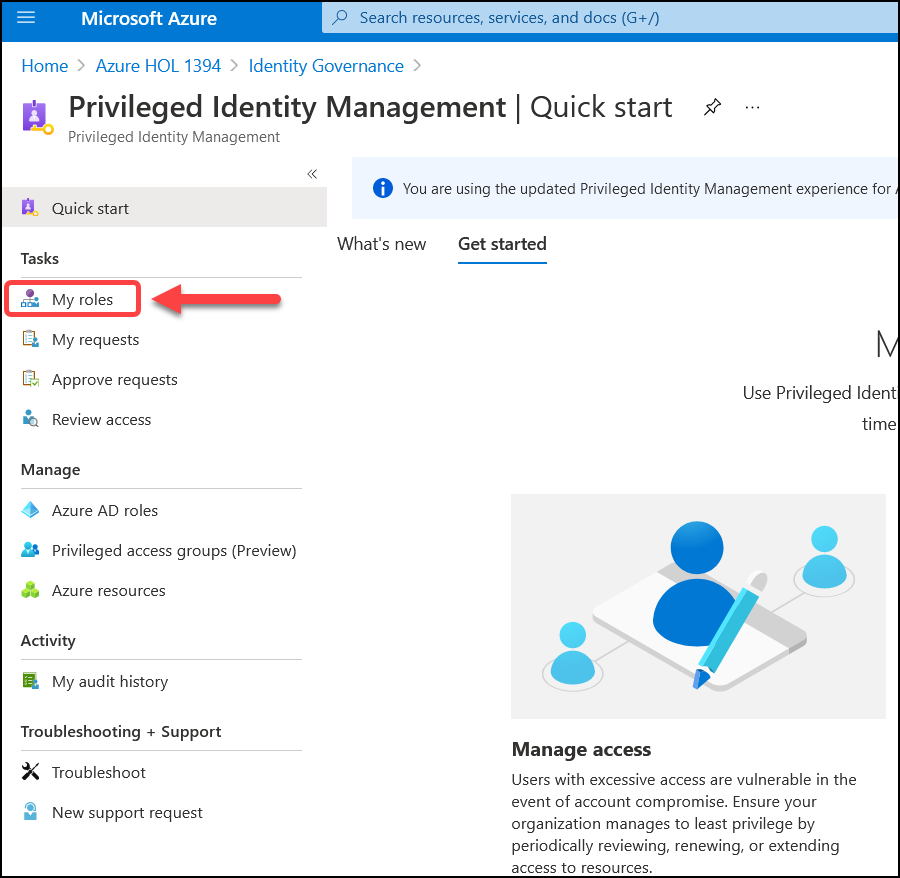

1. In the last column of the table, labeled action, select **Activate**.

   

1. You will see a warning icon indicating Additional verification is required.  Select **Click to continue**.  Recall that the PIM settings for the User administrator role require multi-factor authentication.  Additionally, since Diego’s contact information for use with MFA (authentication methods) was not previously configured, he must register his information, to be able to use MFA.  Although he will have to do MFA anytime he signs in as a user admin, within the assignment period, the MFA registration process is required only once. 

   

1. You are notified that more information is required, select **Next**.

1. In the Keep your account secure window, you have the option to select the method to use for MFA.  Microsoft Authenticator is one option. For expediency in this lab exercise, you will choose a different method.  Select **I want to set up a different method**.  From the Chose a different method pop-up window, select the **drop-down arrow** and select **Phone** then select **Confirm**.

   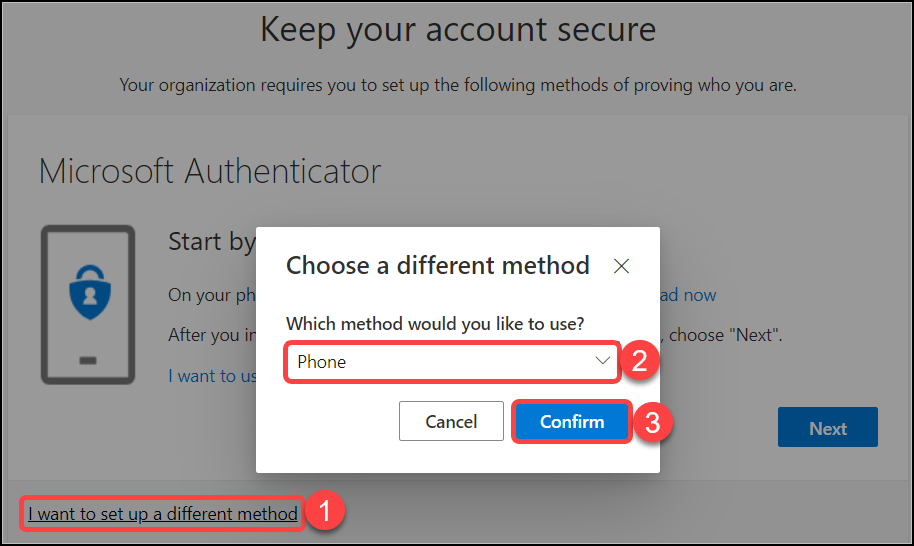

1. You are prompted to enter a phone number you would like to use. Ensure the country is correct, for your telephone number’s country code.  Enter your phone number, ensure that **Text me a code** is selected, then select **Next**.

   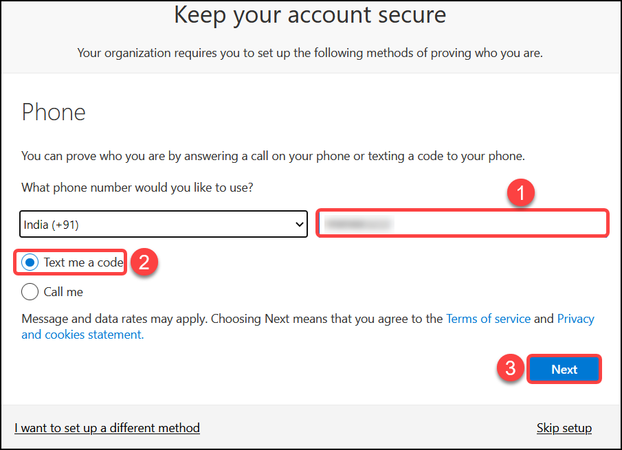

1. Enter the 6 digit code you received on your phone and select **Next**. 

   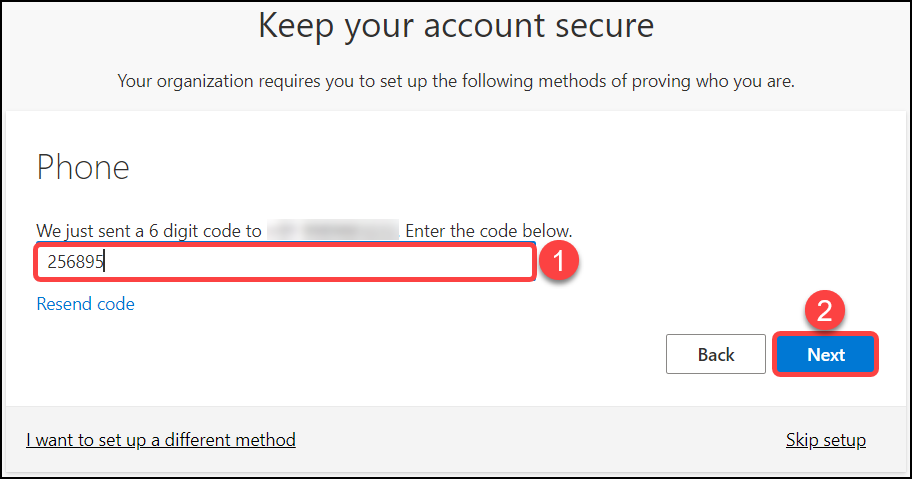

1. You will see a notification that your phone was registered successfully. Select **Next**, then select **Done**.

   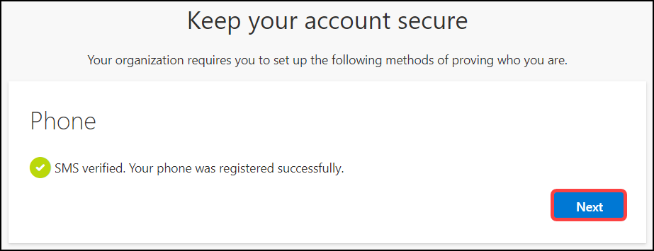

   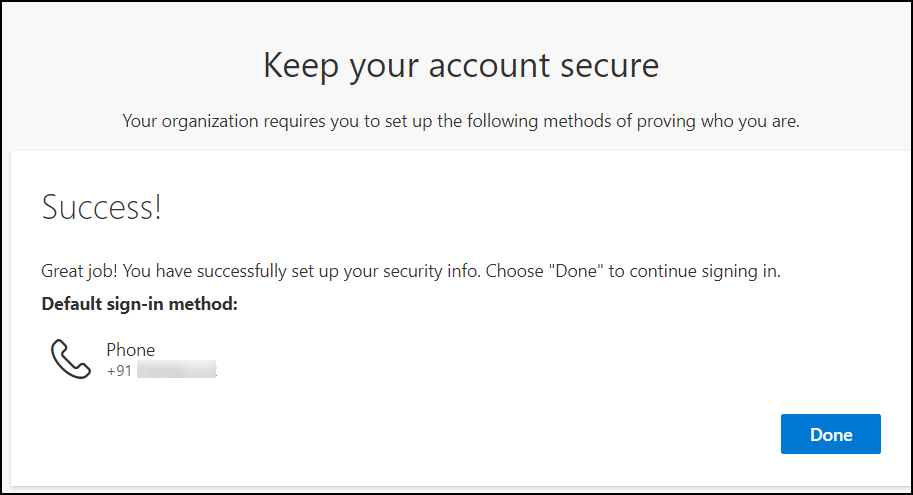

1. You are asked if you want to stay signed in.  Select **Yes**.
1. The Activate User Administrator window appears.  You are required to enter a reason for the activation.  In the box that appears, enter any reason you want (max of 500 characters), then select **Activate**.

   

1. You will see the status (3 stages of progress), as the activation is processed.

   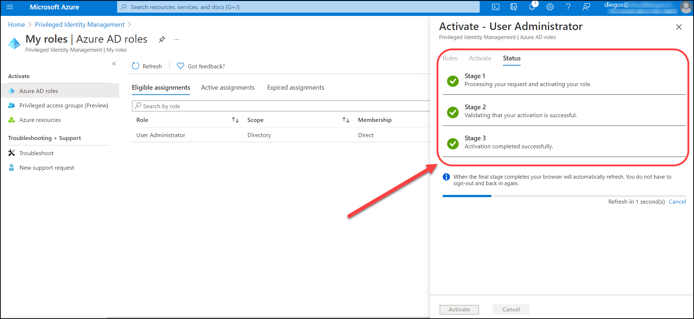

1. Once the activation is completed you are returned to the My roles | Azure AD roles page, where you will see a notification stating you have just activated a role.  Select **Click here** to view your active roles.  If you notice the end time is different than what was originally configured, select the refresh key on the top of the page (it may take a few minutes to refresh). 
1. Close the window, by selecting the **X** on the top right corner of the screen.
1. Close the Privileged Identity Management | Quickstart window by selecting the **X** on the top right corner of the screen.
1. Close the Identity Governance window by selecting the **X** on the top right corner of the screen.
1. You are now back on the Azure Active Directory page.  As an Azure AD user administrator, you can create users and groups, manage licenses, and more.  From the left navigation panel, select **Users**.
1. From the users' list, select **Bianca Pisani**.

   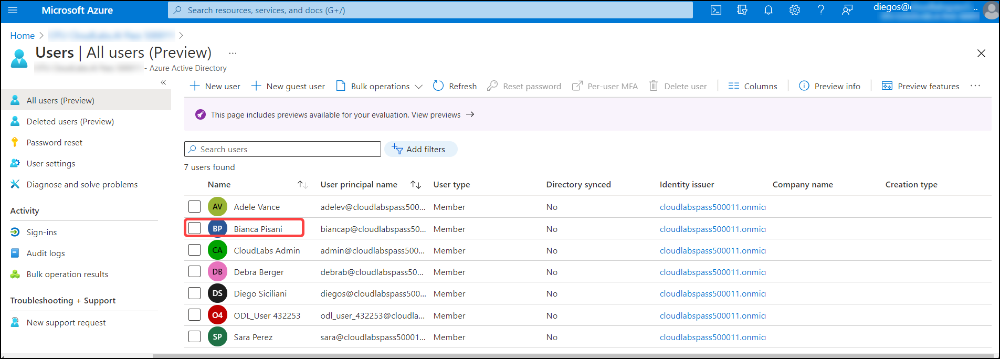
   
1. From the left navigation panel, select **Licenses**.

1. Notice how Bianca has no licenses assigned.  From the top of the page, select **+ Assignments**. 

   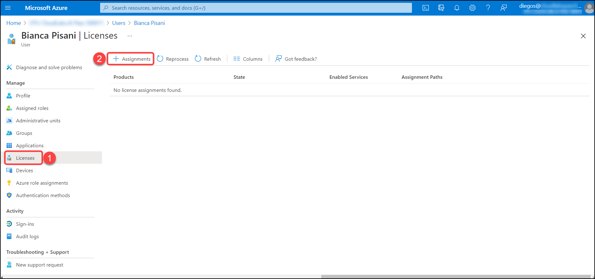

1. Under Select licenses, select **Office 365 E3** then select the **Save** button on the bottom of the screen. A notification on the top right corner of the screen should show that license assignments succeeded.

   

1. Close out of the updated license assignments page, by selecting the **X** on the top right corner of the page.
1. Sign out by selecting the user icon next to the email address on the top right corner of the screen and selecting **Sign out**. Then the close all the browser windows.
1. The duration of the user admin role is limited to the time that was configured.

  > **Congratulations** on completing the task! Now, it's time to validate it. Here are the steps:

 

 
- Click the Lab Validation tab located at the upper right corner of the lab guide section and navigate to the Lab Validation Page.
- Hit the Validate button for the corresponding task. If you receive a success message, you can proceed to the next task. 
- If not, carefully read the error message and retry the step, following the instructions in the lab guide.
- If you need any assistance, please contact us at labs-support@spektrasystems.com. We are available 24/7 to help you out.

### Review
In this lab; you explored PIM.  You, as the admin, configured Diego with user admin privileges for a specified amount of time.  Then you, as Diego, walked through the process of activating the user admin privileges and configuring user settings.  Recall that PIM requires an Azure AD Premium P2 license.
