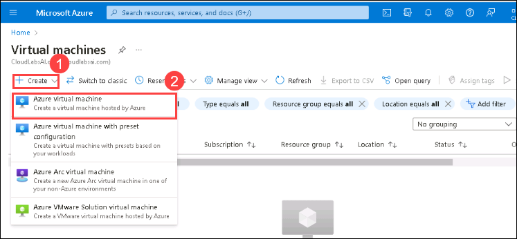
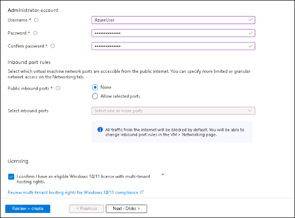
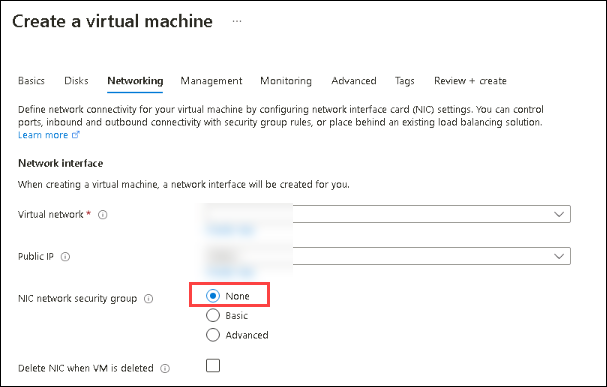
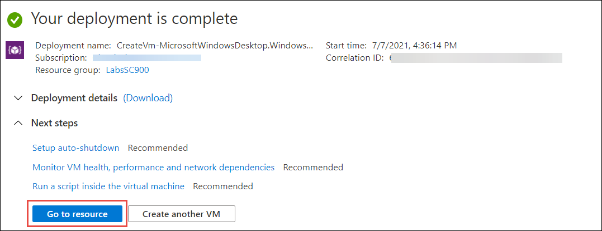
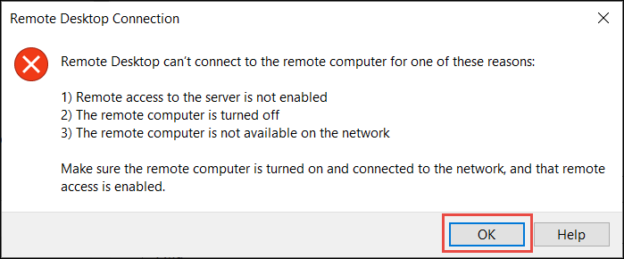
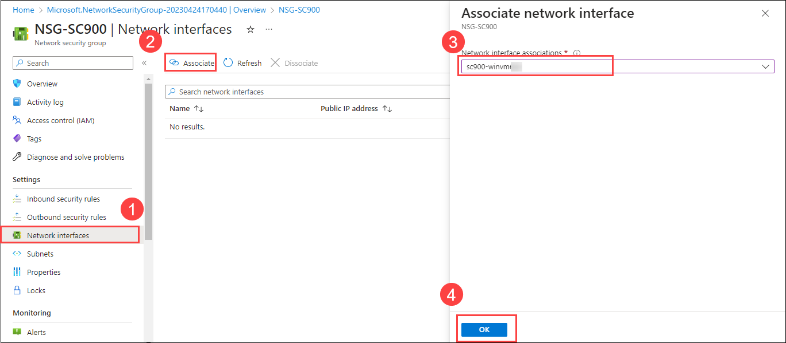
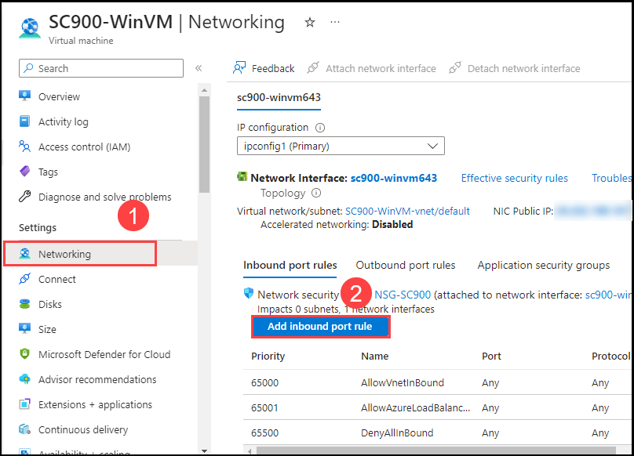
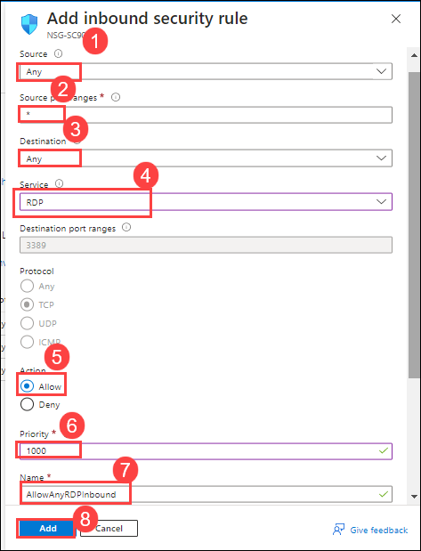
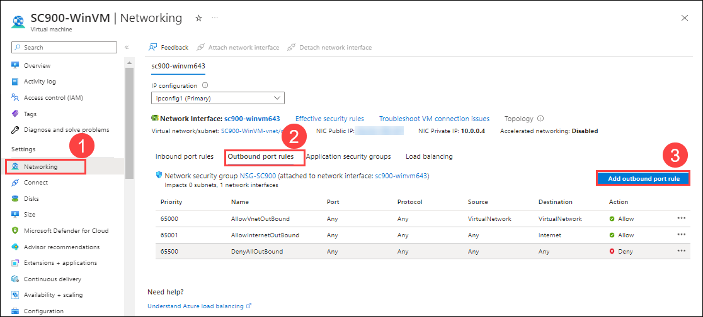
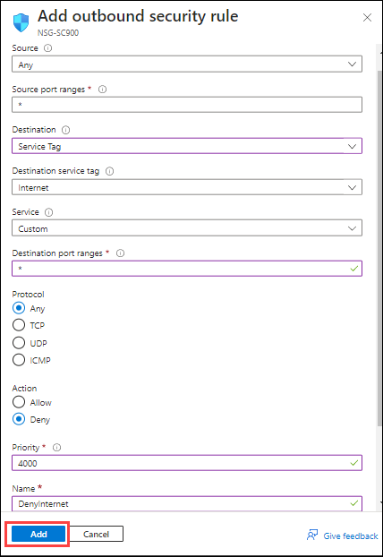

# Lab-05: Explore Azure Network Security Groups (NSGs).

## Lab scenario
In this lab, you will explore the function of network security groups in Azure.  You will do this by create the VM without any network security group (NSG).  Without any NSG to filter traffic, all the ports in the VM are exposed to the public internet.  You will then go through the process of creating an NSG and assigning the VM's interface to that NSG.  Once configured you will test the connection to the VM, using the default NSG rules and also rules that you will create.
  

## Task 1:  In this task you will create a Windows 10 virtual machine.

1. On the main window, under Azure Services, select Virtual Machines.  If  you don't see Virtual machines listed, enter it in the search bar, then select it from the search results.

   

1. From the top left of the page, select **+Create** then select **Azure Virtual machine**.

   

1. From the basics tab, fill in the following information (for anything not listed, leave the default settings):

    1. Subscription:  Leave the default value (this is the Azure subscription provided by the authorized lab hoster)
    1. Resource group:  select the existing resourcegroup **LabsSC900-<inject key="DeploymentID" enableCopy="false"/>**.
    1. Virtual machines name:  enter **SC900-WinVM**.
    1. Region : Leave the default region.
    1. Availability Options : Select **No infrastructure redundancy required** from the drop-down.
    1. Security type : Select **Standard** from the drop-down.
    1. Image:  from the drop-down, select **Windows 10 Pro, Version 22H2 – x64 Gen 2**.
    1. Size:  select **see all sizes** from the drop-down and select **B2s**, then press **Select** on the bottom of the page.
    1. Username:  enter **AzureUser**.
    1. Password:  enter **SC900AzureLabs**.
    1. Public inbounds ports:  select **None**.
       
       
       
    1. Licensing:  select **I confirm I have an eligible Windows 10 license with multi-tenant hosting rights**, so that a checkmark appears in the box.
   
       

    1. Select **Next: Disks**. 
    
1. You are now in the Disks tab for the VM configuration, change the OS disk type to **Standard SSD** and Leave all other settings to the default and select **Next: Networking >**.

      
      
1. You are now in the Networking tab for the VM configuration.  Fill in the following information (for anything not listed, leave the default settings):
    1. NIC network security group:  select **None**.  Note: the reason you are selecting None at this step is because we want want to take you through the steps of setting up an NSG from scratch, which are covered in the subsequent tasks.

      

1. Select **Next:  Management >**.

1. You are now in the Management tab for the VM configuration.  Leave all settings to the default and select **Next: Monitoring>**.

1. You are now in the Monitoring tab for the VM configuration.  Leave all settings to the default and select **Next: Advanced>**.

3. You are now in the Advanced tab for the VM configuration.  Leave all settings to the default and select **Next: Tags>**.

4. You are now in the Tags tab for the VM configuration.  Leave all settings to the default and select **Next: Review + Create>**.

5. Review the configuration for your VM.  A few points to note: This VM has a public IP address and no NIC network security group.  From a security perspective this leaves the VM exposed.  We will address this in a subsequent task. Select Create.  It may take several minutes for the VM deployment to complete.

6. Note the name of the network interface, **sc900-winvmXXX** (the XXX will be specific to the network interface of your VM).

7. Once the VM deployment is complete, select **Go to resource**.
   
    

1. You are now in the SC900-WinVM page.  Note the public IP address. 

1. From the top of the page, select **Connect** then from the drop-down select **RDP**. 

1. Verify the IP address is set to Public IP address, leave the default port number and select **Download RDP file**. 

1. Open the downloaded file and select **Connect**. 

**Note: The port prerequisite is not met.  In order to satisfy the prerequisite, an inbound network security rule with the destination port 3389, used by RDP, must be configured.  You'll do that in the next task, when you create a network security group.**

   
   
21. From the left navigation panel, select **Networking**.  
    1. The default view is for inbound port rules.  Note that the network interface for this VM has no network security groups configured.  The same is true if you select Outbound port rules.
    1. Select **Effective security rules** next to where it says Network interface.  Note that it says, "No network security groups or applications security groups are associated with the network interface".

22. Leave this browser tab open.

## Task 2:  Create a network security group and assign the network interface of the VM to that NSG.nd create a new inbound rule for RDP traffic.

1. Open the SC900-WinVM – Microsoft Azure Tab on your browser.

1. In the blue search bar on the top of the page, enter **Network security groups** groups. From the results, select **Network security groups** (do not select Network security groups classic).

1. From the top of Network security groups page, select **+ Create**.

1. On the Basics tab of the Create network security group page, specify the following settings:
    
    1. Subscription: Leave the default value (this is the Azure subscription provided by the authorized lab hoster)
     1. Resource group: Select **LabsSC900-<inject key="DeploymentID" enableCopy="false"/>**
    3. Name:  **NSG-SC900**
    4. Region:  leave the default value
    5. Select **Review + create** then select **Create**.
    
     

1. Once the deployment is complete, select **Go to resource**.

1. On the top of the page underneath where it says Essentials, you'll see some basic information about the NSG you created.  Two points to note are that there are no Custom Security rules and there are no subnets nor network interfaces associated with this NSG.  Although there are no custom security rules, there are default inbound and outbound rules that are included with every NSG, as shown on the page.  Review both the inbound and outbound rules. The default inbound rules deny all inbound traffic that is not from a virtual network or an Azure load balancer.  The outbound rules deny all outbound traffic except traffic between virtual networks and outbound traffic to the internet.

1. From the left navigation pane on the NSG-SC900 page, under Settings, select **Network interfaces**.
1. Select the **Associate**, above search box.

1. In the associate network interface page, select **sc900-winvmXXX** (the XXX will be specific to the network interface of your VM). then select **ok** on the bottom of the window. As the interface is being associated you will see a notification box in the top right corner of the screen.

     

1. Once the interface is associated to the NSG, it will show up on the list.

1. Navigate to SC900-WinVM Overview page, select **Networking** from the left navigation pane and then select **Add inbound port rule**.
  
     

1. The default inbound rules deny all inbound traffic that is not from a virtual network or an Azure load balancer so you need to set up a rule to allow inbound RDP traffic (traffic on port 3389). Recall that you cannot remove the default rules, but you can override them by creating rules with higher priorities.

From the top of the page, select **Add**. On the Add inbound security rule window, specify the following settings:
    
   1. Source:  **Any**
   1. Source port ranges: **\***
   1. Destination:  **Any**
   1. Service:  **RDP**
   1. Action:  **Allow**
   1. Priority:  **1000**. Note: rules with lower numbers have higher priority and are processed first.
   1. Name:  Leave the default name or create your own descriptive name.
   1. Note the warning sign at the bottom of the page.  We're using RDP only for testing purposes and to demonstrate the functionality of the NSG.

       

1. Select **Add**

1. Once the rule is provisioned, it will appear on the list of inbound rules (you may need to refresh the screen). On the newly added rule, you'll see a warning sign.  As stated above, we're using RDP to only for testing purposes and to demonstrate the functionality of the NSG. Select the newly added rule.

## Task 3: In this task, you'll test the newly created inbound NSG rule to confirm that you can establish a remote desktop (RDP) connection to the VM.  Once inside the VM you'll work check outbound connectivity to the internet from the VM. 

1. Open the SC900-WinVM – Microsoft Azure Tab on your browser.If you previously closed the browser tab, select the blue search bar on the top of the page and select Virtual machines, then select the VM, **SC900-WinVM**.

1.  From the top of the page, select **Connect** then select **RDP**.

1. Verify the IP address is set to Public IP address, leave the default port number and select **Download RDP file**.

1. A Remote Desktop Connection window opens, select **Connect**.

1. You will be prompted for your credentials.  For Username, enter **AzureUser**.  For the Password, enter **SC900AzureLabs**.

1. A Remote Desktop connection window opens indicating, The identity of the remote computer cannot be verified.  Do you wish to connect anyway?  Select **Yes**.

1. You are now connected to the VM. In this case you were able to connect to the VM because the inbound traffic rule you created allows inbound traffic to the VM via RDP.

1. After a few seconds on the Welcome screen you'll see a window to Choose privacy settings for your device, select **Accept**.  On the Networks window, select **No**.

1. With the VM up and running, test outbound connectivity to the internet from the VM.
    1. From the VM, select **Microsoft Edge** to open the browser.  Since this is the first time you open Microsoft Edge, you may get a pop-up window, select **Start without your data**, then select **Continue without this data**, then select **Confirm and start browsing**.
 1. Enter **www.bing.com** in the browser address bar and confirm you're able to connect to the search engine.
    1. Once you've confirmed that you can access www.bing.com, close the browser window in the VM, but leave the VM up.

1. Minimize the VM, by selecting the underscore **_** in the blue tab that shows the VM's IP address. This brings you back to the SC900-WinVM | Connect page. 

1. From the left navigation panel, select **Networking**.

1. Keep the browser tab open you'll use it the next task.

## Task 4:  The default outbound rules for NSG allow outbound internet traffic so you will validate that you can connect to the internet. In this You will then go through the process of creating a custom outbound rule to block outgoing internet traffic and test that rule.

1. You should be on the SC900-WinVM | Networking page. If you previously closed the browser tab, select the blue search bar on the top of the page and select Virtual machines, then select the VM, **SC900-WinVM**, then select **Networking**.

1. Select the **Outbound port rules** tab.  You'll see the default outbound rules.  Note the default rule "AllowInternetOutBound". This rule allows all outbound internet traffic. You cannot remove the default rule, but you can override it by creating a rule with higher priority. From the right side of the page, select **Add outbound port rule**.

   

1. On the Add outbound security rule page, specify the following settings:
    
    1. Source:  **Any**
    1. Source port ranges:  **\***
    1. Destination:  **Service Tag**
    1. Destination service tag:  **Internet**
    1. Service:  **Custom** (leave the default)
    1. Destination port ranges:  * (be sure to put an asterisk in the destination port ranges field)
    1. Protocol: **Any**
    1. Action: **Deny**
    1. Priority:  **4000**
    1. Name:  **DenyInternet**
    1. Select **Add**
    
   

1. Once the rule is provisioned, it will appear on the list of outbound rules.  Although it appears on the list, it will take a few minutes to take effect (wait a few minutes before continuing with the next steps).  

1. Return to your VM (the icon for the VM should be shown on the task bar on the bottom of the page).

1. Open the Edge browser in your VM and enter **https://www.bing.com**.  The page should not display.  Note: if you are able to connect to the internet and you verified that all the parameters for the outbound rule were properly set, it is likely because it takes a few minutes for the rule to take effect.  Close the browser, wait a few minutes and try again. Note:  Azure subscriptions in the lab environment may experience longer than normal delays.

1. Close the remote desktop connection, by selecting the **X** on the top center of the page where the IP address is shown.  A pop-up windows indicates Your remote session will be disconnected. Select **OK**.

1. In this task you successfully configured an outbound rule in your NSG, to block outbound internet traffic.

### Review

In this lab you walked through the process of setting a VM with and without a network security group (NSG) and see the impact of default NSG rules.  You also walked through the process of creating NSG rules.
