# Lab 06: Explore Microsoft Defender for Cloud

## Lab Overview

In this lab, you will explore Microsoft Defender for Cloud and learn how Azure Secure Score can be used to improve your organization's security posture. 

## Lab Objectives

In this lab, you will complete the following tasks:

+ Task 1: Explore on Microsoft Defender for Cloud
+ Task 2: How to enable/disable the various Microsoft Defender for Cloud plans

## Estimated timing: 120 Minutes

## Architecture diagram

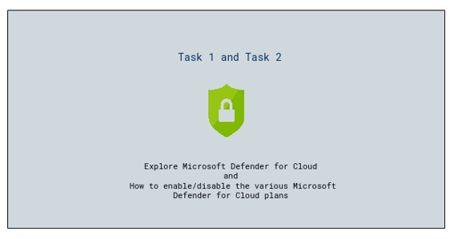

## Task 1: Explore on Microsoft Defender for Cloud

1. In the Azure portal, in the **Search resources, services, and docs** search for **Microsoft Defender for Cloud (1)**, then from the results list, select **Microsoft Defender for Cloud (2)**.

    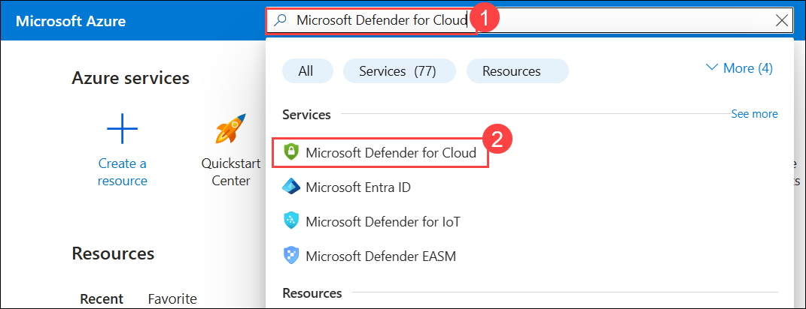

1. In the **Enhance your security posture by enabling Defender CSPM** pane, select **Enable** to activate Defender CSPM.

    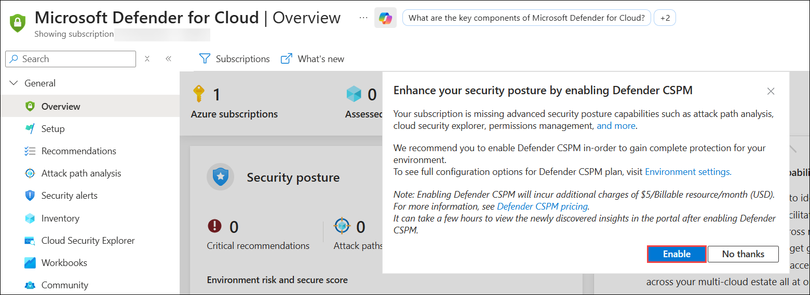

    >**Note:** If the Enhance your security posture by enabling Defender CSPM pane does not appear, proceed to the next step to enable Defender CSPM from Environment settings manually.

1. In the confirmation pane, select **Accept** to confirm and enable Defender CSPM.

    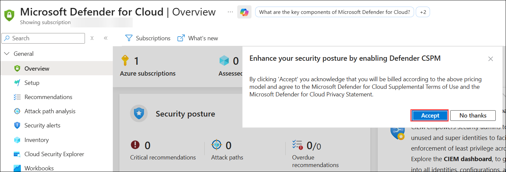

1. From the left pane, select **Environment settings (1)** under **Management** section, on the **Microsoft Defender for Cloud | Environment settings** page expand **Tenant Root group (2)**, and then choose your subscription **(3)**.    

    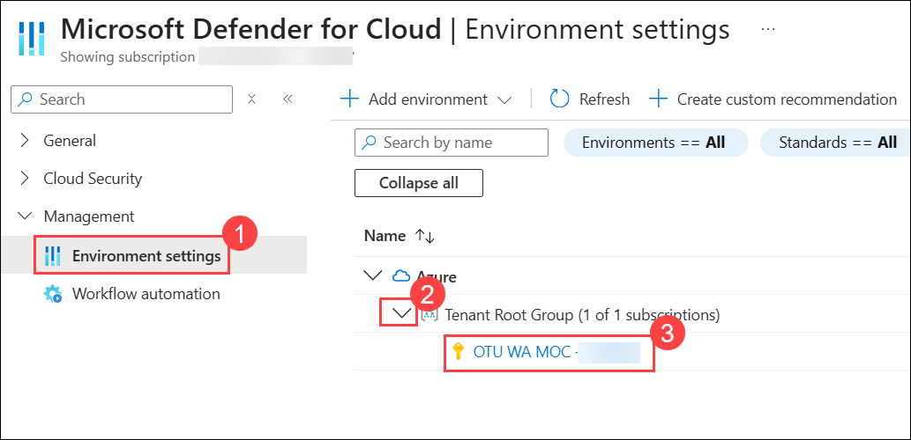

1. From the left navigation pane, select **Defender plans**, set **Defender CSPM** to **On** if it is not already enabled, and then select **Save**.

    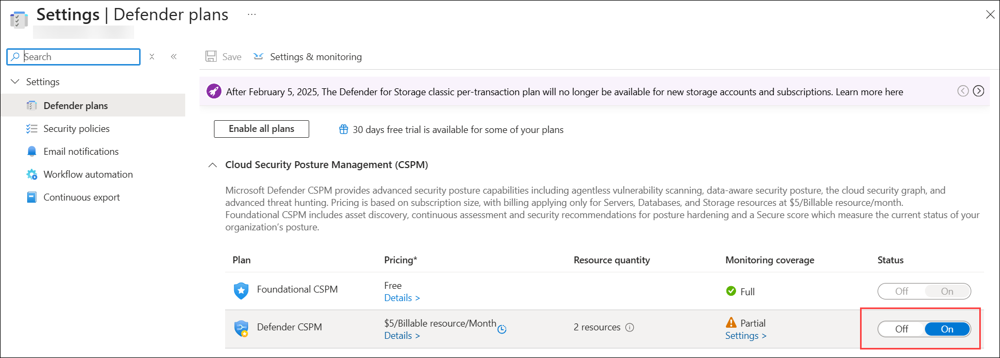

1. In the settings page, from the left navigation pane, choose **Security policies (1)** and enable the toggle for **Microsoft cloud security benchmark (2)**.
      
     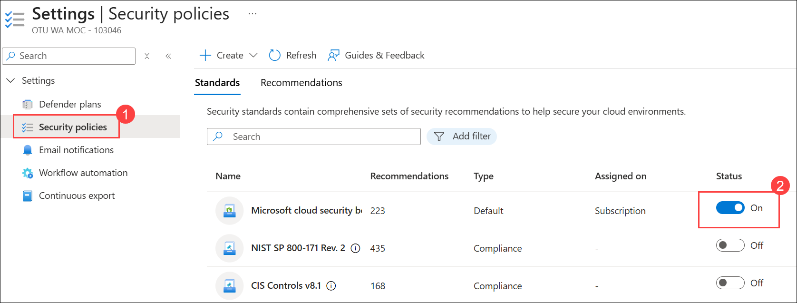

1. Return to the Inventory page and refresh to view the resources.

1. From the **Overview** page of Microsoft Defender for Cloud, notice the information available on the page (if you see 0 assessed resources and active recommendations, refresh the browser page, it may take a few minutes). Information on the top of the page includes the number of Azure subscriptions, the number of Assessed resources, the number of active recommendations, and any security alerts.  On the main body of the page, there are cards representing Security posture, Regulatory compliance, Insights, and more.
 
   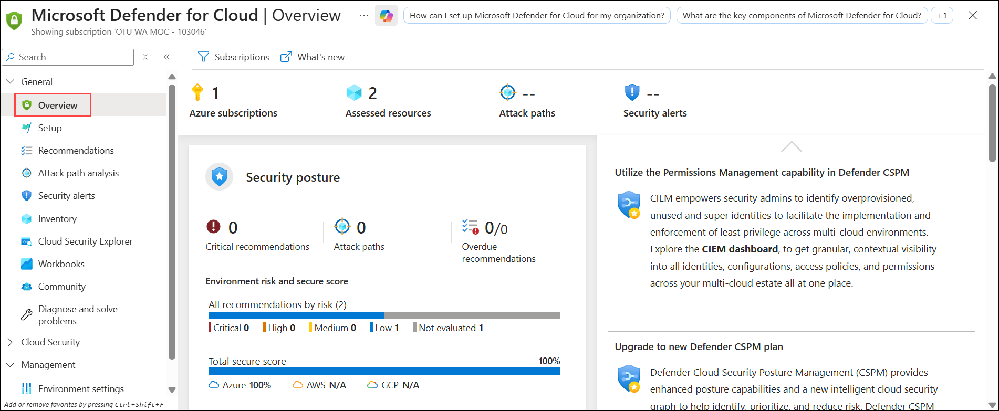  

    > **Note:** The Microsoft Defender for Cloud default policy initiative, which would normally have to be assigned by the admin, has already been assigned as part of the Azure subscription setup. The secure score, however, will show as 0% because there can be up to a 24 hour delay for Azure to reflect an initial score.

1. From the top of the page, select **Assessed resources**. (Note that this is equivalent to having selected Inventory from the left navigation panel of the Microsoft Defender for Cloud home page).

    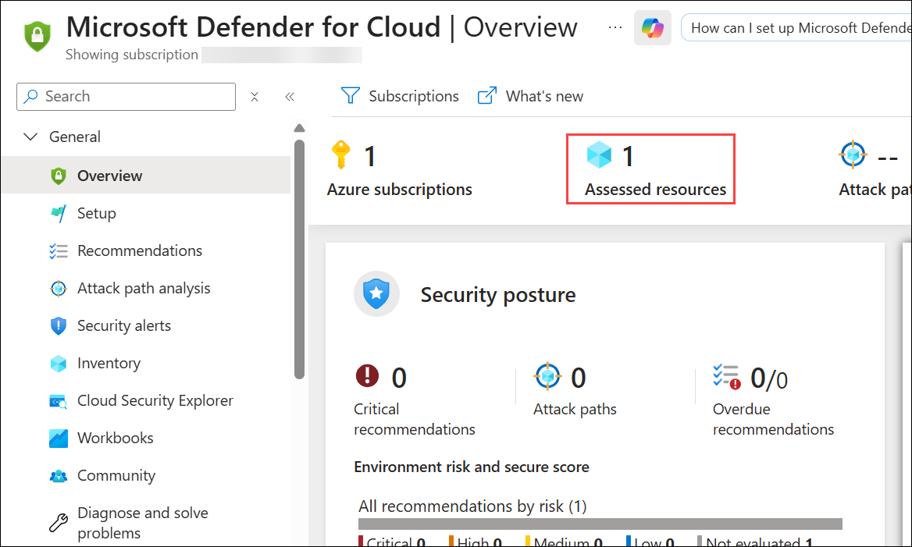

    > **Note:** It may take approximately **1 to 1.5 hours** for all resources to appear in the **Inventory** because **Microsoft Defender for Cloud** requires time to discover, onboard, and assess Azure resources. In the meantime, please **proceed with the next lab 7**, and after **1 to 1.5 hours**, return to this lab and check the options again.

    > **Note:** If the **Assessed resources** section is still not populated after 1.5 hours, it may be due to a delay in the initial security assessment or backend synchronization. In that case, please contact **Cloudlabs-Support@spektrasystems.com** for assistance.
   
1. This brings you to the **Inventory** page that lists the current resources. Select the virtual machine resource, **sc900-win2**. This resource is associated with the virtual machine you used in the previous lab.
       
    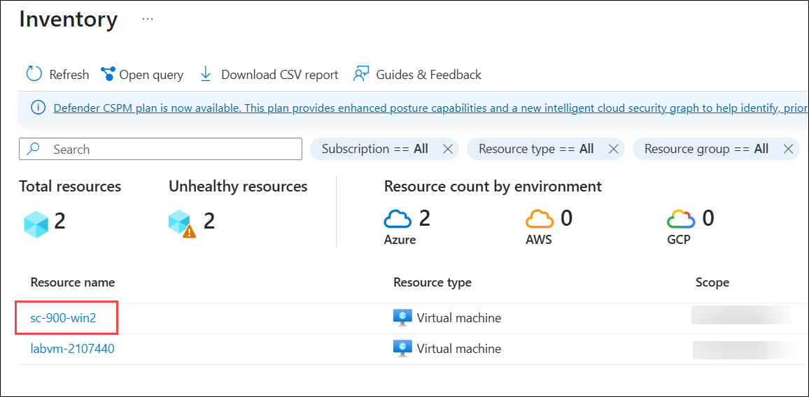

1. The Resource health page for the VM provides a list of recommendations.  From the available list, select any item from the list that shows an **unhealthy** status.
   
     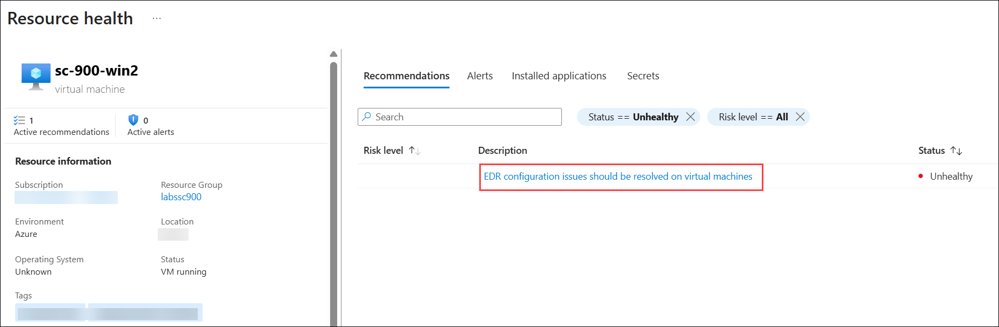

      > **Note:** It may take a some time for all recommendations and resource details to load completely. Please select the availabe list and proceed.

1. Click on **View recommendation for all resources** from the top menu.

    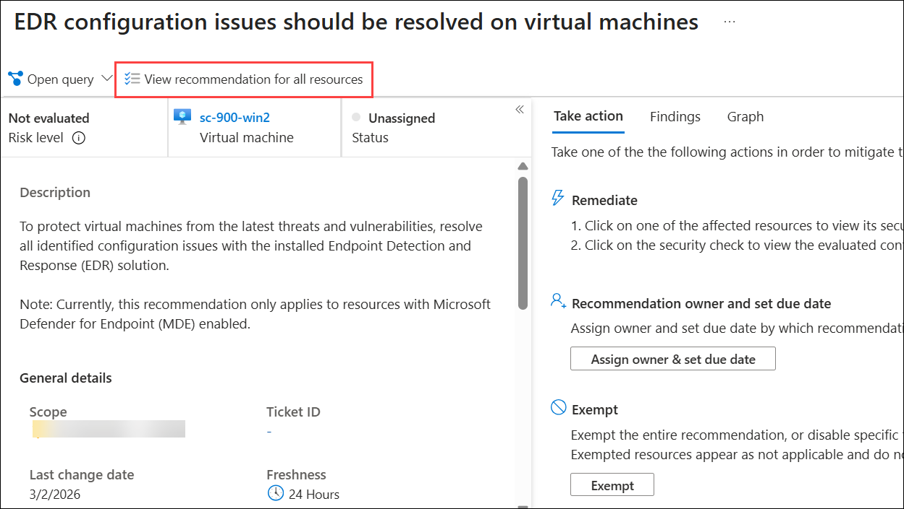
   
1. Note the detailed description. Select the drop-down arrow next to the Remediate. Note how remediate instructions (or links to instructions) are provided along with the option to take action.  Exit the window without taking any action.

    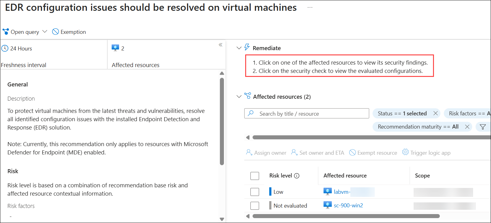
  
1. Return to the Microsoft Defender for Cloud overview page, by selecting **Microsoft Defender for Cloud | Overview** from the top of the page, above where it says Resource health.

1. From the main left navigation panel, select **Regulatory compliance (2)** under **Cloud Security (1)**. 

    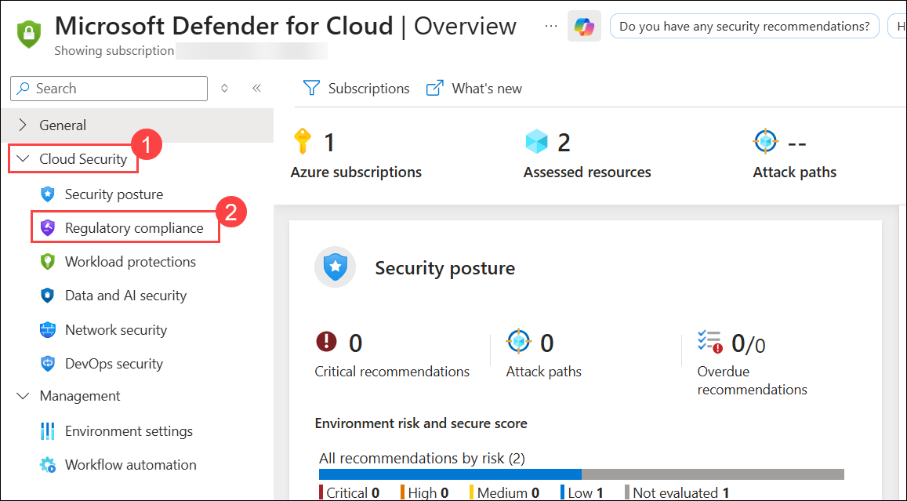

    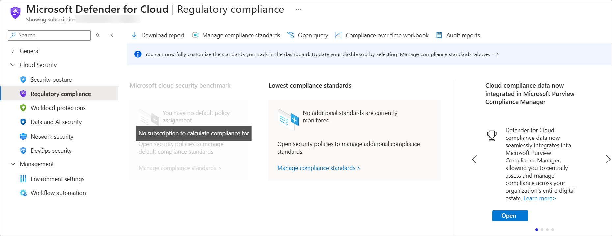

    > **NOTE:** If you see that there is **no subscription to calculate compliance for**, its because there may be up to a 24 hour delay for information to appear. Move to Task 2.

## Task 2: How to enable/disable the various Microsoft Defender for Cloud plans

Recall that Microsoft Defender for Cloud is offered in two modes: without enhanced security features (free) and with enhanced security features that are available through the Microsoft Defender for Cloud plans. In this task, you discover how to enable/disable the various Microsoft Defender for Cloud plans.

1. From the Microsoft Defender for Cloud overview page, select the **Environment settings** from the left navigation panel.

    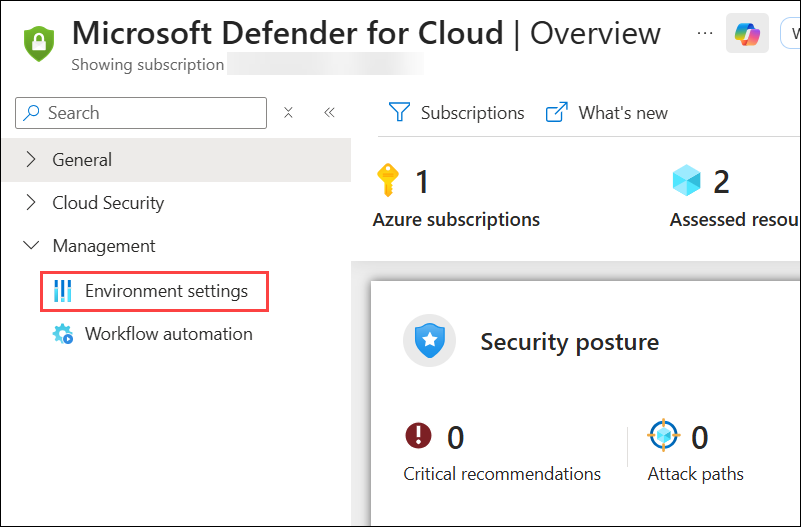

1. Expand the **Azure** list **(1)(2)** then select the **Existing Subscription (3)** listed next to the yellow key icon.

   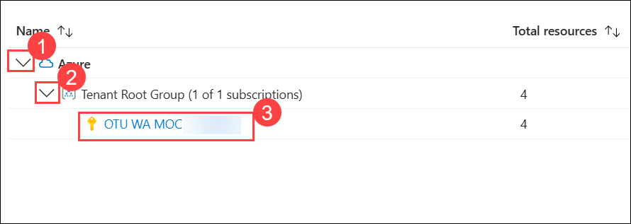
      
1. On the Defender plans page, notice the availabe options (Enable all or select individual Defender plans).

1. Verify that Foundational CSPM status is set to **On**, if not, set it now.  

   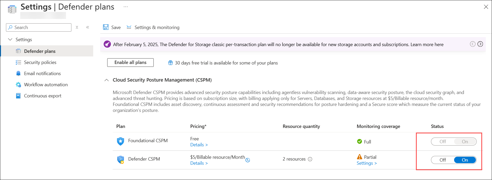
      
1. Close all the open browser tabs.
      
## Review

In this lab, you have completed:

- Explored on Microsoft Defender for Cloud
- Enabled/Disabled the various Microsoft Defender for Cloud plans

## You have successfully completed the lab