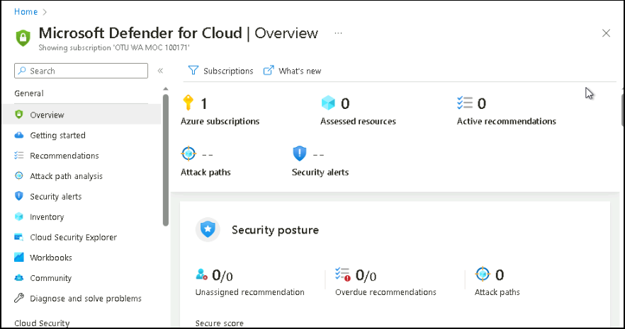
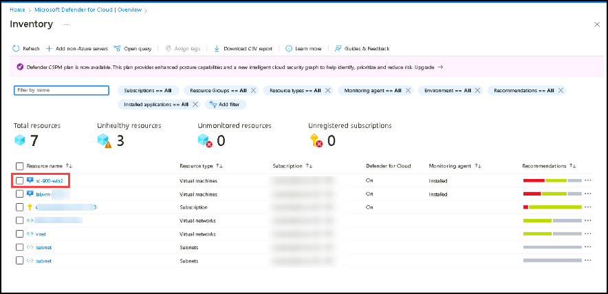
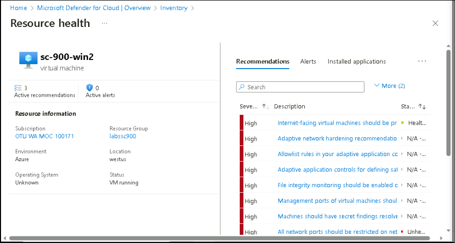
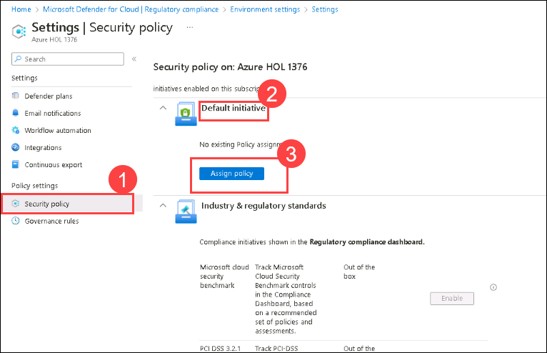
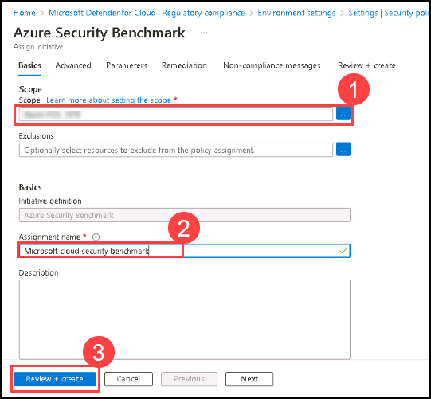
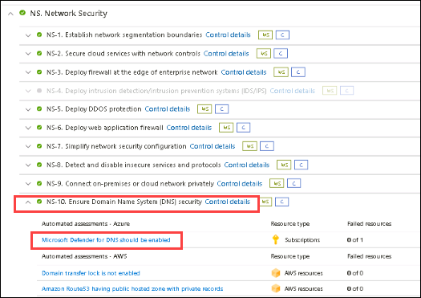
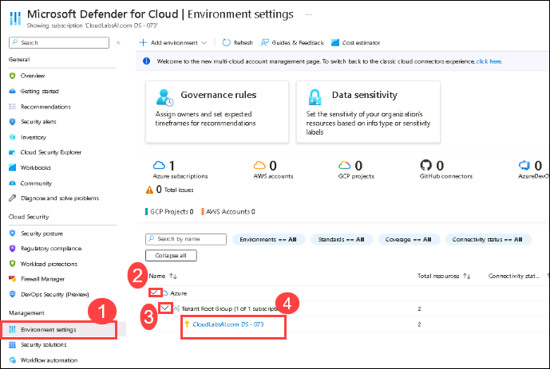

# Lab-06: Explore Microsoft Defender for Cloud

## Lab scenario
In this lab, you will explore Microsoft Defender for Cloud and learn how Azure Secure Score can be used to improve your organization's security posture. NOTE: the Azure subscription provided by the Authorized Lab Hoster (ALH) limits access and may experience longer than normal delays.

## Task 1: Explore on Microsoft Defender for Cloud

In this task, you'll do a high-level walk-through of some of the capabilities of Microsoft Defender for Cloud

1. Open Microsoft Edge. In the address bar enter **admin.microsoft.com**.

1. Sign in with your admin credentials.
   
1. In the Sign in window enter you will see a login screen, in that enter the following email/username and then click on **Next**. 

    * Email/Username: <inject key="AzureAdUserEmail"></inject>

1. Now enter the password and click on Sign in.
   
   * Password: <inject key="AzureAdUserPassword"></inject>
  
1. When prompted to stay signed-in, select **Yes**. This takes you to the Microsoft 365 admin center page.

1. In the blue search bar enter **Microsoft Defender for Cloud**, then from the results list, select **Microsoft Defender for Cloud**.

1. If this is the first time you enter Microsoft Defender for Cloud with your subscription, you may land on the Getting started page and be prompted to upgrade.  Scroll to the bottom of the page and select **Skip**. You'll be taken to the Overview page.

    
    
1. From the Overview page of Microsoft Defender for Cloud, notice the information available on the page (if you see 0 assessed resources and active recommendations, refresh the browser page, it may take a few minutes).  Information on the top of the page includes the number of Azure subscriptions, the number of Assessed resources, the number of active recommendations, and any security alerts.  On the main body of the page, there are cards representing Security posture, Regulatory compliance, Insights, and more.  Note: The Microsoft Defender for Cloud default policy initiative, which would normally have to be assigned by the admin, has already been assigned as part of the Azure subscription setup. The secure score, however, will show as 0% because there can be up to a 24 hour delay for Azure to reflect an initial score.
   
       

1. From the top of the page, select **Assessed resources**.  (Note that this is equivalent to having selected Inventory from the left navigation panel of the Microsoft Defender for Cloud home page).
   
   i. This brings you to the **Inventory** page that lists the current resources. Select the virtual machine resource, **sc900-win2**. This resource is associated with the virtual machine you used in the previous lab.
       
   
        
      >**Note** : It will take around 1-1.5 hr to fetch all the resources inside the Inventory.
      
   ii. The Resource health page for the VM provides a list of recommendations.  From the available list, select any item from the list that shows an **unhealthy** status.
   
   
   
   iii. Note the detailed description.  Select the drop-down arrow next to the Remediation steps. Note how remediation instructions (or links to instructions) are provided along with the option to take action.  Exit the window without taking any action.
  
   iv. Return to the Microsoft Defender for Cloud overview page, by selecting **Microsoft Defender for Cloud | Overview** from the top of the page, above where it says Resource health.

1. From the main left navigation panel, select **Regulatory compliance**. The regulatory compliance page provides a list of compliance controls based on the Microsoft Cloud security benchmark (verify that the Microsoft Cloud security benchmark tab is selected/underlined). Under each control domain is a subset of controls and for each control, there are one or more assessments. Each assessment provides information including description, remediation, and affected resources.
   
   >**Note** : If you are not able to see the assessments Go to **Manage Compliance Policies** and then **Environment Settings page** open select **Subscription**(decrease the resolution if it isnt visible) then the Defender plans page open then go to **Security policy** and select **Default initiative** then initiative assignment page open here In **Scope** option select Azure subscription and **Assignment name** as **Microsoft cloud security benchmark** and leave remaining as default and select **Review+Create** and Click on **Create**. under **Industry & Regulatory Standards** section Microsoft cloud security benchmark got disabled. It may take a few hours to reflect.

    

    
     
    

    
     
    i. Let's explore one of the control domains areas. Select (expand) **NS. Network Security**. A list of controls related to network security is displayed.
       
      
       
     >**Note** : If you are not able to see the list of controls as provided in the Screenshot, skip the below steps and start Task

   ii. It takes 2-3 hrs to fetch this list of controls.
      1. Select **NS-10. Microsoft Defender for DNS should be enabled**. Note the list of automated assessments (which include automated assessments for AWS) and how each assessment line item provides information including the resource type, failed resources and compliance stations. Select the assessments listed.  Here you see information including a description, Remediation steps, and Affected resources.
    
      
    
     1. Select the **X** on the top-right corner of the screen to close the page.
     1. Select **Overview** from the left navigation panel to  return to the Microsoft Defender for Cloud Overview page.
     
 1. Keep the Microsoft Defender for Cloud overview page open, you'll use in the next task.

**Congratulations** on completing the task! Now, it's time to validate it. Here are the steps:
- Navigate to the Lab Validation Page, from the upper right corner in the lab guide section.
- Hit the Validate button for the corresponding task. If you receive a success message, you can proceed to the next task. 
- If not, carefully read the error message and retry the step, following the instructions in the lab guide.
- If you need any assistance, please contact us at labs-support@spektrasystems.com. We are available 24/7 to help you out.

## Task 2: How to enable/disable the various Microsoft Defender for Cloud plans

Recall that Microsoft Defender for Cloud is offered in two modes: without enhanced security features (free) and with enhanced security features that are available through the Microsoft Defender for Cloud plans. In this task, you discover how to enable/disable the various Microsoft Defender for Cloud plans.

1. From the Microsoft Defender for Cloud overview page, select the **Environment settings** from the left navigation panel.
1. Expand the **Azure** list then select the **Existing Subscription** listed next to the yellow key icon.

      
      
1. On the Defender plans page, notice how you can select Enable all or select individual Defender plans. 
    1. Verify that CSPM status is set to **On**, if not, set it now.  
    1. Enable the plan for Servers.  Select **On** for the Servers line item, then select **Save** from the top of the page.
   
      
      
1. Close all the open browser tabs.
      
### Review

In this lab, you explored Microsoft Defender for Cloud.

