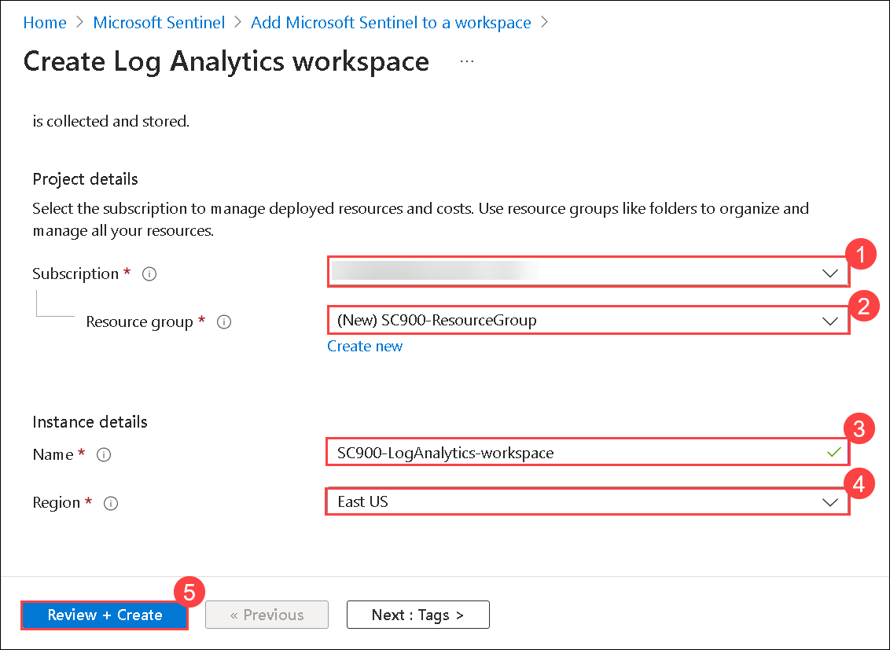
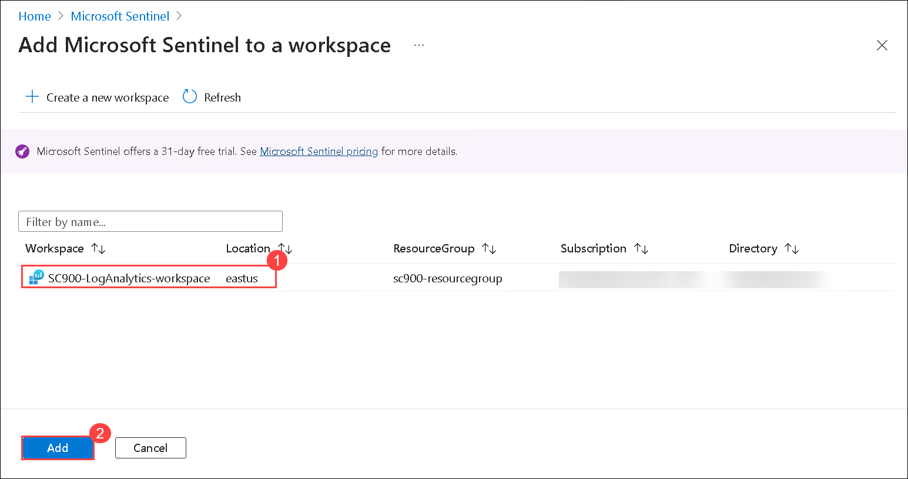
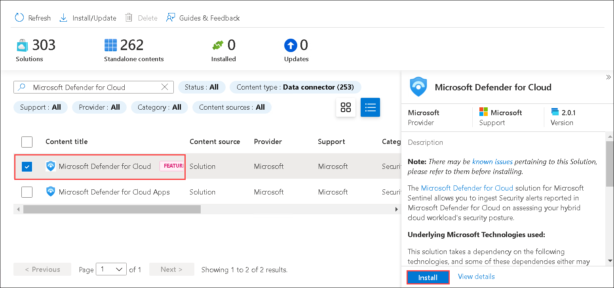
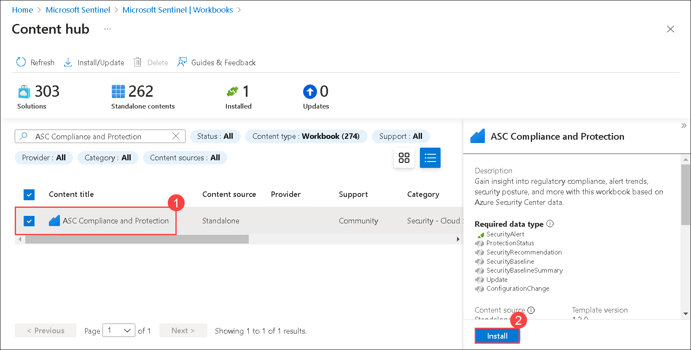
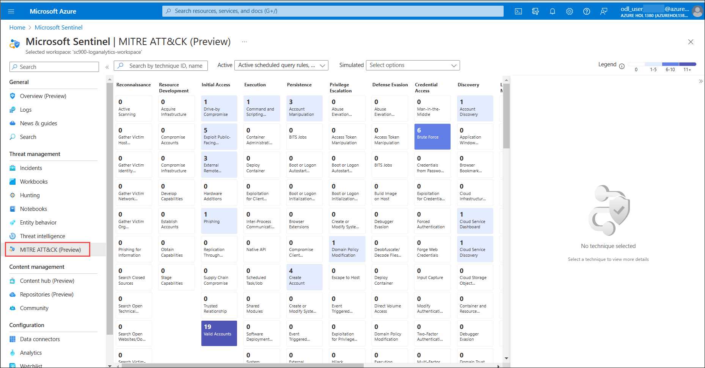
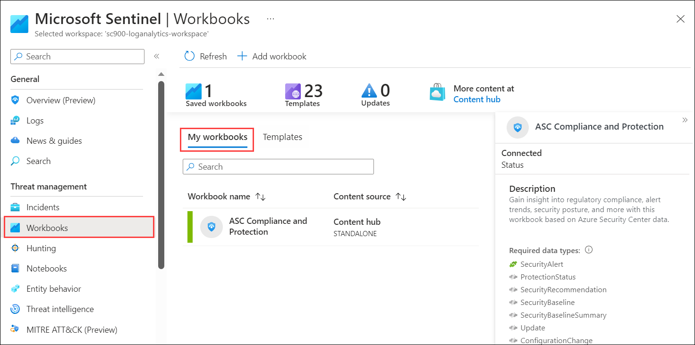

# Lab-07 : Explore Microsoft Sentinel 

## Lab scenario
In this lab you will walk through the process of creating an  Microsoft Sentinel instance.  You will also set up the permissions to ensure access to the resources that will get deployed to support  Microsoft Sentinel.  Once this basic setup is done you will walk through the steps for connecting Microsoft Sentinel to your data sources, set up a workbook, and do a brief walk-through of some of key capabilities available in Microsoft Sentinel. 

## Lab objectives

In this lab, you will complete the following tasks:

+ Task 1: Create a Microsoft Sentinel instance
+ Task 2: Built-in Microsoft Sentinel roles
+ Task 3: Data connector to your instance of Microsoft Sentinel
+ Task 4: Explore on capabilities available in Sentinel

## Estimated timing: 60 minutes

## Architecture diagram

.png)
  
## Task 1:  Create a Microsoft Sentinel instance

1. In the Azure portal, in the **Search resources, services, and docs** search for **Microsoft Sentinel** then select **Microsoft Sentinel** from the search results.  

1. From the Microsoft Sentinel page, select **+ Create**.

1. From Add Microsoft Sentinel to a workspace, select **+ Create a new workspace**.

1. From the basics tab of the Create Log Analytics workspace, enter the following

1. click **Review + Create**.   

1. Verify the information you entered then select **Create**.

1. If you don’t see the new workspace listed, select **Refresh**, then select newly created workspace **SC900-LogAnalytics-workspace (1)** and click on **Add (2)**.

1. Once the new workspace is added, the Microsoft Sentinel | News & guides page will display., including that the Microsoft Sentinel free trial is activated. Select **OK**  Note the three steps listed on the Get started page.

1. Keep this page open, as you will use it in the next task.

  | Setting | Action |
  | -- | -- |
  | Subscription |  **Select the given subscription (1)**  |
  | Resource group | select **Create New**, then enter the name **SC900-ResourceGroup** then select **OK**. |
  | Name | **SC900-LogAnalytics-workspace-<inject key="DeploymentID" enableCopy="false"/>** |
  | Region | leave this default |
 
  

  

## Task 2: Built-in Microsoft Sentinel roles

With the Microsoft Sentinel instance created, it is important that users that will have responsibility to support Microsoft Sentinel have the necessary permissions.  This is done by assigning the designated user the required role permissions. In this task, you'll view the available, built-in Microsoft Sentinel roles.

1. In the **Search resources, services, and docs** search for **resource groups** then select **Resource groups** from the search results. 

1. From the Resource groups page, select the resource group that you created with Microsoft Sentinel, **SC900-ResourceGroup**.

   >**Note**: Working at the resource group level will ensure that any role that is selected will apply to all the resources that are part of the Microsoft Sentinel instance that was created in the previous task.

   >**Note**:  For the Azure subscription provided to you by the Authorized Lab Hoster, a role has been defined that will give you access to manage all necessary resources as shown in the description. It is important, however, to understand the available Sentinel specific roles. Note the current role is Owner.

    >**NOTE:**  As a best practice you should assign the least privilege required for the role.  As a reference, review permissions in Azure Sentinel: https://docs.microsoft.com/en-us/azure/sentinel/roles
   
1. Select the **Access Control (IAM)**, select **View my access** to confirm the owner role has been added, then close the window by select the **X** on the top-right corner of the window.
   
   >**Note**: For the Azure subscription provided to you by the Authorized Lab Hoster, a role has been defined that will give you access to manage all necessary resources, as  shown in the description. It is important, however, to understand the available Sentinel specific roles.
   
   >**Note the current role is Owner.**

1. Return to the All services page of Azure, by selecting **All Services** from the top-left corner of the page, above where it says Resource groups.

## Task 3: Data connector to your instance of Microsoft Sentinel

In this task you will walk through the steps involved in setting up a data connector to your instance of Microsoft Sentinel and selecting a built-in workbook templates to allow you to quickly gain insights across your data as soon as you connect a data source. Note: Azure lab subscriptions may experience greater than normal delays in connecting to a data source and/or visualizing data.

1. In the **Search resources, services, and docs** search for **Microsoft Sentinel** then select **Microsoft Sentinel** from the search results.

1. From the Microsoft Sentinel page, select the workspace you created with the instance of Microsoft Sentinel, **SC900-LogAnalytics-workspace-<inject key="DeploymentID" enableCopy="false"/>**.

1. The first step with Microsoft Sentinel is to be able to collect data. From the left navigation panel select **Data connectors**, listed under configuration.

1. On the **Microsoft Sentinel | Data connctor** page scroll down and select **Go to Content hub**.

1. On **Content hub** page in  the Search bar, search for **Microsoft Defender for Cloud** and then from the list select **Microsoft Defender for Cloud** and click **Install**

    

1. Once installation procees is done, navigate back to **Microsoft Sentinel | Data connctor** page and refresh the page to get **Microsoft Defender for Cloud** option.

1. On the **Microsoft Sentinel | Data connctor** page , select **Microsoft Defender for Cloud**.
   
1. The Microsoft Defender for Cloud connector window opens. Review the description then Select **Open connector page**.
 
    .png)

1. From the Microsoft Defender for Cloud connector page, review the Description on the left side of the window.

1. The instructions tab in the main window, provides the prerequisites. Review the instructions and configuration information.

1. From the configuration section, select listed subscription, select your azure subscription so that a checkmark appears in a blue box,

1. then select **Connect** (the connect option is shown above the search box).

1. A Connect window will appear, select **OK**.

1. In the status column, next to the subscription you should see that status update to Connected.  Don't worry if you don't see connected status in the window on the left      side of the page, do NOT refresh the browser.
   
1. Return to **Microsoft Sentinel** and from the Microsoft Sentinel page, select the workspace you created with the instance of Microsoft Sentinel, **SC900-LogAnalytics-workspace-<inject key="DeploymentID" enableCopy="false"/>**.
       
1. From the left navigation panel, select **Workbooks**, scroll dowm and select **Go to Content hub**.

1. On **Content hub** page in the Search bar, search for **ASC Compliance and Protection**  and then from the list select **ASC Compliance and Protection (1)** and click **Install (2)**

     

1. Once installation procees is done, navigate back to **Microsoft Sentinel | Workbooks** page and refresh the page to get **ASC Compliance and Protection** option.

1. under **Templates** tab search and select **ASC Compliance and Protection** (Note: ASC or Azure Security Center is now called Microsoft Defender for Cloud). This opens the workbooks page.

1. On the bottom right side of the screen, review the description then select **Save** from the bottom of the screen then select **OK** to save the workbook to the default location. Now select **View saved workbook**.

   1. In the workspace field, select **SC900-LogAnalytics-workspace-<inject key="DeploymentID" enableCopy="false"/>**.
   1. From the top of the workbook page, select **Auto refresh: Off**, then select **5 minutes** and select **Apply**.
   1. From the top of the workbook page, select the **Save icon**.
   1. From the top-left corner of the Workbooks page, above where it says Workbooks, select **Microsoft Sentinel** and Select **SC900-LogAnalytics-workspace-<inject key="DeploymentID" enableCopy="false"/>** This returns 
      you to the Overview page.
   1. On the Overview page, select **New overview** toggle and scroll down and select **data connectors** under **Data** section then you should now see the number 1 above 
      where it says connected, to indicate one active connector (you may need to select refresh).

1. Keep this page open, as you'll use it in the next task
    
## Task 4 : Explore on capabilities available in Sentinel

In this task, you'll walk through some of the options available in Sentinel.

1. From the left navigation panel, select **Hunting**.

1. GO-TO the **queries** tab, scroll dowm and select **Go to Content hub**.

1. On **Content hub** select **Content title** and select **Install/Upadte**.

    >**Note**: wait till installation process to complete.

1. Once installation procees is done, navigate back to **Microsoft Sentinel | Hunting** page and refresh the page.
   
1. Select the **queries** tab which is selected (underlined), select any query from the list.  Once a query is selected, note the information that is provided about that query, including the code for the query, as well as the option to run the query and see results.  Don't select anything.
   
    
   
    
   
1. From the left navigation panel, select **MITRE ATT&CK**.  MITRE ATT&CK is a publicly accessible knowledge base of tactics and techniques that are commonly used by attackers. With Microsoft Sentinel you can view the detections already active in your workspace, and those available for you to configure, to understand your organization's security coverage, based on the tactics and techniques from the MITRE ATT&CK® framework.  Select any cell from the matrix and note the information available on the right side of the screen.  

    

1. From the left navigation panel, select **Community**. Microsoft security analysts constantly create and add new workbooks, playbooks, hunting queries, and more, posting them to the community for you to use in your environment. From the right side of the screen,

1. select **Onboard community content**.  A new tab to the GitHub repository opens where you can download content to enable your scenarios. Scroll down to the README.md section and review the description. Return to the Azure tab in your browser.

1. From the left navigation panel, select **Analytics**.  Select the first item from the list **Advanced Multistage Attack Detection**.

    >**Note**: the detailed information.  Microsoft Sentinel uses Fusion, a correlation engine based on scalable machine learning algorithms, to automatically detect multistage attacks (also known as advanced persistent threats) by identifying combinations of anomalous behaviors and suspicious activities that are observed at various stages of the kill chain. On the basis of these discoveries, Microsoft Sentinel generates incidents that would otherwise be difficult to catch.

1. From the left navigation panel, select **Automation**.  Here you can create simple automation rules, integrate with existing playbooks, or create new playbooks.  Select **+ Create** dropdown, and then select **Automation rule**. Note the window that opens on the right side of the screen and the options available to create conditions and actions.  Select **Cancel** from the bottom of the screen.
 
    

1. From the left navigation panel, select **Workbooks**. From the Workbooks page, select the **My workbooks** tab, which is above the search box.  The workbook you saved earlier is listed and available for you to view and monitor your data.
  
    >**Note**: There isn't any real activity happening in the Azure subscription to reflect in the workbook and Azure lab subscriptions may experience greater than normal                  delays in collecting data that can be visualized in the workbook.
  
    
  
1. Close the window by selecting the **X** on the top-right corner of the window.

1. From the top left corner of the window, just below the blue bar, select **Home** to return to the home page of the Azure portal.

1. Close all the open browser tabs.

    > **Congratulations** on completing the task! Now, it's time to validate it. Here are the steps:
    - Navigate to the Lab Validation Page, from the upper right corner in the lab guide section.
    - Hit the Validate button for the corresponding task. If you receive a success message, you can proceed to the next task. 
    - If not, carefully read the error message and retry the step, following the instructions in the lab guide.
    - If you need any assistance, please contact us at labs-support@spektrasystems.com. We are available 24/7 to help you out.
      
## Review
In this lab, you have completed:
- Create a Microsoft Sentinel instance
- Built-in Microsoft Sentinel roles
- Data connector to your instance of Microsoft Sentinel
- Explore on capabilities available in Sentinel

## You have successfully completed the lab

