# Lab 11: Explore the Service Trust Portal

## Lab Overview

In this lab, you will explore the features and content available from the Service Trust Portal. You will also visit the Trust Center and navigate to the six key privacy principles.

## Lab Objectives

In this lab, you will complete the following tasks:

+ **Task 1:** Explore the Service Trust portal
+ **Task 2:** Explore Microsoft Trust Center: Trust, Privacy, Security, Compliance, and AI Governance

## Estimated timing: 30 Minutes

## Architecture diagram

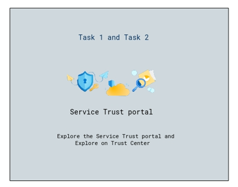

## Task 1: Explore the Service Trust portal

In this task you will explore the Service Trust portal and the different types of content available, you will learn how to access reports, and how to save reports to your library.

1. Within the virtual machine(VM) on the left, click **Microsoft edge** shortcut (Msdge) on the desktop and enter **https://servicetrust.microsoft.com/**.  This will bring you to the landing page for the Service Trust Portal. The Service Trust Portal contains details about Microsoft's implementation of controls and processes that protect our cloud services and the customer data therein.

   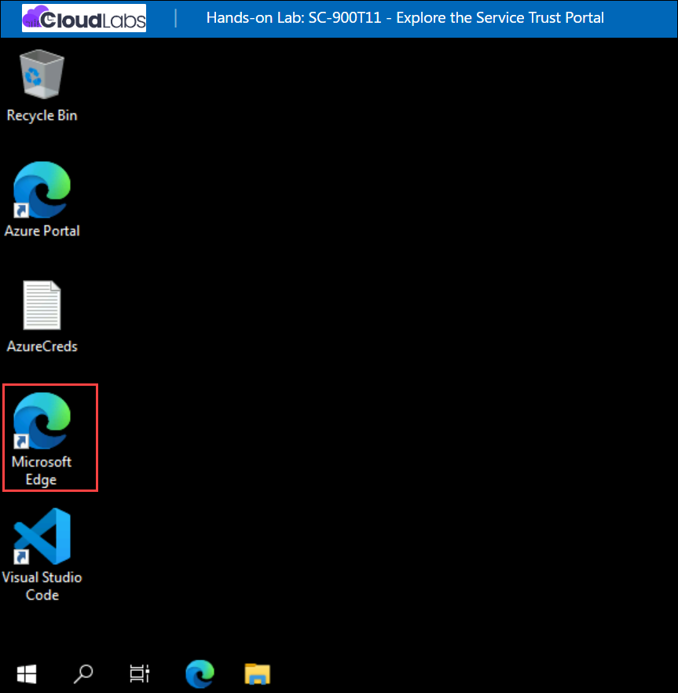

1. You have now arrived at the Service Trust Portal.

   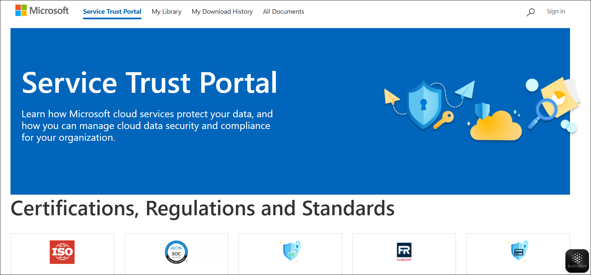

1. To access some of the resources on the Service Trust Portal, you must log in as an authenticated user with your Microsoft cloud services account and review and accept the Microsoft Non-Disclosure Agreement for Compliance Materials. To **Sign-in** Scroll down and select **ISO/ICE** which will be under Certifications, Regulations and Standards.
   
   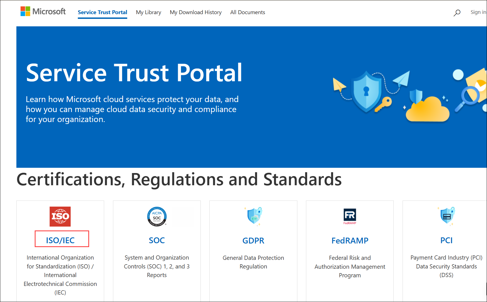

1. Click on **Sign in** blade.

   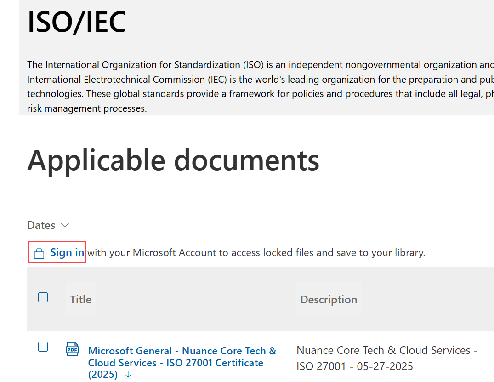

1. A login Screen appears, in that enter the following email/username and then click on **Next**. 
   
   * Email/Username: <inject key="AzureAdUserEmail"></inject>

     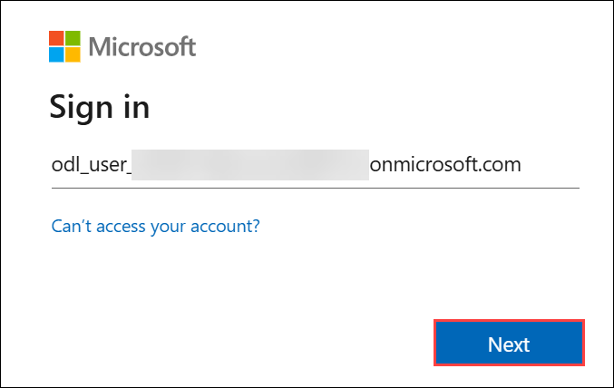
     
1. Now enter the following password and click on **Sign in**.
   * Password: <inject key="AzureAdUserPassword"></inject>

     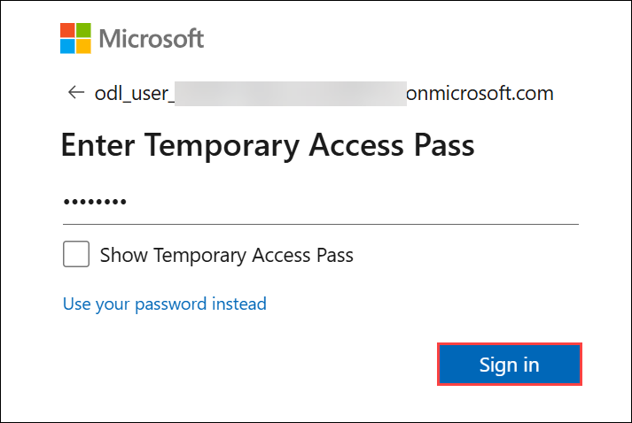
   
1. if prompted, select **Agree** to accept the Microsoft Non-Disclosure Agreement for Compliance Materials.

1. Note the description on the top of the page and available applicable documents. Select the **ellipsis(...) (1)** under the More Options and then select **Save to Library (2)**.

   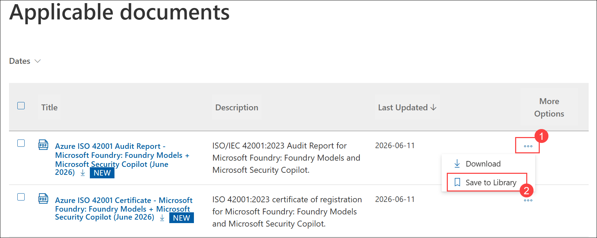
   
1. A window will pop up asking if you want to subscribe to this document.  Select **Yes**.

   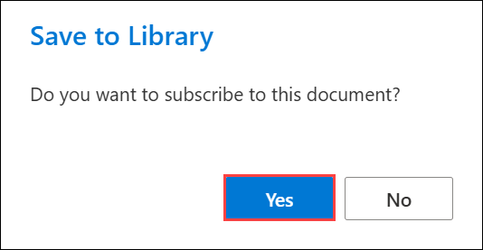
  
1. A window will pop up for notification settings, note the different settings and select **Daily (1)** and Select **Save (2)**.
 
   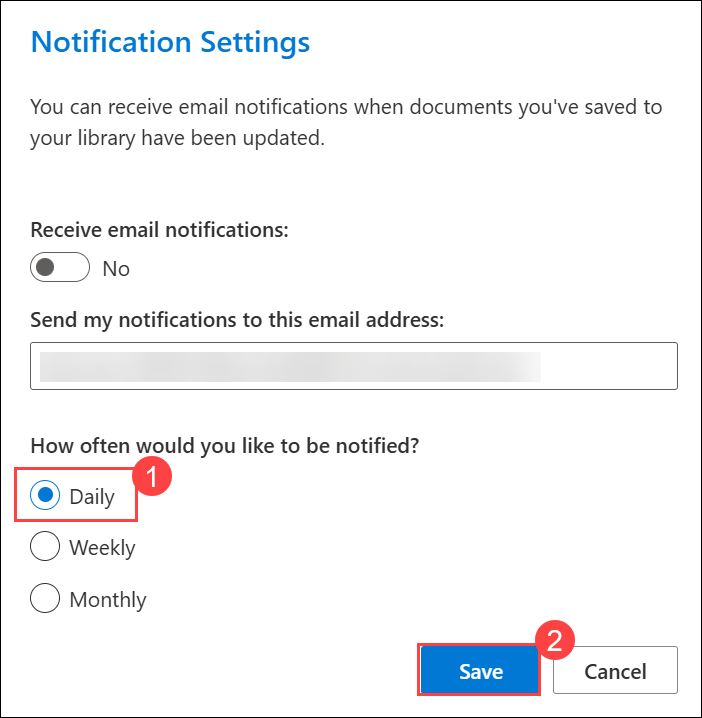

1. To verify that the document has been saved, scroll up to the top of the page and select **My Library**, view the document that we have saved.

   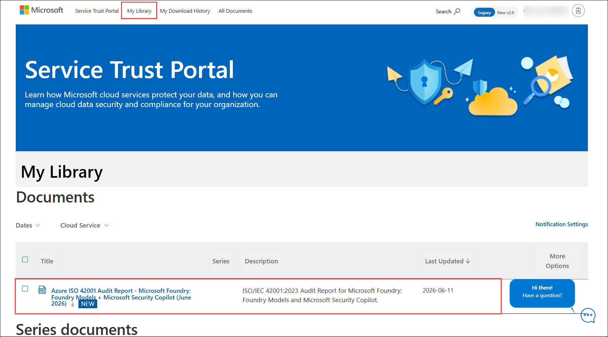

1. From the top of the My Library page, select **Service Trust Portal** to return to the Service Trust Portal home page.

   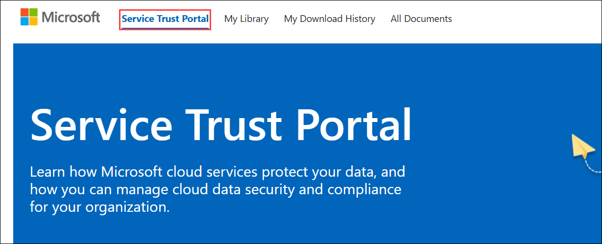
   
1. From the Service Trust Portal home page, scroll down to the **Industry and Regional Resources (1)** category.  Note the available tiles.  Select **Financial Services (2)**. 
 
   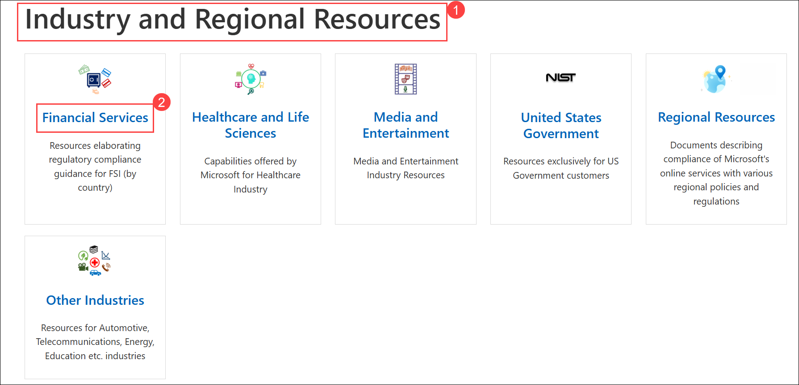

1. Scroll down to see all the available regions and countries.  Select the tile for any country to view the applicable documents.

   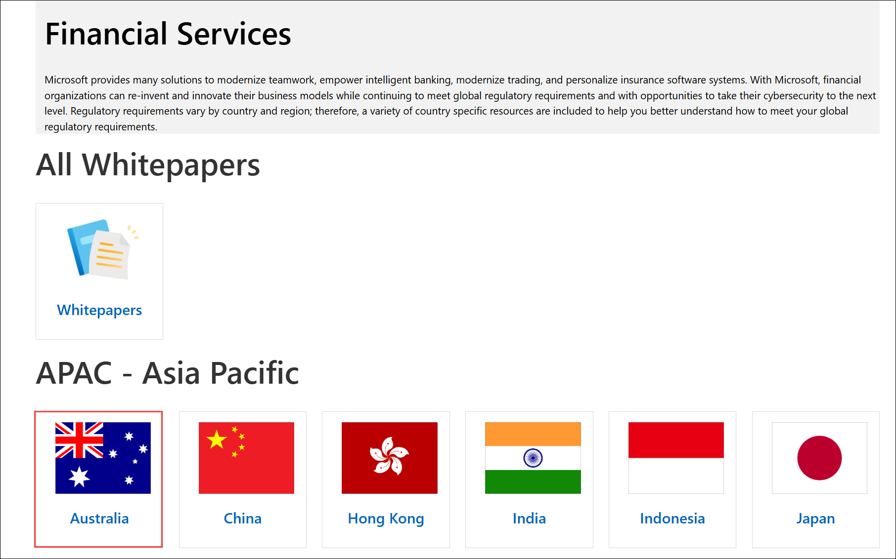

   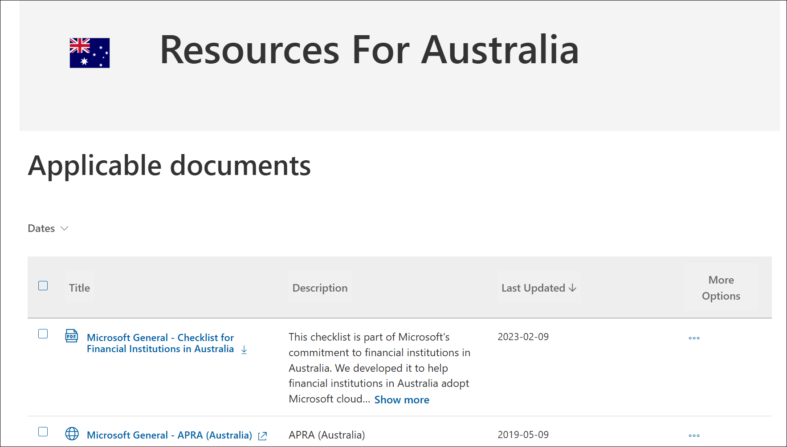   
 
1. Navigate back to the Service Trust Portal home page, select the link **Service Trust Portal** at the top of the page.
   
   
    
1. From the Service Trust Portal home page, scroll down to the **Resources for your Organization (1)** category. Select **Resources for your Organization (2)**.  Note that any documents listed here are based on your organization's subscription and permissions.    

   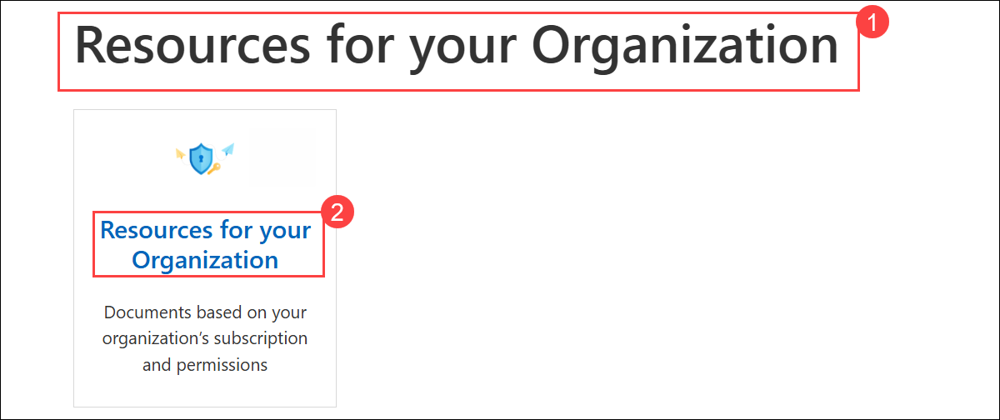
   
   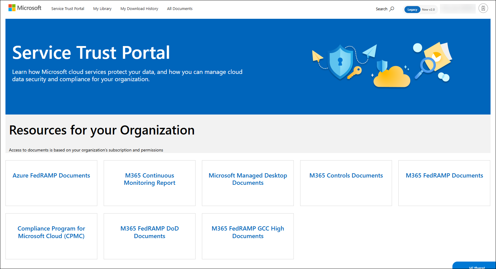
   
1. Navigate back to the Service Trust Portal home page, select the link **Service Trust Portal** at the top of the page.

   
    
## Task 2: Explore Microsoft Trust Center: Trust, Privacy, Security, Compliance, and AI Governance

In this task, you will explore the **Microsoft Trust Center** to understand how Microsoft approaches **trust, privacy, security, compliance, and Responsible AI** across its cloud services.

1. Open a new browser tab and navigate to the **Microsoft Trust Center** at  **`https://www.microsoft.com/trust-center`**.

1. On the Trust Center home page, review the introductory content. Notice how Microsoft presents **trust** as a core principle that spans security, privacy, compliance, and transparency across its services.

   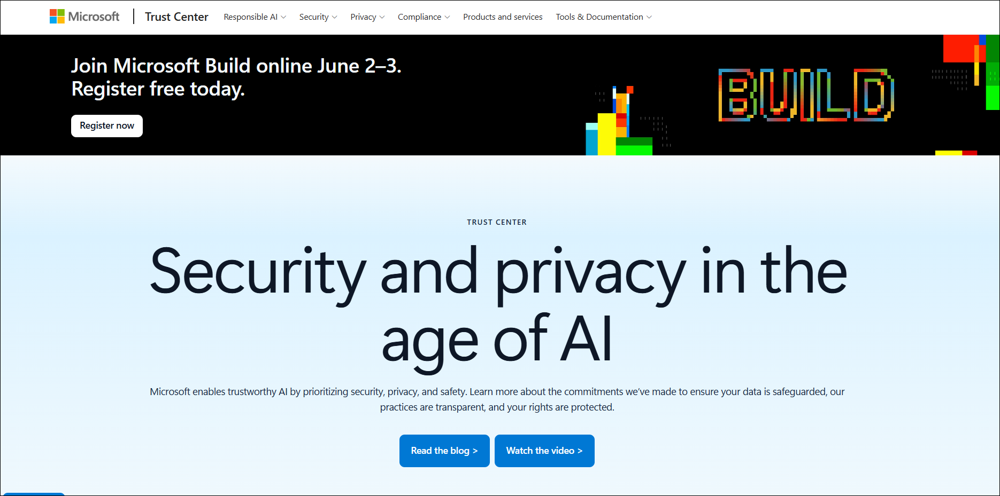

1. From the top navigation menu, explore **Privacy**, **Security**, and **Compliance**. Focus on understanding how Microsoft protects customer data, applies security by design, and supports regulatory and industry compliance requirements.

   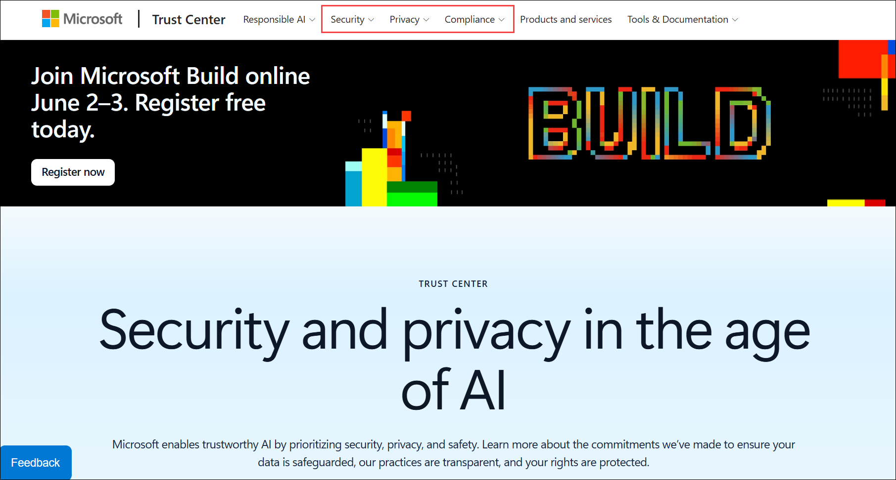

1. From the top navigation menu, select **Responsible AI** and **Products and services**. Review how Microsoft applies Responsible AI principles and how trust commitments are consistently implemented across Microsoft cloud products.

   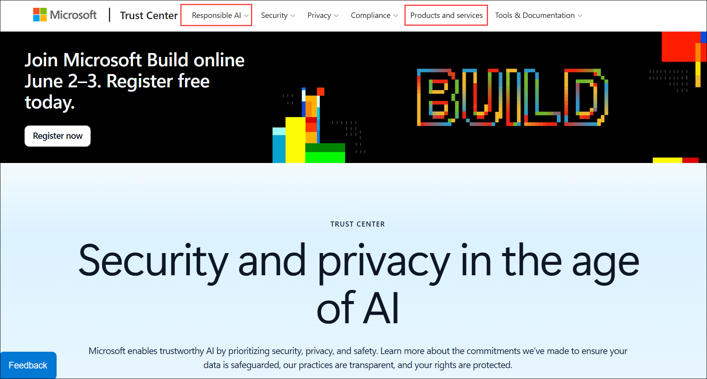

1. Close all open browser tabs.

## Review
In this lab, you have completed:
- Explored the Service Trust portal
- Explore Microsoft Trust Center: Trust, Privacy, Security, Compliance, and AI Governance
  
## You have successfully completed the lab
