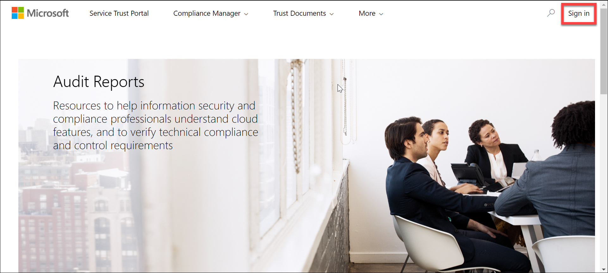
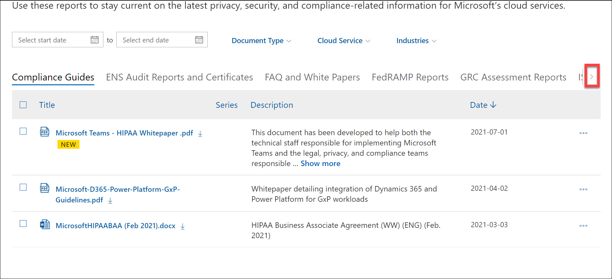
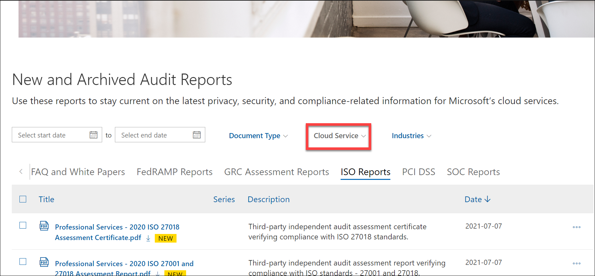
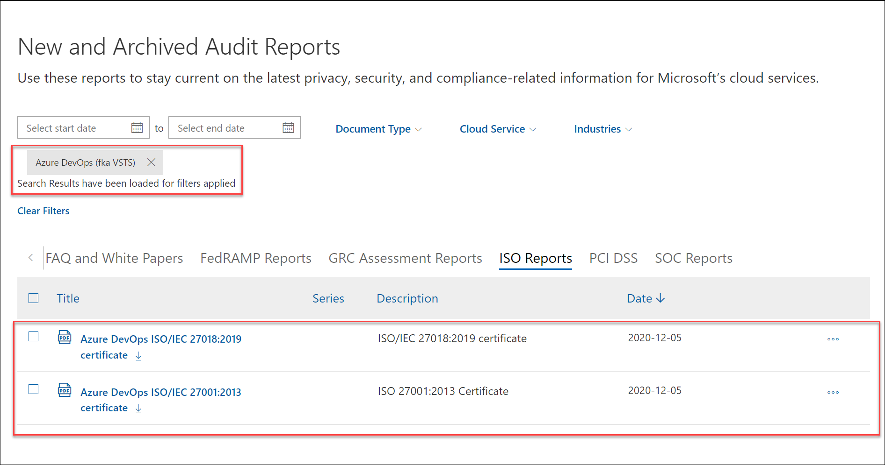
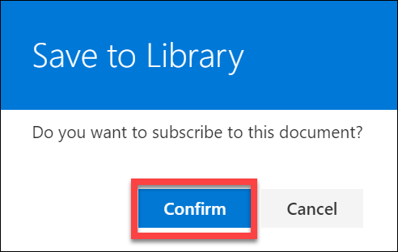
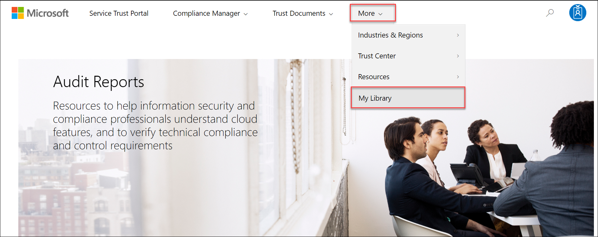

---
lab:
    title: 'Explore the Service Trust Portal'
    module: 'Module 4 Lesson 1: Describe the capabilities of Microsoft compliance solutions: Describe the compliance management capabilities in Microsoft'
---

# Lab: Explore the Service Trust Portal

## Lab scenario

In this lab, you will explore the features and content available from the Service Trust Portal. You will also visit the Trust Center and navigate to the six key privacy principles.

**Estimated Time**: 10-15 minutes

#### Task 1: In this task you will explore the Service Trust portal and the different types of content available, you will learn how to access reports, and how to save reports to your library. 

1. Open Microsoft Edge. Navigate to **https://portal.azure.com/** and sign in with the user credentials provided in the environment details page.

   

1. In the same window open another tab and enter **https://servicetrust.microsoft.com/**.  This will bring you to the landing page for the Service Trust Portal. The Service Trust Portal contains details about Microsoft's implementation of controls and processes that protect our cloud services and the customer data therein. 

1. To access some of the resources on the Service Trust Portal, you must log in as an authenticated user (i.e. the user account with which we have signed into azure.) with your Microsoft cloud services account and review and accept the Microsoft Non-Disclosure Agreement for Compliance Materials. On the top, right hand corner of the landing page the for the Service Trust Portal, you will see the option to Sign in.  **Sign in**, using your admin credentials and, if prompted, select **Agree** to accept the Microsoft Non-Disclosure Agreement for Compliance Materials.

    

    
    
1. Scroll down on the page and notice the links to Audit reports, Documents & Resources and more.  Select **View all Audit Reports**.

   

1. Scroll down to the middle of the page and you will see New and Archived Audit Reports.  You can select from a variety of categories, including Compliance Guides, ENS Audit Reports and Certificates, FAQ and White Papers, and more.

1. Select **ISO Reports**.  If you don’t immediately see the option for ISO Reports, select the right arrow until you see the option for ISO Report, then select it.

   

1. You will see a long list of available ISO reports, so you have the option to filter based on a date range as well as Document Type, Cloud Service, and Industries.  In this case, you are looking for available ISO reports for Azure DevOps.  Select Cloud Service and from the drop down, select Azure DevOps (aka VSTS).  The result is two documents.

   
   
   
   
   

1. You have the option to download or Save to Library all or individual documents.  In this case, you want to save just the first document.  Select the **ellipses (…)**, then select **Save to Library**.  You will be prompted to subscribe to the document, select **Confirm**.

   
   
   

1. A pop-up window may appear with the option to receive email notifications when documents that are saved to your library are updated.  In this case, you don’t need to receive any notifications of updates, so leave the defaults and select **Save**.  The document is still saved to your library.

   

1. Now verify that the document is in fact in your library. Scroll up to get to get back to the top of page.  From the top navigation, select **My Library**.  If you don’t see the option for My Library, select More, then select My Library.

   
   
   

1. From the top of the Service Trust Portal page, select **Trust Documents** and note the options. Explore the information available for each of the links under Trust Documents. Selecting Audit Reports directs you to the same location that you explored in the previous task.  Explore the information available for each of the links.

1. From the top of the page, select **Industries & Regions**.  Choose **Regional Solutions**. Notice the different Regions listed.  Select **United Kingdom**.  

1. You can select from different categories.  Including GRC Assessment Reports, Compliance Guides, and more.  As with the previous task, you can filter the list of documents displayed and you can select documents to download or save documents to your library.

#### Task 2: In this task you will visit the Trust Center and navigate to Microsoft’s six, key privacy principles.

1. From the top of the Service Trust Portal page, select **Trust Center** then choose **Home**. This opens a new browser tab that takes you to the Trust Center where you find more information about security, compliance, and privacy in the Microsoft Cloud.

1. From the top of the page, select **Privacy**, then select **Resources**.

1. Select **Additional privacy resources**.

1. Select **Privacy at Microsoft**.

1. Review the six key privacy principles.

1. Close your browser windows to exit out the Service Trust Portal and the Trust Center.

#### Review

In this lab you explored some of the options available under the Service Trust Portal, how to access reports, and how to use My Library to save documents for future review.  Additionally, you visited the Trust Center to access and review Microsoft's Privacy principles.
