# Lab-12: Explore the Microsoft Purview compliance center & Compliance Manager

## Lab scenario
In this lab, you will explore the Microsoft Purview compliance center home page and ways in which the capabilities of Compliance manager can help organizations improve their compliance posture.

#### Task 1: Explore the Microsoft Purview compliance center..

1.	Open Microsoft Edge. In the address bar enter **admin.microsoft.com**.

      

1. Sign in with your admin credentials.
    1. In the Sign in window, Get the user credentials provided in the environment details page and paste the value in the username section and then select **Next**.
     
        
     
        
    
    1. Enter the admin password which should be provided by your lab hosting provider. Select **Sign in**.
    
        
     
    1. When prompted to protect the account, Please select **Skip for now**.

        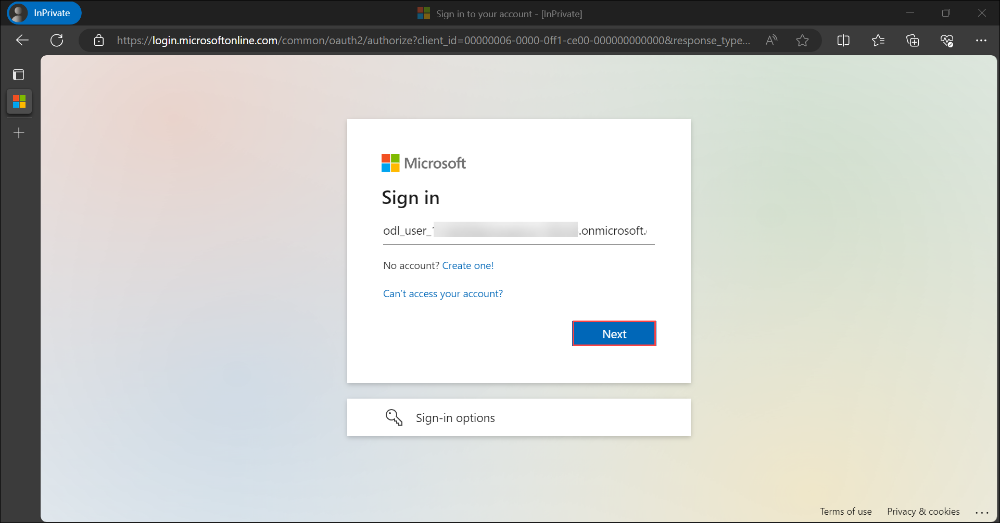
        
    1. When prompted to Action Required, Please select **Ask later**

          
     
    1. When prompted to stay signed- in, select **Yes**. This takes you to the Microsoft 365 admin center page.

1. From the left navigation pane of the Microsoft 365 admin center, select **Show all**.

     

1. Under Admin centers, select **Compliance**.  A new browser page opens to the welcome page of the Microsoft Purview compliance center.

     
     
1. The card section on the home page shows you, at a glance, how your organization is doing with your compliance posture, what solutions are available for your organization, and more.
1. From the main window, scroll down to view the different cards. The cards available on the home screen and the position of the cards can be changed to accommodate each administrator’s preference.  
1. Placing your mouse cursor over the title bar of any card turns the title bar grey.  When you see the cursor turn into a cross shape, you can move the card to your desired location.

     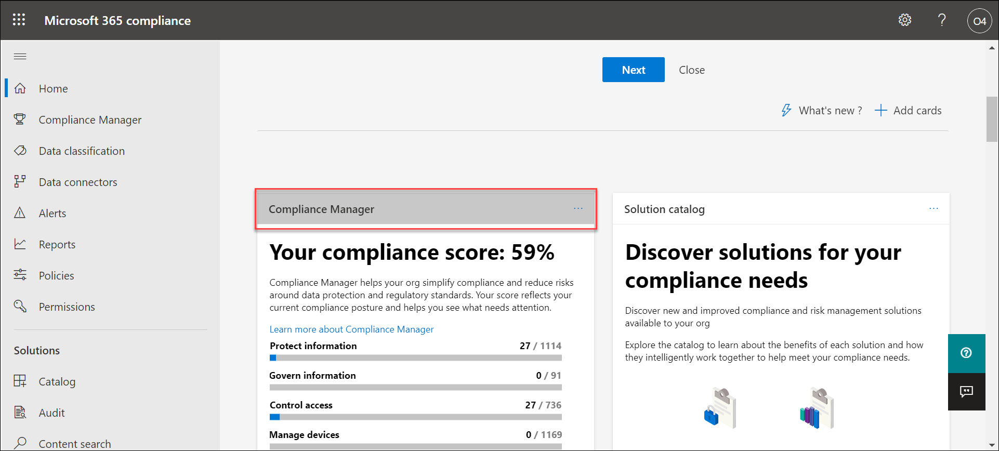
     
1. On the title bar of every card, you will also see an ellipsis that provides actions you can take.  Select the ellipses on the Solution catalog and select **Remove**.
    
     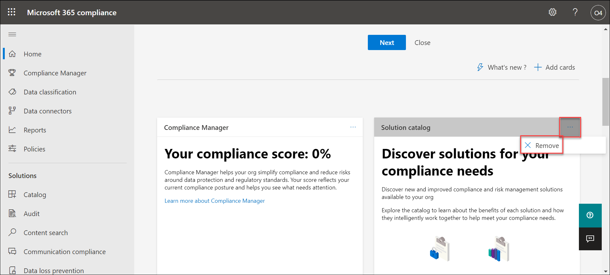
     
1. You can add cards, by selecting **+ Add cards**.  The Add cards to your home page window opens.  Place your mouse cursor over the Solution catalog card shown in this window and drag it over to the location on your home screen where you want the card to be positioned.

     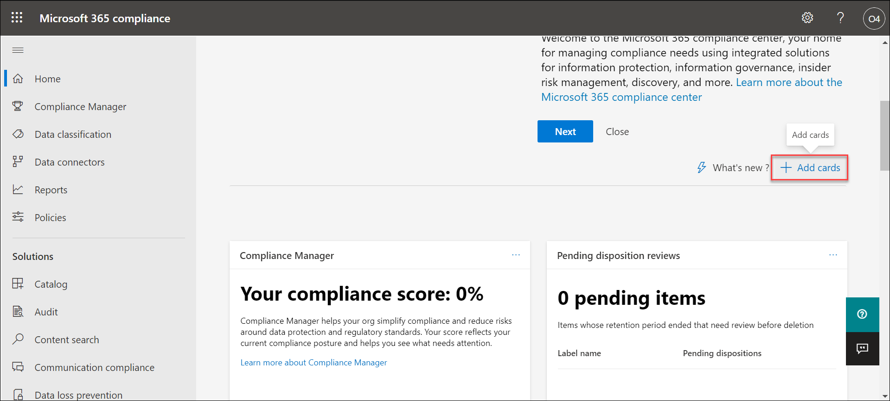
     
1. As the compliance admin, there may be a set of solutions that you manage for our organization and that you want to have always listed on the navigation panel.  To customize to your preferences select **Customize navigation**. 

     
     
1. From the Customize your navigation pane window, select **Audit**, **Data loss prevention** and **eDiscovery**.  Select **Save** on the bottom of the window.  Notice how the Solutions section of the navigation panel has been updated.

     
     
     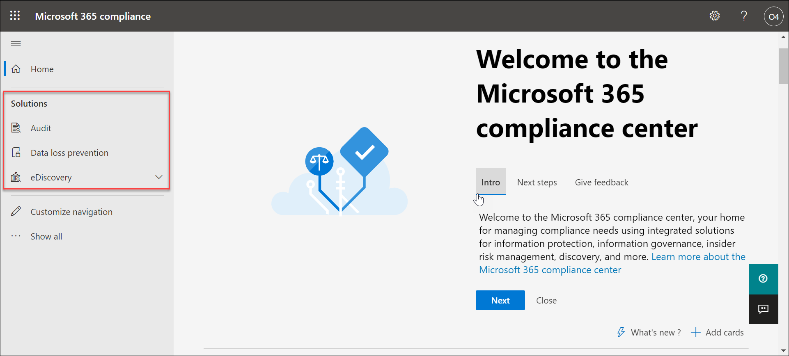
     
1. From the left navigation panel of the Microsoft 365 compliance center home page, notice that under Solutions only Catalog is displayed.  From the left navigation panel, select **...Show all**.  Notice how all the additional solutions appear under the solutions section.  

1. Select **Show less** to hide.
     
1. Leave the browser tab open.

#### Task 2: Learn about your organization’s compliance posture through Compliance Manager.

1. From the left navigation panel of the Microsoft Purview compliance center, select **Compliance Manager**.  Alternatively, you can select Compliance Manager on the title bar of the Compliance Manager card. Select **Show all** , if the options are not seen in the left navigation pane. 

1. If any pop-up appears, Please close it. From the top of the Compliance Manager page, ensure **Overview** is selected (underlined). Scroll down to see all the information available on the page.  Information on this page includes your compliance score, as a percentage and based on your points achieved and Microsoft managed points achieved.   You will see Key improvement actions, Solutions that effect your score and compliance score breakdown by categories or assessments.

     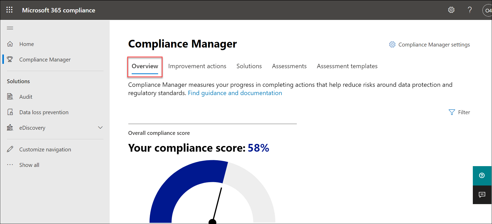

**Note**- If the Compliance Score is shown as zero percentage, try refreshing the page or sign-out and sign-in again.

1. From the top of the Overview page, select **Improvement actions**.  These are actions that can improve the organization’s compliance score, points may take up to 24 hours to update.  Notice the available filters.

     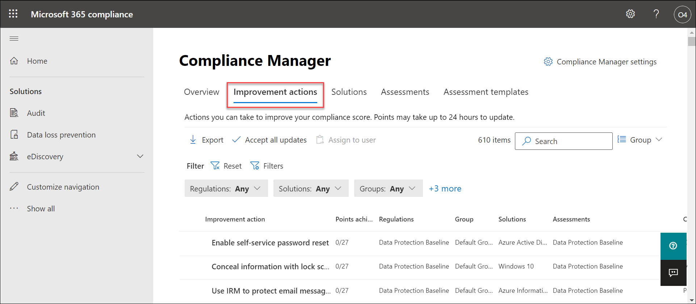

1. From the list of improvement actions, select **Enable self-service password reset**.  Each improvement action has an overview section along with the details page from which you can select implementation, testing, the related standards and regulatory requirements, and documents.

     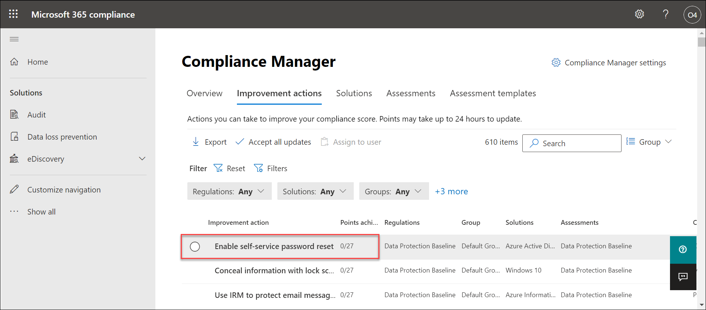

1. Exit out of this improvement action by selecting the **X** on the top right corner of the screen.  Alternatively, you select **Improvement Actions** from the breadcrumb on the top left of the page.  You are now back on the improvement actions page.

     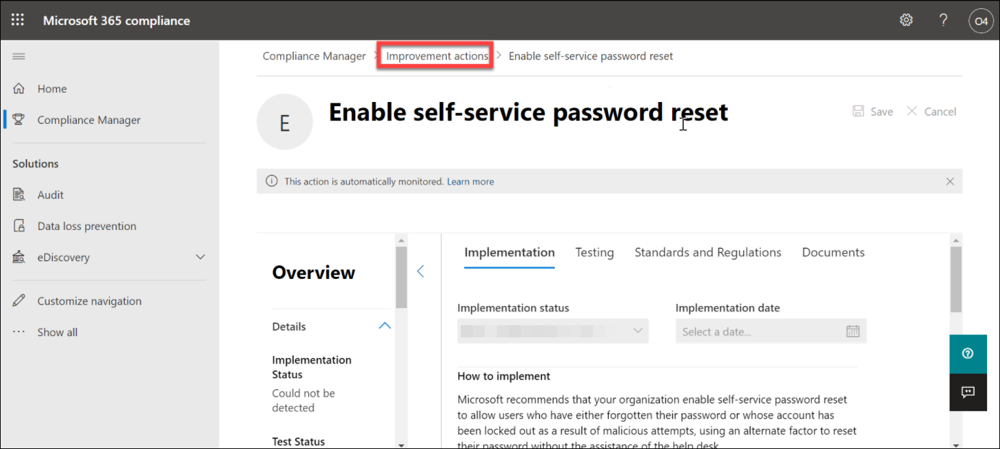

1. From the top of the page, select **Solutions**. On this page you will see how solutions contribute to your score and their remaining opportunity for improvement.

     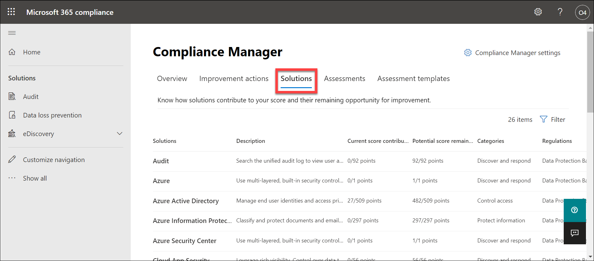

1. From the top of the page, select **Assessments**. On this page you will see the Data Protection Baseline.  This is a default assessment Microsoft provides in Compliance Manager for the Microsoft 365 data protection baseline.  This baseline assessment has a set of controls for key regulations and standards for data protection and general data governance. Compliance Manager becomes more helpful as you build and manage your own assessments to meet your organization's particular needs.

     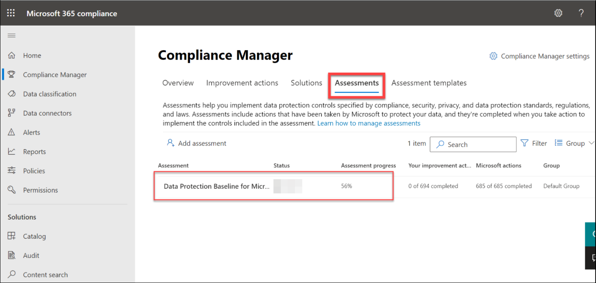

1. Select **Data Protection Baseline**.  Notice the information available on the progress tab.  You can also view status of controls for this assessment, your improvement actions, Microsoft actions.

     

1. From the top left of the page, above where it says Assessments (the breadcrumb), select **Assessment** to return to the assessments page.  

     

1. From the top of the page, select **Assessment templates**.  This page lists the available templates. You can create assessments for your organization by using an existing template or you can create a new template.

     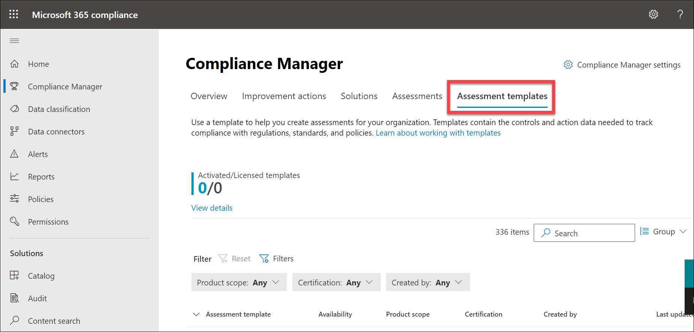
 
1. From the included templates list, select **ISO/IEC 27001:2013** (**Note:-** Search the template in the filter by pasting the name and then press enter in keyboard) From the top right of the page, select **+ Create assessment**.  Notice on the left side of the screen that there are only two steps to create an assessment from the template.  Select Cancel from the bottom of the page.

     
     
     
     
     

1. Close the open browser tabs.

#### Review
In this lab you explored the Microsoft Purview compliance center home page and ways in which the capabilities of Compliance manager can help organizations improve their compliance posture.
