# Lab-13: Explore sensitivity labels in Microsoft Purview

## Lab scenario
In this lab you will explore the capabilities of sensitivity labels.  You will go through the settings for existing sensitivity labels that have been created and the corresponding policy to publish the label.   Then you will see how to apply a label and the impact of that label, from the perspective of a user.

#### Task 1: In this task you will gain an understanding of what sensitivity labels can do by going through the settings for an existing sensitivity label that have been created and the corresponding policy to publish the label.

1.	Open Microsoft Edge. In the address bar enter **admin.microsoft.com**.

      

1. Sign in with your admin credentials.
    1. In the Sign in window, Get the user credentials provided in the environment details page and paste the value in the username section and then select **Next**.
     
        
     
        
    
    1. Enter the admin password which should be provided by your lab hosting provider. Select **Sign in**.
    
        
     
    1. When prompted to protect the account, Please select **Skip for now**.

        
        
    1. When prompted to Action Required, Please select **Ask later**

                  
     
    1. When prompted to stay signed- in, select **Yes**. This takes you to the Microsoft 365 admin center page.

1. From the left navigation pane of the Microsoft 365 admin center, select **Show all**.

    

1. Under Admin centers, select **Compliance**.  A new browser page opens to the welcome page of the Microsoft Purview.  

    
    
    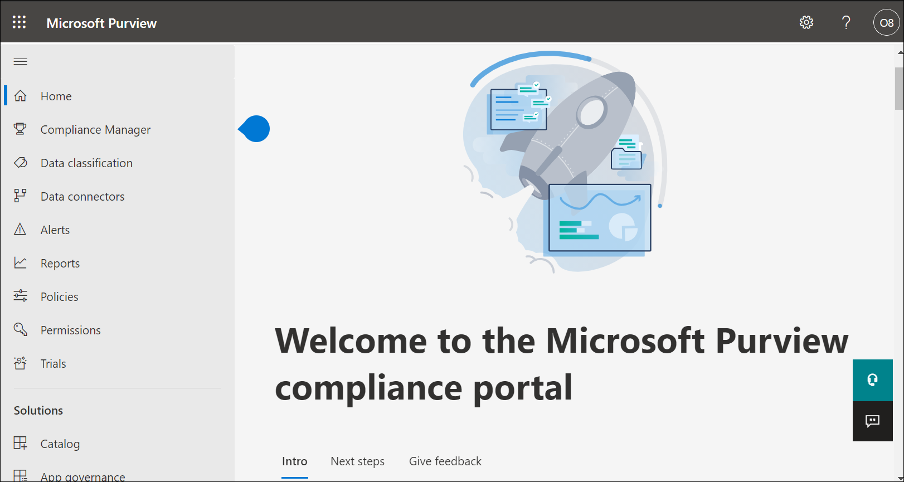

1. From the left navigation panel of the Microsoft Purview, under solutions expand **Information protection** then select **Overview**.

1. In the yellow information box, indicates that Your organization has not turned on the ability to process content in Office online files that have encrypted sensitivity labels applied and are stored in OneDrive and SharePoint.  Select **Turn on now**.  Once you do this, there can be a delay for the setting to propagate through the system.

    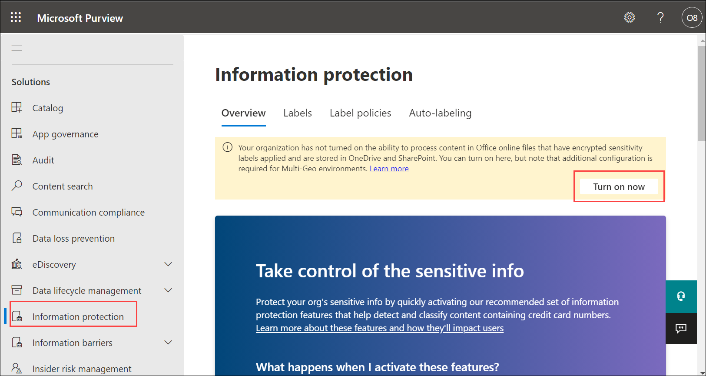

1. Now select the **Labels** tab from the dropdown and then select **Create a label**

    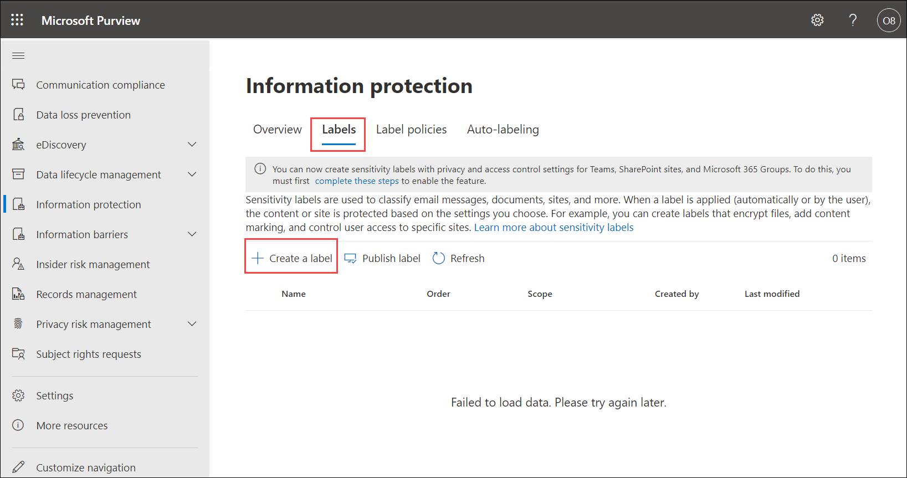

1. Configuration starts provide a name and description for your label. Select **Next** at the bottom of the page.

    | Setting | Action |
    | -- | -- |
    | **Name** text box | Enter **Confidential-Finance** |
    | **Display name** text box | Enter **Confidential-Finance** |
    | **Description for users** text box | Enter **Confidential-Finance Demo | 

    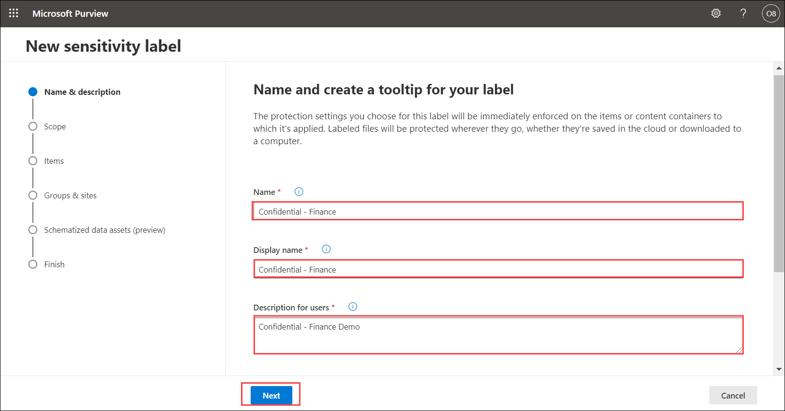

1. Note the scope for this label.  The scope is set to **Items**.  Read the description but don’t change anything.  Select **Next** at the bottom of the page.

      

1. On the Choose protection settings for labeled items select the **Apply or remove encryption** and **Apply content marking**, then select **Next**.

    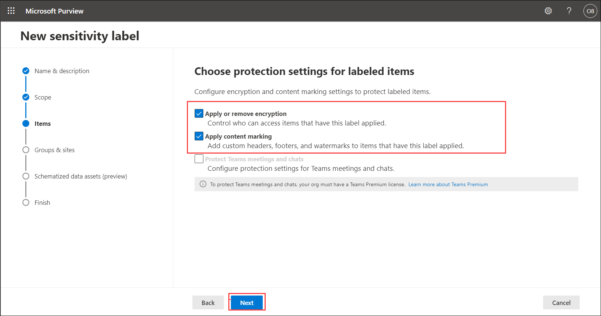
    
1. The Encryption window shows the configuration for the encryption settings. Review the information box under Configure encryption settings and review the configured settings. Notice how the user access to content is set to never expire.  You can also assign permissions to specific users and groups By clicking on the **Assign permission**.
    
    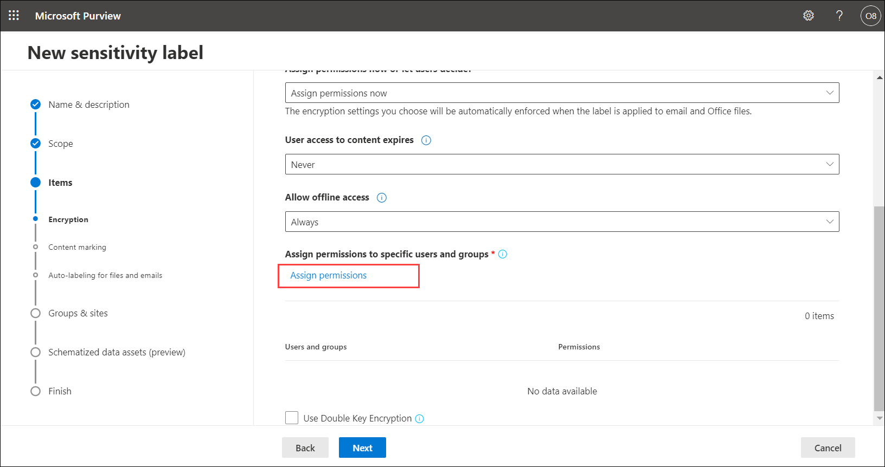
  
1. Click on **+Add Users or Groups**, select your **user name**  and **Megan Bowen** and click on **Add** then back to Assign permission page, Click on **Save**.and so only they can interact with content that has this label applied.  Under users and groups, the tenant is defined so all users in your tenant can view content that has this label.  The finance team is also listed and they have co-author permissions.  Don’t change any settings.  Select **Next** on the bottom of the page.

      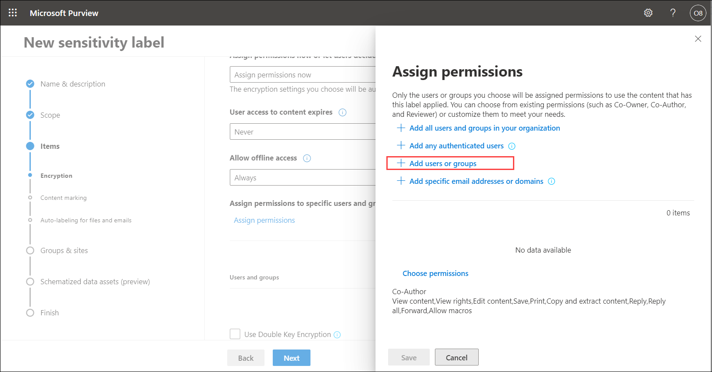
      
      
      
      
      
      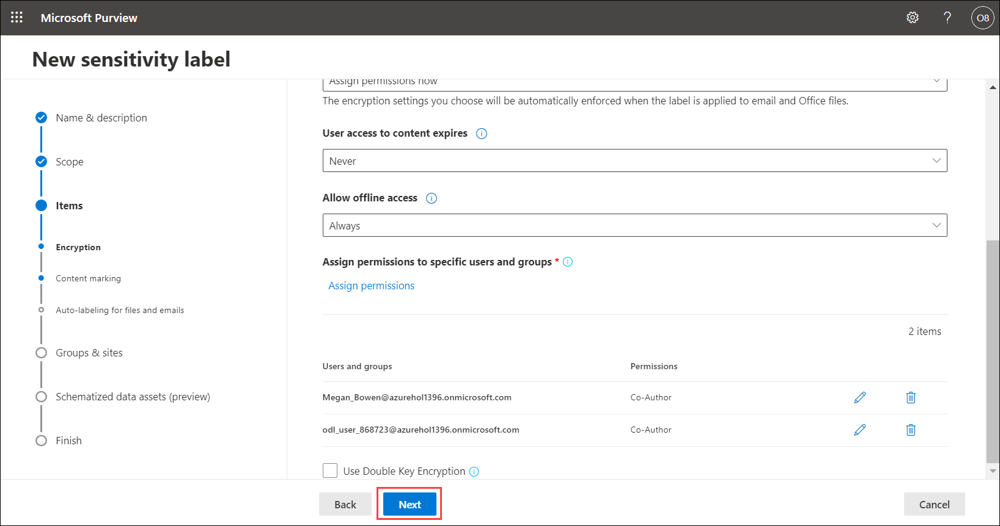
      

1. On the content markings page, take note of the information box on the top of the page. Turn on the Content Making and select **Add a watermark**, **Add a header**, & **Add a footer**, and click on **Customize text** on each and provide the text to it and click on **Save**.  Content markings will be applied to documents but only headers and footers will be applied to email messages. In other words, watermarks are not applied to emails.  The content marking associated with this label is a watermark. Select **Next** on the bottom of the page.

      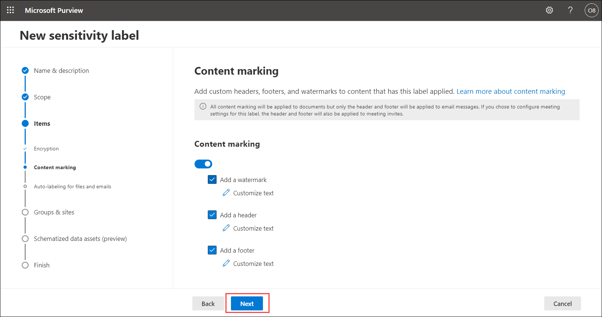

1. You are now in the Auto-labeling for files and emails window. Turn on the **Auto-labeling for files and emails** and Read the description of auto-labeling on the top of the page and the information box below it. Select **Next** on the bottom of the page.

      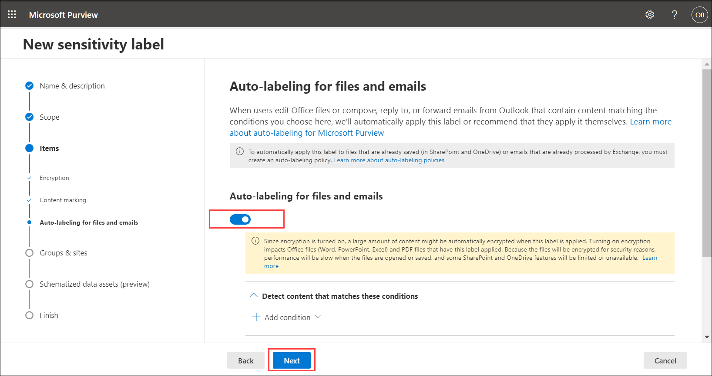

1. This next window defines protection settings for groups, and sites that have this label applied. This is not enabled, select **Next** on the bottom of the page.

      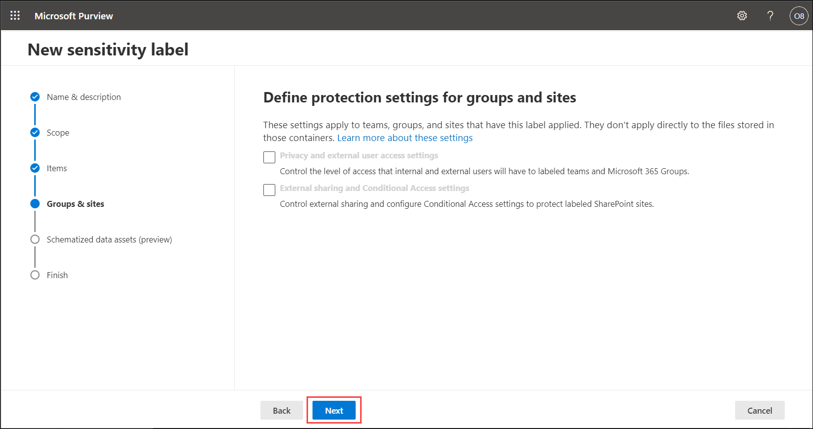

1. This next window is a preview feature to automatically apply this label to Azure database columns (such as SQL, Synapse, and more) that contain the sensitive info types you choose.  This features is not enabled. Select **Next** on the bottom of the page.

      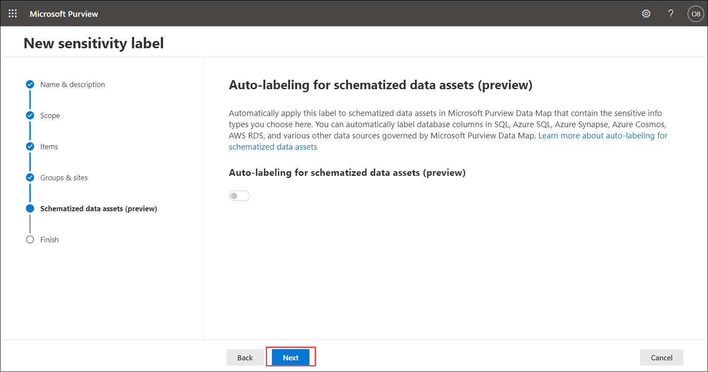
       
      
1.  Review the settings and click on **Create label**.

      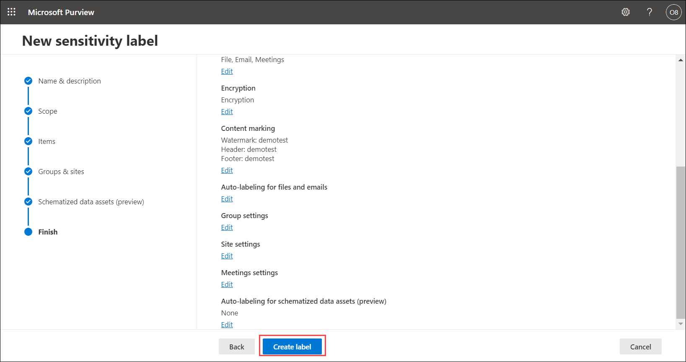
      
1. Click on **Done** on next window.   

      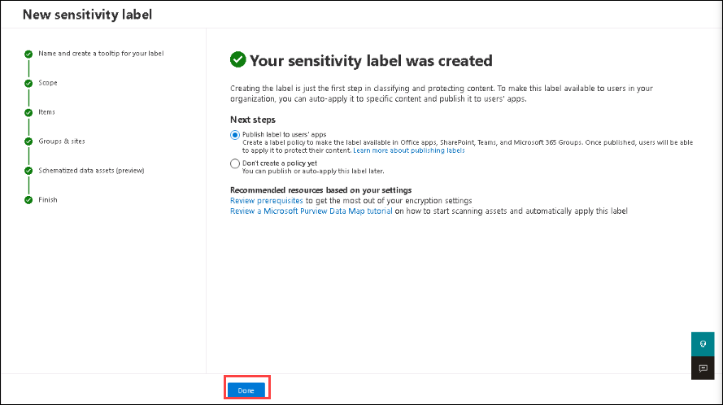
      
1. Click on **Publish label** from the **Label** Window.

           
    
1. Select **Choose sensitivity labels to publish**. A window opens that provides information about the policy. This policy serves to publish the IT-Department-Demo. Select **Confidential-Finance** from label and select **Add** on the bottom of the page. And then click on **Next**.

     
     
1. Under the Sensitivity labels to publish.  Don’t change any settings.  Select **Next** on the bottom of the page.

     
     
1. Click on **Next** on Assign Admin Units(Preview). 

     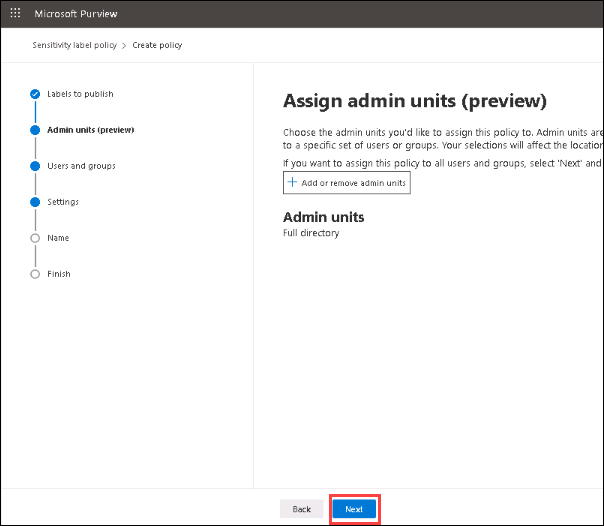   

1. Read the description under “Publish to users and groups”.  Notice the this label is available to all users.  Don’t change any settings.  Select **Next** on the bottom of the page.

    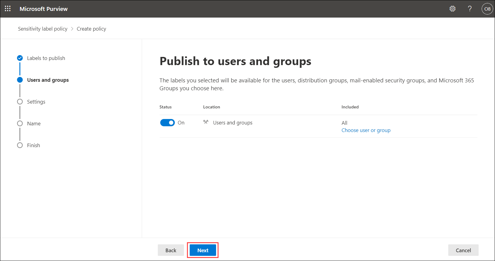

1. Under the policy settings.  Don’t change any settings.  Select **Next** on the bottom of the page.

    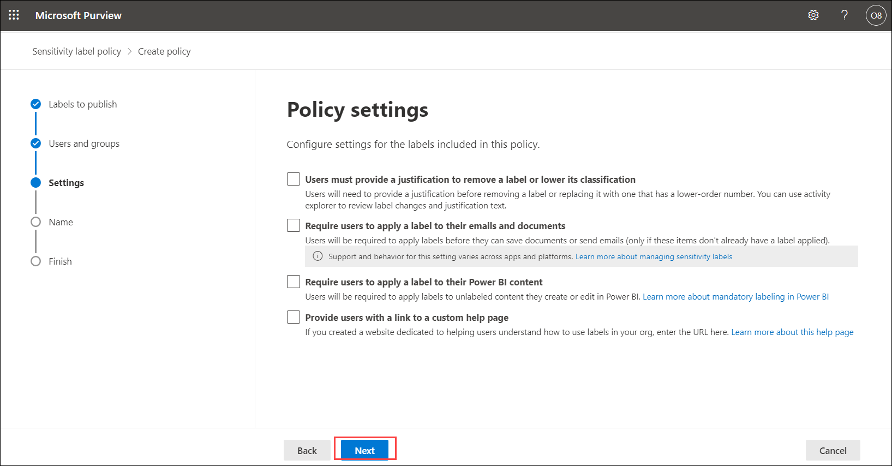

1. Under the **Apply a Default label to documents**.  Don’t change any settings.  Select **Next** on the bottom of the page.

    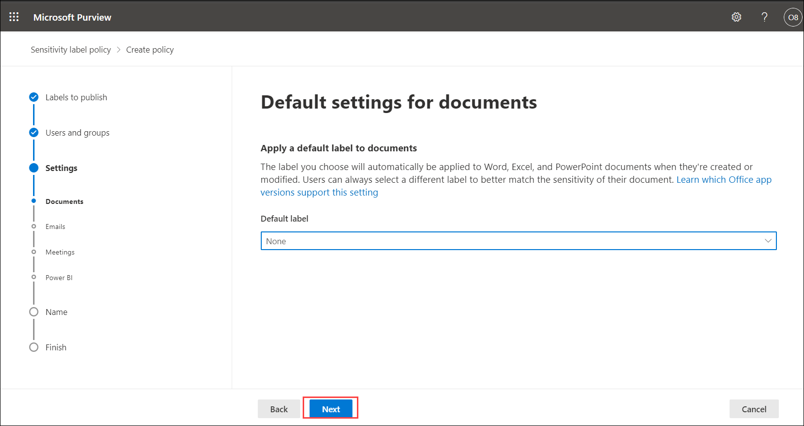
1. Under the **Apply a Default label to emails**.  Don’t change any settings.  Select **Next** on the bottom of the page.

    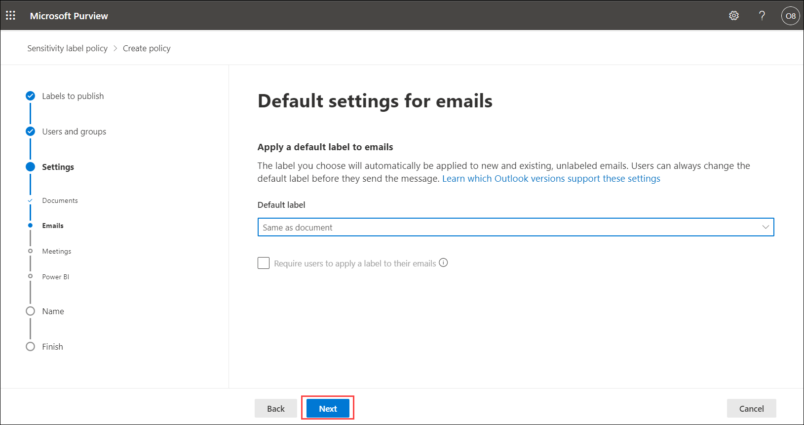
    
1. Under the **Apply a default label to meetings and calendar events**.  Don’t change any settings.  Select **Next** on the bottom of the page.    

    
    
1. Under the **Apply a default label to Power BI content**.  Don’t change any settings.  Select **Next** on the bottom of the page.

    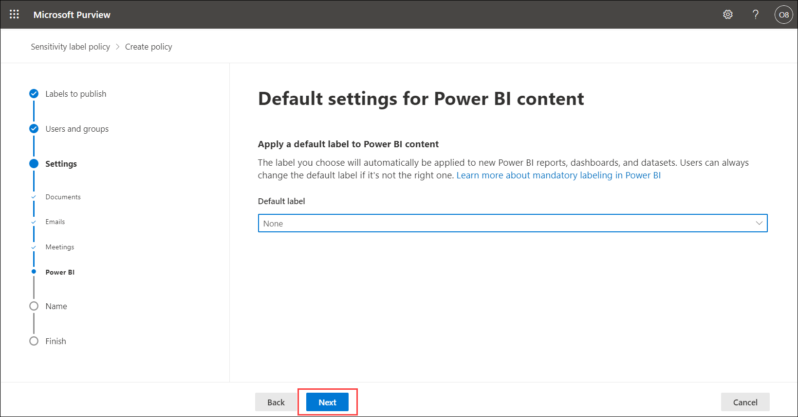
    
1. The last configuration option is to name your policy. Enter the policy name as **Confidential-Finance Policy**.  Select **Next** on the bottom of the page to exit the policy configuration and return to the Information protection page.

    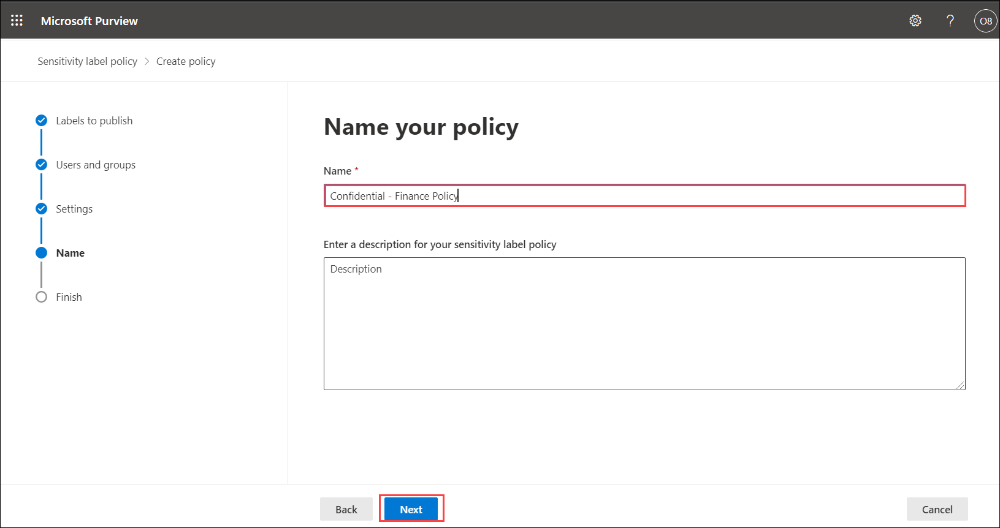
    
1. Review the settings and click on **Submit** and then select **Done**.

    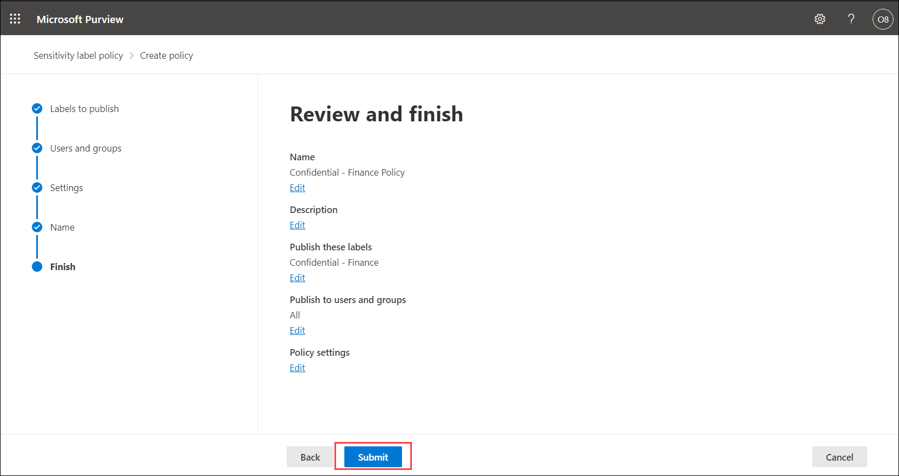
    
        
    
**Note**- The label created cannot be deleted, it can only be edited. 

1. From the left navigation panel, select Home to return to the Microsoft Purview.

1. Keep this page open, you will use it in the next task.

1. It can take up to 24 hours to publish the labels to the selected users apps

#### Task 2:  In this task, you will go through the process of applying a label from the perspective of the user (in this case the user is the admin) and view the content marking that is generated by the label.

1. From the Microsoft Purview home page, select the **app launcher icon**, and **right click on the Word icon** and select **Open in new tab**. 

       

1. Select **+ New blank document**, then enter some text on the page.  On the blue bar on the top of the page, select the down-arrow, next to where it says DocumentXX - Saved, and in the File Name box enter, **Test-label**.

1. From the top menu bar, select **Sensitivity**.(**Note**: If the option is not available, it will take sometime to reflect Alternatively try refreshing the page or sign-out and sign-in again) From the drop down select **Confidential - Finance-Demo**.

            

1. From the top menu bar, select **View**, then select **Reading view**.

      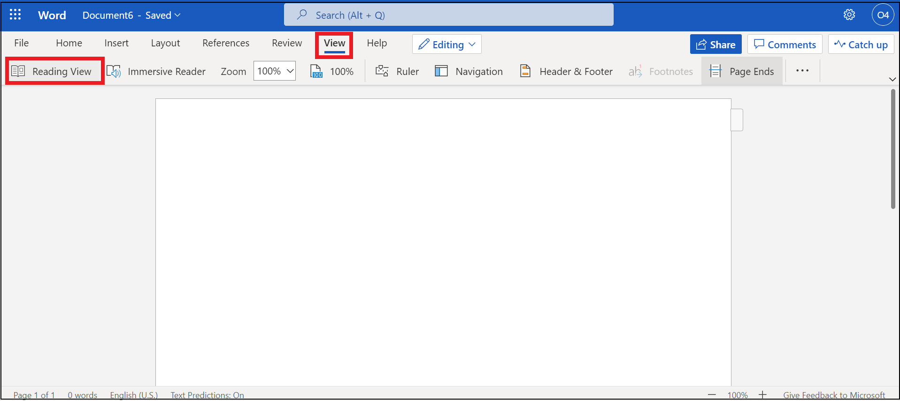            

1. Notice how the document includes the watermark.  

1. Close the Microsoft Word tabs that are open on your browser to exit from Word.

#### Task 3 (optional): In addition to content marking, the label protection setting was set for encryption. Per the permissions that were configured with this label, members of the finance group can co-author documents with this label applied and users in the Contoso tenant can view (or any document/email with the label applied).  In this task you will send this document to an email address to which you have access (ie., a personal email address) and that is NOT part of the WWLxZZZZ.OnMicrosoft.com domain and see what happens when you try to open the attachment.  

1. From the Microsoft Purview home page, select the **app launcher icon**, and **right click on the Outlook icon** and select **Open in new tab**.

      

1. Select **New message** from the top left corner of the screen.  Enter an email address to which you have access and is not part of the WWLxZZZZ.OnMicrosoft.com domain and enter **Test** in the subject line.

1. Select **Attach**.

1. Select **Browse cloud locations**.

1. From the list that shows up, select the document you created and to which you applied the label **Test-label**. Select **Next** and select **Attach as a copy**.  Press **Send**.

1. Check the email to which you sent the document.  Note, the email may be directed to your junk folder.  When you attempt to open the attached word file you will see a notification that you do not have permission to open the document.

1. Close the open browser tabs.

#### Review
In this lab you will explore the capabilities of sensitivity labels.  You will go through the settings for existing sensitivity labels that had already been created and the corresponding policy to publish the label.   Then you will see how to apply a label and the impact of that label, from the perspective of a user.
