# Lab: Explore sensitivity labels in Microsoft 365

## Lab scenario
In this lab you will explore the capabilities of sensitivity labels.  You will go through the settings for existing sensitivity labels that have been created and the corresponding policy to publish the label.   Then you will see how to apply a label and the impact of that label, from the perspective of a user.

**Estimated Time**: 20-25 minutes

#### Task 1: In this task you will gain an understanding of what sensitivity labels can do by going through the settings for an existing sensitivity label that have been created and the corresponding policy to publish the label.

1.	Open Microsoft Edge. In the address bar enter **admin.microsoft.com**.

      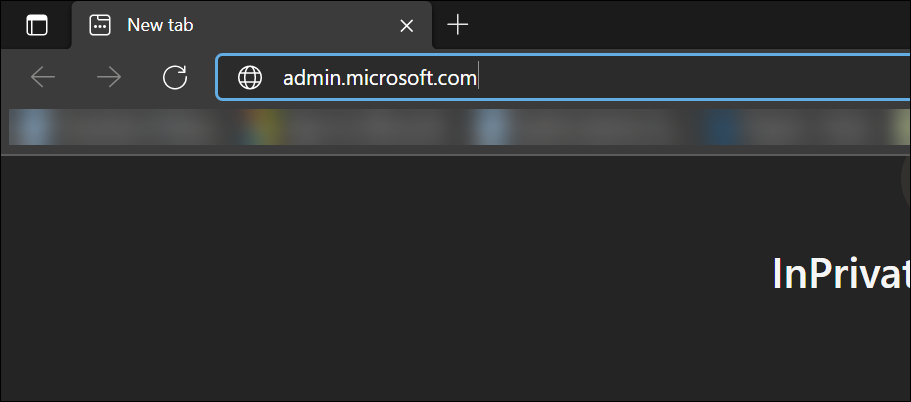

1. Sign in with your admin credentials.
    1. In the Sign in window, Get the user credentials provided in the environment details page and paste the value in the username section and then select **Next**.
     
        
     
        
    
    1. Enter the admin password which should be provided by your lab hosting provider. Select **Sign in**.
    
        
     
    1. When prompted to protect the account, Please select **Skip for now**.

        
     
    1. When prompted to stay signed- in, select **Yes**. This takes you to the Microsoft 365 admin center page.

1. From the left navigation pane of the Microsoft 365 admin center, select **Show all**.

    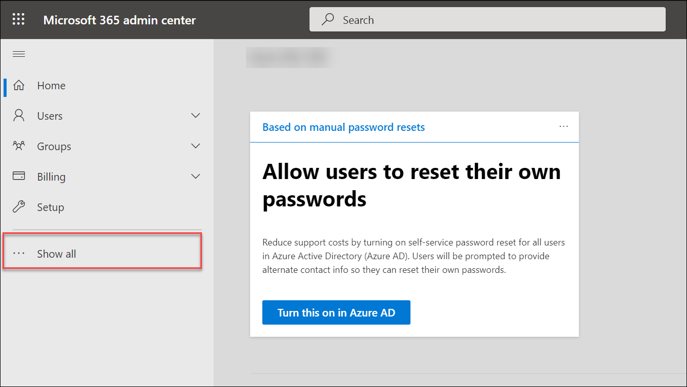

1. Under Admin centers, select **Compliance**.  A new browser page opens to the welcome page of the Microsoft 365 compliance center.  

    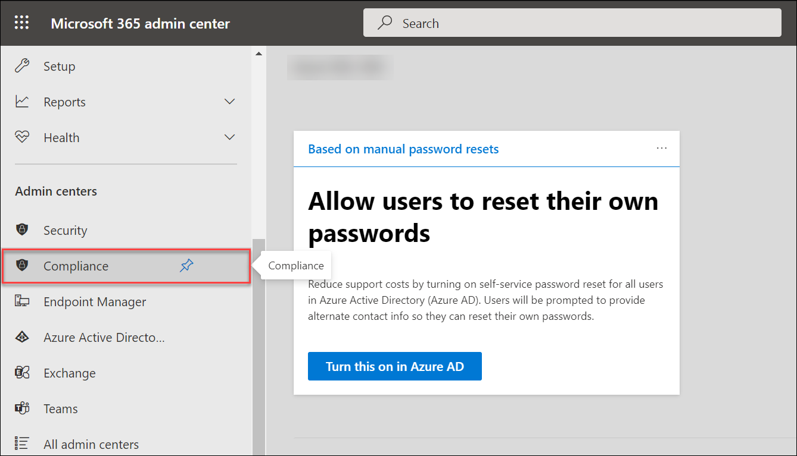
    
    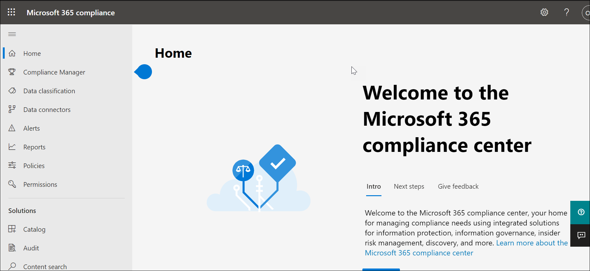

1. From the left navigation panel of the Microsoft 365 compliance center, under Solutions, select **Information protection**.

1. In the yellow information box, indicates that Your organization has not turned on the ability to process content in Office online files that have encrypted sensitivity labels applied and are stored in OneDrive and SharePoint.  Select Turn on now.  Once you do this, there can be a delay for the setting to propagate through the system.

    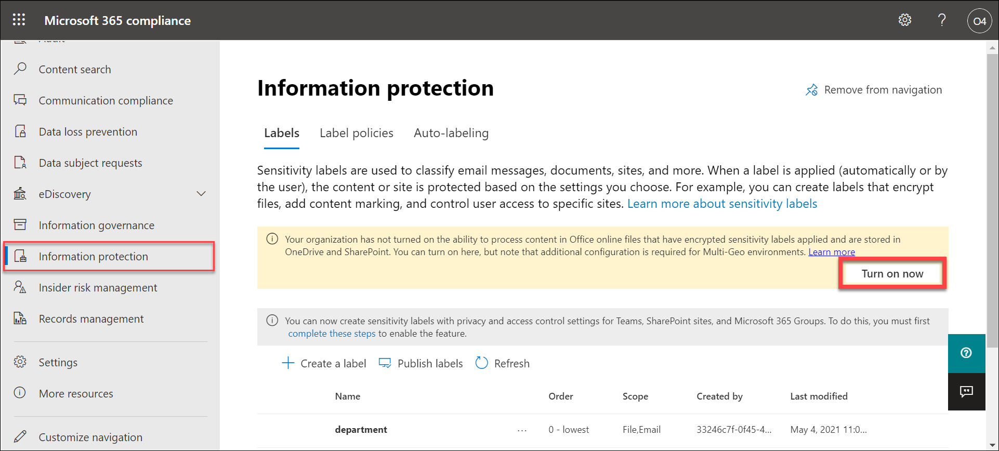

1. Verify you that the **Labels** tab on the top of the page is selected (underlined). Now select **Create a label**

    

1. Configuration starts with providing a name and description for your label.  Don’t change anything.  Select **Next** at the bottom of the page.

    

1. Note the scope for this label.  The scope is set to Files & emails to which you can configure Encryption and content marking settings to protect labeled emails and office files.  Don’t change anything.  Select **Next** at the bottom of the page.

    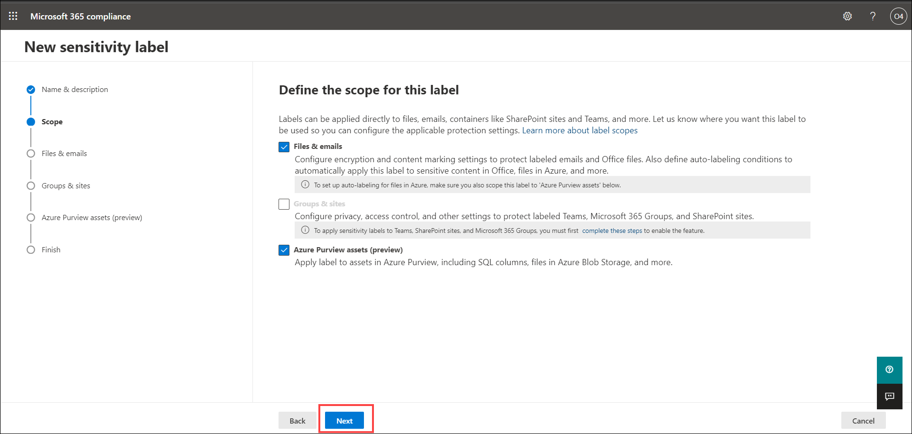

1. For the selected scope, Files & emails, you can configure to encrypt and/or mark the content.  Note how the protection settings for files and emails is set for both encryption and marking the content of files.  Review the definition of each.  Don’t change anything.  Select **Next** at the bottom of the page.

    

1. You are now in the Auto-labeling for files and emails window.  Read the description of auto-labeling on the top of the page and the information box below it.  Also take note that this label is set for auto-labeling for specific conditions. Don’t change any settings.  Select **Next** on the bottom of the page.

    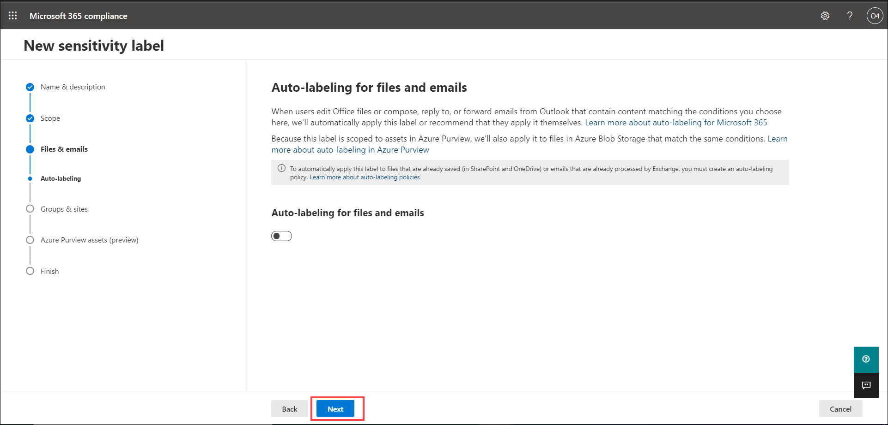

1. This next window defines protection settings for teams, groups, and sites that have this label applied. This is not enabled, select **Next** on the bottom of the page.

    

1. This next window is a preview feature to automatically apply this label to Azure database columns (such as SQL, Synapse, and more) that contain the sensitive info types you choose.  This features is not enabled. Select **Next** on the bottom of the page.

    
    
1.  Review the settings and click on **Create label**

    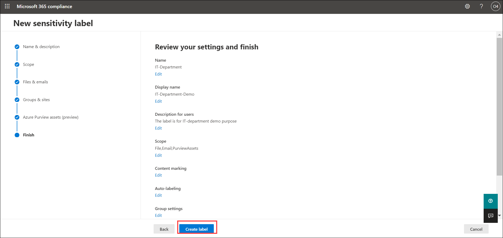

1. From the top of the Information protection page, select **Label policies**.  It is through label policies that sensitivity labels can be published.

    

1. Select **Confidential-Finance Policy**.  A window opens that provides information about the policy.  This policy serves to publish the Confidential-Finance Policy labels and protects data that contains financial data for Contoso.  Also note how this policy is published to all. 

1. Select **Edit** policy from the top of the window.

    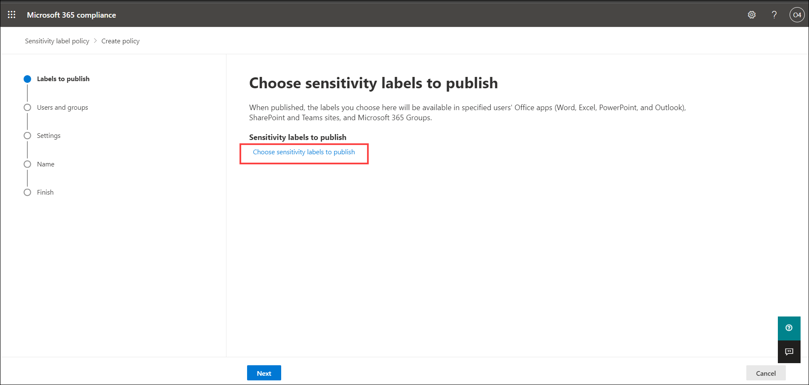

1. Read the description under “Choose sensitivity labels to publish”.  Notice the label that is listed.  Don’t change any settings.  Select **Next** on the bottom of the page.

    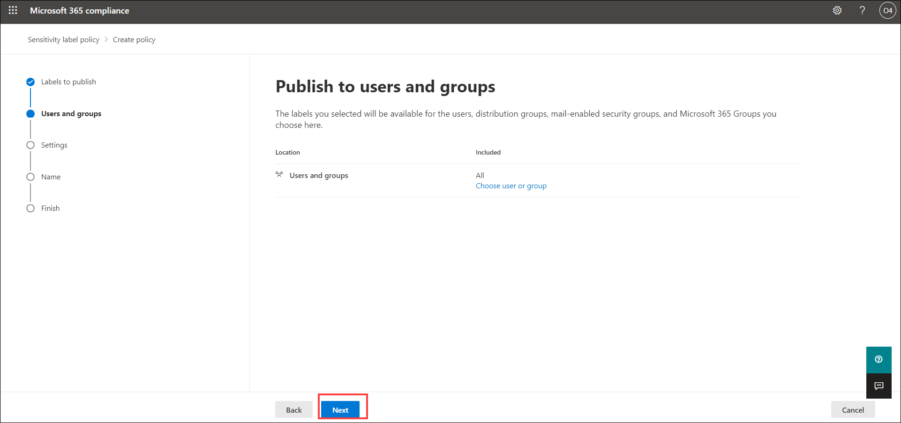

1. Read the description under “Publish to users and groups”.  Notice the this label is available to all users.  Don’t change any settings.  Select **Next** on the bottom of the page.

    

1. Review the policy settings.  Don’t change any settings.  Select **Next** on the bottom of the page.

    

1. The last configuration option is to name your policy.  Don’t change any settings.  Select **Cancel** on the bottom of the page to exit the policy configuration and return to the Information protection page.

    

1. From the Information protection page, select Auto-labeling.  Note there is no auto-labeling policy configured.  Don’t change any settings.  If you are wondering why there is no policy here, given that the label configuration is set to auto-labeling for files and emails, go back to the steps where you walked through the label configuration settings and review the description and information boxes associated Auto-labeling for files and emails.  Hint:  In the auto labeling tab for the sensitivity lab, it says.  "To automatically apply this label to files that are already saved (in SharePoint and OneDrive) or emails that are already processed by Exchange, you must create an auto-labeling policy."

    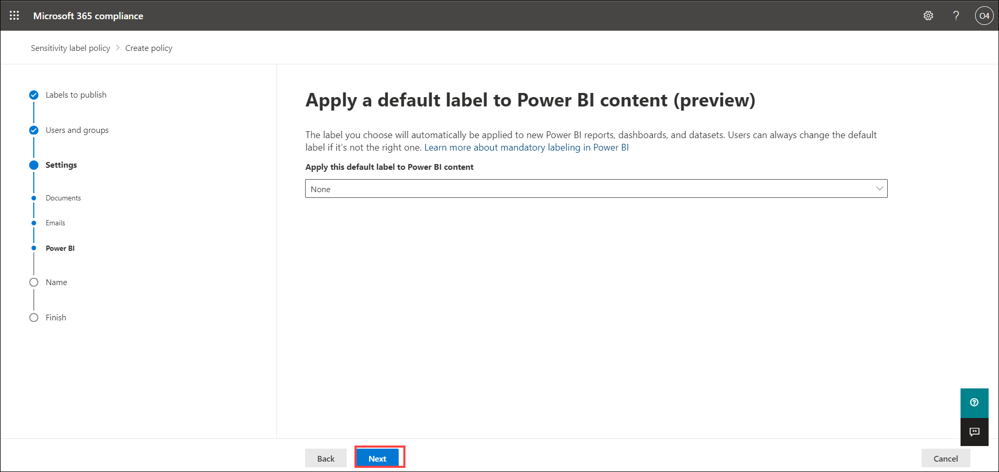

1. From the left navigation panel, select Home to return to the Microsoft 365 compliance center.

    

1. Keep this page open, you will use it in the next task.

#### Task 2:  In this task, you will go through the process of applying a label from the perspective of the user (in this case the user is the admin) and view the content marking that is generated by the label.

1. From the Microsoft 365 compliance center home page, select the **app launcher icon**, next to where it says Contoso Electronics. **right click on the Word icon** and select **Open in new tab**.  

1. Select **+ New blank document**, then enter some text on the page.  On the blue bar on the top of the page, select the down-arrow, next to where it says DocumentXX - Saved, and in the File Name box enter, **Test-label**.

1. From the top menu bar, select **Sensitivity**. From the drop down select **Confidential - Finance**. 

1. From the top menu bar, select **View**, then select **Reading view**.

1. Notice how the document includes the watermark.  

1. Close the Microsoft Word tabs that are open on your browser to exit from Word.

#### Task 3 (optional): In addition to content marking, the label protection setting was set for encryption. Per the permissions that were configured with this label, members of the finance group can co-author documents with this label applied and users in the Contoso tenant can view (or any document/email with the label applied).  In this task you will send this document to an email address to which you have access (ie., a personal email address) and that is NOT part of the WWLxZZZZ.OnMicrosoft.com domain and see what happens when you try to open the attachment.  

1. From the Microsoft 365 compliance center home page, select the **app launcher icon**, next to where it says Contoso Electronics. **right click on the Outlook icon** and select **Open in new tab**.

1. Select **New message** from the top left corner of the screen.  Enter an email address to which you have access and is not part of the WWLxZZZZ.OnMicrosoft.com domain and enter **Test** in the subject line.

1. Select **Attach**.

1. Select **Browse cloud locations**.

1. From the list that shows up, select the document you created and to which you applied the label **Test-label**. Select **Next** and select **Attach as a copy**.  Press **Send**.

1. Check the email to which you sent the document.  Note, the email may be directed to your junk folder.  When you attempt to open the attached word file you will see a notification that you do not have permission to open the document.

1. Close the open browser tabs.

#### Review
In this lab you will explore the capabilities of sensitivity labels.  You will go through the settings for existing sensitivity labels that had already been created and the corresponding policy to publish the label.   Then you will see how to apply a label and the impact of that label, from the perspective of a user.
