# Lab 14: Explore Insider Risk Management in Microsoft Purview

## Lab Overview
In this lab, you will walk through the process of setting up an insider risk policy, along with the basic prerequisites to configure and use insider risk management policies.  

>**Note:** This lab will only provide visibility into what is required for setting up Insider risk management and options associated with creating a policy.  This lab does not include a task to trigger the policy, as the number of events that would need to occur to trigger a policy is outside of the scope of this exercise.

## Lab Objectives

In this lab, you will complete the following tasks:

+ Task 1: Process of setting up an insider risk policy
+ Task 2: Enable the Audit log search capability
+ Task 3: Apply to all insider risk management policies
+ Task 4: Create policy

## Estimated timing: 60 Minutes

## Architecture diagram

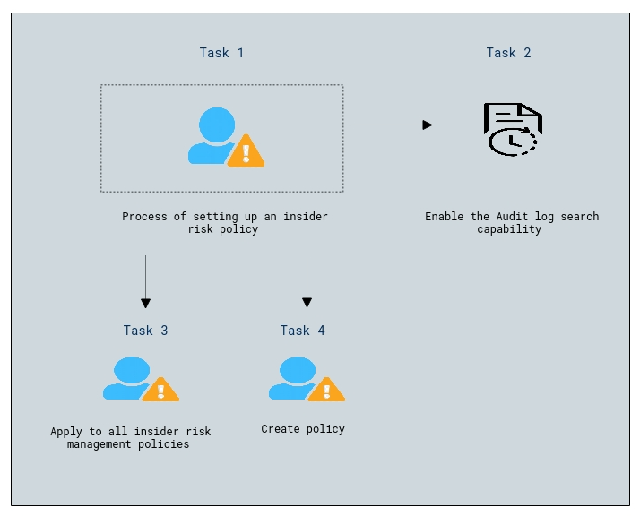

## Task 1: Process of setting up an insider risk policy
In this task, you, as the global administrator, will enable permissions for Insider Risk Management.  Specifically, you will add users to the Insider Risk Management role group to ensure that designated users can access and manage insider risk management features.  It may take up to 30 minutes for the role group permissions to apply to users across the organization. 

1. In the address bar of Microsoft edge enter **admin.microsoft.com**.

1. On the **Sign in** blade, you will see a login screen, in which you enter the following **email/username** and **password**. 
 
    * **Email/Username:** <inject key="AzureAdUserEmail"></inject>

    * **Password:** <inject key="AzureAdUserPassword"></inject>

1. When prompted to stay signed in, select **Yes**. This takes you to the Microsoft 365 admin center page.

1. From the left navigation pane of the Microsoft 365 admin center, select **Show all**.

    

1. Under **Admin centers (1)**, select **Microsoft Purview (2)**.

    

1. Upon logging in to the portal, a **Welcome to the new Microsoft Purview portal!** pop-up window will appear, select **Get started**.

    

1. You are now on the homepage of the New Microsoft Purview portal.

    

1. From the left navigation panel, select **Settings (1)**, expand **Roles and scopes (2)** and then select **Role groups (3)**.

    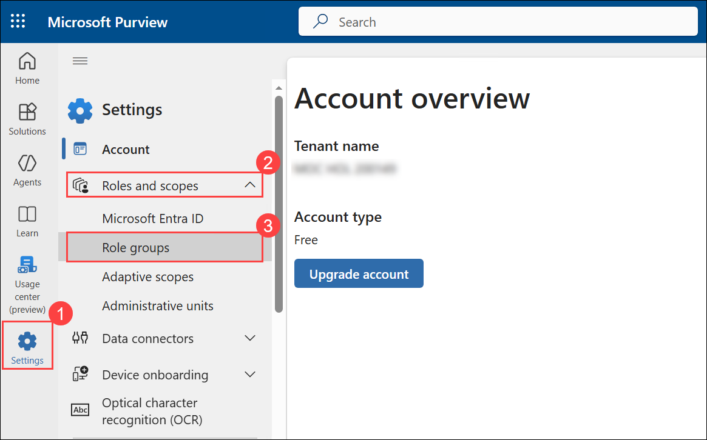

1. In the search field, on the top right of the page, type **Insider risk (1)** then hit Enter on your keyboard.  Notice the numerous roles that show up.  Each of these has different access levels.  Select **Insider Risk Management (2)** and review the description.

    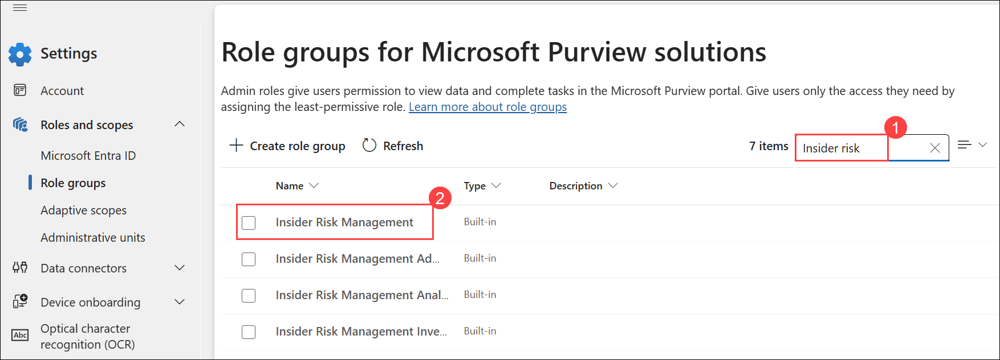

1. In the window that opens on the right, select **Edit**.
   
    .png)

1. To add members to this role group, select **Choose users (1)**. From the list of names, select  **ODL_User **<inject key="DeploymentId"></inject>** (2)** and **Megan Bowen (3)** and then click on **Select (4)** at the bottom of page. 

    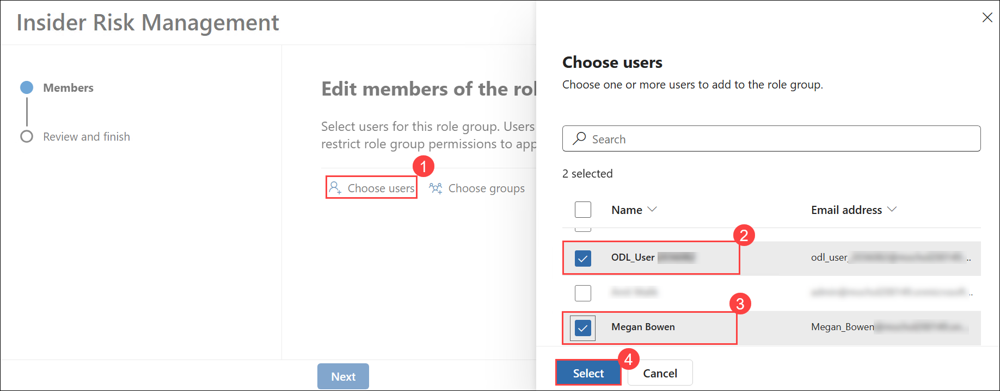

1. After the 2 users have been added, click on **Next**.

    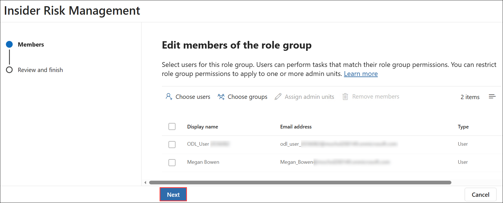

1. On the **Review the role group and finish** page, verify the added members are correct and then select **Save**.

    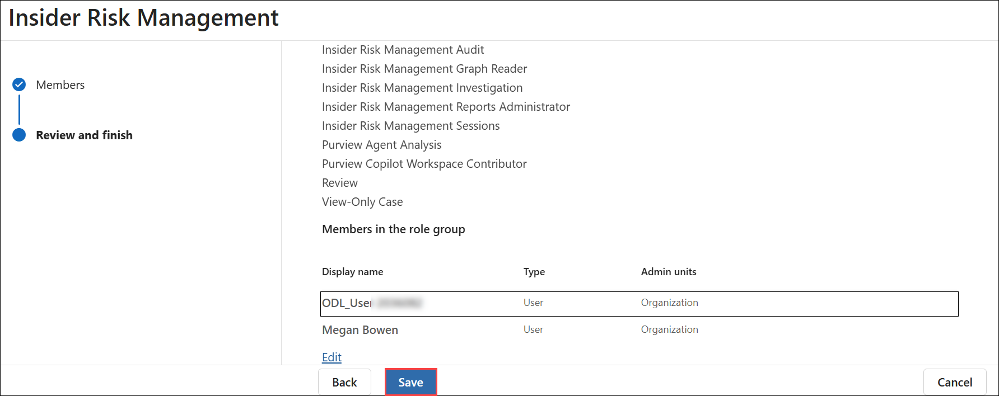

1. From the bottom of the Insider Risk Management page, select **Done**.

    

1. Please keep this tab open, as we will use it for upcoming tasks.

## Task-2: Enable the Audit log search capability (SKIP if you did the setup lab task to enable the audit log)
Insider risk management uses Microsoft 365 audit logs for user insights and activities identified in policies and analytics insights. In this task, you will enable the Audit log search capability. 
>**Note:** It may take several hours after you turn on audit log search before you can return results when you search the audit log.  Although it can take several hours before you can search the audit log, it will not impact the ability to complete other tasks in this lab.

1. In the left navigation pane select **Solutions (1)** and then **Audit (2)**.

   .png)
   
1. Once you land on the Audit page, wait 2-3 minutes.  If Auditing is NOT enabled, you will see a blue bar at the top of the page that says start recording user and admin activity.  Select **Start recording user and admin activity (1)**.  Once auditing is enabled, the blue bar disappears.  If the blue bar is not present, then auditing is already enabled, and no further action is required.

   .png)

1. When the pop-up appears, click **Yes**.

   

1. Return to the home page of the Microsoft 365 compliance center by selecting **Home** from the left navigation panel.

1. Keep this browser tab open, as you will use it in the next task.

## Task 3: Apply to all insider risk management policies
In this task, you will walk through the settings associated with the Insider Risk Management solution.  Insider risk management settings apply to all insider risk management policies, regardless of the template you choose when creating a policy. 

1. Select **Settings (1)** from the left navigation pane, then select **Insider Risk Management (2)**. Here you'll explore some of the available settings.

    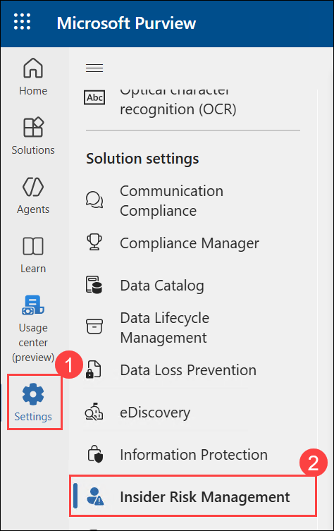
    
   i. **Privacy:**  for users who perform activities matching your insider risk policies, this setting will determine whether to show their actual names or use anonymized versions to mask their identities. For the purpose of this walk-through, you can leave the default setting.

      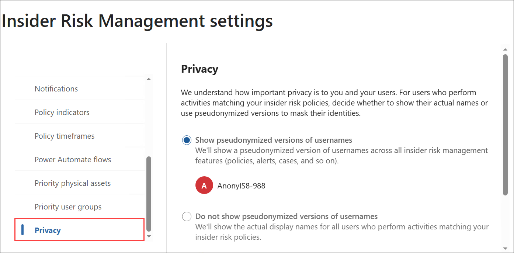
    
   ii. **Policy indicators:** Once a policy triggering event occurs, activities that map to the selected indicators are used in determining the risk score for the user. 
      Policy indicators selected here include the Insider risk policy templates.  Scroll to view all the indicators available and any associated information. Under 
      **Office indicators**, select **Select all (1)**, scroll down and then select **Save (2)**.

      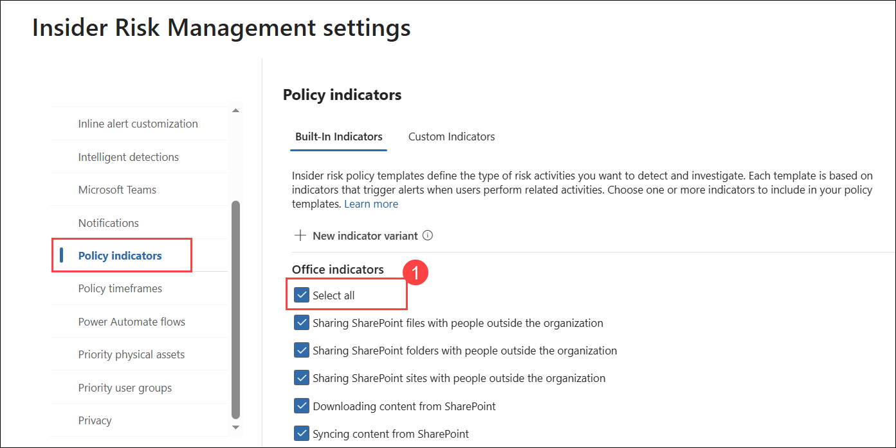

      .png)
   
   iii. **Policy timeframes:**  The timeframes you choose here go into effect for a user when they trigger a match for an insider risk policy.   The Activation window 
      determines how long policies will actively detect activity for users and is triggered when a user performs the first activity matching a policy. Past activity 
      detection determines how far back a policy should go to detect user activity and is triggered when a user performs the first activity matching a policy.  Leave the 
      default values.

      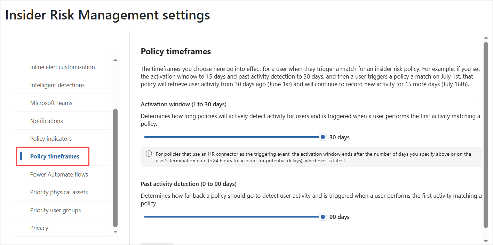
   
   iv. **Intelligent detections:**  Review the options here.  Note the domains' settings and how they relate to the indicators.

      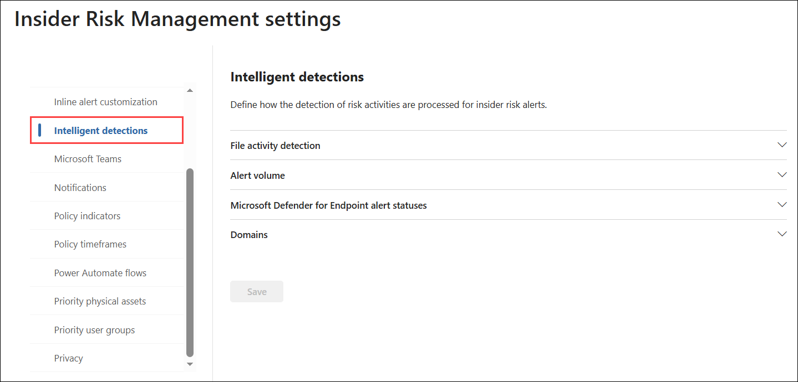
   
   v. Explore other items listed in the settings and note that many are in preview.

1. From the left navigation pane, select **Solutions (1)**, then select **Insider Risk Management (2)**.

    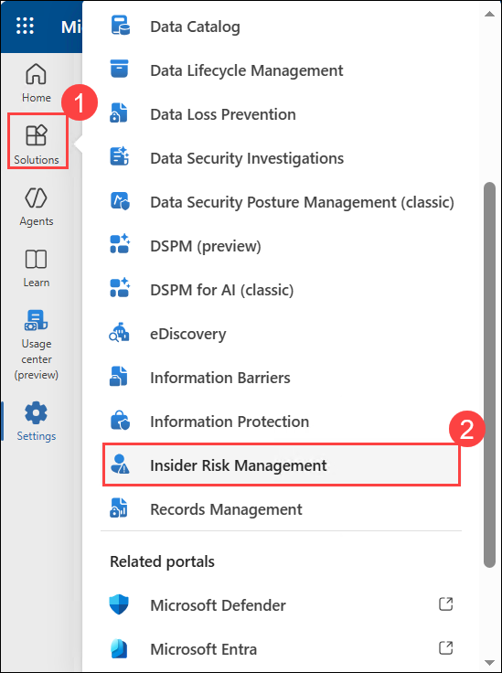

1. Keep this browser tab open, as you will use it in the next task.

## Task 3: Create policy
In this task, you will walk through the creation of a policy.

1. You should be on the overview page for Insider Risk Management.  If not already there, select **Solutions** from the left navigation pane, then select **Insider Risk Management**.

1. From the Insider risk management overview page, select the **Policies (1)** tab, then select **+ Create policy (2)** dropdown, then select **Custom policy (3)** from the list.  Configure each of the following policy tabs.

    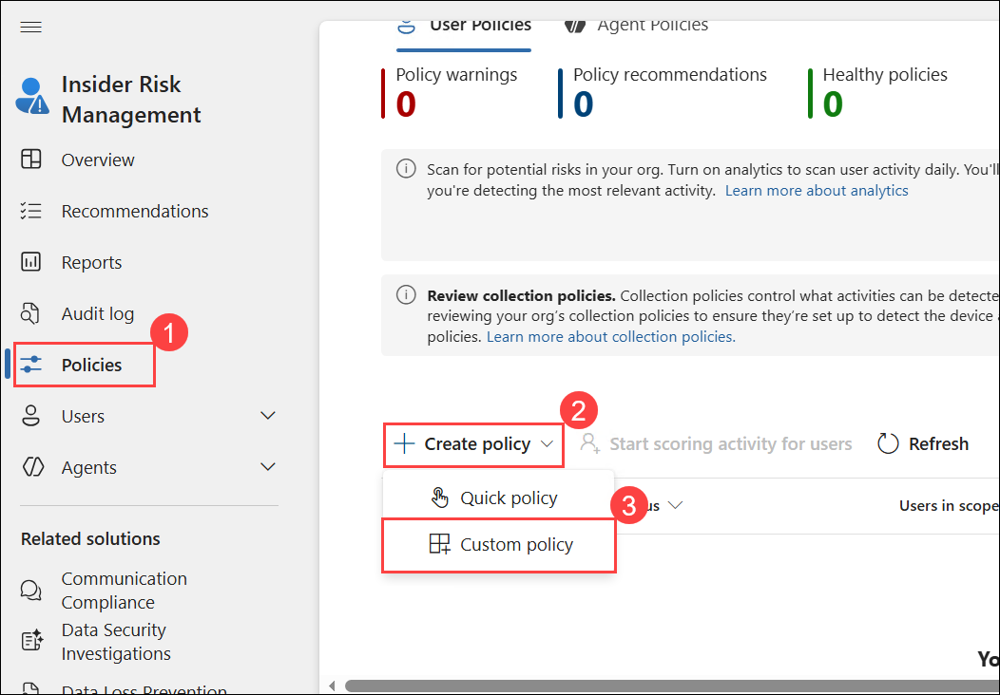

1. **Policy template:**  From the list of categories, select **Data leaks**. Read the details associated with this template, then select **Next**.

    
    
1. **Name and description:**  enter a name, **SC900-InsiderRiskPolicy (1)**, then select **Next (2)**.

    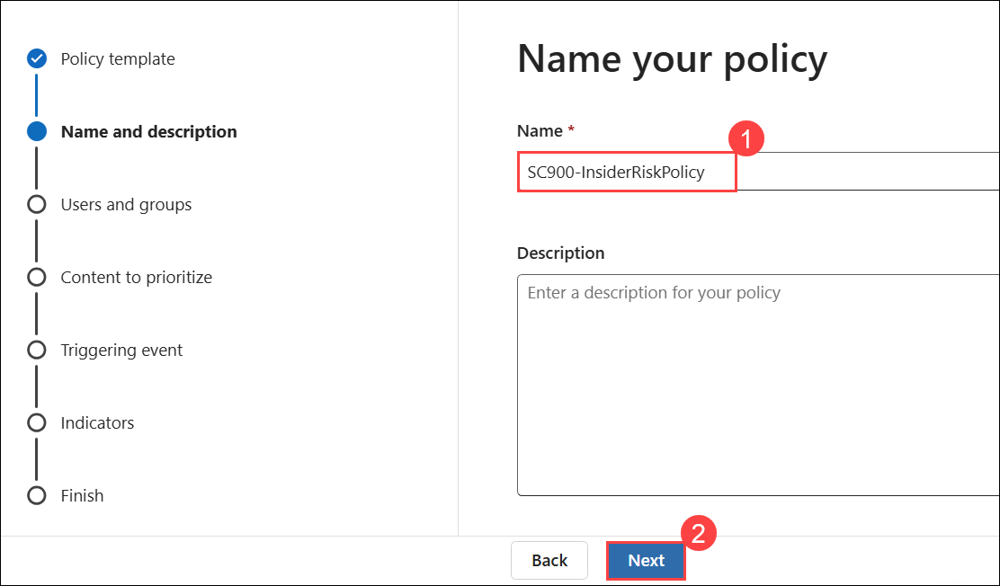
    
1. **Users and groups:**  Review the information box.  Leave the default setting, **All users, groups, and adaptive scopes**, and select **Next**.

    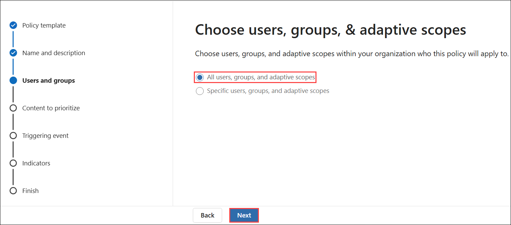

1. **Exclude users and groups (optional) (preview):** Here, we can choose users and groups to exclude from this policy. For now, we will skip this and click **Next**.

    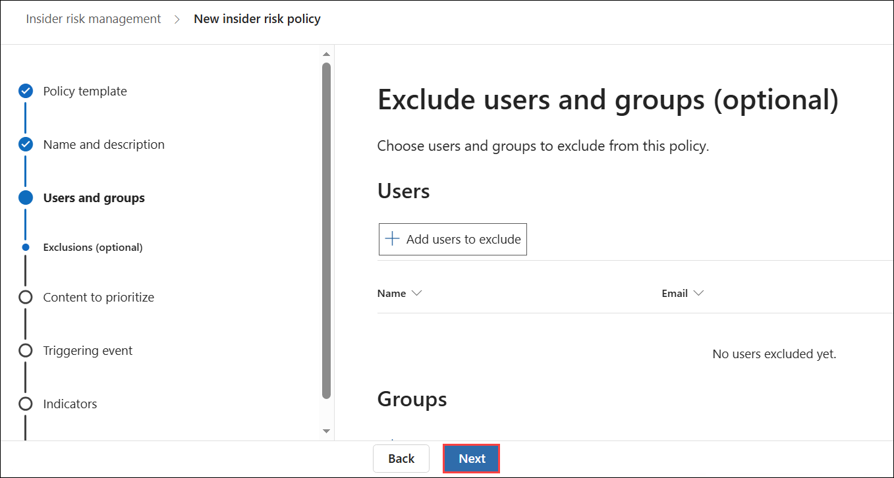

1. **Content to prioritize:** As per the description, Risk scores are increased for any activity that contains priority content, which in turn increases the chance of generating a high-severity alert. For simplicity, select **I don't want to prioritize content right now (1)**, then select **Next (2)**.

   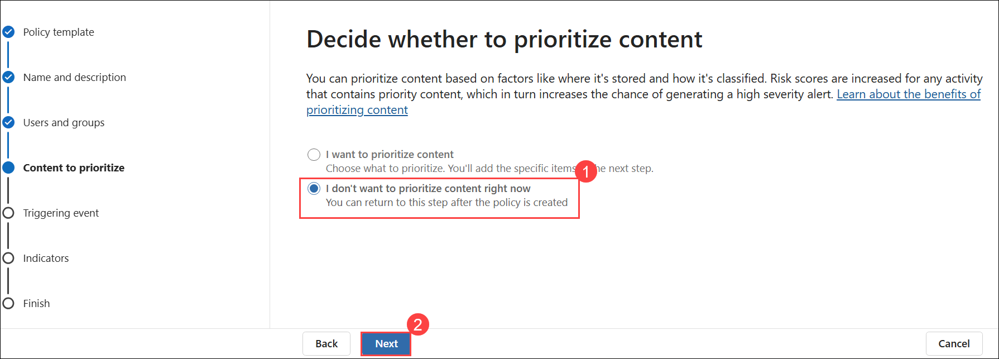
               
1. **Triggers:** Review the detailed information. The policy is triggered by either the user performing an exfiltration activity as defined (select the information icons for each bullet point for more detailed information) OR a match to an existing Data Loss Prevention (DLP) policy.  Since you don’t have any DLP policy configured as part of this exercise, select **User performs an exfiltration activity**.  Scroll down to see what is automatically selected.  Note that the policy indicators you enabled in the previous task are checked.   Recall that these indicators will only be activated once the policy is triggered, and any activities that map to these indicators will be used in calculating a risk score for the user.  In addition, Sequence detection is enabled.  If a sequence of activities, as defined, is detected, then it suggests greater risk.  Select the information icon for detailed information on which indicators are required.  This selection requires that certain indicators be selected and that devices be onboarded. Scroll down and leave the defaults and click **Next**

   

   >**Note:** If you don't see the indicators, Click on **Turn on indicators** and **Turn on all indicators** then click on **Save**. 
        
1. **Triggering Thresholds:** Here, you can specify default or custom thresholds associated with the indicators.  Recall that  the indicators are activated only after the policy trigger occurs, so these thresholds do not influence when the policy is triggered. Select **Choose your own thresholds (1)**. By selecting this option, you can see the current default values. Leave the defaults and select **Next (2)**.

    
    
1. **Indicators:** Expand **Office indicators**. Note how the Office indicators area is already selected; this is based on the settings from the previous task. You can deselect some selected indicators or add new ones by selecting Choose indicators. For this exercise, leave the current settings as and select **Next**.  

    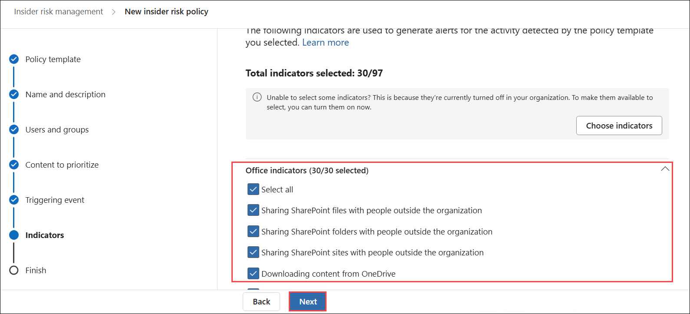
    
1. **Detection options:** Review the information, and leave everything as the default, and then select **Next**.   
   
    
    
1. **Indication thresholds:** leave the default setting **Apply thresholds provided by Microsoft**, then select **Next**.  

   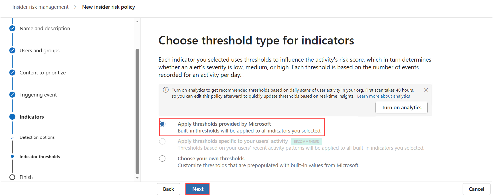  
    
1. Finish:  Review the settings, select **Submit**, then select **Done**.

   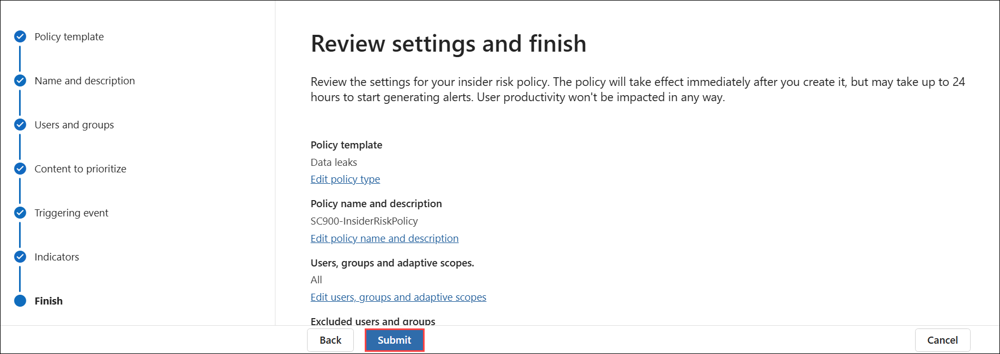  
   
   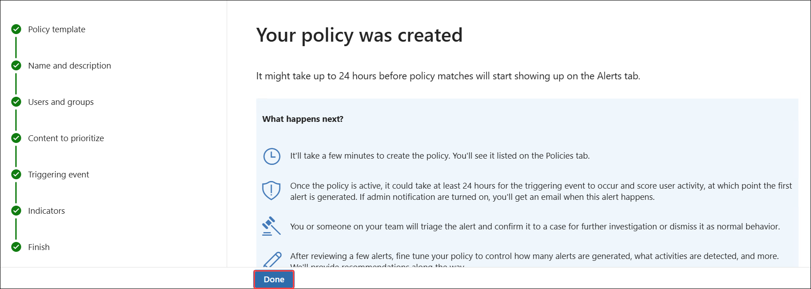  

1. You are back on the Policies tab of the Insider Risk Management page. The policy you just created will be listed.  

1. In the policy you just created, the "Users in scope" field represents users who are currently being assigned risk scores by the policy.  Assigning users a risk score occurs when the policy is triggered, which is why the value shows 0.  An admin can configure a policy to start assigning risk scores to specific users, based on activity detected by the policies you selected, which bypasses the requirement that a triggering event be detected first. To do this, select the checkbox next to the policy name to select the policy, then select **Start scoring activity for users**, which is shown above the policy table. Populate each field, then select **Start scoring activity**. It can take 24 hours for the users to appear on the 'Users' tab. After that time, you can select the users from that tab to review detected activities.

    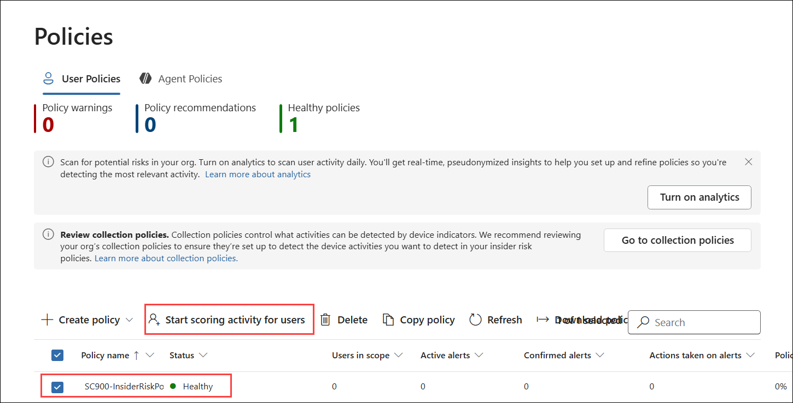

    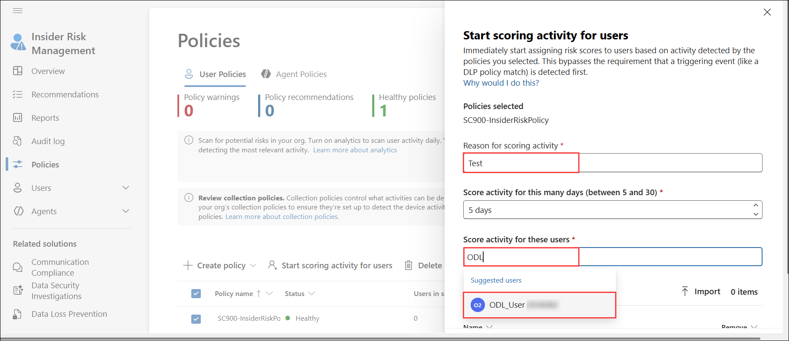

## Review
In this lab, you have completed:
- Process of setting up an insider risk policy
- Enable the Audit log search capability
- Apply to all insider risk management policies
- Create policy

## You have successfully completed the lab
