# Lab-14: Explore Insider Risk Management in Microsoft Purview

## Lab scenario
In this lab, you will walk through the process of setting up an insider risk policy, along with the basic prerequisites to configure and use insider risk management policies.  Note:  this lab will only provide visibility into what is required for setting up Insider risk management and options associated with creating a policy.  This lab does not include a task to trigger the policy, as the number of events that would need to occur to trigger a policy are outside of the scope of this exercise.

#### Task 1: In this task you, as the global administrator, will enable permissions for Insider Risk Management.  Specifically, you will add users to the Insider Risk Management role group to ensure that designated users can access and manage insider risk management features.  It may take up to 30 minutes for the role group permissions to apply to users across the organization. 

1. From the left navigation pane of the Microsoft 365 admin center, select **Show all**.

    

1. Under Admin centers, select **Security**.  A new browser page opens to the welcome page of the Microsoft 365 Defender portal.

    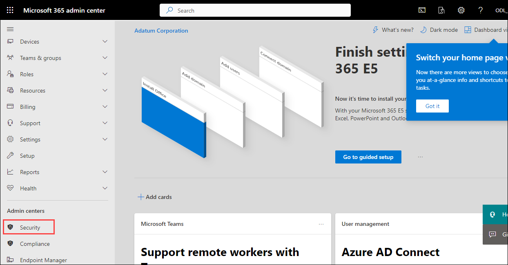

1. From the left navigation pane of the Microsoft 365 Defender portal, select **Permissions**.  You may need to scroll down to see this option.
    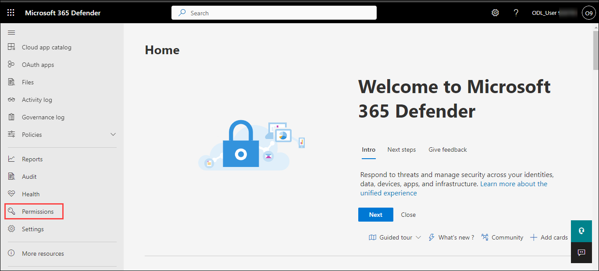
1. From the Permissions page, under **Email & collaboration roles** select **Roles**.

    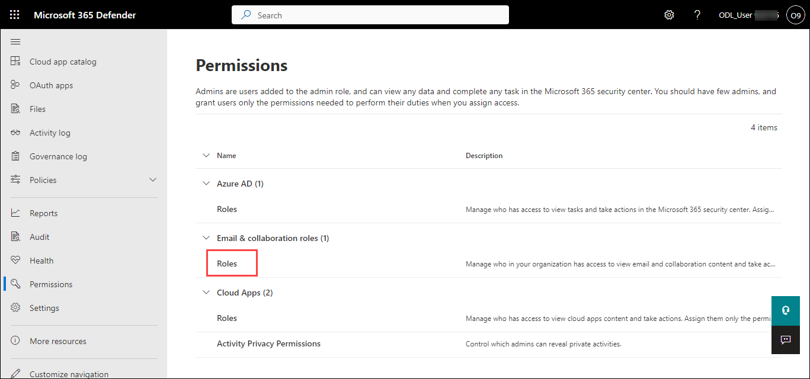

1. In the search bar, enter **Insider risk** then select the search icon (magnifying glass).  Notice the five roles that show up.  Each of these has different access levels.  Select **Insider risk management**.

    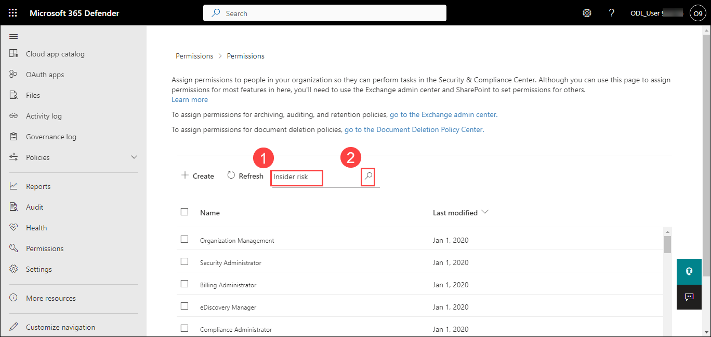
    
    

1. In the window that opens, next to where it says Members, select **Edit**. you may need to scroll to find it.

    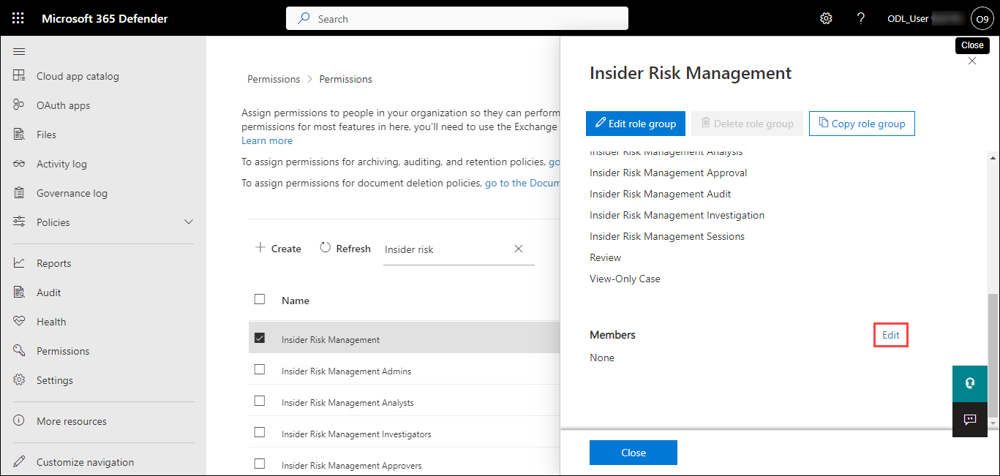

1. To add members to this role group, select **Choose members**.

    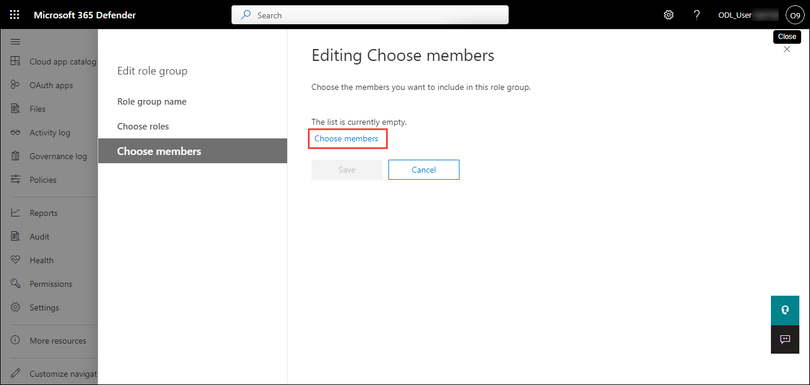

1. Select **+ Add** from the top of the page.

    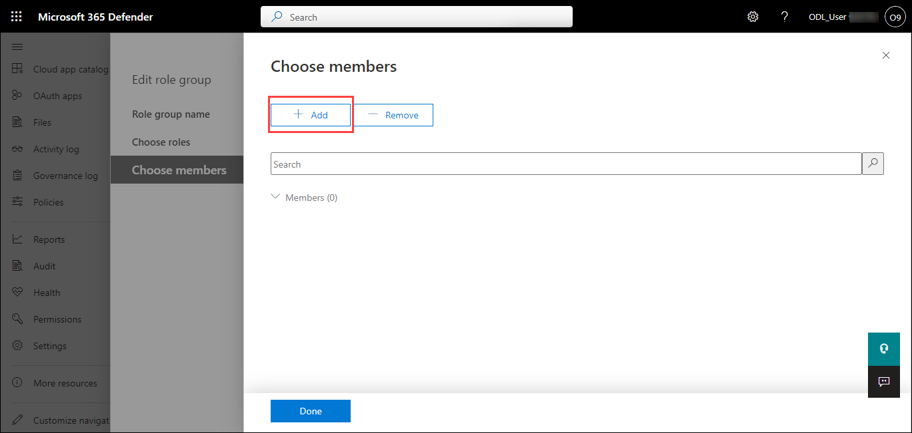

1. From the list of names, select **Megan Bowen** and your account ie. name with **ODL_User uniqueID** then select **Add** at the bottom of the page, then select **Done** at the bottom of the page.

    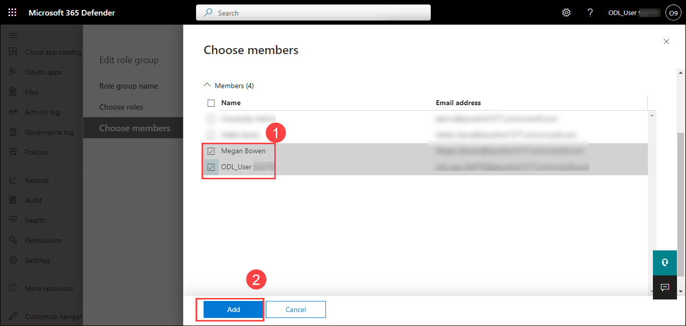
    
    

1. Verify the added members is correct then select **Save**.

    

1. From the bottom of the Insider Risk Management window, select **Close**.

    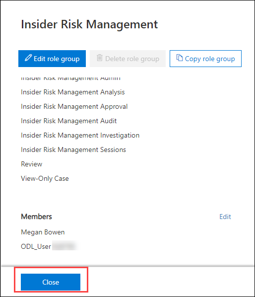

1. Close all the tabs except the **admin.microsoft.com** and then sign out from the admin center page and sign-in back again to reflect the permissions added for users faster.

#### Task-2: Insider risk management uses Microsoft 365 audit logs for user insights and activities identified in policies and analytics insights. In this task, you will enable the Audit log search capability. Note:  It may take several hours after you turn on audit log search before you can return results when you search the audit log.  Although it can take several hours before you can search the audit log, it will not impact the ability to complete other tasks in this lab.

1. Select the browser tab labeled, **Microsoft 365 admin center - Home**.  If you previously closed this browser tab, open Microsoft Edge and in the address bar enter **admin.microsoft.com** and sign in with your admin credentials.

1. Under Admin centers, select **Compliance**.  A new browser page opens to the welcome page of the Microsoft 365 compliance center.  

    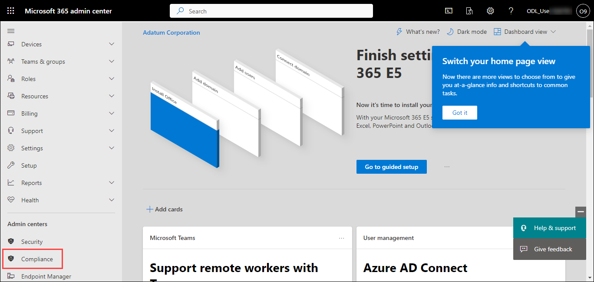

1. In the left navigation panel, under solutions, select **Audit**.

1. Verify that the **Search** tab is selected (underlined).

1. Once you land on the Audit page, wait 2-3 minutes.  If Auditing is NOT enabled, you will see a blue bar on the top of the page that says start recording user and admin activity.  Select **Start recording user and admin activity**.  Once auditing is enabled, the blue bar disappears.  If the blue bar is not present then auditing is already enabled, and no further action is required.

1. Return to the home page of the Microsoft 365 compliance center by selecting **Home** from the left navigation panel.

1. Keep this browser tab open, as you will use it in the next task.

#### Task 3: In this task you will walk through the settings associated with the Insider Risk Management solution.  Insider risk management settings apply to all insider risk management policies, regardless of the template you choose when creating a policy. 

1. You should be on the Microsoft 365 compliance center home page. If not, Open the browser tab **Home - Microsoft 365 compliance**.

1. From the left navigation panel under Solutions, select **Insider risk management**.

    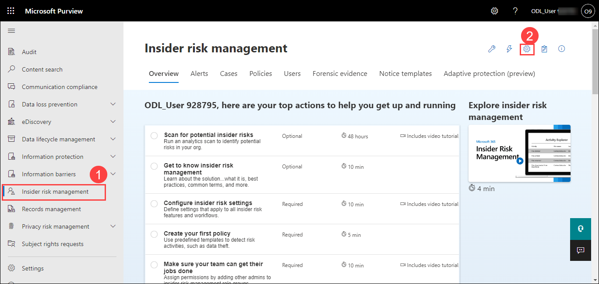

1. Before getting started with setting up a policy, there are some settings that need to be configured.  From the Insider Risk Management page, select the **setting cog icon** on the top-right corner of the page to access Insider Risk settings.  
    1. Privacy tab:  for users who perform activities matching your insider risk policies, this setting will determine whether to show their actual names or use anonymized versions to mask their identities.  Select **Do not show anonymized versions of usernames** then select **Save**.  Select the  **Policy indicators** tab.

          
    
    1. Policy indicators tab: Once a policy triggering event occurs, activities that map to the selected indicators are used in determining the risk score, for the user. Policy indicators selected here are included the Insider risk policy templates.  Scroll to view all the indicators available and any associated information. Under **Office indicators**, select **Select all**, scroll down and then select **Save**.  Select the **Policy timeframes** tab.

          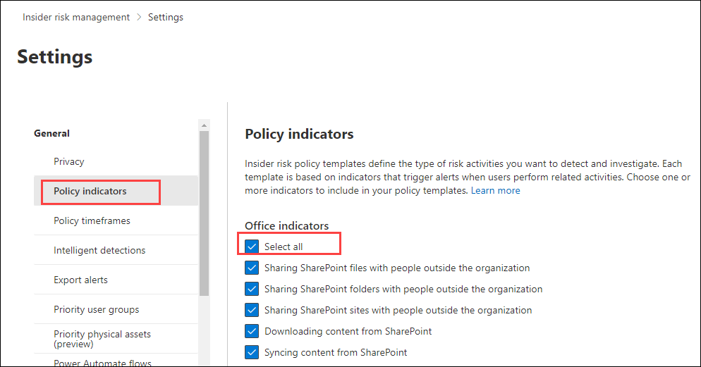
    1. Policy timeframes tab:  The timeframes you choose here go into effect for a user when they trigger a match for an insider risk policy.   The Activation window determines how long policies will actively detect activity for users and is triggered when a user performs the first activity matching a policy. Past activity detection Determines how far back a policy should go to detect user activity and is triggered when a user performs the first activity matching a policy.  Leave the default values.  Select the **Intelligent detections** tab.

          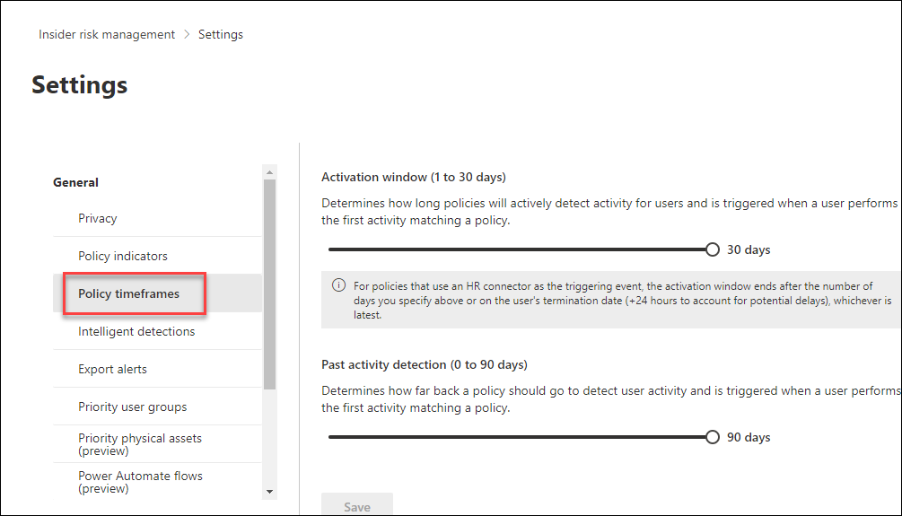
    1. Intelligent detections tab:  Review the options here.  Note the domains settings and how they relate to the indicators.

          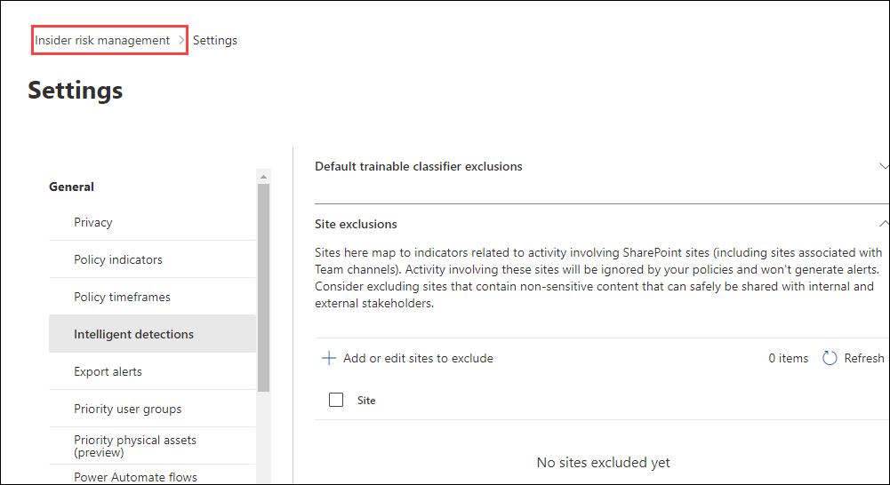
    3. Other items listed in the settings are in preview.  Explore these at will and note that as a preview, they are subject to change.

1. To return to the Insider risk management overview, select **Insider risk management** from the top-left corner of the page, above where it says Settings.

    

1. Keep this browser tab open, as you will use it in the next task.

#### Task 4:  In this task you will walk through the creation of a policy.

1. You should be on the Insider risk management page.  If not already there, open the browser tab labeled, **Insider risk management - Microsoft 365 compliance**.

1. From the Insider risk management overview page, select the **Policies** tab then select **+ Create**.  Configure each of the following policy tabs.

    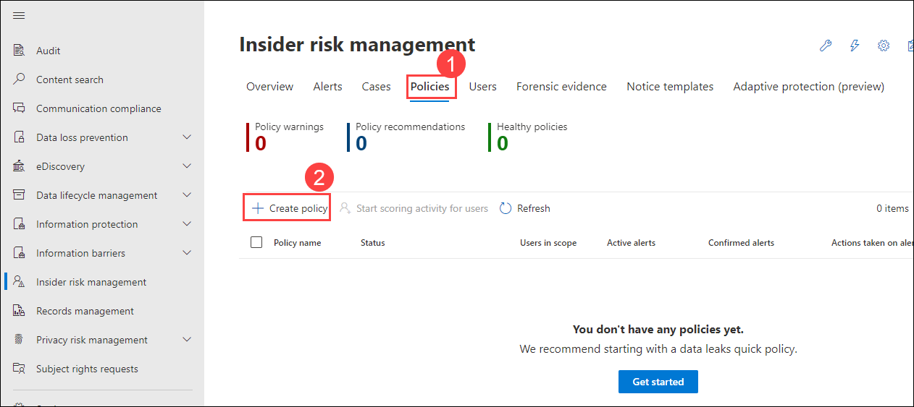

1. Policy template:  From the list of categories, select **Data leaks**. Read the details associated with this template, then select **Next**.

    
    
1. Name and description:  enter a name, **SC900-InsiderRiskPolicy**, then select **Next**.

    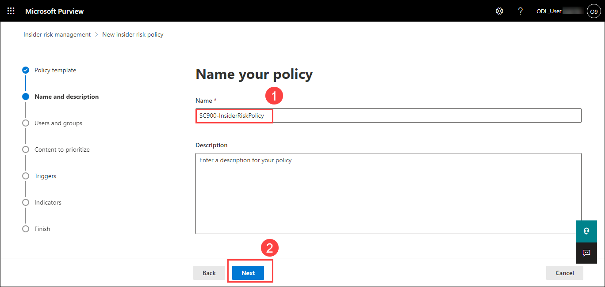
    
1. Users and groups:  Review the information box.  Leave the default setting, **Include all users and groups**.  Select **Next**.

    
         
1. Content to prioritize: Read the description. Select **I dont't want to specify priority content right now**, then select **Next**.

   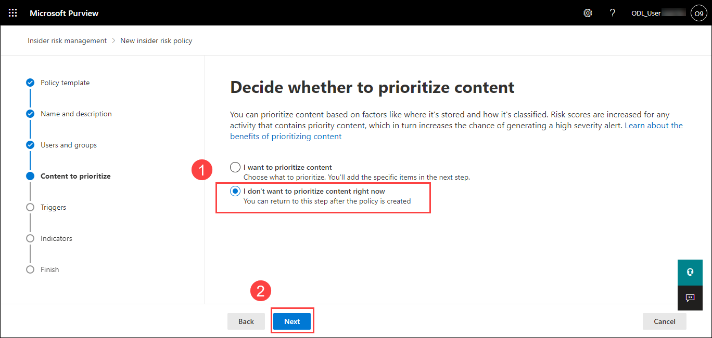
               
1. Triggering event: Review the detailed information. The policy is triggered by either the user performing an exfiltration activity as as defined (select the information icons for each bullet point for more detailed information) OR a match to an existing Data Loss Prevention (DLP) policy.  Since you don’t have any DLP policy configured as part of this exercise, select **User performs an exfiltration activity**.  Scroll down to see what is automatically selected.  Note that the policy indicators you enabled in the previous task are checked.   Recall that these indicators will only be activated once the policy is triggered and any activities that map to these indicators  will be used in calculating a risk score for the user.  In addition, Sequence detection is enabled.  If a sequence of activities, as defined, is detected then it suggests greater risk.  Select the information icon for detailed information on which indicators are required.  This selection requires that certain indicators be selected and that devices be onboarded. Scroll down and Leave the defaults and click **Next**

   
        
1. Triggering Thresholds: here you can specify default or custom thresholds associated with the indicators.  Recall the indicators are activated only after the policy trigger occurs so these thresholds do not influence when the policy is triggered. Select **Use custom thresholds**, By selecting this option, you can see the current default values. Leave the defaults and select **Next**.

    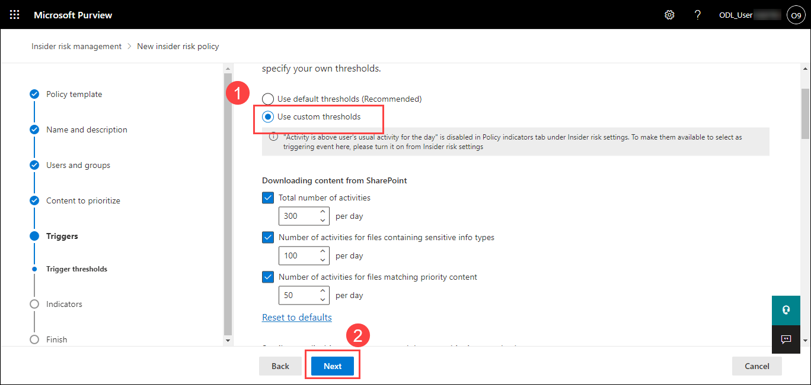
    
1. Indicators: Review the detailed information. Leave the default setting, Select **Next**.    

    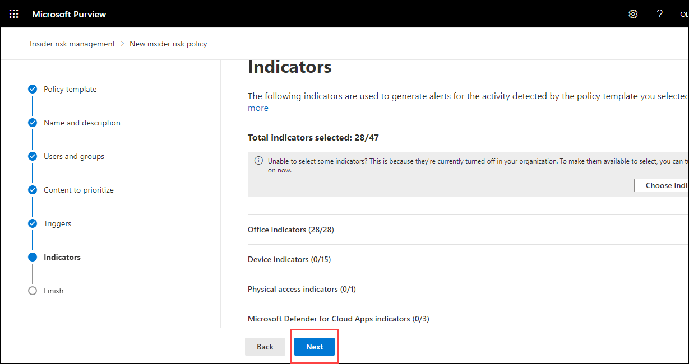
    
1. Detection options: Review the information, Select **Next**.   
   
    
    
1. Indication thresholds: Review the information. Select **Customize thresholds** then Select **Next**.  

     
    
1. Finish:  review the settings, select **Submit**, then select **Done**.

   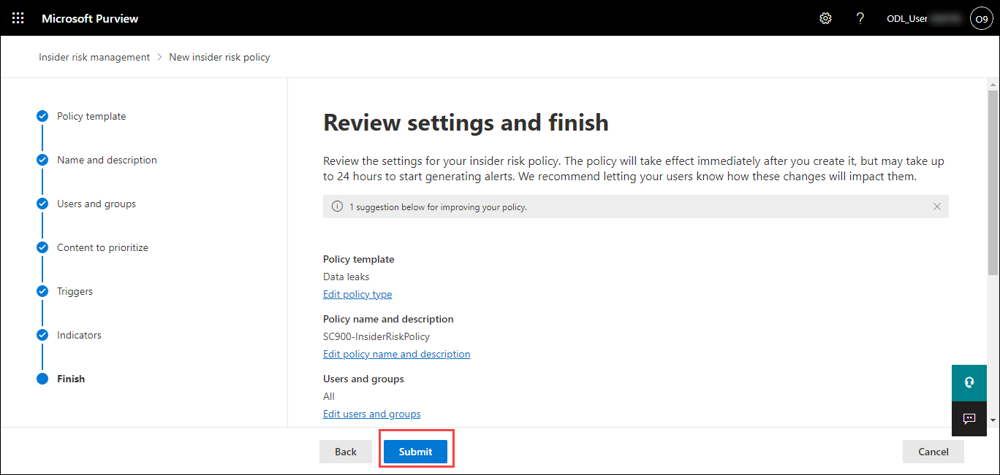  
   
   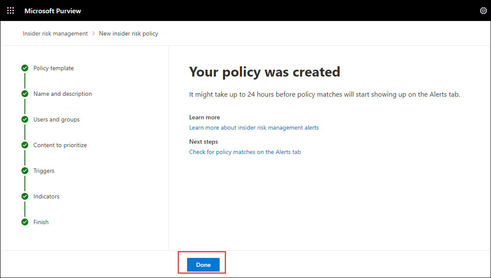  

1. You are back on the Policies tab of the Insider risk management page.  The policy you just created will be listed.  

1. As an admin, you can immediately start assigning risk scores to users based on activity detected by the policies you selected. This bypasses the requirement that a triggering event (like a DLP policy match) is detected first. An admin would do this by selecting the empty square next to the policy name to select the policy, then select Start scoring activity for users, which is shown above the policy table. A new window opens that requires the admin to populate the available fields. Leave the fields empty as you won't configure this option, but for more information on why an admin would want to do this, select Why would I do this??. Exit the window by selecting the X on the top right of the window.

    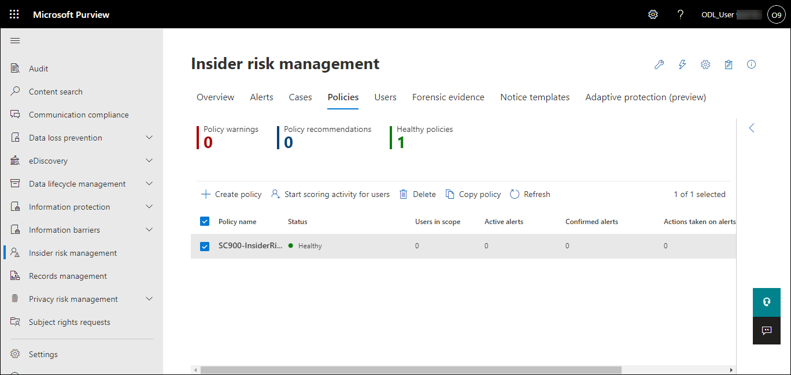 

#### Review
In this lab, you walked through the process of setting up an insider risk policy, along with the basic prerequisites to configure and use insider risk management policies.
