# Lab-15: Explore the Core eDiscovery workflow

## Lab scenario
In this lab you will go through the steps required for setting up Core eDiscovery and then go through the Core eDiscovery workflow, by creating an eDiscovery hold, creating a search query, and then exporting the results of the search.  Note:  Licensing for Core eDiscovery requires the appropriate organization subscription and per-user licensing. If you aren’t sure which licenses support core eDiscovery, visit Get started with Core eDiscovery.

#### Task 1:  To access Core eDiscovery or be added as a member of a Core eDiscovery case, a user must be assigned the appropriate permissions. In this task, you as the global admin, will add specific users as members of the eDiscovery Manager role group.

1.	Open Microsoft Edge. In the address bar enter **admin.microsoft.com**.

      

1. Sign in with your admin credentials.
    1. In the Sign in window, enter following username and select **Next**.

       * Email/Username: <inject key="AzureAdUserEmail"></inject>
     
        .png)
     
    1. Enter the following admin password and Select **Sign in**.
  
       * Password: <inject key="AzureAdUserPassword"></inject>
    
       .png)
        
    1. When prompted to Action Required, Please select **Ask later**

        .png)    
     
    1. When prompted to stay signed- in, select **Yes**. This takes you to the Microsoft 365 admin center page.

1. From the left navigation pane of the Microsoft 365 admin center, select **Show all**.

    

1. Under Admin centers, select **Security**.  A new browser page opens to the welcome page of the Microsoft 365 Defender portal.

    

1. From the left navigation pane of the Microsoft 365 Defender portal, select **Permissions**.  You may need to scroll down to see this option.

    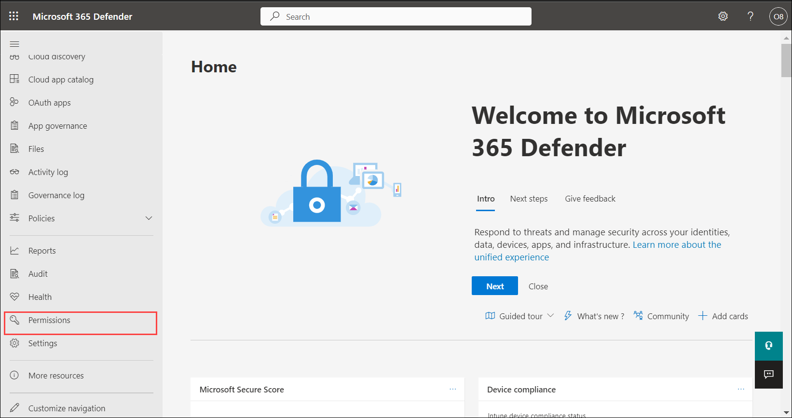

1. From the Permissions page, under **Email & collaboration roles** select **Roles**.

    

1. In the search bar, enter **eDiscovery** then select the search icon (magnifying glass).  Select **eDiscovery Manager**.

    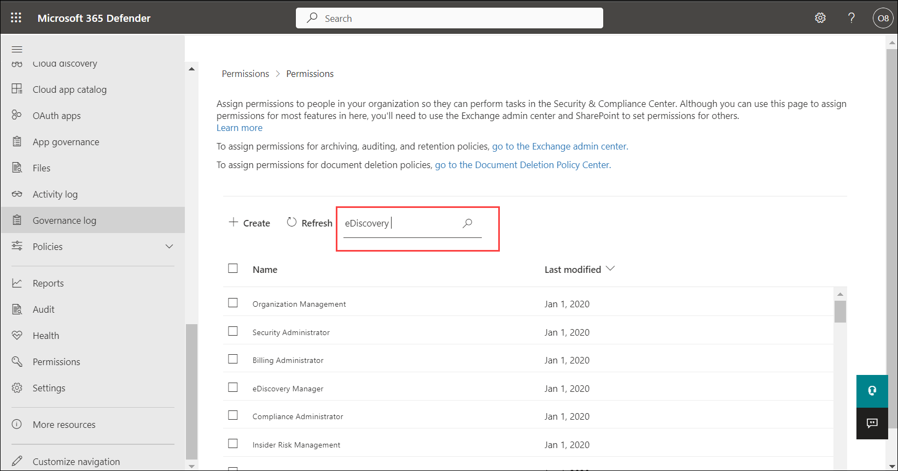
    
    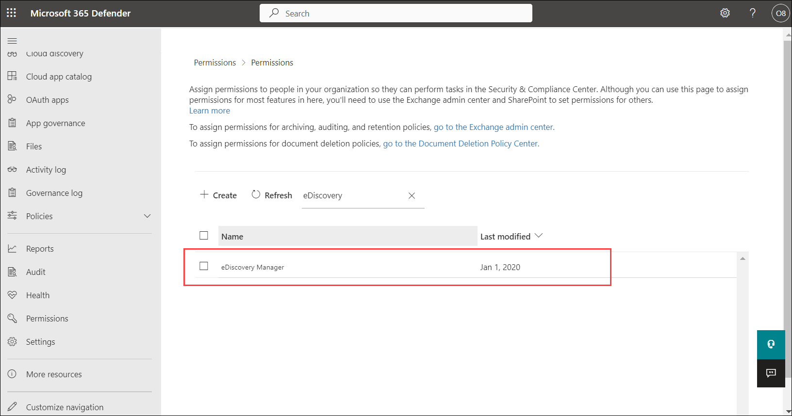

1. In the window that opens, notice how there are two sub-groups, eDiscovery Manager and eDiscovery Administrator.  Read the description of each.  For this lab lab, we will add members to the eDiscovery Administrator sub-group.

1. Select **Edit** 

    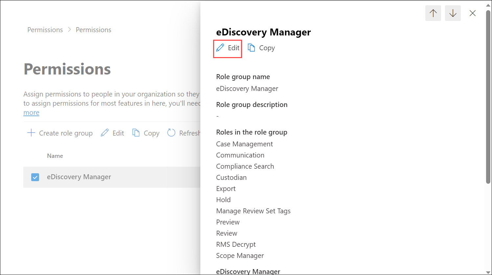

1. On **eDiscovery Manager** page select **Next** on  **Manager eDiscovery Manager**.

   

1. On **Manage ediscovery Administrator**, click on **Choose User** and select **ODL_User and Megan Bowen** from the list and click on **select** and **Next**.

   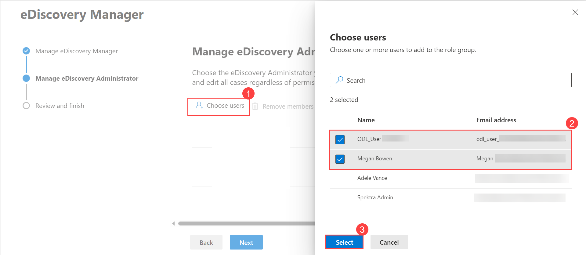

1. On **Review and finish** page, select **Save**.

   

1. Close all the tabs except the **admin.microsoft.com** and then **sign out** from the admin center page and **sign-in** back again to reflect the permissions added for users faster.

#### Task 2:  In this task you, as an eDiscovery Administrator (ODL admin is an eDiscovery administrator), will create a case to start using Core eDiscovery.

1. Open the Microsoft 365 admin center tab on your browser.

1. From the left navigation panel, under Admin Centers, select **Compliance**.

    

1. You are now in the Microsoft Purview. From the left navigation panel, select **Show all**.

1. From the left navigation panel, under Solutions, select **eDiscovery** then select **Standard**.

1. From the top of the Core eDiscovery page, select **+ Create a case**.

    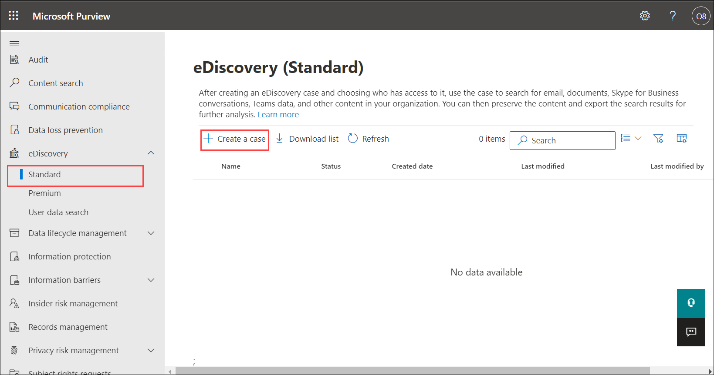

1. In the New case window, enter a Case name, **SC900 Test Case** then select the **Save** at the bottom of the page.

    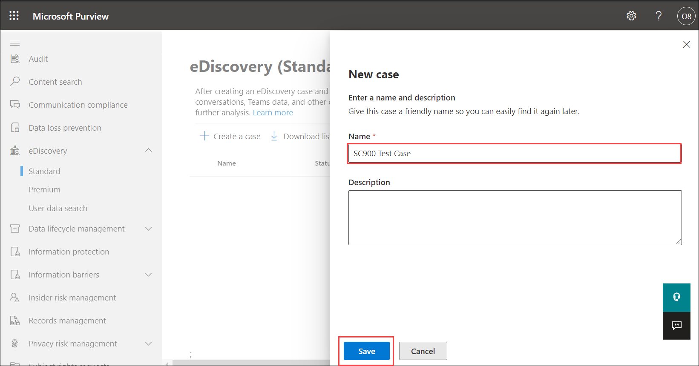

1. The case should now appear on the list.

    

1. As the creator of the case and because you have eDiscovery Administrator privileges, you can begin to work with it.  

1. Keep this browser tab open, as you will use it in the subsequent task.

#### Task 3:  Now that you have created a Core eDiscovery case, you can begin to work with the case.  In this task, you will create an eDiscovery hold for the case for you just created.  Specifically, you will crate a hold for the the exchange mailbox belonging to ODL-User.

1. Open the Core eDiscovery tab on your browser.

1. From the Core eDiscovery page, select the case you created in the previous tab, **SC900 Test Case**. 

1. From the Home page of the case, select the **Hold** tab then select **+Create**.

    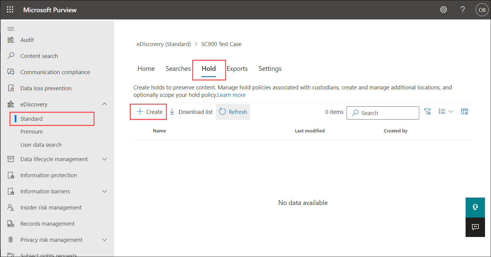

1. In the name field, enter **Test hold** then select Next.

    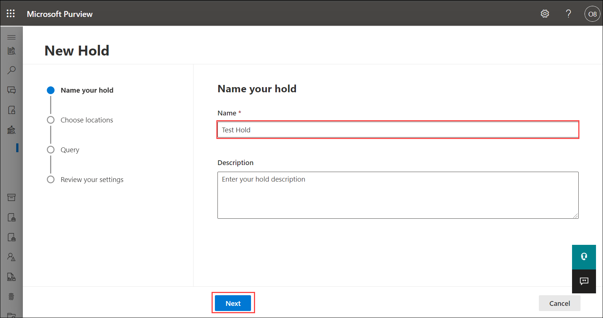

1. In the Choose locations page, select toggle switch next to Exchange mailboxes to set the status to **On**, select **Choose users, groups, or teams** and select the **ODL-UserUniqueID** user and click on **Done**
    
    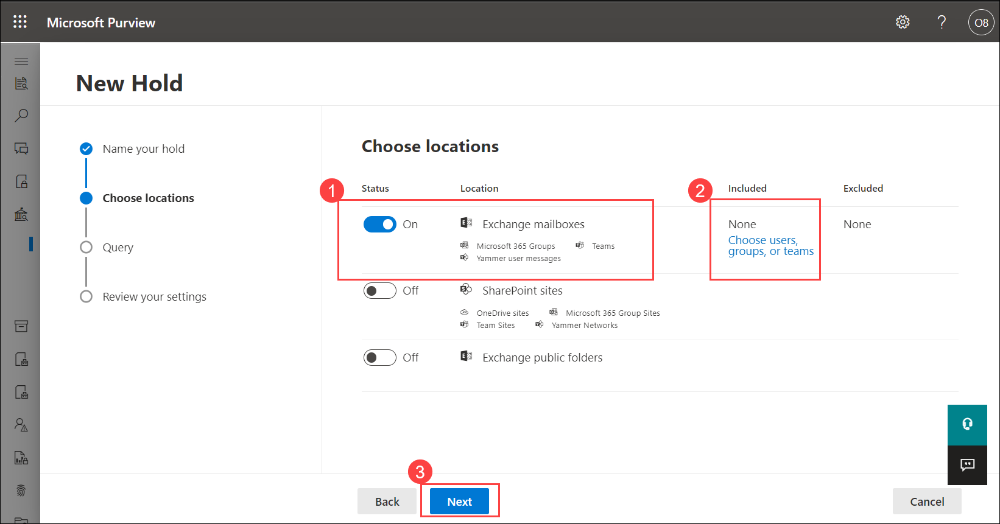
    
1. From the Choose locations page, select **Next**.  For expediency with the lab, no other locations will be included in this hold.

1. The Query conditions page enables you to create a hold, based on specific Keywords or Conditions that are satisfied, select **+Add condition** to view the available options.  Select **Next**. Without any conditions, the hold will preserve all content in the specified location.

    
    
    

1. Review your settings and select **Submit**, it may take a minute, then select **Done**.  The Test hold should appear on the list.  If you don't immediately see it, select **Refresh**

    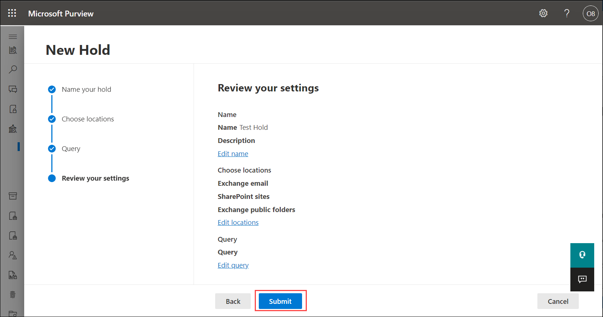

1. Keep this browser tab open, as you will use it in the subsequent task.

#### Task 4:  With a hold in place, you will create a search query.  Once your search is complete you will go export and download the results for future investigation.   Note:  Searches associated with a Core eDiscovery case are not listed on the Content search page in the Microsoft 365 compliance center. These searches are listed only on the Searches page of the associated Core eDiscovery case.

1. Open the SC900 Test case tab on your browser.

1. From the Holds page of the case, select **Searches**.

1. From the Search page, select **+ New Search**.

    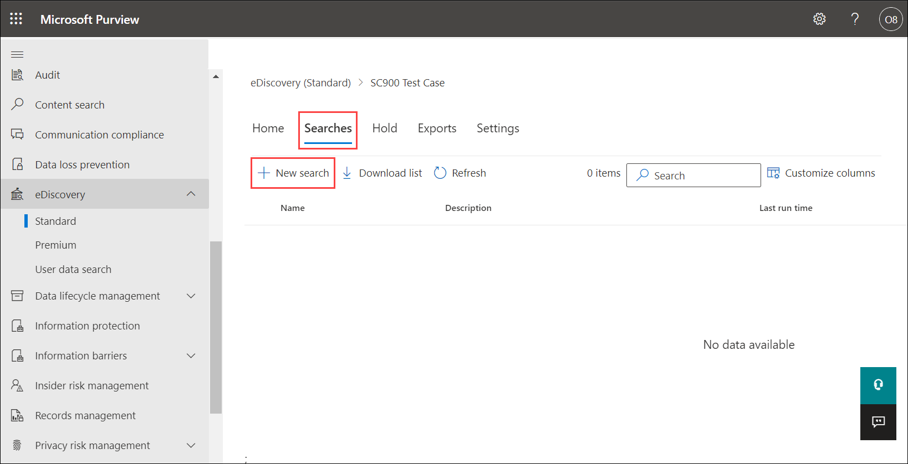

1. In the Name field, enter **Test Hold – Sales Search**, then select **Next** from the bottom of the page.

    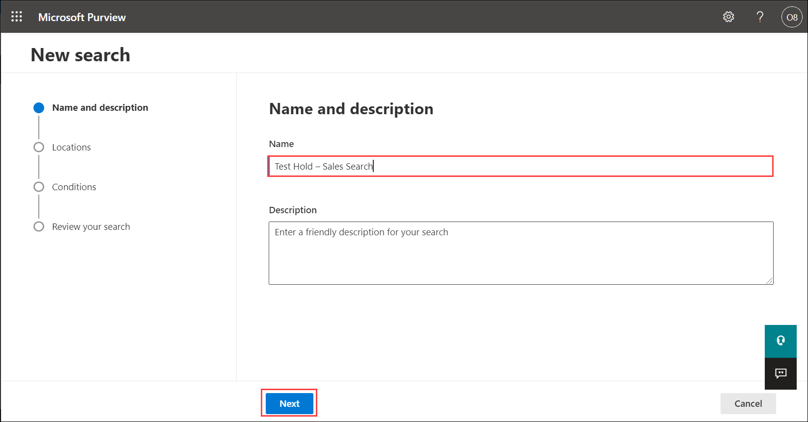

1. In the Choose locations page, select toggle switch next to Exchange mailbox to set the status to **On**, select **Choose users, groups, or teams** and select the **ODL-UserUniqueID** user and click on **Done**. 

    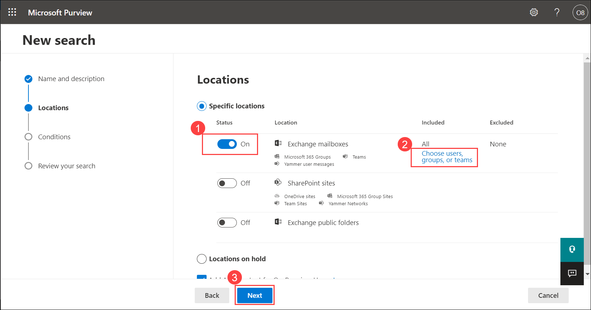

1. From the Choose locations page, select **Next**.  

1. The Query conditions page enables you to create a search, based on specific Keywords or Conditions that are satisfied, In the keyword field enter **Sales** select **Next**.

    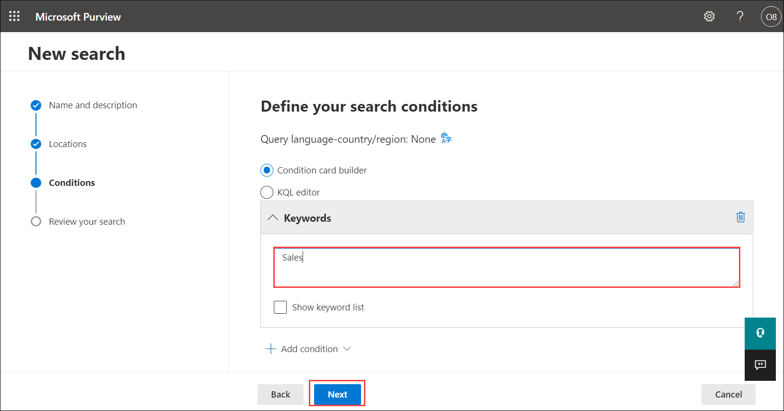

1. Review your settings and select **Submit**, it may take a minute, then select **Done**.  The search should appear on the list.  If you don't immediately see it, select **Refresh**

    
    
     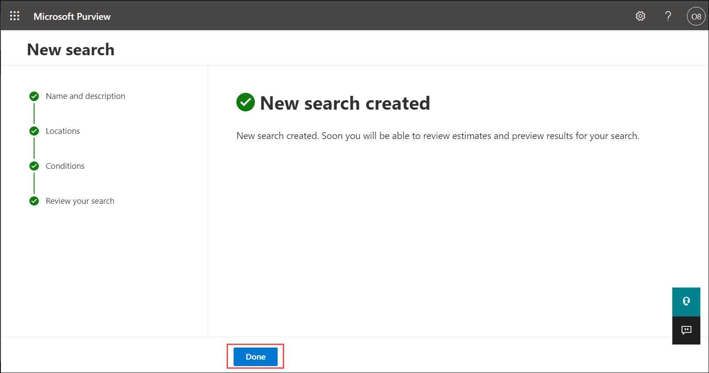

1. From the Searches window, select the search you just created, **Test Hold - Sales Search**.  A window that opens with the Summary tab selected.  Once the search is complete the status will indciate that the search is completed.  You will see a Search statistics tab (if you don't see the Search statistics tab, the search may still be running and may take a few minutes to complete).  Select the **Search statistics** tab and select the drop-down next to Search content.  You can also view more information for the Condition report and Top locations.  

    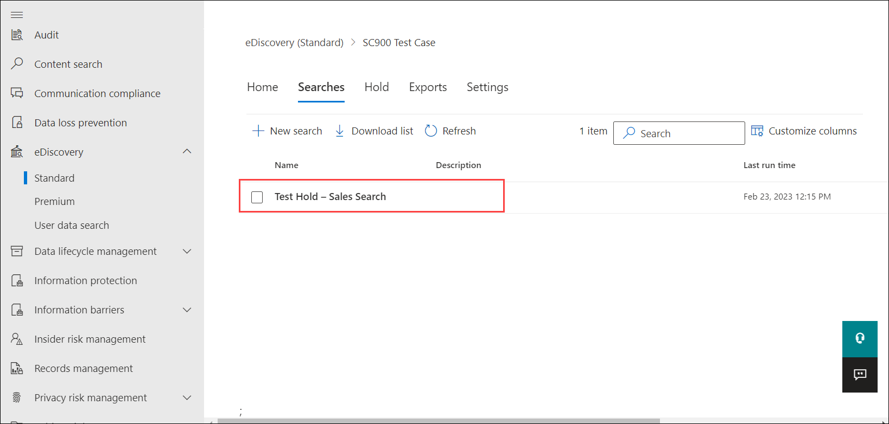

1. From the bottom of the page, select **Actions**.  Note the available options. By selecting **Export results**, search results can be downloaded. 

      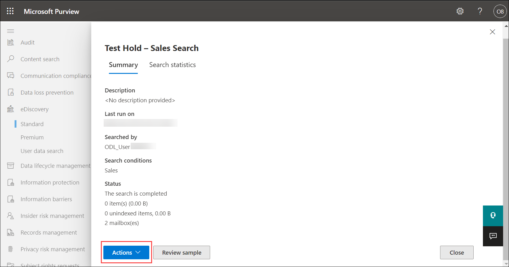
    
      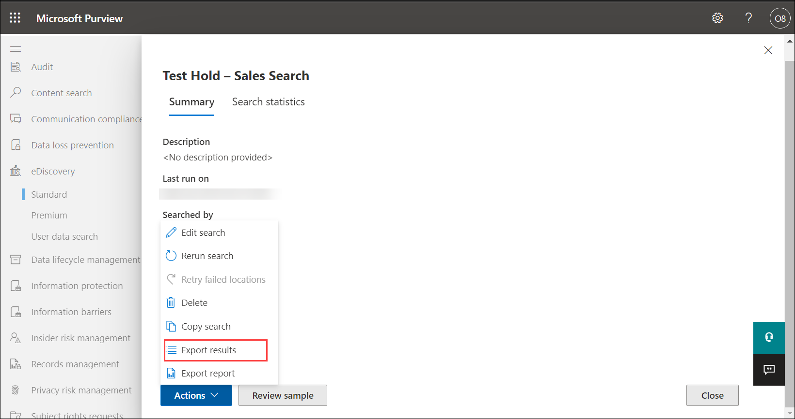
      
1. From the Export results window, leave the defaults and select **Export** from the bottom of the page. You will automatically be returned to the "Test Hold - Sales search" window. Select **close** on the bottom of the page.

      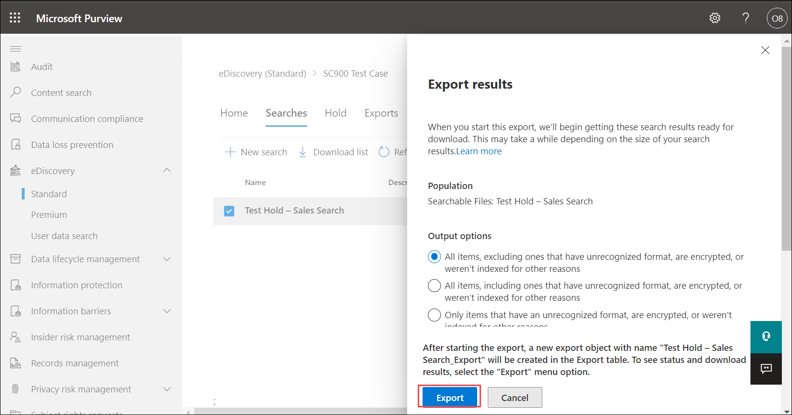  
    
1. From the SC900-Test case page, select **Exports** from the top of the page.

1. Select **Test Hold - Sales Search_Export**

1. In the window that opens, "Test Hold - Sales Search_Export", you will see an Export key, select **Copy to clipboard**.

      
1. From the top of the window, select **Download results.***(**Note**: You must use Microsoft Edge or Internet Explorer to download). A new browser page opens and a pop-up window displays asking if you want to open this file, select **Open**.

      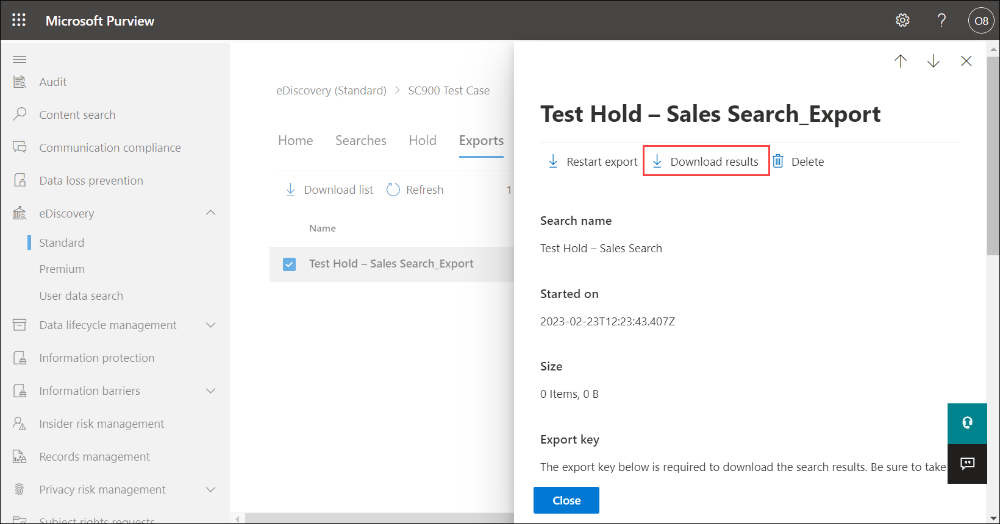
         
      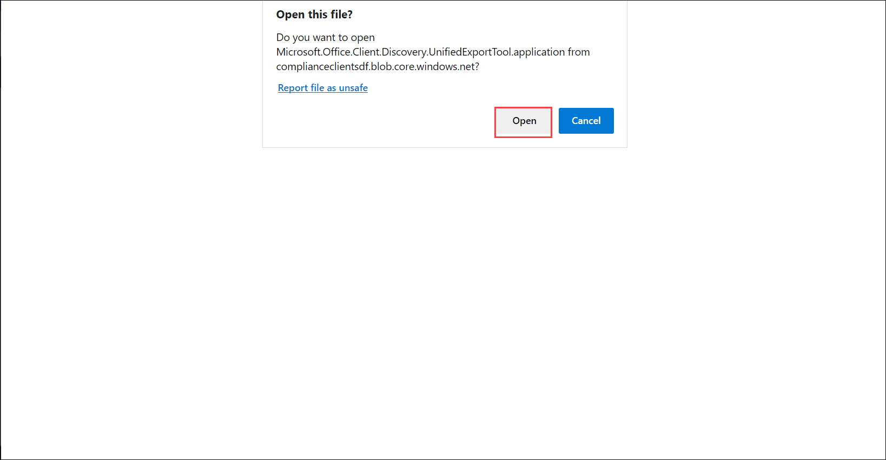
1. If this is the first time you do a download of a content search, you will be prompted to install the Microsoft Office 365 eDiscovery Export tool.  Select **Install**.

      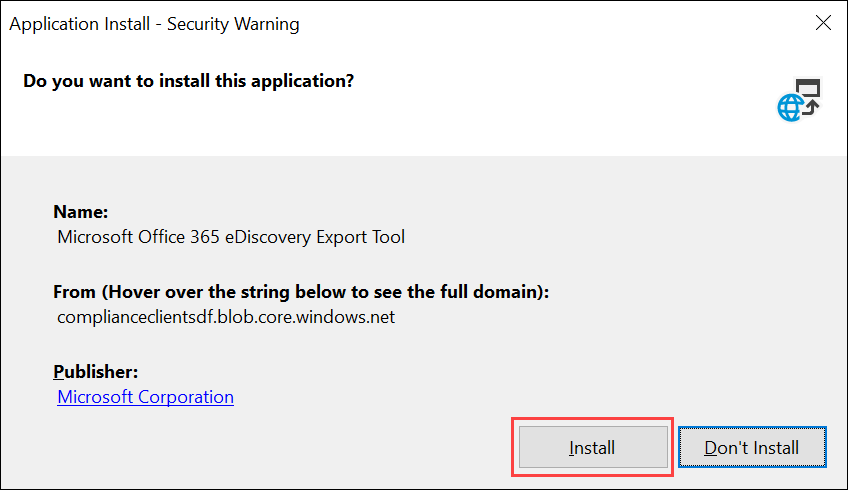
         
1. Once the install is completed, the eDiscovery export tool window opens.  In the first field, paste the export key that you copied to your clipboard, paste it in now (Control V on your keyboard or right-click on your mouse and select paste). 
 
1. In the second field, Click on **Browse** and set the location to C:\LabFiles to store the downloaded file , then select **Start**.  Once the download process is completed, select **Close** and close this browser tab.

      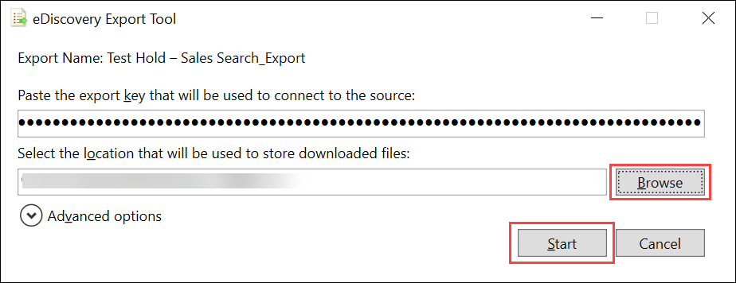
      
1. You are back on the "Test Hold - Sales Search_Export" window.  Select **Close**.

1. Check the location of your download to verify the download was successfully completed. 

#### Review

In this lab you went through the steps required to get started with core eDiscovery, including setting up the role permissions for eDiscovery and creating an eDiscovery case.  With the case, created you went through the Core eDiscovery workflow, by creating an eDiscovery hold, creating a search query and then you read on the process of exporting the results of the search to use further investigation.
