# Lab: Explore Azure Policy

## Lab scenario
Azure Policy helps to enforce organizational standards and to assess compliance at-scale. Azure Policy evaluates resources in Azure by comparing the properties of those resources to business rules. In this lab, you will start by exploring the Azure policy landing page. After the initial exploration of the Azure policy page, you will create a policy and see the impact of that policy.

**Estimated Time**: 20-25 minutes

#### Task 1: Briefly explore the Azure policy page.

1. Open Microsoft Edge. In the address bar enter **portal.azure.com**.

1. Sign in with your admin credentials.
    1. In the Sign in window, Get the user credentials provided in the environment details page and paste the value in the username section and then select **Next**.

       
     
       
     
    1. Enter the admin password which should be provided by your lab hosting provider. Select **Sign in**.
       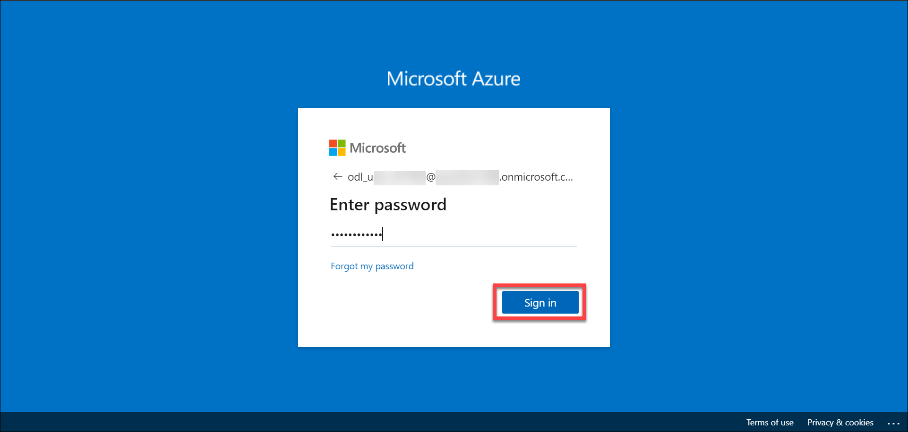
    1. When prompted to protect the account, Please select **Skip for now**.

       
     
    1. When prompted to stay signed- in, select **Yes**.

1. From the left navigation panel, select **Getting started**.  Here you can view the different options including the option to browse built-in policies and assign policies at scale, you can create custom policy definitions for your environment, recommend policy assignments and much more.

    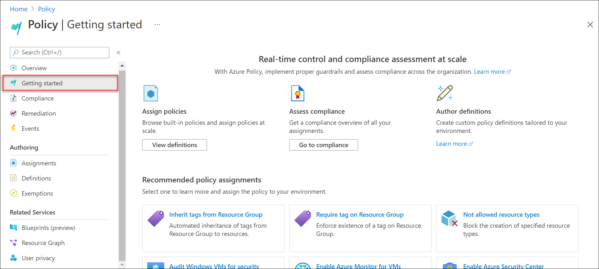

1. From the left navigation panel, select **Compliance**.  As with the overview page, here you can view the compliance state of the listed policies and/or initiatives.  From the Policy Compliance page, you can also assign a policy or an initiative (you’ll assign a policy in the next task).

    

1. From the left navigation panel, select **Remediation**.  This page provides a list of policies that have non-compliant resources.  By selecting on a policy on the remediation page, you can trigger the creation of a task to remediate the policy.

    

1. From the left navigation pane, under authoring, select **Assignments**.  From here, you can see the current policy and/or initiative assignments and you can create policy assignments or initiatives.  You will come back to this in the in next task.

    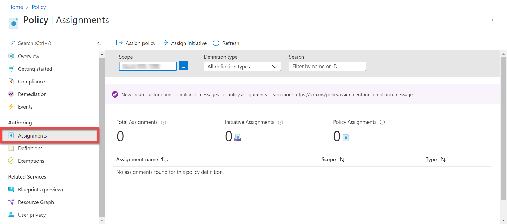

1. From the left navigation panel, select **Definitions**.  From this page, select **Audit machines with insecure password security setting**. This is an initiative definition, that includes many policies. **Note:-** You can use the filter option to find the definition as shown in below image.

    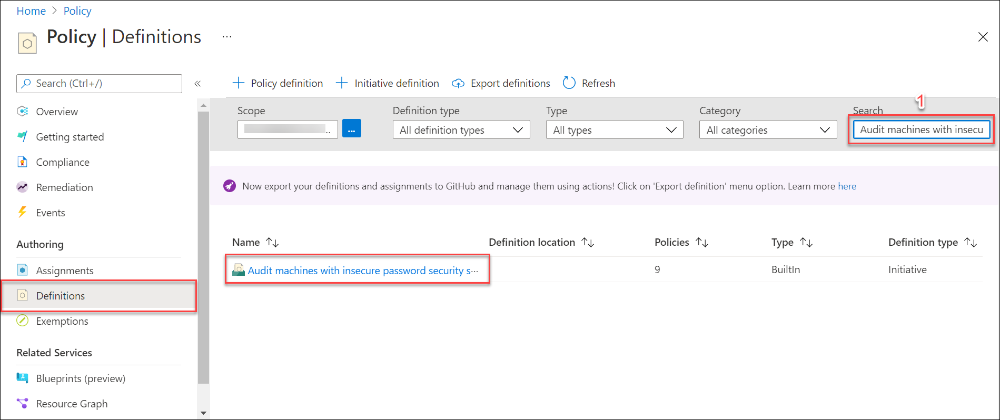
 
1. Inside the definition, To view what a policy definition looks like, select **Audit Windows machines that do not have a maximum password age of 70 days**. When the page opens you will see the actual policy definition in Java Script Object Notation (JSON) structure.   As you can see from the text in red, the policy definition contains elements that define the display name, description, parameters, policy rules, and more. DO NOT CHANGE ANYTHING.

    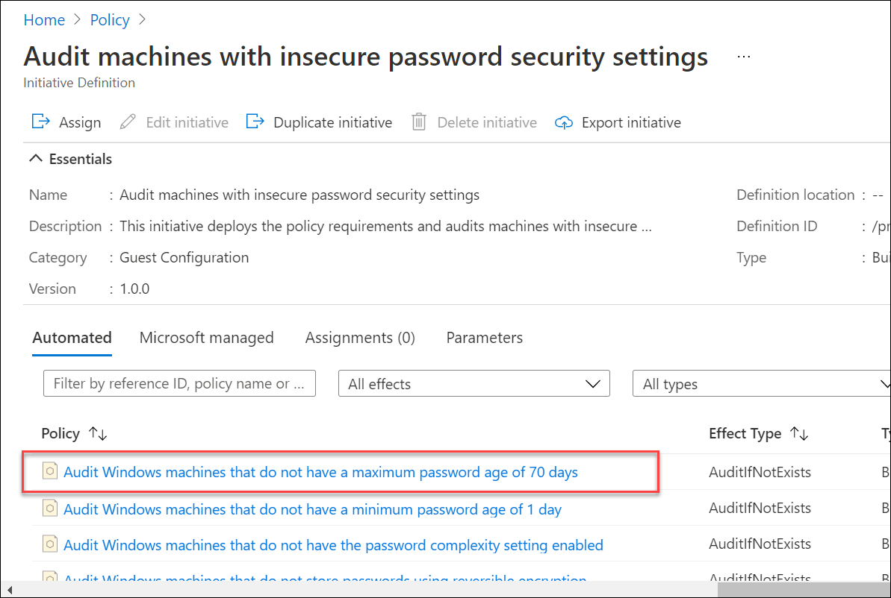
    
    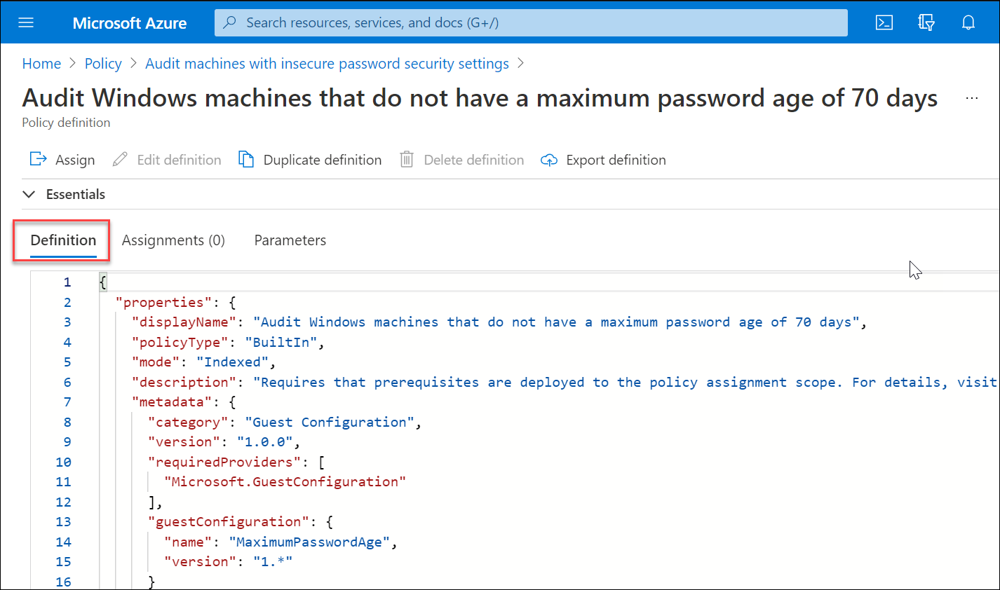

1. Exit from the Policy definition page, by select the **X** on the top right corner of the page.

1. Exit from the Initiative definition page, by select the **X** on the top right corner of the page.

1. Keep this browser tab (Policy – Microsoft Azure) open for the next task.

#### Task 2:  In this task you will create a basic policy assignment to require a tag on resource groups.

1. Open the browser tab, Policy – Microsoft Azure.

1. Form the left navigation panel, under Authoring, select **Assignments**.

1. From the top of the page, select **Assign policy**.

    

1. The Assign policy wizard opens to the guide the admin in the process of assigning a policy.  Next to the Policy definition field, select the **ellipses**.  A list of the available policy definitions is provided.

    

1. In the search bar enter, **Tag**.

1. From the search results, select **Require a tag on resource group** (you may need to scroll down), then press **Select**.  Note: the effect of this policy is to Deny the creation of any new resource group that does not satisfy the requirement.

    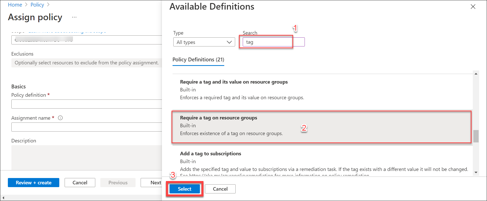

1. Note the default assignment name.  Keep the name as is and from the bottom of the page, select **Next**.

    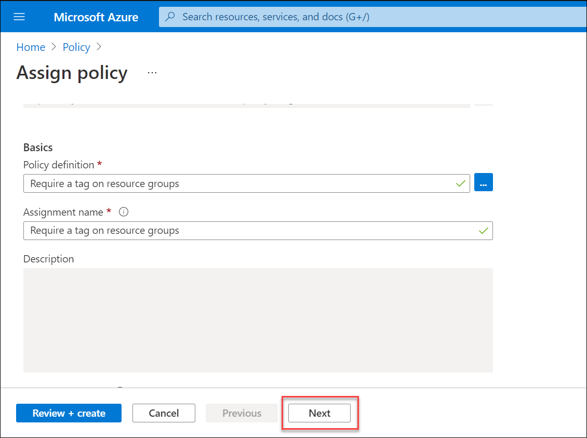

1. Under Parameters, In the Tag name field, enter **Environment** then select **Next**.

    
    
1. Click next under Remediation.

1. In the non-compliance messages, enter **An environment tag is required**, then select **Next**. Note: this message will appear as the reason for non-compliance for resource groups that were created before the policy assignment and do not have an Environment tag.  For resource groups created after the policy was created, the creating of the resource group will be denied if there is no environment tag.

    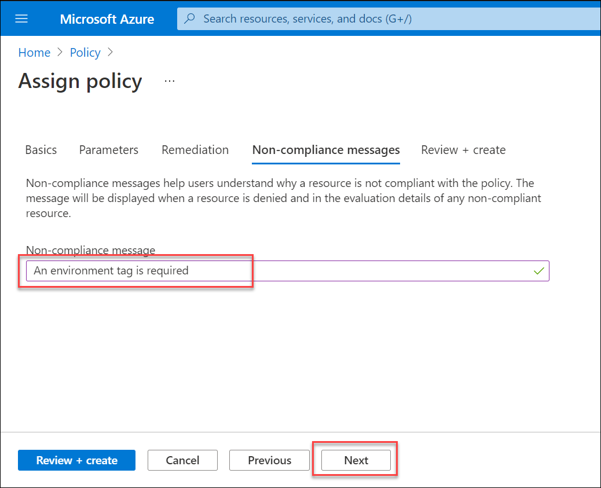

1. Review the policy assignment, then select Create.  

    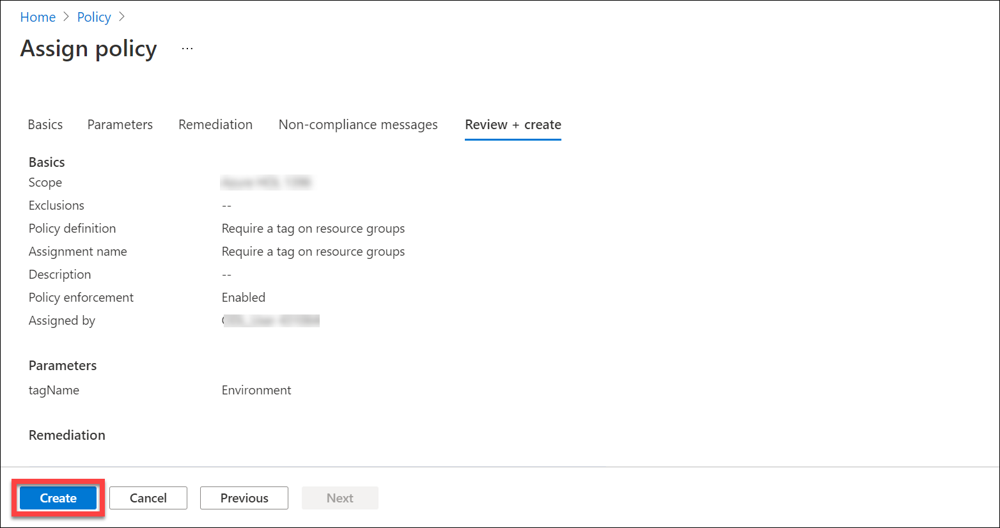

1. If you don’t immediately see the policy, select **Refresh**.

    
    
1. **Note:** It may take up to 30 minutes for the policy to take effect.

1. Exit from the Policy assignments page by selecting the **X** on the top right corner of the screen.

1. You are now in the Azure services home page.  Keep this page open, you will need it for the next task.

#### Task 3:  In this task you will see the impact of the Azure policy assignment, by creating a resource group in Azure that does not have a tag, then you will see update the resource group to include a tag.  Note: It may take up to 30 minutes for the policy created in the previous task to take effect, but it usually happens faster.

1. Navigate to Home – Microsoft Azure.

1. Select **Resource groups**.

    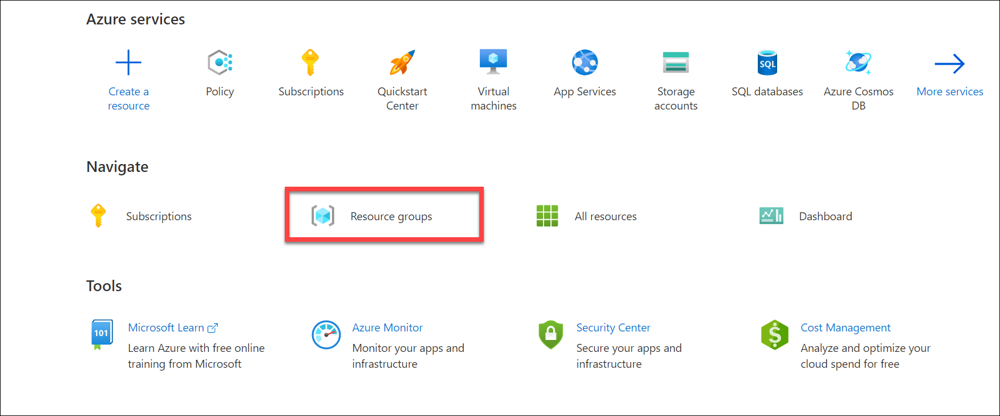

1. From the top left corner of the page, select **+ Create**.

    

1. From the Basics tab of the Create a resource group, leave the Subscription field as is, Azure Pass -  Sponsorship.

1. In the Resource group field enter, **SC900-Labs**.

1. Leave the Region setting to the default, then select **Next: Tags**.

    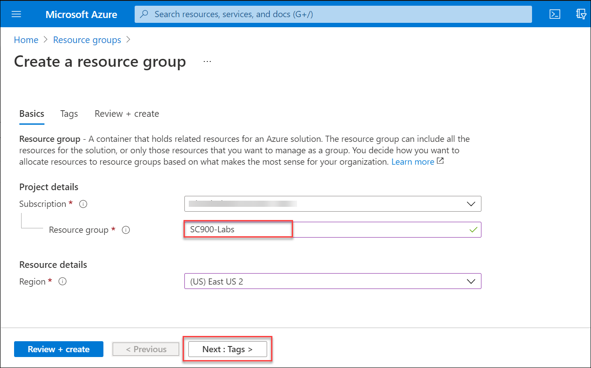

1. Leave the tag Name and Value field empty.  DO NOT POPULATE, then select **Review + create**.

    

1. You will see a validate passed (the tag name and value are not required fields in the wizard), then select **Create**.

    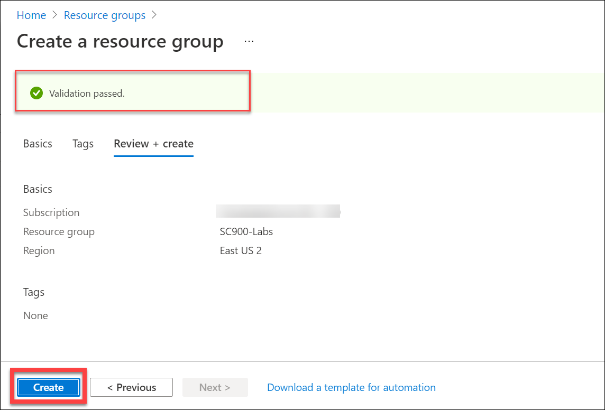

1. You will see a failure message on the top of the screen, “Failed to create the resource group. View error details”.  Select **View error details**. The condition that is part of the Azure policy was not satisfied so the resource group creating was blocked, for non-compliance. Note: If you don’t see the failure message and the resource group was created, it is because the policy has not yet taken effect.  Go the Policy page for the policy you created in the previous task and once the policy takes effect you will see that the resource is not compliant.  The details page will include the non-compliance message.

1. The error summary shows the error type, “Resource ‘SC900-Labs’ was disallowed by policy.  Close this window by selecting the **X** on the top left corner of the screen.

    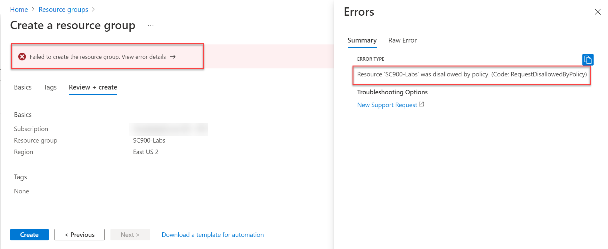

1. From the Create a resource group window, select **<Previous**.

    

1. You are back in the Tags page for Create a resource group.  In the Name field enter Environment and in the Value field, enter **SC900-Labs**, then select **Next: Review + Create >**.

    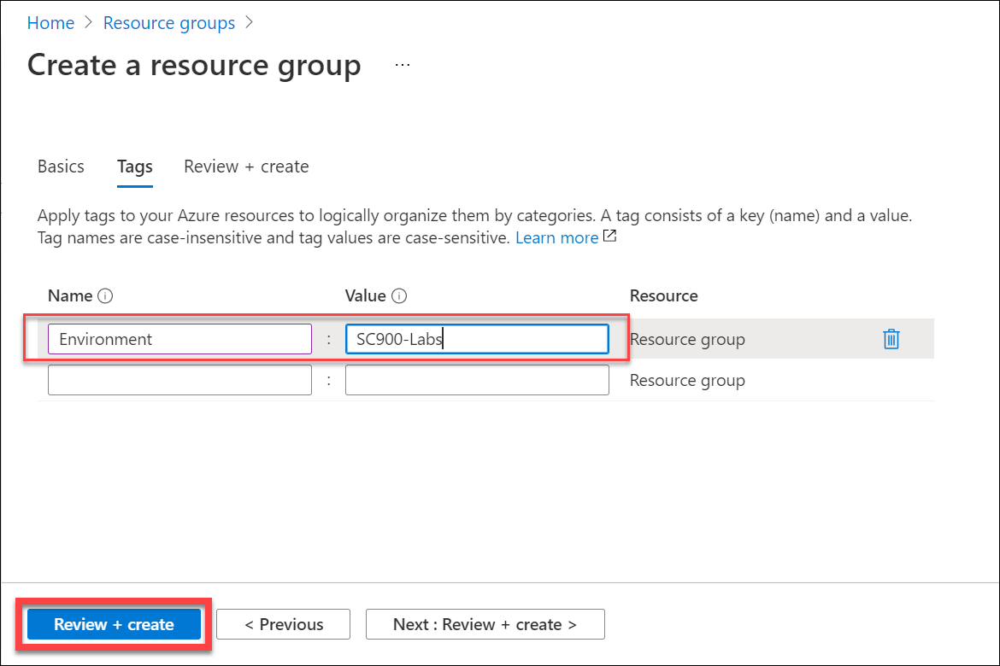

1. Verify the tag and select **Create**.

1. You will see the resource group listed.  Because the tag was provided in the resource group, the condition included as part of the Azure policy was satisfied.  The resource group is compliant with the policy.

1. Before you exit, remove the Azure policy.
    1. From the top left corner of the page, select Home, to return to the Azure home page.
    
    1. Underneath where it says Azure services, select Azure policy.
    1. In the middle of the page, you will see a list of the Azure policy/initiative assignments.  Select the ellipses for the policy assignment Require a tag on resource groups, then select Delete assignment.
    1. You will be prompted to confirm that you want to delete the assignment.  Select Yes.

#### Review

In this lab, you went through the Azure policy landing page. After the initial exploration of the Azure policy page, you went through the process of creating a policy and you were able to see the impact of that policy.
