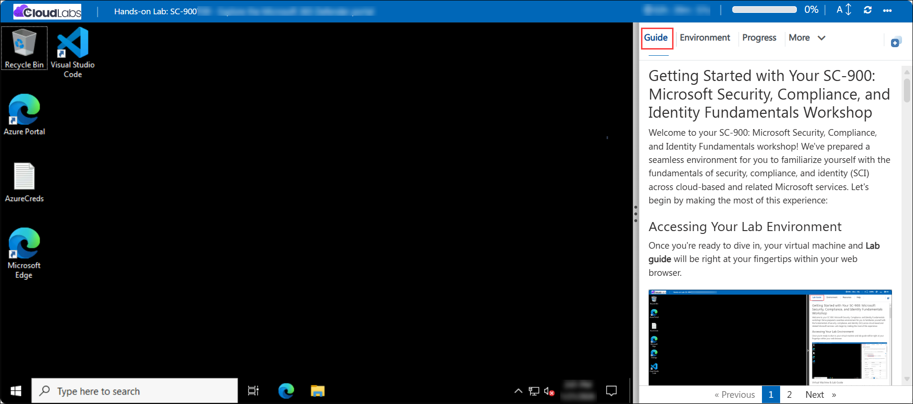
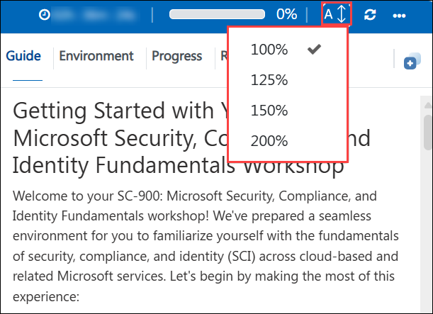
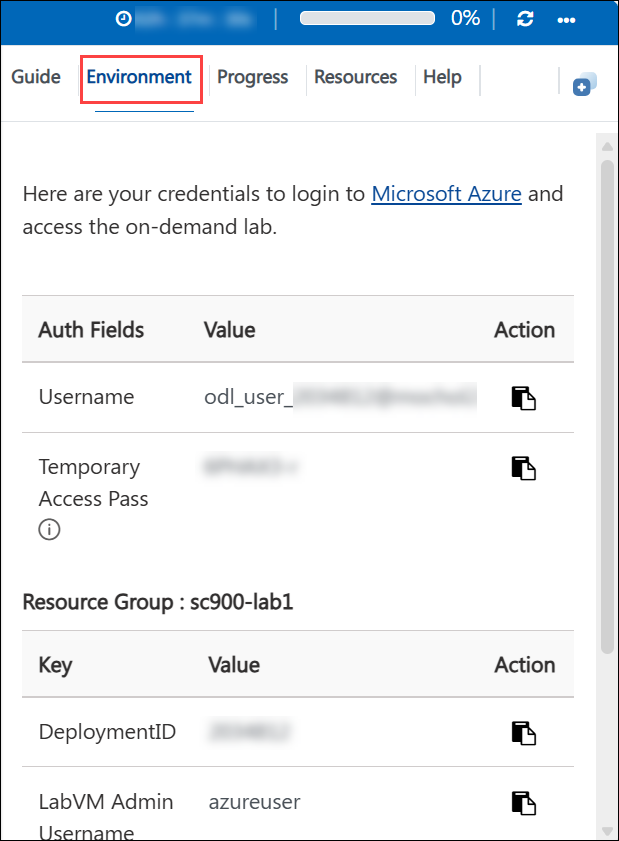
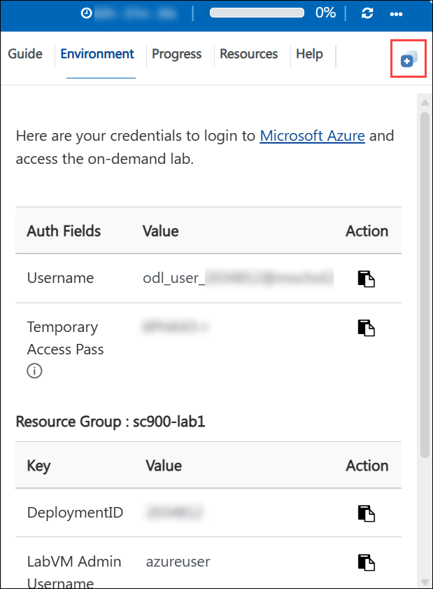
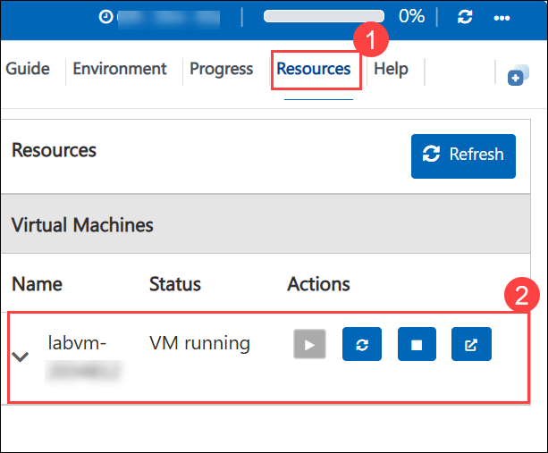
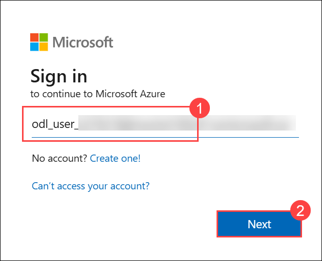
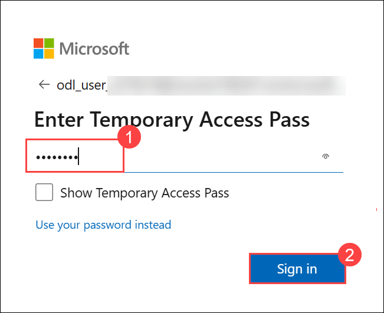
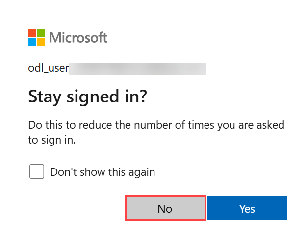

# Getting Started with Your SC-900: Microsoft Security, Compliance, and Identity Fundamentals Workshop
 
Welcome to your SC-900: Microsoft Security, Compliance, and Identity Fundamentals workshop! We've prepared a seamless environment for you to familiarize yourself with the fundamentals of security, compliance, and identity (SCI) across cloud-based and related Microsoft services. Let's begin by making the most of this experience:
 
## Accessing Your Lab Environment
 
Once you're ready to dive in, your virtual machine and **Guide** will be right at your fingertips within your web browser.
 

### Virtual Machine & Lab Guide
 
Your virtual machine is your workhorse throughout the workshop. The lab guide is your roadmap to success.
 
## Lab Guide Zoom In/Zoom Out
 
To adjust the zoom level for the environment page, click the **A↕ : 100%** icon located next to the timer in the lab environment.

## Exploring Your Lab Resources
 
To get a better understanding of your lab resources and credentials, navigate to the **Environment** tab.
 

 
## Utilizing the Split Window Feature
 
For convenience, you can open the lab guide in a separate window by selecting the **Split Window** button from the Top right corner.
 

## Lab Progress

You can use the **Progress** tab to track your progress while working on the lab. A score will be provided after successful validation.

## Managing Your Virtual Machine
 
Feel free to start, stop, or restart your virtual machine as needed from the **Resources** tab. Your experience is in your hands!
 

## Lab Validation

1. After completing the task, hit the **Validate** button under the Validation tab integrated within your lab guide. If you receive a success message, you can proceed to the next task; if not, carefully read the error message and retry the step, following the instructions in the lab guide.

   
   
## Lab Duration Extension

1. To extend the duration of the lab, kindly click the **Hourglass** icon in the top right corner of the lab environment. 

    

    >**Note:** You will get the **Hourglass** icon when 10 minutes are remaining in the lab.

2. Click **OK** to extend your lab duration.
 
   

3. If you have not extended the duration prior to when the lab is about to end, a pop-up will appear, giving you the option to extend. Click **OK** to proceed. 

## Let's Get Started with Azure Portal
 
1. On your virtual machine, click on the Azure Portal icon as shown below:
 
    .png)

2. You'll see the **Sign in to continue to Microsoft Azure** tab. Here, enter your credentials and click on **Next**:
 
   - **Email/Username:** <inject key="AzureAdUserEmail"></inject>
 
     
 
3. Next, provide your password and click on **Sign in**:
 
   - **Password:** <inject key="AzureAdUserPassword"></inject>
   
   > **Note:** If you're asked to enter a Temporary Access Pass instead of a Password when signing in to the Azure portal, don't worry, it refers to the same credential. You can find it under the **Environment Details** tab.
 
     

4. If you see the pop-up **Stay-Signed in?**, click **No**.

   

> **Note:** If you're prompted to set up Multi-Factor Authentication (MFA), please proceed with the next step. Otherwise, you can skip the MFA setup and continue with the remaining steps in the exercise.

## Steps to Proceed with MFA Setup if "Ask Later" Option is Not Visible

1. At the **"More information required"** prompt, select **Next**.

1. On the **"Keep your account secure"** page, select **Next** twice.

1. **Note:** If you don’t have the Microsoft Authenticator app installed on your mobile device:
   - Open **Google Play Store** (Android) or **App Store** (iOS).
   - Search for **Microsoft Authenticator** and tap **Install**.
   - Open the **Microsoft Authenticator** app, select **Add account**, then choose **Work or school account**.

1. A **QR code** will be displayed on your computer screen.

1. In the Authenticator app, select **Scan a QR code** and scan the code displayed on your screen.

1. After scanning, click **Next** to proceed.

1. On your phone, enter the number shown on your computer screen in the Authenticator app and select **Next**.
       
1. If prompted to stay signed in, you can click "No."
 
1. If a **Welcome to Microsoft Azure** pop-up window appears, simply click "Maybe Later" to skip the tour.
 

## Support Contact

The CloudLabs support team is available 24/7, 365 days a year, via email and live chat to ensure seamless assistance at any time. We offer dedicated support channels tailored specifically for both learners and instructors, ensuring that all your needs are promptly and efficiently addressed.

Learner Support Contacts:

   - Email Support: cloudlabs-support@spektrasystems.com

   - Live Chat Support: https://cloudlabs.ai/labs-support

Click **Next** from the bottom right corner to embark on your Lab journey!
 
   .png)
 
Now you're all set to explore the powerful world of technology. Feel free to reach out if you have any questions along the way. Enjoy your workshop!
