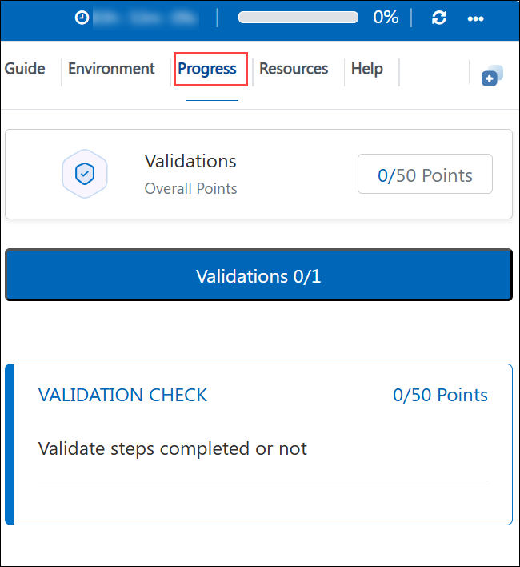
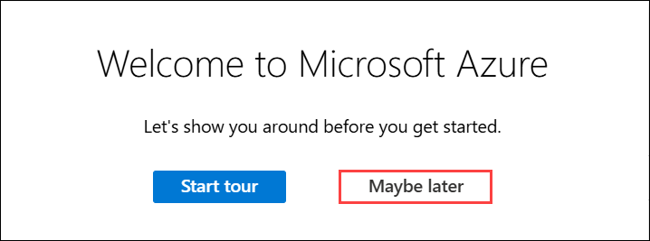

# Getting Started with Your SC-900: Microsoft Security, Compliance, and Identity Fundamentals Workshop
 
Welcome to your SC-900: Microsoft Security, Compliance, and Identity Fundamentals workshop! We've prepared a seamless environment for you to familiarize yourself with the fundamentals of security, compliance, and identity (SCI) across cloud-based and related Microsoft services. Let's begin by making the most of this experience:
 
## Overview

In these hands-on labs, you will explore the core concepts and capabilities of security, compliance, and identity (SCI) across Microsoft Entra ID, Azure, and Microsoft 365. Working as a Security, Compliance, and Identity practitioner, you will manage users, groups, and licenses in Microsoft Entra ID, and secure sign-in with Self-Service Password Reset (SSPR), Conditional Access, and Privileged Identity Management (PIM). You will also secure network traffic with Azure Network Security Groups, and explore Microsoft's security stack — Microsoft Defender for Cloud, Microsoft Sentinel, Microsoft Defender for Cloud Apps, and the unified Microsoft 365 Defender portal with Secure Score. Finally, you will explore Microsoft Purview's compliance capabilities, including the Service Trust Portal, Compliance Manager, sensitivity labels, Insider Risk Management, and Core eDiscovery. By completing these labs, you will gain the practical, portal-based experience needed to understand how Microsoft's identity, security, and compliance solutions work together to protect an organization's users, data, and resources.

## Objectives

By the end of these labs, you will be able to:

1. **Manage identities in Microsoft Entra ID:** Create and manage users and groups, assign Microsoft 365 licenses, review directory roles, and register for multifactor authentication (MFA).

1. **Enable self-service password reset (SSPR):** Configure SSPR authentication methods and scope, register a user for SSPR, and review SSPR audit logs and usage insights.

1. **Implement Conditional Access:** Create a Conditional Access policy that targets specific users and cloud apps to control access to Microsoft admin portals based on organizational conditions.

1. **Secure network traffic with Network Security Groups (NSGs):** Deploy a virtual machine, observe unrestricted network exposure, and create NSG inbound/outbound rules to control RDP and internet access.

1. **Explore Microsoft Sentinel:** Provision a Log Analytics workspace and Sentinel instance, connect a data source, and tour Sentinel's incidents, hunting, threat intelligence, MITRE ATT&CK, and automation capabilities.

1. **Explore Microsoft Defender for Cloud Apps:** Generate a Cloud Discovery report, review discovered apps and risk scores in the cloud app catalog, and explore information protection, activity logs, and policies.

1. **Navigate the Microsoft 365 Defender portal:** Tour the unified security dashboard and explore Microsoft Secure Score's recommended actions, implementation details, history, and trends.

1. **Explore the Service Trust Portal:** Access compliance materials, industry and regional resources, and Microsoft's privacy principles.

1. **Work with Microsoft Purview Compliance Manager:** Review an organization's compliance score, improvement actions, and assessments, and explore creating a new assessment from a regulatory template.

1. **Create and apply sensitivity labels:** Configure a sensitivity label with scope, permissions, and content marking, publish it through a label policy, and apply it to a document to enforce protection.

1. **Configure Insider Risk Management:** Assign the Insider Risk Management role group, configure organization-wide settings, and create a policy from the Data Leaks template.

1. **Perform a Core eDiscovery workflow:** Assign eDiscovery permissions, create a case and hold, and run a keyword search against a mailbox.

## Pre-requisites

- A basic understanding of security, compliance, and identity concepts is recommended, but no prior hands-on security experience is required — these labs are designed for SC-900 (Fundamentals-level) learners.
- Familiarity with navigating the Azure portal and the Microsoft 365 admin center will help you move through the labs more efficiently.
- General awareness of cloud computing concepts (users, groups, roles, and resources) is helpful.
- All required Azure subscriptions, Microsoft Entra ID/Microsoft 365 tenant access, and any premium licensing needed for specific labs (for example, Microsoft Entra ID P2 for Privileged Identity Management) are pre-provisioned in your lab environment, no additional purchases or license assignments are required on your part.

## Architecture

The lab architecture reflects how Microsoft's identity, security, and compliance solutions work together across Microsoft Entra ID, Azure, and Microsoft 365/Microsoft Purview to protect an organization end-to-end. Rather than a single fixed topology, the architecture is built up progressively, layering identity, network & cloud security, threat protection, and compliance controls. The flow you will follow across the workshop is as follows:

1. **Microsoft Entra ID:** You start by establishing the identity plane itself — creating a Microsoft 365 group, adding a new user, assigning that user a license, reviewing directory roles, and registering the user for multifactor authentication (MFA). Every later lab acts on identities created here.

2. **Self-service access (SSPR):** On top of that identity plane, you scope Self-Service Password Reset to a security group, configure its authentication methods and registration requirements, and have a user register for and use SSPR — reducing reliance on helpdesk-driven password resets.

3. **Conditional Access:** You then add a policy layer that evaluates sign-in conditions (user and target cloud app) and enforces a Grant control, blocking a specific user from Microsoft admin portals while leaving their normal Microsoft 365 access untouched — demonstrating how access decisions are made dynamically rather than statically.

5. **Network-layer security:** Moving from identity to infrastructure, you deploy a virtual machine with no network filtering (showing full exposure), then introduce a Network Security Group on its network interface with ordered inbound/outbound rules — first allowing RDP, then denying outbound internet traffic — to see directly how NSG rule priority controls traffic flow.

6. **Microsoft Defender for Cloud:** With compute resources in place, Defender for Cloud is enabled to continuously assess them — surfacing a Secure Score, prioritized recommendations, per-resource health, and regulatory compliance standing, plus the paid vs. free plan options available per workload.

7. **Microsoft Sentinel:** A Log Analytics workspace and Sentinel instance are provisioned on top of the same subscription, ingesting signals (including from Defender for Cloud via a content-hub connector) into a cloud-native SIEM/SOAR, where you tour incidents, hunting, threat intelligence, the MITRE ATT&CK matrix, and automation rules.

9. **Microsoft 365 Defender portal:** All of the above security signals converge in the Microsoft 365 Defender portal, which links out to Defender for Endpoint, Defender for Office 365, and Defender for Cloud Apps, and centers Microsoft Secure Score as the organization-wide measure of security posture over time.

10. **Service Trust Portal:** Shifting from security to compliance, you review Microsoft's own compliance reports, audited certifications, and privacy documentation for its cloud services — the evidentiary basis an organization uses to evaluate Microsoft as a cloud provider.

12. **Data classification and protection:** You then create a sensitivity label with defined scope, access permissions, and content marking, publish it through a label policy, and apply it to a real document observing firsthand how the label's encryption blocks an external, non-tenant recipient from opening protected content.

13. **Insider Risk Management:** With data now classified, Insider Risk Management is configured at the organization level (privacy settings, indicators, detection timeframes) and a policy is built from the Data Leaks template to watch for exfiltration-style activity involving in-scope users.

14. **Core eDiscovery:** Finally, you will grant eDiscovery role permissions, creating a case, placing a hold on a mailbox, and running a keyword search the workflow an organization uses to investigate and preserve data once a risk or legal matter is identified.

## Explanation of Components

1. **Microsoft Entra ID:** The cloud-based identity and access management service used to create and manage users and groups, assign licenses, and control directory roles across Microsoft 365 and Azure.

2. **Self-Service Password Reset (SSPR):** Lets users reset or unlock their own accounts using registered authentication methods, reducing helpdesk load while giving admins audit logs and usage insights.

3. **Conditional Access:** A policy engine that grants or blocks access to apps and resources based on signals such as user, application, and network conditions.

5. **Azure Network Security Groups (NSGs):** Filter inbound and outbound network traffic to Azure resources such as virtual machines using ordered allow/deny rules.

6. **Microsoft Defender for Cloud:** A cloud security posture management (CSPM) and workload protection service that surfaces Secure Score, recommendations, and regulatory compliance status for Azure resources.

7. **Microsoft Sentinel:** A cloud-native SIEM/SOAR built on Log Analytics that collects, detects, investigates, and responds to security threats using analytics rules, hunting, and automation.

9. **Microsoft 365 Defender Portal & Secure Score:** A unified portal that brings together Defender for Endpoint, Defender for Office 365, and Defender for Cloud Apps, alongside Microsoft Secure Score for tracking overall security posture.

10. **Service Trust Portal:** Provides access to Microsoft's compliance reports, trust documentation, and privacy resources for evaluating Microsoft cloud services.

11. **Microsoft Purview Compliance Manager:** Measures an organization's compliance posture with a compliance score, improvement actions, and assessments against regulatory and industry templates.

12. **Sensitivity Labels:** Classify and protect content by applying scope, permissions, content marking, and encryption, enforced consistently across documents and emails.

13. **Insider Risk Management:** Identifies and helps mitigate internal risks such as data leaks using policy templates, indicators, and intelligent detections while preserving user privacy.

## Accessing Your Lab Environment
 
Once you're ready to dive in, your virtual machine and **Guide** will be right at your fingertips within your web browser.
 

### Virtual Machine & Lab Guide
 
Your virtual machine is your workhorse throughout the workshop. The lab guide is your roadmap to success.
 
## Lab Guide Zoom In/Zoom Out
 
To adjust the zoom level for the environment page, click the **A↕ : 100%** icon located next to the timer in the lab environment.

## Exploring Your Lab Resources
 
To get a better understanding of your lab resources and credentials, navigate to the **Environment** tab.
 

 
## Utilizing the Split Window Feature
 
For convenience, you can open the lab guide in a separate window by selecting the **Split Window** button from the Top right corner.
 

## Lab Progress

You can use the **Progress** tab to track your progress while working on the lab. A score will be provided after successful validation.

## Managing Your Virtual Machine
 
Feel free to start, stop, or restart your virtual machine as needed from the **Resources** tab. Your experience is in your hands!
 

## Lab Validation

After completing the task, hit the **Validate** button under the Validation tab integrated within your lab guide. If you receive a success message, you can proceed to the next task; if not, carefully read the error message and retry the step, following the instructions in the lab guide.

   

## Lab Duration Extension

1. To extend the duration of the lab, kindly click the **Hourglass** icon in the top right corner of the lab environment. 

    

    >**Note:** You will get the **Hourglass** icon when 10 minutes are remaining in the lab.

2. Click **OK** to extend your lab duration.
 
   

3. If you have not extended the duration prior to when the lab is about to end, a pop-up will appear, giving you the option to extend. Click **OK** to proceed. 

## Let's Get Started with Azure Portal
 
1. On your virtual machine, click on the Azure Portal icon as shown below:
 
    .png)

2. You'll see the **Sign in to continue to Microsoft Azure** tab. Here, enter your credentials and click on **Next**:
 
   - **Email/Username:** <inject key="AzureAdUserEmail"></inject>
 
     
 
3. Next, provide your password and click on **Sign in**:
 
   - **Password:** <inject key="AzureAdUserPassword"></inject>
   
   > **Note:** If you're asked to enter a Temporary Access Pass instead of a Password when signing in to the Azure portal, don't worry, it refers to the same credential. You can find it under the **Environment Details** tab.
 
     

4. If you see the pop-up **Stay-Signed in?**, click **No**.

   

5. If a **Welcome to Microsoft Azure** pop-up window appears, simply click **Maybe Later** to skip the tour.

    
 
## Support Contact

The CloudLabs support team is available 24/7, 365 days a year, via email and live chat to ensure seamless assistance at any time. We offer dedicated support channels tailored specifically for both learners and instructors, ensuring that all your needs are promptly and efficiently addressed.

Learner Support Contacts:

   - Email Support: cloudlabs-support@spektrasystems.com

   - Live Chat Support: https://cloudlabs.ai/labs-support

Click **Next** from the bottom right corner to embark on your Lab journey!
 
   .png)
 
Now you're all set to explore the powerful world of technology. Feel free to reach out if you have any questions along the way. Enjoy your workshop!
